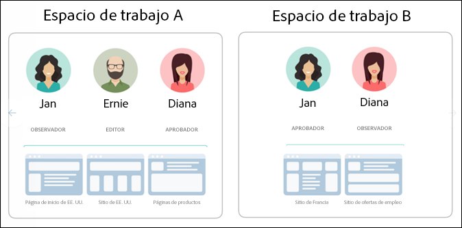
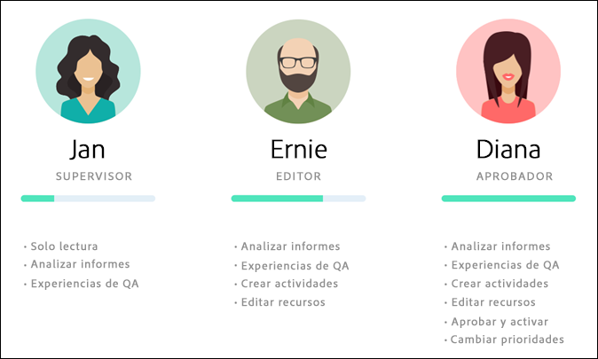
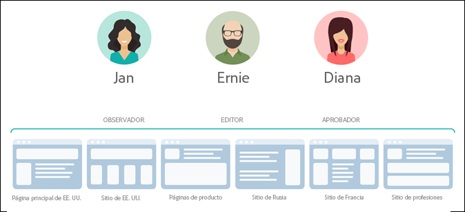
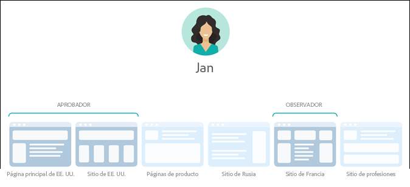
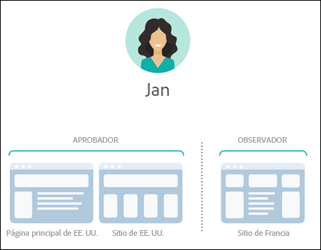
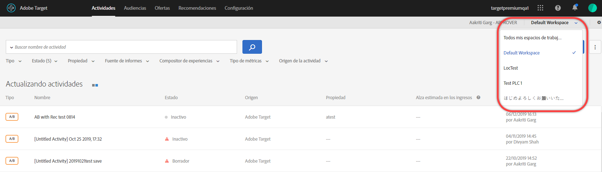
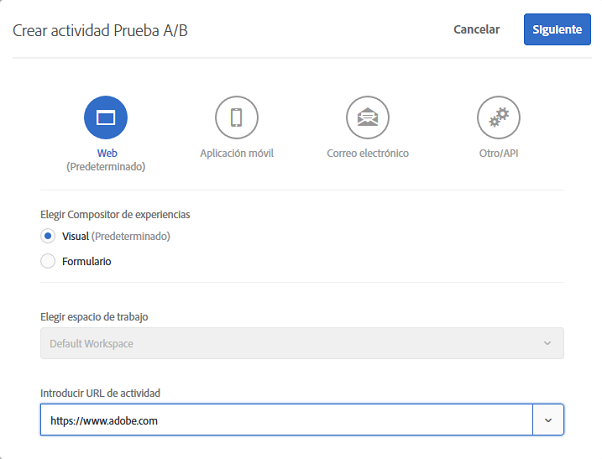
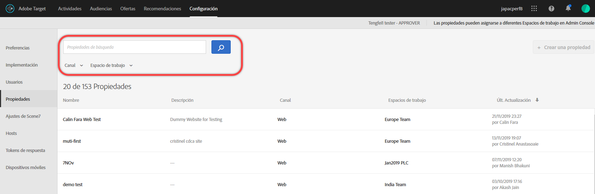

#  Permisos de usuario de Enterprise{#enterprise-user-permissions}

Los permisos de usuario de Enterprise son un medio para administrar formalmente el acceso de usuarios de nivel Enterprise a [!DNL Target]. Add users to [!DNL Target], assign permissions based on their roles, and create workspaces for teams based on different departments, global locations, channels, and other logical groupings. You can assign users the roles of [!UICONTROL Observer], [!UICONTROL Editor], or [!UICONTROL Approver].

## Determinar si tiene acceso a los permisos de usuario de Enterprise

>[!NOTE]
>
>La funcionalidad Propiedades y Permisos está disponible como parte de la [!DNL Target]solución Premium. No están disponibles en [!DNL Target] Standard sin una licencia de [!DNL Target] Premium.
>
>Your [!DNL Target] implementation can be using any version of at.js or mbox.js.

You can tell whether your organization has a Standard or Premium license by clicking the [!UICONTROL Administration] link at the top of the [!DNL Target] UI.

* **[!DNL Target Standard]Clientes**: Si ve la ficha [!UICONTROL Usuarios] ([!UICONTROL Administración > Usuarios]) (y no la ficha [!UICONTROL Propiedades] ), su organización dispone de una [!DNL Target Standard] licencia. Los clientes de [!DNL Target Standard] deben seguir las instrucciones de [Usuarios](/help/administrating-target/c-user-management/c-user-management/user-management.md) para agregar usuarios y asignar permisos en [!DNL Adobe Admin Console].

* **[!DNL Target Premium]Clientes**: Si ve la ficha [!UICONTROL Propiedades] ([!UICONTROL Administración > Propiedades]) y la ficha [!UICONTROL Usuarios] , su organización dispone de una [!DNL Target Premium] licencia. Los clientes de [!DNL Target Premium] deben seguir las instrucciones de este artículo y de [Configurar los permisos de Enterprise](/help/administrating-target/c-user-management/property-channel/properties-overview.md).

## Antes de empezar a usar permisos de empresa

>[!IMPORTANT]
>
>Ensure that you read the [Caveats](/help/administrating-target/c-user-management/property-channel/property-channel.md#section_9714311B1CD9497A86F4910F8AE635E2) section below before proceeding with enterprise permissions.

## Terms and definitions used in this section {#section_F8D229544FEA41C3BC2EFD1F95AA0116}

The following terms are used throughout this section and might be new to users wanting to use the Properties and Permissions functionality in [!DNL Target] Premium.

### Propiedad

Properties are similar in nature to those within [!DNL Adobe Platform Launch] in that they use a unique snippet of code to differentiate them.

Una propiedad web es una biblioteca de reglas y un código incrustado. Una propiedad web puede ser cualquier conjunto de uno o varios dominios y subdominios.

Las propiedades se habilitan agregando un par nombre/valor específico como parámetro con cualquier llamada (llamada de Destinatario, llamada de API, etc.) a [!DNL Target].

Las propiedades pertenecen a canales específicos (web, móvil, correo electrónico o API/otros).

### Espacio de trabajo (perfil de producto)

Un espacio de trabajo permite que una organización asigne un conjunto de usuarios específico a un conjunto de propiedades concretas. En muchos aspectos, un espacio de trabajo es parecido a un grupo de informes en [!DNL Adobe Analytics].

Note: Workspaces are known as [!UICONTROL Product Profiles] in the [!DNL Adobe Admin Console for Enterprise].

Si forma parte de una organización multinacional, puede tener un espacio de trabajo para sus páginas web, propiedades o sitios europeos y otro para sus páginas web, propiedades o sitios estadounidenses. Si forma parte de una organización de varias marcas, puede contar con un espacio de trabajo independiente para cada una.

Los usuarios pueden formar parte de varios espacios de trabajo y pueden incluso tener diferentes roles en cada uno de ellos.

Users can have different views of [!DNL Adobe Target] by moving between workspaces, similar to how [!DNL Analytics] users have different views of [!DNL Analytics] by moving between Report Suites.

Los espacios de trabajo pueden incluir audiencias, ofertas de código y actividades totalmente distintas.

Todas las audiencias y actividades creadas antes de la migración al modelo de permisos de Enterprise se agruparán en el “espacio de trabajo predeterminado” que se trata más adelante.

All activities created via [!DNL Adobe Experience Manager] (AEM), [!DNL Adobe Mobile Services], and [!DNL Adobe Target Classic] will be part of the &quot;Default Workspace.&quot;

### Espacio de trabajo predeterminado

All existing workspaces (product profiles) within [!DNL Admin Console] are merged into a single workspace called &quot;Default Workspace&quot; during your organization&#39;s migration to the new Enterprise Permissions model.

>[!IMPORTANT]
>
>No elimine el espacio de trabajo predeterminado.

All user roles and access to all [!DNL Target] functionality remains exactly the same as they were prior to the migration to the new Enterprise Permissions model.

### Grupos de usuarios

Puede crear grupos de usuarios, como Desarrolladores, Analistas, Especialistas en marketing, Ejecutivos, etc., y luego asignar privilegios en varios productos y espacios de trabajo de Adobe. Asignar todos los privilegios apropiados en diferentes productos de Adobe a un nuevo miembro del equipo puede ser tan fácil como añadirlos a un grupo de usuarios específico.

### Funciones y permisos

Las funciones y los permisos determinan los niveles de acceso que tienen los usuarios para crear y administrar actividades en su implementación de [!DNL Target]. En [!DNL Target] existen las funciones siguientes:

| Función | Descripción |
|--- |--- |
| Aprobador | Puede crear, editar y activar o detener actividades. |
| Editor | puede crear y editar actividades antes de que estén activas, pero no puede aprobar el lanzamiento de una actividad. |
| Observador | Puede ver actividades, pero no puede crearlas o editarlas. |
| Editor | Similar a la función Observador (puede vista de actividades, pero no puede crearlas o editarlas). Sin embargo, la función Editor tiene el permiso adicional para activar actividades. |

### Canal

El canal se refiere al tipo de contenido desde donde se suministran sus actividades de [!DNL Target]: páginas web, aplicaciones móviles, mensajes de correo electrónico, etc.

Cuando se crea una actividad nueva, esta se crea en el espacio de trabajo que está seleccionado. Verá las opciones de selección del canal en el primer cuadro de diálogo que le permite elegir el canal deseado para la actividad: web, aplicación móvil, correo electrónico o API/otro.

## Permissions overview {#section_DC2172520DA84605B218A5E9FB6D187A}

En esta sección explicamos cómo se aplicaban antes los permisos en [!DNL Target] y cómo se aplican usando la funcionalidad [!UICONTROL Propiedades] y [!UICONTROL permisos].

La nueva funcionalidad [!UICONTROL Permisos] permite crear diferentes proyectos (llamados “perfiles de producto” en [!DNL Adobe Admin Console for Enterprise]) para que pueda asignar a un único usuario los diferentes permisos que dictan sus derechos de acceso a cada proyecto. Estos proyectos independientes pueden compararse con el modo en el que funcionan los grupos de informes en [!DNL Adobe Analytics]. Cada proyecto tiene usuarios específicos con funciones específicas que se aplican a un conjunto de propiedades. De este modo, los clientes podrán restringir la vista, editar y aprobar el acceso de los usuarios según la región, el entorno (desarrollo/rodaje/prod.), el canal u otros criterios personalizados, como los siguientes:

Por ejemplo, un usuario determinado puede tener el acceso de aprobación en los sitios web de América, pero solo el acceso de visualización en la aplicación móvil europea. Ese mismo usuario puede no tener acceso ni siquiera a la visualización de las actividades ofrecidas en propiedades web y móviles en la región Asia-Pacífico.

El modelo actual de [!DNL Target] [!UICONTROL Permisos] de tiene tres funciones de permiso (Observador, Editor y Aprobador), como se muestra en la siguiente ilustración:

Cada función tiene diferentes niveles de permisos:

| Función | Descripción |
|--- |--- |
| Aprobador | Puede crear, editar y activar o detener actividades. |
| Editor | puede crear y editar actividades antes de que estén activas, pero no puede aprobar el lanzamiento de una actividad. |
| Observador | Puede ver actividades, pero no puede crearlas o editarlas. |
| Editor | Similar a la función Observador (puede vista de actividades, pero no puede crearlas o editarlas). Sin embargo, la función Editor tiene el permiso adicional para activar actividades. |

Es importante tener en cuenta que la función de cada usuario se aplica a cada página, propiedad o sitio de su cuenta que incluya etiquetas de [!DNL Target] como se muestra a continuación:

El nuevo modelo de [!DNL Target] [!UICONTROL Permisos] de tiene las mismas funciones de permiso (Observador, Editor y Aprobador); sin embargo, estas funciones se pueden asignar a cada usuario por separado para páginas, propiedades o sitios concretos, como se muestra a continuación:

En este ejemplo, Jan tiene permisos de aprobador en la página principal y el sitio de EE. UU. y permisos de observador en el sitio de Francia.

Además, Jan no podrá ver páginas, propiedades ni sitios en [!DNL Target] para los que no tenga permisos de visualización, como se muestra a continuación:

En este ejemplo, Jan no ve las páginas de productos, el sitio de Rusia ni el sitio de ofertas de empleo.

## Use-case scenarios {#section_F3CE8576959E4F4CB13BEEED38311DD8}

En los siguientes casos de uso, trataremos de explicar cómo lograr los objetivos de marketing con ayuda de las propiedades, los proyectos y las funciones de [!DNL Target]:

### Organización multinacional

Si forma parte de una organización multinacional, puede tener un espacio de trabajo para sus páginas web, propiedades o sitios europeos y otro para sus páginas web, propiedades o sitios estadounidenses. 
Usando los personajes de las ilustraciones anteriores, tras una reorganización, podría configurar los espacios de trabajo y permisos de este modo:

* **Jan:** Jan es la jefa de optimización del Centro de excelencia para las páginas web, las propiedades y los sitios estadounidenses de la organización. Es muy probable que tenga derechos de administración del sistema en Adobe Experience Cloud.

   Con su función, tiene permisos de aprobación en la página principal y el sitio de EE. UU. Con los permisos de aprobación, puede crear, editar y activar o detener actividades.

   Jan también realiza consultas al equipo de optimización de Francia, por lo que tiene permisos de observación en el sitio francés que le otorgan acceso de solo lectura a las actividades. Jan puede ver actividades, pero no puede crearlas o editarlas.

   Como no tiene ninguna función que le exija ver las páginas de productos, el sitio de Rusia ni el sitio de ofertas de empleo, no ve las actividades relacionadas con estos sitios.

* **Ernie:** Ernie trabaja como administrador de marketing en la organización que se encarga del marketing de EE. UU.

   Como Ernie lleva poco tiempo en la organización y no tiene demasiada experiencia con Target, tiene permisos de edición en la página principal y el sitio de EE. UU. y en las páginas de productos. Con los permisos de edición, Ernie puede crear y editar actividades antes de que estén activas, pero no puede aprobar el lanzamiento de una actividad. Alguien con permisos de aprobación, como Jan, tiene que aprobarla para que pueda pasar a la fase de producción.

   Como no tiene ninguna función que le exija ver el sitio de Rusia, el sitio de Francia ni el sitio de ofertas de empleo, no ve las actividades relacionadas con estos sitios.

* **Diana:** Diana trabaja como analista en la organización y se le han concedido permisos de observación en la página principal y el sitio de EE. UU., las páginas de productos, el sitio de Rusia y el sitio de Francia. Con estos permisos tiene acceso de solo lectura a las actividades. Diana puede ver actividades, pero no puede crearlas o editarlas.

   Como no tiene ninguna función que le exija ver el sitio de ofertas de empleo, no ve las actividades relacionadas con este sitio.

### Organización de varias marcas

Si forma parte de una organización de varias marcas, puede contar con un espacio de trabajo independiente para cada página web, propiedad o sitio de la marca.

Usando los personajes de las ilustraciones anteriores, tras una reorganización podría configurar los proyectos y permisos de este modo:

* **Jan:** Jan es la jefa de optimización del Centro de excelencia de una organización sanitaria que trabaja en el ámbito de productos para hospitales y consumidores. Es muy probable que tenga derechos de administración del sistema en Adobe Experience Cloud.

   Con su función, tiene permisos de aprobación en el sitio del hospital. Con los permisos de aprobación, puede crear, editar y activar o detener actividades.

   Jan también realiza consultas al equipo de optimización en el ámbito de productos para consumidores, por lo que tiene permisos de observación en el sitio correspondiente que le otorgan acceso de solo lectura a las actividades. Jan puede ver actividades, pero no puede crearlas o editarlas.

* **Ernie:** Ernie trabaja como administrador de marketing en la organización que se encarga del marketing en el ámbito de productos para consumidores.

   Como Ernie lleva poco tiempo en la organización y no tiene demasiada experiencia con Target, tiene permisos de edición en el sitio para consumidores. Con los permisos de edición, Ernie puede crear y editar actividades antes de que estén activas, pero no puede aprobar el lanzamiento de una actividad. Alguien con permisos de aprobación en el sitio para consumidores (que, en este caso, no es Jan) tiene que aprobarla para que pueda pasar a la fase de producción.

   Como no tiene ninguna función que le exija ver el sitio del hospital, no ve las actividades relacionadas con estos sitios.

* **Diana:** Diana trabaja como analista en la organización y se le han concedido permisos de observación en el sitio del hospital y el sitio para consumidores. Con estos permisos tiene acceso de solo lectura a las actividades. Diana puede ver actividades, pero no puede crearlas o editarlas.

## Target UI Property and Permissions touchpoints {#section_3414371393BB42999A268628B5456EC9}

La nueva funcionalidad Permisos puede verse en diferentes sitios de la interfaz de usuario de [!DNL Target].

* **Lista desplegable Espacio de trabajo (Perfil de producto):** la lista desplegable Espacio de trabajo se muestra en la parte superior de las páginas [!UICONTROL Actividades], [!UICONTROL Audiencias] y [!UICONTROL Ofertas]. Seleccione el espacio de trabajo deseado para filtrar la lista y mostrar únicamente los elementos de dicho espacio de trabajo.

   

* **Creación de actividad:** cuando crea una nueva actividad, esta se crea en el espacio de trabajo seleccionado actualmente. Verá las opciones de selección del canal en el primer cuadro de diálogo que le permite elegir el canal deseado para la actividad: web, aplicación móvil, correo electrónico o API/otro.

   

* **Creación de audiencias:** cuando crea una nueva audiencia, se hace en el espacio de trabajo seleccionado.
* **Creación de ofertas:** cuando crea una nueva oferta, se hace en el espacio de trabajo seleccionado.
* **Página Propiedades (Administración > Propiedades):** Puede utilizar el cuadro [!UICONTROL Buscar] para buscar en la lista [!UICONTROL Propiedad] .

   

## Advertencias {#section_9714311B1CD9497A86F4910F8AE635E2}

Consider the following when using or configuring properties and permissions in [!DNL Target] Premium:

* **Importante**: No elimine espacios de trabajo con actividades. Si esto sucede, trabaje con ClientCare para recuperar estas actividades.
* Al utilizar la vista Todos mis espacios de trabajo:

   * Puede ver las actividades, audiencias y ofertas de todos los espacios de trabajo para los que tenga el rol adecuado y permiso de acceso.
   * Cuando se selecciona la vista Todos mis espacios de trabajo, se agrega a las páginas Actividades, Audiencias y Ofertas una nueva columna que indica el espacio de trabajo del elemento y los permisos de usuario que tiene asociados para dicho elemento (Observador, Editor o Aprobador).
   * Al crear una actividad, audiencia u oferta en la vista Todos mis espacios de trabajo, debe seleccionar el espacio de trabajo donde se creará el elemento. Solo podrá seleccionar los espacios de trabajo para los que disponga del permiso Editor o Aprobador.
   * Al copiar una actividad, audiencia u oferta en la vista Todos mis espacios de trabajo, debe seleccionar el espacio de trabajo donde se copiará el elemento. Solo podrá seleccionar los espacios de trabajo para los que disponga del permiso Editor o Aprobador.

* Cualquier aprobador puede controlar cualquier configuración de las siguientes páginas de administración en cualquier espacio de trabajo:

   * Compositor de experiencias visuales
   * Creación de informes
   * Configuración de Scene7
   * Implementación
   * Propiedades
   * Hosts
   * Entornos
   * Tokens de respuesta
   * Usuarios

* Los usuarios no pueden mover recursos de un espacio de trabajo (perfil de producto) a otro. Sin embargo, sí se permite la copia.
* Si visualiza las audiencias desde la página [!DNL Audiences], la página carga más lento de lo esperado. Si interactúa con la barra de búsqueda de cualquier forma, las audiencias se muestran más rápido. Este es un problema conocido que se solucionará en una próxima actualización. Este problema no afecta a la selección de audiencias durante el flujo de trabajo de creación de actividades.
* Los siguientes recursos son parte del nuevo modelo de permisos de Enterprise:

   * Actividades, audiencias y ofertas de código creadas en Target Standard/Premium después de que el cliente haya recibido permisos. (Nota: Los clientes deben cumplir los requisitos para el uso de Target Premium).
   * Las propiedades pueden añadirse a actividades existentes en el espacio de trabajo predeterminado; sin embargo, esto está sujeto a cambios.
   * Solo los nuevos recursos (como actividades, ofertas de código y audiencias) creados en Target Premium (una vez habilitados los permisos de Enterprise) se podrán restringir mediante permisos.
   * Los recursos externos solo están disponibles para los usuarios en el espacio de trabajo predeterminado. El rol de un usuario en el espacio de trabajo predeterminado se aplica globalmente (a todas las solicitudes y recursos de Target).

* Los siguientes recursos *no* son parte del nuevo modelo de permisos de Enterprise:

   * Ofertas de imágenes
   * Todos los recursos de Recommendations, incluidos la Biblioteca de criterios, Biblioteca de diseños, Catálogo, Configuración de Recommendations.
   * Los recursos existentes (como actividades, ofertas de código y audiencias) creados en Target Premium antes de la habilitación de los permisos de Enterprise se pueden copiar, pero no se pueden mover a otros espacios de trabajo.
   * Las actividades, audiencias, ofertas de código, ofertas de imágenes o cualquier otro recurso creado con las siguientes soluciones o métodos no se pueden controlar mediante el modelo de permisos de Enterprise, pero formarán parte del espacio de trabajo predeterminado: Target Classic, Adobe Experience Manager (AEM), Adobe Mobile Services y recursos creados mediante API. Recursos creados mediante API (incluidas actividades, audiencias, ofertas de código y ofertas de imagen).
   * Las ofertas de imagen (recursos almacenados en `https://[tenantName].marketing.adobe.com/content/mac/[tenantName]/target/offers.html#image-library`) no se pueden controlar mediante el modelo de permisos de Enterprise en este momento.
   * clickTracking y las redirecciones solo funcionan cuando el vínculo de destino o la página de destino son parte de una propiedad incluida en la actividad. Además, es posible que clickTracking no funcione al utilizar la función `targetPageParams()`. La función recomendada es `targetPageParamsAll()`.

   [!DNL Target]Actualmente,  necesita que haya un token `at_property` en todas las páginas donde se lleve a cabo un seguimiento. In the event that the token is (1) not present, (2) not detected at the time of activity setup (within the VEC), or (3) not passed to the clickTracking Target call via the `targetPageParamsAll()` function, the metric will not be incremented and will appear as &quot;0.&quot;

   Lo mismo se aplica a las actividades que usan redirecciones. La página de destino debe tener un token `at_property` y se debe reconocer cuando se configura en el VEC.

   En una versión futura, Target funcionará en páginas donde no haya presente un token `at_property`, o donde exista un token `at_property` distinto.

* La funcionalidad Permisos de usuario de Enterprise no se admite en [llamadas a la API de Adobe I/O](https://developers.adobetarget.com)

## Preguntas frecuentes {#faqs}

Las preguntas más frecuentes sobre permisos de Enterprise incluyen las siguientes:

### ¿Puedo trasladar una actividad de un espacio de trabajo a otro?

Por desgracia, las actividades no se pueden trasladar de un espacio de trabajo a otro. Sin embargo, puede copiar una actividad a cualquier espacio de trabajo, pero los datos del informe no se guardarán. Para obtener más información, consulte “Copiar/editar una actividad al utilizar espacios de trabajo” en [Copiar/Editar una actividad al usar espacios de trabajo.](/help/c-activities/edit-activity.md#section_45A92E1DD3934523B07E71EF90C4F8B6)

Las actividades creadas antes de la migración se siguen ejecutando del mismo modo en el espacio de trabajo predeterminado, a menos que se editen y se les asignen propiedades. Las actividades que se encuentran en un espacio de trabajo responden a las propiedades asignadas a ese espacio de trabajo y, por lo tanto, puede ser que el comportamiento no sea el mismo que antes de la migración.

### ¿Por qué aparece un mensaje de error que indica que no hay ninguna propiedad asociada con esta actividad, aunque haya una propiedad asignada?

Si ha implementado [!DNL Target] con [!DNL Adobe Launch] y ha obtenido un mensaje de error indicando que no hay propiedad asociada con la actividad, pase el parámetro `at_property` con la función `targetPageParams`.

### ¿Se registran conversiones de rastreo de clics si una página redireccionada y la dirección URL de actividad pertenecen a propiedades diferentes?

El rastreo de clics no se registra en páginas en las que la URL de la página y de la actividad pertenecen a propiedades diferentes.

Considere el siguiente escenario (se aplica tanto a at.js como a mbox.js):

* Página1 pertenece a Propiedad1.
* Página2 pertenece a Propiedad2.
* En la actividad, Página1 redirige a Página2, que contiene los rastreos de clics.

Cuando un visitante abre Página1 en un explorador, se le redirige a Página2. Debido a que Página2 no cumple los requisitos para entregar la actividad, su llamada de Target no contiene rastreos de clics en su respuesta.

Si la página de redirección y la dirección URL de la actividad pertenecen a la misma propiedad, los rastreos de clics funcionan según lo esperado. Para obtener más información, consulte [Rastreo de clics](/help/c-activities/r-success-metrics/click-tracking.md).

## Vídeos de formación

Los siguientes vídeos contienen más información sobre los conceptos mencionados en este artículo.

### Training Video: Enterprise Permissions Training Video 

Objetivos de aprendizaje:

* Los tres roles que pueden tener los usuarios de Adobe Target
* Los conceptos de propiedad y espacio de trabajo, y cómo operan estos límites y agrupamientos para permitir controlar el nivel de acceso de los usuarios
* Diferentes ejemplos de propiedades para la consideración de su organización

>[!VIDEO](https://video.tv.adobe.com/v/19042/)

### Horario de oficina: Destinatario Premium Workspaces

Este vídeo es una grabación de “Horario de oficina”, una iniciativa dirigida por el equipo de atención al cliente de Adobe.

* Creación de un espacio de trabajo (perfil del producto)
* Creación de propiedades
* Añadir usuarios
* Actualización de la implementación

>[!NOTE]
>
>La interfaz de usuario del menú [!DNL Target] Administración [!UICONTROL (anteriormente] Ajustes ) se ha rediseñado para proporcionar un rendimiento mejorado, reducir el tiempo de mantenimiento necesario al lanzar nuevas funciones y mejorar la experiencia del usuario en todo el producto. La información del siguiente vídeo es, en general, correcta; sin embargo, las opciones pueden estar en ubicaciones ligeramente diferentes. Los vídeos actualizados se publicarán pronto.

>[!VIDEO](https://video.tv.adobe.com/v/23643/)
