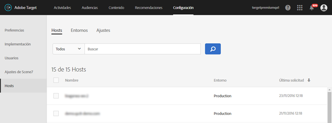

# Hosts{#hosts}

Organice sus sitios y entornos de preproducción para facilitar la administración y la creación de informes individuales.

El objetivo primordial de la administración de hosts reside en garantizar que ningún contenido inactivo se muestre por error en los sitios web. La administración de hosts también le permite separar los datos del informe por [entorno](/help/administrating-target/environments.md).

Un host es cualquier dominio desde el cual se realiza una solicitud [!DNL Target]. En un sitio web, generalmente es la propiedad `location.hostname` de la dirección URL que realiza la solicitud [!DNL Target].

De manera predeterminada, [!DNL Target] no limita un host que puede realizar [!DNL Target] solicitudes y recibir [!DNL Target] respuestas. Cuando los nuevos hosts realizan solicitudes, funcionan automáticamente. Esto también permite realizar pruebas en distintos dominios que no conoce o no puede prever. Si desea anular este comportamiento predeterminado, puede configurar una lista de permitidos o lista de bloqueados para limitar los hosts con [!DNL Target].

Para administrar hosts, haga clic en **[!UICONTROL Administración]** > **[!UICONTROL Hosts]**.

## Reconocimiento de hosts {#concept_0D4B43E23AA9408F8B28A57ED754BF65}

Para reconocer un host y agregarlo a la lista [!UICONTROL Hosts], deben cumplirse las siguientes condiciones:

* Debe existir al menos una solicitud [!DNL Target] en el host
* Una página del host debe tener   lo siguiente:

   * Una referencia at.js o mbox.js precisa
   * Una solicitud [!DNL Target] o una solicitud global [!DNL Target] generada automáticamente

* La página con la solicitud [!DNL Target] debe verse en un explorador

Después de ver la página, el host aparece en la lista [!UICONTROL Hosts], lo que le permite administrarla en un entorno, así como actividades y pruebas de previsualización e inicio.

>[!NOTE]
>
>Esto engloba todos los servidores de desarrollo personal.

Cuando un host se añada a la lista [!UICONTROL Hosts], compruebe si se reconoce.

1. Haga clic en **[!UICONTROL Administración]** > **[!UICONTROL Hosts]**.
1. Si no está en la lista, actualice el navegador. 

   De forma predeterminada, un host recién reconocido se coloca en el entorno [!UICONTROL Producción]. Se trata del entorno más seguro, dado que desde estos hosts no se pueden visualizar actividades inactivas.

1. (Condicional) Haga clic en el icono **[!UICONTROL Mover]** (  ) para mover el host al [!UICONTROL Desarrollo], [!UICONTROL Ensayo] u otro entorno.

>[!NOTE]
>
>El entorno [!UICONTROL Producción] no se puede eliminar, aunque se le cambie el nombre. Se da por hecho que desde este se van a suministrar las actividades y pruebas finales y activas. El entorno predeterminado no permite la visualización de campañas inactivas.

## Ordenar o buscar la lista Hosts {#section_068B23C9D8224EB78BC3B7C8580251B0}

Para ordenar la lista [!UICONTROL Hosts], haga clic en cualquier encabezado de columna ([!UICONTROL Nombre], [!UICONTROL Entorno] o [!UICONTROL Última solicitud]) para ordenar la lista en orden ascendente o descendente.

Para buscar la lista [!UICONTROL Hosts], escriba un término de búsqueda en el cuadro [!UICONTROL Hosts de búsqueda].

## Cree listas de permitidos que especifiquen hosts autorizados para enviar solicitudes de Destinatario a Destinatario. {#allowlist}

Puede crear una lista de permitidos que especifique los hosts (dominios) autorizados para enviar [!DNL Target] solicitudes a [!DNL Target]. Todos los demás hosts que generen solicitudes obtendrán una respuesta de error de autorización comentada. De forma predeterminada, cualquier host que contenga una solicitud [!DNL Target] se registra con [!DNL Target] en el entorno [!UICONTROL Producción] y tiene acceso a todas las actividades activas y aprobadas. Si este no es el método deseado, puede usar la lista de permitidos para registrar hosts específicos que cumplen los requisitos para realizar [!DNL Target] solicitudes y recibir [!DNL Target] contenido. Todos los hosts seguirán mostrándose en la lista [!UICONTROL Hosts], y aún se pueden usar entornos para agrupar estos hosts y asignar diferentes niveles a cada uno, como por ejemplo si el host puede ver actividades activas o inactivas.

Para crear una lista de permitidos:

1. En la lista [!UICONTROL Hosts], haga clic en **[!UICONTROL Autorizar hosts]**.
1. Habilite la opción **[!UICONTROL Habilitar hosts autorizados para envío de contenido]**.
1. Añada los hosts que desee en el cuadro **[!UICONTROL El host contiene]**, como desee.

   Se pueden agregar varios hosts, cada uno en una línea.

1. Añada los hosts que desee en el cuadro **[!UICONTROL El host no contiene]**, como desee.

   Se pueden agregar varios hosts, cada uno en una línea.

1. Haga clic en **[!UICONTROL Guardar]**.

Si se realiza una solicitud [!DNL Target] en un host no autorizado, la llamada responderá con `/* no display - unauthorized mbox host */`.

>[!IMPORTANT]
>
>**Prácticas** recomendadas de seguridad: Si utiliza la funcionalidad de ubox de  [!DNL Target], tenga en cuenta que esta lista de permitidos también controlará la lista de los dominios en los que navegan los   redirectores. Asegúrese de agregar los dominios a los que desee redirigir cuando utilice ubox como parte de la implementación. Si no se especifica la lista de permitidos, [!DNL Adobe] no podrá verificar las direcciones URL de redireccionamiento ni protegerse de posibles redirecciones maliciosas.
>
>La lista de permitidos tiene prioridad sobre los entornos. Debe borrar todos los hosts antes de utilizar la función de lista de permitidos y, a continuación, solo los hosts permitidos por la lista de permitidos aparecerán en la lista de hosts. A continuación, puede mover los hosts al entorno que quiera.

En ocasiones, aparecen dominios de otros sitios en los entornos. Un dominio aparece en la lista si el dominio realiza una llamada a su at.js o mbox.js. Por ejemplo, si alguien copia una de sus páginas web en su servidor, ese dominio aparecerá en nuestro entorno. También es probable que vea dominios de motores de araña, sitios de traducción de idiomas o unidades de disco locales.

En casos en los que `mboxHost` se pasa en una llamada de API, la conversión se registra para el entorno que se pasa. Si no se pasa ningún entorno, el host de la llamada tiene el valor predeterminado [!UICONTROL Producción].

También puede crear una  de lista de bloqueados que especifique hosts (dominios) que no puedan enviar solicitudes [!DNL Target] a [!DNL Target] agregando los hosts deseados en el cuadro [!UICONTROL El host no contiene].

>[!NOTE]
>
>Dado que la lista Hosts autorizados se utiliza tanto para hosts [!DNL Target] como para hosts de redireccionamiento predeterminados, debe agregar todos los dominios existentes aprobados para utilizar el [!DNL Adobe Target] SDK de Javascript (at.js) *AND* todos los dominios utilizados en las direcciones URL de redireccionamiento predeterminadas de ubox. También debe agregar dominios similares nuevos a la lista de permitidos en el futuro.

## Eliminar un host {#section_F56355BA4BC54B078A1A8179BC954632}

Puede eliminar un host cuando ya no vaya a necesitarlo.

1. En la lista [!UICONTROL Hosts], haga clic en el icono **[!UICONTROL Eliminar]**.
1. Haga clic en **[!UICONTROL Eliminar]** para confirmar la acción.

>[!NOTE]
>
>El host volverá a aparecer si alguien se desplaza a una página que contenga una solicitud [!DNL Target] en el host.

## Resolución de problemas de hosts {#concept_B3D7583FA4BB480382CC7453529FE1B7}

Pruebe los siguientes consejos de resolución de problemas si tiene algún problema con los hosts:

**El host no aparece en la lista de su cuenta.**

* Actualice la página [!UICONTROL Hosts] en el navegador.
* Confirme que la solicitud [!DNL Target] es correcta, incluida la referencia a at.js o mbox.js.
* Intente buscar una de las [!DNL Target] solicitudes en el host. Es posible que ninguna solicitud [!DNL Target] del host se haya procesado en un explorador.

**La lista [!UICONTROL Hosts] contiene dominios aleatorios o desconocidos.**

Un dominio aparece en esta lista si se realiza una solicitud a [!DNL Target] desde el dominio. Con frecuencia, es posible ver dominios de motores de araña, sitios de traducción de idiomas o unidades de disco locales. En caso de que el dominio incluido en la lista no sea uno de los que el equipo usa, puede hacer clic en [!UICONTROL Eliminar] para eliminarlo.

**Mi  [!DNL Target] solicitud devuelve /* sin visualización - host de mbox no autorizado */.**

Si se realiza una solicitud [!DNL Target] en un host no autorizado, la solicitud responderá con /* sin visualización: host de mbox no autorizado */.
