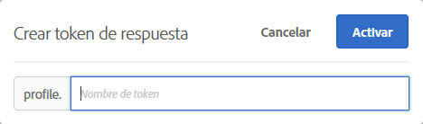

# Tokens de respuesta{#response-tokens}

Los tokens de respuesta permiten generar automáticamente información específica de [!DNL Target] (detalles de actividad, información de perfil del usuario, información geográfica, etc.) para utilizarla en la depuración o integración con sistemas de terceros (como Clicktale).

Los tokens de respuesta le permiten elegir qué variables utilizar y, a continuación, habilitarlas para que se envíen como parte de una respuesta de Destinatario. Para hacerlo, simplemente habilite una variable mediante el conmutador y la variable se enviará con respuestas de Destinatario, que se pueden validar en llamadas de red. Los tokens de respuesta también funcionan en el modo [!UICONTROL Previsualización].

Una diferencia clave entre complementos y tokens de respuesta es que, mientras que los primeros envían a la página código JavaScript que se ejecuta al recibirlo, los segundos envían un objeto que puede leerse y sobre el que puede actuarse utilizando detectores de eventos. Para obtener más información, consulte Más adelante en este artículo se encuentran los [eventos personalizados de at.js](/help/c-implementing-target/c-implementing-target-for-client-side-web/atjs-custom-events.md) y los ejemplos. El enfoque de tokens de respuesta es más seguro y debería facilitar el desarrollo y mantenimiento de integraciones de terceros.

>[!NOTE]
>
>Los tokens de respuesta están disponibles con at.js 1.1 o posterior. No son compatibles con mbox.js.

| Biblioteca de Target en uso | Acciones sugeridas |
|--- |--- |
| at.js | Compruebe que está utilizando la versión 1.1 o posterior de at.js. Para obtener información sobre la descarga de la versión más reciente de at.js, consulte [Descargar at.js](/help/c-implementing-target/c-implementing-target-for-client-side-web/how-to-deployatjs/implementing-target-without-a-tag-manager.md). Para obtener más información sobre las funcionalidades en cada versión de at.js, consulte [Detalles de la versiones de at.js](/help/c-implementing-target/c-implementing-target-for-client-side-web/target-atjs-versions.md).<br>Se recomienda a los clientes que usen at.js utilizar tokens de respuesta y abandonar los complementos. Se enviarán algunos complementos que dependen de métodos internos y que existen en mbox.js pero no en at.js, aunque no funcionarán. Para obtener más información, consulte [Limitaciones de at.js](/help/c-implementing-target/c-implementing-target-for-client-side-web/t-mbox-download/c-target-atjs-implementation/target-atjs-limitations.md). |
| mbox.js | Los complementos seguirán siendo compatibles y se enviarán al utilizar mbox.js.<br>Sin embargo, se recomienda a los clientes que utilicen mbox.js y los complementos que se pasen a at.js y a los tokens de respuesta. Para obtener más información sobre las ventajas de utilizar at.js sobre mbox.js, consulte [Preguntas más frecuentes de at.js](/help/c-implementing-target/c-implementing-target-for-client-side-web/c-target-atjs-faq/target-atjs-faq.md). Para obtener más información acerca de la migración, consulte [Migrar de mbox.js a at.js](/help/c-implementing-target/c-implementing-target-for-client-side-web/t-mbox-download/c-target-atjs-implementation/target-migrate-atjs.md).<br>Cuando Target Classic sea declarado obsoleto (noviembre de 2017), es posible que deba ponerse en contacto con Client Care para editar o deshabilitar los complementos existentes. Tendría que haber auditado sus conectores antes de que Target Classic quedara obsoleto y haber deshabilitado los complementos no deseados.<br>No puede crear nuevos complementos en Target Standard/Premium. En su lugar, utiliza tokens de respuesta.<br>Los antiguos complementos de SiteCatalyst deben deshabilitarse y reemplazarse con [Adobe Analytics como Fuente de informes para Adobe Target](/help/c-integrating-target-with-mac/a4t/a4t.md) (A4T). El complemento ttMeta debería deshabilitarse y reemplazarse con [Adobe Experience Cloud Debugger](https://chrome.google.com/webstore/detail/adobe-experience-cloud-de/ocdmogmohccmeicdhlhhgepeaijenapj). |

## Uso de tokens de respuesta {#section_A9E141DDCBA84308926E68D05FD2AC62}

1. Compruebe que está utilizando la versión 1.1 o posterior de [!DNL at.js].

   Para obtener más información, consulte [Descargar at.js](/help/c-implementing-target/c-implementing-target-for-client-side-web/how-to-deployatjs/implementing-target-without-a-tag-manager.md#concept_1E1F958F9CCC4E35AD97581EFAF659E2).

1. En [!DNL Target], haga clic en **[!UICONTROL Administración]** > **[!UICONTROL Tokens de respuesta]**.

   

1. Active los tokens de respuesta deseados, como `activity.id`, `option.id`, etc.

   Los siguientes parámetros están disponibles de forma predeterminada:

   | Tipo | Parámetro | Notas |
   |--- |--- |--- |
   | Perfiles integrados | `profile.activeActivities` | Devuelve una matriz de los `activityIds` para los que el visitante está cualificado. Aumenta a medida que los usuarios se cualifican. Por ejemplo, en una página con dos [!DNL Target] solicitudes que ofrecen dos actividades diferentes, la segunda solicitud incluye ambas actividades. |
   |  | `profile.isFirstSession` | Devuelve “true” o “false”. |
   |  | `profile.isNewSession` | Devuelve “true” o “false”. |
   |  | `profile.daysSinceLastVisit` | Devuelve el número de días desde la última visita del visitante. |
   |  | `profile.tntId` | Devuelve el tntID del visitante. |
   |  | `profile.marketingCloudVisitorId` | Devuelve el ID de visitante de Experience Cloud del visitante. |
   |  | `profile.thirdPartyId` | Devuelve el ID de terceros del visitante. |
   |  | `profile.categoryAffinity` | Devuelve la categoría favorita del visitante. |
   |  | `profile.categoryAffinities` | Devuelve una matriz de las cinco principales categorías del visitante en forma de cadenas. |
   | Actividad | `activity.name`<br>`activity.id`<br>`experience.name`<br>`experience.id`<br>`option.name`<br>`option.id` | Detalles sobre la actividad actual. Tenga en cuenta que “opción” es igual a “oferta”. |
   | Geografía | `geo.country`<br>`geo.state`<br>`geo.city`<br>`geo.zip`<br>`geo.dma`<br>`geo.domainName`<br>`geo.ispName`<br>`geo.connectionSpeed`<br>`geo.mobileCarrier` | Para obtener más información acerca del uso de la segmentación geográfica en las actividades, consulte [Geografía](/help/c-target/c-audiences/c-target-rules/geo.md). |
   | Método de asignación de tráfico<br>(sólo se aplica a actividades [!UICONTROL Destinatario automático] y [!UICONTROL Automated Personalization]). | `experience.trafficAllocationId` | Devuelve 0 si un visitante ha recibido una experiencia por estar en tráfico de &quot;control&quot; y 1 si un visitante ha recibido una experiencia de la distribución de tráfico de &quot;objetivo&quot;. |
   |  | `experience.trafficAllocationType` | Devuelve &quot;control&quot; o &quot;segmentado&quot;. |

   Los atributos del perfil de usuario y los atributos de cliente también se muestran en la lista.

   >[!NOTE]
   >
   >Los parámetros con caracteres especiales no se muestran en la lista. Se admiten únicamente caracteres alfanuméricos y guiones bajos.

1. (Condicional) Si desea utilizar un parámetro de perfil como token de respuesta, pero el parámetro no se ha pasado a través de una solicitud [!DNL Target] y, por lo tanto, no se ha cargado en la interfaz de usuario de Destinatario, puede utilizar el botón [!UICONTROL Añadir token de respuesta] para agregar el perfil a la interfaz de usuario.

   Haga clic en **[!UICONTROL Añadir token de respuesta]**, proporcione el nombre del token y haga clic en **[!UICONTROL Activar]**.

   

1. Cree una actividad.

Utilice [eventos personalizados de at.js](/help/c-implementing-target/c-implementing-target-for-client-side-web/atjs-custom-events.md) para detectar la respuesta de y leer los tokens de respuesta.[!DNL Target]

El siguiente ejemplo de código añade un controlador de evento personalizado [!DNL at.js] directamente a la página HTML:

```html
<html> 
  <head> 
    .... 
    <script src="at.js"></script> 
    <script> 
      document.addEventListener(adobe.target.event.REQUEST_SUCCEEDED, function(e) { 
        console.log("Request succeeded", e.detail); 
      }); 
    </script> 
  <head> 
  <body> 
  ... 
  </body> 
</html>
```

Las siguientes instrucciones muestran cómo se añade un controlador de evento personalizado [!DNL at.js] utilizando el administrador dinámico de etiquetas de Adobe (DTM):

1. Inicie sesión en DTM.
1. Vaya a la propiedad pertinente.
1. Abra la herramienta Target.

   Como DTM no admite at.js de forma nativa, deberá utilizar un editor de código.

1. En el editor, añada el siguiente código a [!DNL at.js]:

   ```json
   document.addEventListener(adobe.target.event.REQUEST_SUCCEEDED, function(e) { 
     console.log("Request succeeded", e.detail); 
   });
   ```

Puede agregar el siguiente fragmento a la página de [configuración de pie de página de at.js](/help/c-implementing-target/c-implementing-target-for-client-side-web/how-to-deployatjs/implementing-target-without-a-tag-manager.md#concept_2FA0456607D04F82B0539C5BF5309812) si desea tener todo en un archivo.

```json
document.addEventListener(adobe.target.event.REQUEST_SUCCEEDED, function(e) { 
  console.log("Request succeeded", e.detail); 
});
```

## Preguntas frecuentes de tokens de respuesta {#section_3DD5F32C668246289CDF9B4CDE1F536D}

**¿Qué rol se necesita para activar o desactivar tokens de respuesta?**

Los tokens de respuesta pueden activarlos o desactivarlos únicamente los usuarios con el rol Administrador de Target.

**¿Qué sucede si ejecuto at.js 1.0 o inferior?**

Verá los tokens de respuesta, pero at.js no será capaz de usarlos.

**¿Qué sucede su utilizo at.js 1.1 (o posterior) en algunas página de mi sitio, pero mbox.js en otras?**

Los tokens de respuesta se enviarán a las respuestas del [!DNL at.js] Destinatario, pero no a las respuestas [!DNL mbox.js].

**¿Puedo tener activos a la vez complementos de Target Classic y tokens de respuesta?**

Los complementos y los tokens de respuesta estarán disponibles en paralelo; sin embargo, los complementos quedarán obsoletos en el futuro.

**¿Los tokens de respuesta se envían a través de todas  [!DNL Target] las respuestas o solo a través de  [!DNL Target] respuestas que ofrecen una actividad?**

Los tokens de respuesta solo se envían mediante [!DNL Target] respuestas que envían una actividad.

**Mis complementos de Target Classic incluyen código JavaScript. ¿Cómo replico su funcionalidad mediante tokens de respuesta?**

Al migrar a los tokens de respuesta, este tipo de JavaScript deberá mantenerse en su base de código o en su solución de administración de etiquetas. Puede activar este código utilizando eventos [!DNL at.js] personalizados y pasando los valores de token de respuesta a sus funciones JavaScript.

**¿Por qué mi perfil o el parámetro de atributos de cliente no se muestra en la lista de tokens de respuesta?**

Target actualiza normalmente los parámetros cada 15 minutos. Esto depende de acciones del usuario y los datos se actualizan únicamente cuando se ve la página de tokens de respuesta. Si sus parámetros no aparecen en la lista de tokens de respuesta, puede deberse a que Target no haya actualizado los datos todavía.

Además, los parámetros que contienen caracteres distintos de los alfanuméricos o cualquier símbolo distinto del guion bajo no aparecen en la lista. En este momento, solo se admiten caracteres alfanuméricos y guiones bajos.

**Si creo un token de respuesta utilizando un script de perfil o un parámetro de perfil y posteriormente elimino el script o parámetro ¿seguirá ofreciendo contenido el token de respuesta?**

Los tokens de respuesta extraen y posteriormente envían información de los perfiles de usuario. Que elimine un script o parámetro de perfil no significa que la información se haya eliminado de los perfiles de usuario. Estos seguirán teniendo los datos correspondientes al script de perfil. El token de respuesta seguirá ofreciendo ese contenido. En el caso de usuarios que no tienen esa información guardada en sus perfiles, o de nuevos visitantes, ese token no se enviará porque los datos no están presentes en su perfil.

Target no desactivará el token automáticamente. Si elimina un script de perfil y ya no quiere que se envíe el token, deberá desactivar este usted mismo.

**He cambiado el nombre del script Mi perfil, ¿por qué el token que utiliza dicho script sigue activo con el nombre antiguo?**

Como se ha mencionado anteriormente, los tokens de respuesta operan con la información de perfil que los usuarios tienen guardada. Aunque cambie el nombre de su script de perfil, los usuarios que hayan visitado el sitio web tendrán el valor del antiguo script guardado en sus perfiles y el token seguirá tomando ese valor antiguo. Si desea enviar contenido con el nuevo nombre, deberá desactivar el token antiguo y activar el nuevo.

**Si mis atributos cambian, ¿cuándo se eliminarán de la lista?**

Target realiza una actualización de atributos a intervalos regulares. Cualquier atributo que no esté activado se eliminará durante la siguiente actualización. Sin embargo, si se elimina un atributo activado (por ejemplo, si se elimina un script de perfil que se utilizaba como token), dicho script no se eliminará de la lista de atributos hasta que lo desactive. Target solo elimina de la lista los atributos desactivados cuando estos se eliminan o se cambia su nombre.

## Envío de datos a Google Analytics mediante at.js    {#section_04AA830826D94D4EBEC741B7C4F86156}

Es posible enviar datos a Google Analytics mediante at.js añadiendo el siguiente código en la página HTML:

```javascript
<script type="text/javascript"> 
  (function(i, s, o, g, r, a, m) { 
    i['GoogleAnalyticsObject'] = r; 
    i[r] = i[r] || function() { 
      (i[r].q = i[r].q || []).push(arguments) 
    }, i[r].l = 1 * new Date(); 
    a = s.createElement(o), 
      m = s.getElementsByTagName(o)[0]; 
    a.async = 1; 
    a.src = g; 
    m.parentNode.insertBefore(a, m) 
  })(window, document, 'script', 'https://www.google-analytics.com/analytics.js', 'ga'); 
  ga('create', 'Google Client Id', 'auto'); 
</script> 
 
<script type="text/javascript"> 
  document.addEventListener(adobe.target.event.REQUEST_SUCCEEDED, function(e) { 
    var tokens = e.detail.responseTokens; 
 
    if (isEmpty(tokens)) { 
      return; 
    } 
 
    var activityNames = []; 
    var experienceNames = []; 
    var uniqueTokens = distinct(tokens); 
 
    uniqueTokens.forEach(function(token) { 
      activityNames.push(token["activity.name"]); 
      experienceNames.push(token["experience.name"]); 
    }); 
 
    ga('send', 'event', { 
      eventCategory: "target", 
      eventAction: experienceNames, 
      eventLabel: activityNames 
    }); 
  }); 
 
  function isEmpty(val) { 
    return (val === undefined || val == null || val.length <= 0) ? true : false; 
  } 
 
  function key(obj) { 
     return Object.keys(obj) 
    .map(function(k) { return k + "" + obj[k]; }) 
    .join(""); 
  } 
 
  function distinct(arr) { 
    var result = arr.reduce(function(acc, e) { 
      acc[key(e)] = e; 
      return acc; 
    }, {}); 
   
    return Object.keys(result) 
    .map(function(k) { return result[k]; }); 
  } 
</script>
```

## Depuración (similar al complemento ttMeta)    {#section_DB3392B6E80749C1BFB520732EDF3BCE}

Puede crearse el equivalente del complemento ttMeta para depuración añadiendo el siguiente código a la página HTML:

```javascript
<script type="text/javascript" > 
  document.addEventListener(adobe.target.event.REQUEST_SUCCEEDED, function (e) { 
    window.ttMETA= typeof(window.ttMETA)!="undefined" ? window.ttMETA : []; 
 
    var tokens=e.detail.responseTokens; 
 
    if (isEmpty(tokens)) { 
      return; 
    } 
     
    var uniqueTokens = distinct(tokens); 
 
    uniqueTokens.forEach(function(token) { 
      window.ttMETA.push({ 
        'CampaignName': token["activity.name"], 
        'CampaignId' : token["activity.id"], 
        'RecipeName': token["experience.name"], 
        'RecipeId': token["experience.id"], 
        'OfferId': token["option.id"], 
        'OfferName': token["option.name"], 
        'MboxName': e.detail.mbox}); 
      console.log(ttMETA); 
    }); 
  }); 
 
  function isEmpty(val){ 
    return (val === undefined || val == null || val.length <= 0) ? true : false; 
  } 
 
  function key(obj) { 
     return Object.keys(obj) 
    .map(function(k) { return k + "" + obj[k]; }) 
    .join(""); 
  } 
 
  function distinct(arr) { 
    var result = arr.reduce(function(acc, e) { 
      acc[key(e)] = e; 
      return acc; 
    }, {}); 
   
    return Object.keys(result) 
    .map(function(k) { return result[k]; }); 
  } 
</script>
```

## Vídeo de formación: Tokens de respuesta y eventos personalizados de at.js  {#section_3AA0A6C8DBD94A528337A2525E3E05D5}

Vea el siguiente vídeo para aprender a utilizar los tokens de respuesta y los eventos personalizados de at.js con el fin de compartir información de perfil de Target con sistemas de terceros.

>[!NOTE]
>
>La interfaz de usuario del menú [!DNL Target] [!UICONTROL Administración] (anteriormente [!UICONTROL Configuración]) se ha rediseñado para proporcionar un rendimiento mejorado, reducir el tiempo de mantenimiento necesario al lanzar nuevas funciones y mejorar la experiencia del usuario en todo el producto. La información del siguiente vídeo es, en general, correcta; sin embargo, las opciones pueden estar en ubicaciones ligeramente diferentes. Los vídeos actualizados se publicarán pronto.

>[!VIDEO](https://video.tv.adobe.com/v/23253/)
