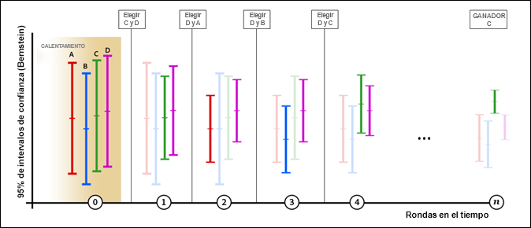

# Asignación automática{#auto-allocate}

La asignación automática identifica un ganador entre dos o más experiencias y le reasigna automáticamente más tráfico para aumentar las conversiones mientras la prueba sigue ejecutándose y aprendiendo.

Mientras [crea una actividad A/B con el flujo de trabajo guiado de tres pasos](../../c-activities/t-test-ab/t-test-create-ab/test-create-ab.md#task_68C8079BF9FF4625A3BD6680D554BB72), puede elegir la opción [!UICONTROL Asignar automáticamente a la mejor experiencia].

## El reto {#section_85D5A03637204BACA75E19646162ACFF}

Las pruebas A/B estándar tienen un coste inherente. Debe invertir tráfico para medir el rendimiento de cada experiencia y utilizar el análisis para determinar la experiencia ganadora. La distribución del tráfico sigue siendo fija incluso después de reconocer que el rendimiento de algunas experiencias supera al de otras. Además, es complicado determinar el tamaño de la muestra, y la actividad debe haber finalizado para poder tomar medidas con la mejor experiencia. Después de todo esto, existe la posibilidad de que la mejor experiencia identificada en realidad no sea la mejor.

## La solución: Asignación automática {#section_98388996F0584E15BF3A99C57EEB7629}

La asignación automática reduce este coste y gastos derivados de determinar una experiencia ganadora. La asignación automática supervisa el rendimiento de la métrica de objetivos de todas las experiencias y envía a más participantes de manera proporcional a las experiencias de mayor rendimiento. Se reserva bastante tráfico para explorar el resto de las experiencias. Las ventajas de la prueba se pueden observar en los resultados, incluso con la actividad aún en curso: la optimización se produce en paralelo al aprendizaje.

La asignación automática envía a los visitantes de forma gradual hacia las experiencias ganadoras, en vez de hacerles esperar hasta que la actividad acabe para determinar un ganador. Saca provecho del alza más rápidamente porque a los visitantes de la actividad a los que se ha enviado a experiencias con peor rendimiento se les muestran experiencias que potencialmente son las ganadoras.

Una prueba A/B normal en Target muestra únicamente comparaciones de pares de aspirantes y un elemento de control. Por ejemplo, si una actividad tiene las experiencias A, B, C y D, en la que A es el control, una prueba A/B normal de Target compararía A con B, A con C y A con D.

En este tipo de pruebas, la mayoría de los productos, incluido Target, utilizan una prueba T de estudiante para producir confianza basada en el valor P. Este valor de confianza se utiliza para determinar si el aspirante es lo suficientemente distinto del elemento de control. Sin embargo, Target no realiza automáticamente las comparaciones implícitas (B con C, B con D y C con D) necesarias para encontrar la “mejor” experiencia. Por tanto, el experto en marketing debe analizar manualmente los resultados para determinar cuál es esta “mejor” experiencia.

Asignación automática realiza comparaciones implícitas entre todas las experiencias y produce una ganadora “real”. No existe ninguna experiencia de “control” en la prueba.

Asignación automática asigna de forma inteligente nuevos visitantes a distintas experiencias hasta que el intervalo de confianza de la mejor experiencia no se superponga con el de ninguna otra experiencia. Normalmente, este proceso puede producir falsos positivos, pero Asignación automática utiliza intervalos de confianza basados en la [desigualdad de Bernstein](https://en.wikipedia.org/wiki/Bernstein_inequalities_(probability_theory)) que compensan las evaluaciones repetidas. Entonces, conoceremos el auténtico ganador. Cuando la asignación automática se detiene, y siempre que no exista una dependencia del tiempo sustancial para los visitantes que llegan a la página, hay al menos un 95 % de probabilidades de que la asignación automática devuelva una experiencia cuya respuesta verdadera no difiera en más del 1 % (relativo) de la respuesta verdadera de la experiencia ganadora.

## Cuándo se debe utilizar la asignación automática y cuándo la personalización automatizada o A/B {#section_3F73B0818A634E4AAAA60A37B502BFF9}

* Utilice la **asignación automática** cuando quiera optimizar la actividad desde el principio e identificar las experiencias ganadoras lo antes posible. Al ofrecer experiencias con alto rendimiento con más frecuencia, aumenta el rendimiento general de la actividad.
* Utilice una **[prueba A/B](../../c-activities/t-test-ab/test-ab.md#task_05E33EB15C4D4459B5EAFF90A94A7977)** estándar cuando quiera caracterizar el rendimiento de todas las experiencias antes de optimizar el sitio web. Una prueba A/B le ayuda a clasificar todas las experiencias propias, mientras que la Asignación automática del tráfico encuentra las experiencias con mejor rendimiento pero no garantiza poder diferenciar entre las que tienen peor rendimiento.
* Utilice [Personalización automatizada](../../c-activities/t-automated-personalization/automated-personalization.md#task_8AAF837796D74CF893CA2F88BA1491C9) cuando quiera algoritmos de optimización de la más alta complejidad, como pueden ser los modelos de aprendizaje automático que crean predicciones basadas en atributos concretos del perfil. La Asignación automática del tráfico examina el comportamiento agregado de las experiencias (como las pruebas A/B estándar) y no diferencia entre visitantes.

## Ventajas principales   {#section_0913BF06F73C4794862561388BBDDFF0}

* Tiene el mismo rigor que una prueba A/B
* Encuentra una experiencia ganadora con relevancia estadística más rápido que una prueba A/B manual
* Proporciona un alza de la campaña de media superior a la de una prueba A/B manual

## Terminología {#section_670F8785BA894745B43B6D4BFF953188}

Los siguientes términos pueden resultar útiles al tratar el tema de la asignación automática:

**Multi-armed bandit:** un método [multi-armed bandit](https://en.wikipedia.org/wiki/Multi-armed_bandit) en la optimización equilibra el aprendizaje de exploración y la explotación de dicho aprendizaje.

## Cómo funciona el algoritmo {#section_ADB69A1C7352462D98849F2918D4FF7B}

La lógica general de la asignación automática combina el rendimiento medido (por ejemplo, la tasa de conversión) con intervalos de confianza de los datos acumulados. Al contrario que en la prueba A/B estándar, en la que el tráfico se divide de forma equitativa entre las experiencias, la asignación automática cambia la asignación del tráfico entre las distintas experiencias.

* El 80 % de los visitantes se asigna mediante la lógica inteligente que se describe a continuación.
* El otro 20 % de los visitantes se asigna de forma aleatoria entre todas las experiencias para adaptarse a los cambios de comportamiento de los visitantes.

El método multi-armed bandit mantiene libres algunas experiencias para la exploración a la vez que explota las experiencias con buen rendimiento. Se colocan más visitantes nuevos en experiencias con buen rendimiento, mientras que se reserva la capacidad de reaccionar a condiciones cambiantes. Estos modelos se actualizan por lo menos una vez cada hora para garantizar que el modelo reaccione a los datos más recientes.

A medida que entran más visitantes a la actividad, algunas experiencias empiezan a mejorar el rendimiento y se envía más tráfico hacia esas experiencias con buenos resultados. El 20 % del tráfico se sigue ofreciendo de forma aleatoria para explorar todas las experiencias. Si una de las experiencias de bajo rendimiento empieza a mejorar su rendimiento, se le asignará más tráfico. Del mismo modo, si disminuye el éxito de una actividad de alto rendimiento, se le asignará menos tráfico a dicha experiencia. Por ejemplo, si un evento provoca que los visitantes busquen información diferente en su sitio web multimedia o si las ventas del fin de semana de su sitio de comercio minorista proporcionan diferentes resultados.

En la siguiente ilustración se representa un posible resultado del algoritmo durante una prueba con cuatro experiencias:

La ilustración muestra cómo progresa el tráfico asignado a cada experiencia durante varias rondas de la duración de una actividad hasta que se determina un claro ganador.

| Ronda | Descripción |
|--- |--- |
|  | **Ronda de calentamiento (0):** durante la ronda de calentamiento, cada experiencia obtiene la misma asignación de tráfico hasta que cada experiencia de la actividad tenga un mínimo de 1000 visitantes y 50 conversiones.<ul><li>Experiencia A = 25 %</li><li>Experiencia B = 25 %</li><li>Experiencia C = 25 %</li><li>Experiencia D = 25 %</li></ul>Una vez que todas las experiencias han obtenido 1000 visitantes y 50 conversiones, Target inicia la asignación automática del tráfico. Todas las asignaciones tienen lugar por rondas y se eligen dos experiencias para cada ronda. Solo dos experiencias pasan a la siguiente ronda: D y C.  Al pasar a la siguiente ronda, se asignará a estas dos experiencias un 80 % del tráfico de forma equitativa, mientras que las otras dos experiencias seguirán participando, pero solo formarán parte del 20 % de asignación aleatoria del tráfico cuando lleguen nuevos visitantes a la actividad. Todas las asignaciones se actualizan cada hora (tal y como se muestra por rondas en el eje X anterior). Después de cada ronda, se comparan los datos acumulados. |
|  | **Ronda 1**: durante esta ronda, el 80 % del tráfico se asigna a las experiencias C y D (un 40 % a cada una). El 20 % del tráfico se asigna aleatoriamente a las experiencias A, B, C y D (un 5 % a cada una). Durante esta ronda, la experiencia A presenta un buen rendimiento.<ul><li>El algoritmo decide que la experiencia D pasa a la siguiente ronda porque tiene la tasa de conversión más alta (tal y como indica en la escala vertical de cada actividad).</li><li>El algoritmo decide que la experiencia A también supera esta primera prueba porque tiene la cota superior más alta del intervalo de confianza del 95 % de Bernstein en comparación con las demás experiencias.</li></ul>Las experiencias D y A pasan a la siguiente ronda. |
|  | **Ronda 2**: durante esta ronda, el 80 % del tráfico se asigna a las experiencias A y D (un 40 % a cada una). El 20 % del tráfico se asigna aleatoriamente, de modo que A, B, C y D reciben, respectivamente, un 5 % del tráfico. Durante esta ronda, la experiencia B presenta un buen rendimiento.<ul><li>El algoritmo decide que la experiencia D pasa a la siguiente ronda porque tiene la tasa de conversión más alta (tal y como indica en la escala vertical de cada actividad).</li><li>El algoritmo decide que la experiencia B también supera esta segunda prueba porque tiene la cota superior más alta del intervalo de confianza del 95 % de Bernstein en comparación con las demás experiencias.</li></ul>Las experiencias D y B pasan a la siguiente ronda. |
|  | **Ronda 3**: durante esta ronda, el 80 % del tráfico se asigna a las experiencias B y D (un 40 % a cada una). El 20 % del tráfico se asigna aleatoriamente, de modo que A, B, C y D reciben, respectivamente, un 5 % del tráfico. Durante esta ronda, la experiencia D sigue teniendo un buen rendimiento y la experiencia C también logra buenos resultados.<ul><li>El algoritmo decide que la experiencia D pasa a la siguiente ronda porque tiene la tasa de conversión más alta (tal y como indica en la escala vertical de cada actividad).</li><li>El algoritmo decide que la experiencia C también pasa a la siguiente ronda porque tiene la cota superior más alta del intervalo de confianza del 95 % de Bernstein de las experiencias restantes.</li></ul>Las experiencias D y C pasan a la siguiente ronda. |
|  | **Ronda 4**: durante esta ronda, el 80 % del tráfico se asigna a las experiencias C y D (un 40 % a cada una). El 20 % del tráfico se asigna aleatoriamente, de modo que A, B, C y D reciben, respectivamente, un 5 % del tráfico. Durante esta ronda, la experiencia C presenta un buen rendimiento.<ul><li>El algoritmo decide que la experiencia C pasa a la siguiente ronda porque tiene la tasa de conversión más alta (tal y como indica en la escala vertical de cada actividad).</li><li>El algoritmo decide que la experiencia D también supera esta cuarta prueba porque tiene la cota superior más alta del intervalo de confianza del 95 % de Bernstein en comparación con las demás experiencias.</li></ul>Las experiencias C y D pasan a la siguiente ronda. |
|  | **Ronda n**: a medida que progresa la actividad, una experiencia de alto rendimiento empieza a destacar y el proceso continúa hasta que se obtiene la experiencia ganadora. Cuando el intervalo de confianza de la experiencia con la tasa de conversión más alta no se superponga con el intervalo de confianza de ninguna otra experiencia, se etiqueta el ganador y aparece un [distintivo en la página de la actividad](/help/c-activities/automated-traffic-allocation/determine-winner.md) y en la lista de actividades.<ul><li>El algoritmo decide que la experiencia C es la clara ganadora</li></ul>En este punto, el algoritmo otorga el 80 % del tráfico a la experiencia C, mientras que el 20 % del tráfico se sigue ofreciendo aleatoriamente a todas las experiencias (A, B, C y D). En total, C recibe el 85 % del tráfico. En el improbable caso de que el intervalo de confianza del ganador empiece a superponerse de nuevo, el algoritmo restablece el comportamiento de la ronda 4. **Importante:** Si elige un ganador de forma manual antes de que finalice el proceso, habría sido fácil elegir la experiencia incorrecta. Por ese motivo, lo más recomendable es esperar a que el algoritmo determine cuál es la experiencia ganadora. |

Si la actividad solo tiene dos experiencias, ambas tendrán un tráfico equitativo hasta que Target encuentre una experiencia con un 90 % de confianza. En ese momento, el 70 % del tráfico se asigna al ganador y el 30 % al perdedor. Una vez la experiencia alcance el 95 % de confianza, el 100% del tráfico se asigna al ganador y el 0% al perdedor.

After an [!UICONTROL Auto-Allocate] activity is activated, the following operations from the UI are not allowed:

* Cambiar el modo “Asignación del tráfico” a “Manual”
* Cambiar el tipo de la métrica de objetivo
* Cambiar opciones en el panel “Configuración avanzada”

## Ver cómo funciona la asignación automática

Para obtener más información, consulte La asignación [automática puede proporcionarle resultados de prueba más rápidos y mayores ingresos que una prueba manual](/help/c-activities/automated-traffic-allocation/faster-results-higher-revenue.md)

## Advertencias {#section_5C83F89F85C14FD181930AA420435E1D}

**La función de asignación automática funciona solo con una configuración de métrica avanzadas: Aumentar recuento y mantener al usuario en la actividad**

No se admiten las siguientes configuraciones de métrica avanzadas: Aumentar recuento, liberar usuario y permitir la reentrada ni Aumentar recuento, liberar usuario y bloquear su reentrada.

**Los visitantes asiduos pueden inflar las tasas de conversión de la experiencia.**

Si un visitante que ve la experiencia A vuelve a menudo y genera varias conversiones, la tasa de conversión de la experiencia A se incrementa de forma artificial. Compare este comportamiento con la experiencia B, en la que los visitantes generan conversiones pero no vuelven a menudo. Como resultado, la tasa de conversión de A parece mejor que la de B, de modo que es más probable que los visitantes nuevos se asignen a A en lugar de a B. Si decide contabilizar una vez por visitante, puede que la tasa de conversión de A y la de B sean idénticas.

Si los visitantes que vuelven se distribuyen de forma aleatoria, es más probable que se equilibre su impacto en las tasas de conversión. Para mitigar este impacto, plantéese la opción de cambiar el método de recuento de la métrica de objetivos para que solo contabilice una vez por cada visitante.

**Diferencia entre las experiencias con mejor rendimiento, no entre las de peor rendimiento.**

La asignación automática puede diferenciar sin problemas entre las experiencias de rendimiento alto (y determinar cuál es la mejor). Puede que en ocasiones no haya suficiente diferencia entre las experiencias con rendimiento bajo.

Si desea elaborar una diferencia estadísticamente relevante entre todas las experiencias, puede usar el modo manual de asignación de tráfico.

**Las tasas de conversión correlativas en el tiempo (o que varían según el contexto) pueden inclinar las cantidades de asignación.**

Algunos factores que se pueden ignorar durante una prueba A/B estándar porque afectan de igual modo a todas las experiencias no se pueden ignorar en una prueba de asignación automática. El algoritmo es sensible a las tasas de conversión observadas. A continuación tiene algunos ejemplos de factores que pueden afectar al rendimiento de la experiencia de forma desigual:

* Experiencias con diferente relevancia contextual (hora, ubicación, criterios de sexo, etc.).

   Por ejemplo:

   * “Menos mal que ya es viernes” genera más conversiones los viernes
   * “Empieza el lunes con energía” obtiene más conversiones los lunes
   * “Encuentra todo lo necesario para pasar el invierno en el Norte” ofrece más conversiones en lugares del Norte o donde el invierno se hace sentir

Estos factores pueden distorsionar los resultados de una prueba de asignación automática más que los de una prueba A/B, porque la prueba A/B analiza los resultados durante un periodo de tiempo más largo.

* Experiencias con diferentes retrasos en la conversión, posiblemente debidos a la urgencia del mensaje.

   Por ejemplo, el mensaje “El descuento del 30% acaba hoy” señala al visitante que debe generar hoy la conversión, mientras que “Descuento del 50% en la primera compra” no crea la misma sensación de urgencia.

## Preguntas frecuentes {#section_0E72C1D72DE74F589F965D4B1763E5C3}

Consulte las siguientes preguntas más frecuentes y respuestas cuando trabaje con actividades de asignación  automática:

### ¿Analytics para Destinatario (A4T) admite actividades de asignación automática?

Sí. Para obtener más información, consulte Compatibilidad [de Analytics para Destinatario (A4T) con actividades](/help/c-integrating-target-with-mac/a4t/campaign-creation.md#a4t-aa) de asignación automática en la creación *de* Actividades.

###  ¿Los visitantes de retorno se asignan automáticamente a experiencias con alto rendimiento?

No. Solo se asigna automáticamente a los visitantes nuevos. Los de retorno siguen viendo la experiencia original. Así se protege la validez de la prueba A/B.

###  ¿Qué tratamiento se da a los falsos positivos en el algoritmo?

El algoritmo garantiza una tasa de confianza del 95 % o una tasa de falso positivo del 5 % si espera hasta que aparezca el distintivo de ganador.

### ¿Cuándo empieza a asignar tráfico la asignación automática?

El algoritmo empieza a funcionar cuando todas las experiencias de la actividad tienen un mínimo de 1000 visitantes y 50 conversiones.

### ¿Qué nivel de agresividad utiliza el algoritmo para la explotación?

El 80 % del tráfico se reparte mediante la asignación automática y el otro 20 % se reparte de forma aleatoria. Cuando se identifica un ganador, este recibe el 80 % del tráfico, mientras que el otro 20 % se reparte entre todas las experiencias, incluyendo la ganadora.

###  ¿Las experiencias perdedoras se señalan en algún momento?

Sí. El método multi-armed bandit garantiza que al menos el 20 % del tráfico se reserva para explorar las tasas de conversión o los patrones cambiantes en todas las experiencias.

### ¿Qué pasa con las actividades con retrasos de conversión largos?

Siempre que todas las experiencias que se vayan a optimizar sufran los mismos retrasos, el comportamiento será igual al de una actividad con un ciclo de conversión más rápido, aunque se tardará más en alcanzar el umbral de 50 conversiones antes de que comience el proceso de asignación de tráfico.

### ¿En qué se diferencian la asignación automática y la personalización automatizada?

Personalización automatizada usa los atributos de perfil de cada visitante para elegir la mejor experiencia. Con esto, no solo se optimiza la actividad del usuario, sino que se personaliza.

Asignación automática, por su parte, es una prueba A/B que genera un ganador global (la experiencia más popular, pero no necesariamente la más eficaz para cada visitante).

###  ¿Los visitantes de retorno inflan la tasa de conversión en mi métrica de éxito?

En estos momentos, la lógica favorece a los visitantes que generan una conversión rápidamente o que realizan visitas más a menudo. Se debe a que estos visitantes inflan temporalmente la tasa de conversión de la experiencia a la que pertenecen. El algoritmo se ajusta a menudo, de modo que el aumento en la tasa de conversión se amplifica en cada instantánea. Si el sitio recibe muchos visitantes que vuelven, las conversiones que generen pueden inflar la tasa de conversión general de la experiencia a la que pertenecen. Hay probabilidades de que los visitantes que vuelven se distribuyan de forma aleatoria. En ese caso, el efecto agregado (alza incrementada) se equilibra. Para mitigar este impacto, plantéese la opción de cambiar el método de recuento de la métrica de éxito para que solo contabilice una vez por cada visitante.

### ¿Puedo usar la calculadora de tamaño de la muestra al utilizar la asignación automática para estimar el tiempo que tardará la actividad en identificar al ganador?

You can use the existing [sample size calculator](https://docs.adobe.com/content/target-microsite/testcalculator.html) to get an estimate of how long the test will run. (Como sucede con las pruebas A/B tradicionales, aplique la corrección de Bonferroni si está probando más de dos ofertas o más de una métrica o hipótesis de conversión). Tenga en cuenta que esta calculadora está diseñada para las pruebas A/B de horizonte fijo tradicionales y solo proporciona una estimación. El uso de la calculadora para una actividad de asignación automática es opcional porque la asignación automática le declarará ganador (no necesita elegir un punto fijo en el tiempo para ver los resultados de la prueba), los valores proporcionados siempre son estadísticamente válidos. En nuestros experimentos hemos encontrado lo siguiente:
* Al probar exactamente dos experiencias, la asignación automática encuentra un ganador más rápido que las pruebas de horizonte fijo (es decir, el intervalo de tiempo sugerido por la calculadora de tamaño de la muestra) cuando la diferencia de rendimiento entre las experiencias es grande, pero puede requerir más tiempo para identificar un ganador cuando la diferencia de rendimiento entre las experiencias es pequeña. En estos casos, las pruebas de horizonte fijo normalmente habrían finalizado sin un resultado estadísticamente significativo.
* Al probar más de dos experiencias, la asignación automática encuentra un ganador más rápido que las pruebas de horizonte fijo (es decir, el intervalo de tiempo sugerido por la calculadora de tamaño de la muestra) cuando una única experiencia supera con creces el resto de las experiencias. Cuando dos o más experiencias están &quot;ganando&quot; en comparación con otras, pero están muy relacionadas entre sí, la asignación automática puede requerir tiempo adicional para determinar cuál es superior. En estos casos, las pruebas de horizonte fijo normalmente habrían finalizado al concluir que las experiencias &quot;ganadoras&quot; eran mejores que las experiencias de menor rendimiento, pero no habrían identificado cuál era superior.

### ¿Debería eliminar una experiencia con bajo rendimiento de una actividad de asignación automática para acelerar el proceso de determinación de un ganador?

Realmente no hay razón para eliminar una experiencia con bajo rendimiento. La asignación automática sirve automáticamente las experiencias de alto rendimiento con más frecuencia y las experiencias de bajo rendimiento con menos frecuencia. Dejar una experiencia con bajo rendimiento en la actividad no afectará significativamente a la velocidad para determinar un ganador.

El 20 % de los visitantes se asigna de forma aleatoria entre todas las experiencias. La cantidad de tráfico que se proporciona a una experiencia con bajo rendimiento es mínima (20% dividido por el número de experiencias).

### ¿Puedo cambiar la métrica de objetivos a medio camino a través de una actividad de asignación automática? {#change-metric}

No se recomienda cambiar la métrica de objetivos a mitad de camino a través de una actividad. Aunque es posible cambiar la métrica de objetivos durante una actividad mediante la [!DNL Target] interfaz de usuario, siempre debe realizar el inicio de una nueva actividad. No garantizamos lo que sucede si cambia la métrica de objetivo en una actividad después de que se esté ejecutando.

Esta recomendación se aplica a las actividades [!UICONTROL de asignación]automática, Destinatario automático y [!UICONTROL Automated Personalization] que utilizan [!DNL Target] o [!DNL Analytics] (A4T) como origen de sistema de informes.

### ¿Puedo utilizar la opción Restablecer datos del informe mientras ejecuto una actividad de asignación automática?

No se recomienda utilizar la opción [!UICONTROL Restablecer datos] de informes para actividades de asignación  automática. Aunque elimina los datos de sistema de informes visibles, esta opción no elimina todos los registros de formación del modelo de asignación [!UICONTROL automática] . En lugar de utilizar la opción [!UICONTROL Restablecer datos] del informe para actividades de asignación  automática, cree una nueva actividad y desactive la actividad original. (Nota: Esta guía también se aplica a las actividades [!UICONTROL de Destinatario] automático y [!UICONTROL Automated Personalization] ).

### ¿Cómo genera la asignación automática modelos con respecto a los entornos?

[!UICONTROL La asignación] automática genera modelos basados en el tráfico y el comportamiento de conversión registrado solo en el entorno predeterminado. De forma predeterminada, [!UICONTROL Producción] es el entorno predeterminado, pero esto se puede cambiar en [Administración de Destinatarios > Entornos](/help/administrating-target/environments.md).

Si una visita se produce en otro entorno (no predeterminado), el tráfico se distribuye según el comportamiento de conversión observado en el entorno predeterminado. El resultado de esa visita (conversión o no conversión) se registrará con fines de sistema de informes pero no se tendrá en cuenta en el modelo de asignación  automática.

Al seleccionar otro entorno, el informe mostrará el tráfico y las conversiones de ese entorno. El entorno seleccionado predeterminado para un informe siempre será el predeterminado de toda la cuenta que esté seleccionado. El entorno predeterminado no se puede establecer por actividad.

## Vídeos de formación {#section_893E5B36DC4A415C9B1D287F51FCCB83}

Los siguientes vídeos contienen más información sobre los conceptos mencionados en este artículo.

### Flujo de trabajo de actividad - Segmentación (2:14) 

Este vídeo incluye información sobre cómo configurar la asignación de tráfico.

* Asignar una audiencia a la actividad
* Acelerar o desacelerar el tráfico
* Seleccionar el método de asignación de tráfico
* Asignar tráfico entre distintas experiencias

>[!VIDEO](https://video.tv.adobe.com/v/17385)

### Creación de una insignia de 

En este vídeo se explica cómo crear una prueba A/B siguiendo el flujo de trabajo guiado de tres pasos de Target. La asignación de tráfico automática se explica a partir del minuto 4:45.

* Crear una actividad A/B en Adobe Target
* Asignar tráfico usando una división manual o una asignación automática

>[!VIDEO](https://video.tv.adobe.com/v/17391)
