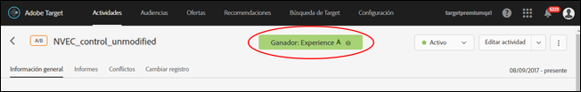
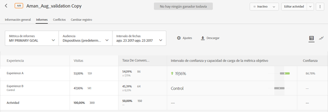
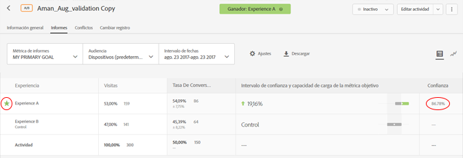

# Determinar un ganador{#determine-a-winner}

Determine el ganador de una actividad A/B de asignación automática consultando los indicadores en la interfaz de usuario de Target.

Muchos especialistas en marketing cometen el error de declarar una experiencia ganadora precipitadamente antes de que los resultados indiquen el claro ganador. Ahora, le facilitamos la tarea de determinar el ganador.

## Ver el distintivo de ganador en la interfaz de usuario de Target {#section_24007470CF5B4D30A06610CE8DD23CE3}

Al utilizar la función de [!UICONTROL asignación automática], [!DNL Target] muestra un distintivo en la parte superior de la página de la actividad indicando “Ningún ganador aún” hasta que la actividad alcance el número mínimo de conversiones con suficiente confianza.

Cuando se declara un claro ganador, [!DNL Target] muestra “Ganador: Experiencia X”.

>[!NOTE]
>
>Las actividades de asignación automática han sido diseñadas para encontrar la mejor experiencia entre todas las opciones y no solo hacer comparaciones por pares con control.

## Garantías estadísticas de asignación automática {#section_7AF3B93E90BA4B80BC9FC4783B6A389C}

Al finalizar una actividad A/B, la asignación automática garantiza que el ganador determinado tiene una tasa efectiva de falsos positivos del 5 %. Esto significa que solo un 5 % de las veces el ganador determinado no es realmente la mejor experiencia de todas las que participan en la actividad. En una prueba A/A (con experiencias idénticas), la prueba se finaliza menos del 5 % de las veces. El comportamiento previsto en una prueba A/A (con experiencias idénticas) es que se ejecute de forma indefinida, de modo que nunca se mostrará el distintivo de ganador.

En la asignación automática no se utiliza la confianza basada en el valor P.

La columna Confianza de una actividad de asignación automática (ilustrada abajo) muestra la probabilidad de que una experiencia sea la ganadora con un 1 % de margen de error (es decir, el algoritmo usa un efecto mínimo detectable del 1 % entre la primera mejor tasa de conversión y la segunda). Observe que el algoritmo usa la [desigualdad de Bernstein](https://en.wikipedia.org/wiki/Bernstein_inequalities_(probability_theory)) para calcular esta probabilidad.

Las pruebas A/B normales calculan la confianza según los valores p. La asignación automática no usa valores p. Los valores p calculan de forma “flexible” la probabilidad de que una experiencia indicada sea diferente al control. Estos valores P solo pueden usarse para determinar si una experiencia es diferente al control. Estos valores no pueden usarse para determinar si una experiencia es diferente a otra experiencia (no control).

La siguiente ilustración muestra una actividad en la que aún no hay ganador:

La siguiente ilustración muestra una actividad en la que ya hay un ganador:

## Preguntas frecuentes {#section_C8E068512A93458D8C006760B1C0B6A2}

**Han pasado varios días desde que empezó la actividad. ¿Por qué todos los valores de confianza siguen en el 0 %?**

Alguna de las siguientes razones describe la razón por la que se muestra un 0 % en la columna [!UICONTROL Confianza] de todas las actividades en el informe:

* Las pruebas A/B manuales y la asignación automática usan diferentes estadísticas para mostrar valores de confianza.

   Las pruebas A/B manuales usan valores p según una [prueba T de estudiante](https://en.wikipedia.org/wiki/Student%27s_t-test). Un valor P es la probabilidad de encontrar la diferencia observada (o más extrema) entre una experiencia y el control, dado que en la realidad no existe dicha diferencia. Estos valores P solo pueden utilizarse para determinar si los datos observados son coherentes con una experiencia determinada y si el control es el mismo. Estos valores no pueden usarse para determinar si una experiencia es diferente a otra experiencia (no control).

   La asignación automática muestra la probabilidad de que una experiencia indicada sea la auténtica ganadora de todas las experiencias de la actividad. Esto significa que solo una experiencia ganadora (que tiene más probabilidades de ganar) tendrá un valor de confianza diferente a cero. El resto tienen más probabilidades de perder y mostrarán un 0 %.

* La asignación automática solo empieza a mostrar la confianza después de que la experiencia ganadora reúna un 60 % de confianza. Estos niveles de confianza suelen aparecer en aproximadamente la mitad del tiempo que tardaría una prueba A/B normal en completarse (aunque esto no está garantizado). To determine how long a normal A/B test would run, please use a [sample size calculator](https://docs.adobe.com/content/target-microsite/testcalculator.html): plug control's conversion-rate in "Baseline conversion rate," "5%" for "Lift," and 95% for "Confidence." Normalmente, la confianza empieza a mostrarse después de que cada experiencia haya reunido al menos un 50 % de las muestras por experiencia necesarias. Esto le dará una idea de cuándo empezará a aparecer la confianza.
* Si el informe muestra un 0 % en el panel, es probable que sea pronto para la actividad.

