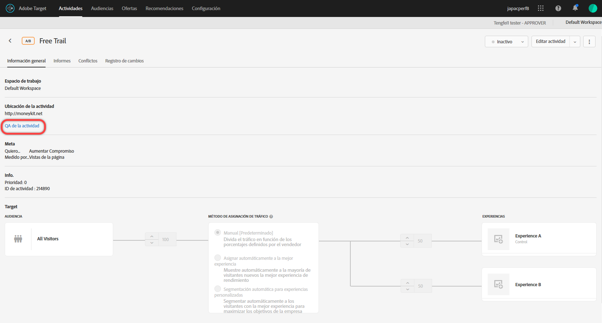
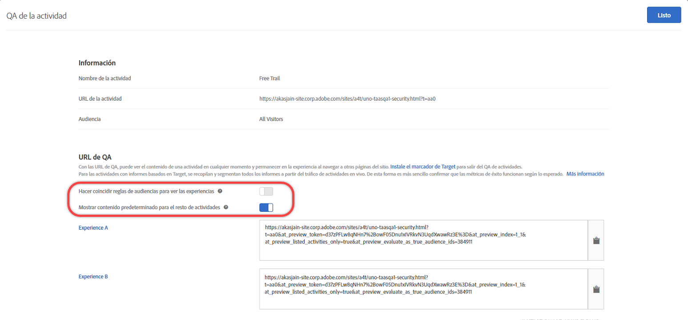

# Control de calidad de la actividad

Use direcciones URL de control de calidad en [!DNL Adobe Target] para realizar sencillos controles de calidad de las actividades de extremo a extremo con vínculos de vista previa invariables, segmentación opcional de audiencias y realización de informes de control de calidad que permanecen segmentados a partir de datos de actividades activas.

## Información general {#section_11B761A522A14E61978275772210A4C2}

Control de calidad de la actividad le permite probar completamente las actividades de Target antes de su lanzamiento. La funcionalidad de control de calidad de la actividad incluye:

* Vínculos que nunca cambian ni requieren regeneración, independientemente de las actualizaciones realizadas en las experiencias o actividades, para compartir con los integrantes del equipo. Esto permite probar todas las actividades a lo largo del viaje del usuario.
* Respeto opcional a las condiciones a audiencia, de forma que los expertos en marketing puedan probar o ignorar criterios de segmentación con el fin de evaluar el aspecto de las experiencias sin necesidad de cumplir sus condiciones de audiencia.
* La realización de informes de control de calidad se captura; de este modo, los expertos en marketing pueden confirmar si las métricas aumentan del modo esperado y es posible mantener los datos de informes de control de calidad separados de los informes de producción (para la creación de informes ajenos a A4T).
* La capacidad de obtener una vista previa de una experiencia de forma aislada o junto con otras actividades activas que satisfagan los criterios de entrega (página/solicitud de Target/audiencia).
* La capacidad para realizar un control de calidad del viaje del usuario completo. Puede acceder a su sitio una vez con el vínculo de control de calidad y, a continuación, examinar el sitio entero durante el control de calidad de la actividad. Permanecerá en el control de calidad de la actividad hasta que termine la sesión o hasta que utilice el  [bookmarklet QA Target](/help/c-activities/c-activity-qa/activity-qa-bookmark.md#concept_A8A3551A4B5342079AFEED5ECF93E879) para forzar su salida de dicho control de calidad. Esta característica es especialmente útil si su actividad abarca varias páginas web.

   >[!NOTE]
   >
   >Esto ocurre en las implementaciones de at.js con la versión 2.** xor later. Para at.js 1.** ximplementaciones, esto solo ocurre si el explorador del visitante no bloquea las cookies de terceros.

## Acceso y uso compartido de una URL de control de calidad {#section_1C59BAA247B247BDB125D1BE8EAD4547}

1. En la página [!UICONTROL Información general] de una actividad, haga clic en el enlace **[!UICONTROL Control de calidad de la actividad]**.

   

1. Configure los siguientes ajustes:

   

   * **Hacer coincidir reglas de audiencias para ver las experiencias:** en ocasiones se quiere confirmar que la coincidencia de audiencias funcione. Otra veces, solo se quiere comprobar el aspecto de la actividad. Si esta opción está activada, los analistas deben cumplir los requisitos de segmentación para poder ver las experiencias. En el caso de actividades de Segmentación de experiencias (XT), se proporciona una única URL de actividad. La experiencia que se ve la determina el cumplimiento de alguna de las reglas de segmentación.

      Si esta opción está desactivada, al hacer clic en los vínculos se mostrarán las experiencias independientemente de si se cumplen los requisitos o no. Al realizar el control de calidad, puede cambiar repetidamente entre un ajuste y otro.

   * **Mostrar contenido predeterminado para el resto de actividades:** si esta opción está activada, se muestra el contenido predeterminado para todas las demás actividades (por ejemplo, la vista previa se mostrará aisladamente sin considerar las demás actividades activas en la misma página/[!DNL Target] solicitud.

      Si el ajuste está desactivado, tenga en cuenta lo siguiente:

      * En caso de conflicto entre la actividad que está probando y otras actividades en curso, se aplicarán  [reglas de prioridad normales](/help/c-activities/priority.md#concept_1780C11FEA57440499F0047DD6900E0F). Debido a esto, es posible que no vea la actividad que desea someter a control de calidad.
      * Las métricas aumentan para las actividades vistas, pero solo en el entorno de realización de informes de control de calidad.

1. Haga clic en **[!UICONTROL Hecho]** para guardar los cambios.
1. Comparta las URL de vínculos de actividad con miembros de su organización para que las prueben.

   Los vínculos de actividad nunca caducan y no es necesario volver a enviarlos si alguien realiza cambios en una actividad o experiencia. Sin embargo, si aplica una audiencia distinta de la biblioteca de audiencias, no podrá limitarse a editar la actividad, pues se generará un nuevo vínculo que tendrá que volver a compartir.

   Cada URL de vínculos de actividad (para Exp A, Exp B, etc.) le permite iniciar el viaje del usuario desde la experiencia correspondiente. Puede hacer clic en la URL generada para una experiencia y, a continuación, examinar normalmente el sitio para ver experiencias en varias páginas (de haberlas). Se genera una única URL por experiencia, aunque esta abarque múltiples páginas (prueba de plantilla o prueba multipágina).

   Puede explorar el sitio para ver las demás páginas, ya que el control de calidad de la actividad es persistente. Tenga en cuenta que esto es así en implementaciones de at.js con la versión 2.** xor later. Para at.js 1.** ximplementaciones, esto solo ocurre si el explorador del visitante no bloquea las cookies de terceros.

1. Para ver los informes generados a partir de las URL de vínculos de actividad, haga clic en la página **[!UICONTROL Informes]** de la actividad, haga clic en el icono **[!UICONTROL Configuración]** () y, a continuación, seleccione **[!UICONTROL Modo de control de calidad]** en la lista desplegable **[!UICONTROL Entorno]**.

## Consideraciones {#section_B256EDD7BFEC4A6DA72A8A6ABD196D78}

* El vínculo [!UICONTROL Control de calidad de la actividad] aparece en la página [!UICONTROL Información general] de todos los tipos de actividad excepto Personalización automatizada (AP).
* Es posible que los vínculos de Vista previa de control de calidad de la actividad para las actividades guardadas no se carguen si hay demasiadas guardadas en su cuenta. Volver a intentar los vínculos de vista previa debería funcionar. Para evitar que esto siga ocurriendo, archive las actividades guardadas que ya no se usan de forma activa.
* Las URL de control de calidad de la actividad están disponibles con actividades que tienen Analytics como fuente de informes (A4T). Las visitas generadas mientras se realiza un control de calidad utilizando el control de calidad de la actividad fluirán al mismo grupo de informes al que llegan los datos de la actividad, incluso después de activarse esta última.
* El control de calidad de la actividad no muestra contenido para actividades archivadas o ya caducadas. Si desactiva una actividad terminada, debe guardar la actividad de nuevo para que el control de calidad de la actividad funcione.
* Las actividades importadas en Target Standard/Premium (desde Target Classic, por ejemplo) no admiten direcciones URL de control de calidad.
* En las actividades de asignación automática, segmentación automática y recomendaciones, el modelo no se ve afectado por las visitas capturadas en el control de calidad de la actividad.
* Como el control de calidad de la actividad es persistente, después de examinar un sitio web durante el control de calidad de la actividad, la sesión de Target debe caducar o tiene que indicar a Target que lo libere del control de calidad antes de poder ver su sitio como un visitante normal. Use el [bookmarklet de control de calidad de Target](/help/c-activities/c-activity-qa/activity-qa-bookmark.md#concept_A8A3551A4B5342079AFEED5ECF93E879) para forzar su salida de dicho control de calidad de la actividad.

   También puede forzar la salida manual cargando una página en su sitio con un valor en blanco en el parámetro `at_preview_token` (por ejemplo, `https://www.mysite.com/?at_preview_token=`).

* Si ha especificado “URL es” al crear la mejora de actividad [en el Compositor basado en formularios](/help/c-experiences/form-experience-composer.md#task_FAC842A6535045B68B4C1AD3E657E56E) o en las opciones de envío [de página del Compositor de experiencias visuales,](/help/c-experiences/c-visual-experience-composer/viztarget-options.md#reference_3BD1BEEAFA584A749ED2D08F14732E81) la URL de control de calidad no funcionará porque el control de calidad de la actividad adjunta parámetros de URL. Para solucionar este problema, haga clic en la URL de control de calidad para ir a su sitio, elimine los parámetros añadidos a la URL y cargue la nueva dirección.
* Si tiene at.js 1.*x*, o mbox.js, el modo de control de calidad de la actividad no será persistente si utiliza Safari u otro explorador que bloquee las cookies de terceros. En estos casos, debe añadir los parámetros de vista previa a cada URL a la que navegue. Lo mismo ocurre si ha implementado [CNAME](/help/c-implementing-target/c-considerations-before-you-implement-target/implement-cname-support-in-target.md).
* Si una actividad utiliza múltiples audiencias de experiencia (por ejemplo, un sitio con versiones para Reino Unido y Estados Unidos incluidas en la misma actividad), no se generan vínculos de control de calidad para las cuatro combinaciones (experiencia A/sitio EE. UU., experiencia A/sitio RU, experiencia B/sitio EE. UU., experiencia B/sitio RU). Se crean solo dos vínculos de QA (Experiencia A y Experiencia B) y los usuarios deben cumplir las condiciones de audiencia apropiadas para ver la página. Un usuario de QA para Reino Unido, no podría ver el sitio de EE. UU.
* Todos los parámetros y valores de `at_preview` ya están codificados en la URL. La mayoría de las veces, todo funciona según lo esperado, pero algunos clientes podrían disponer de equilibradores de carga o servidores WEB que traten de codificar de nuevo los parámetros de la cadena de consulta.

   Debido a esta doble codificación, cuando intentamos decodificar el `at_preview_token`, Target no puede extraer el valor del token correcto, lo que hace que la vista previa no funcione.

   Le recomendamos que hable con su equipo de TI para asegurarse de que todos los parámetros de vista previa estén incluidos en la lista de permitidos, de modo que estos valores no se transformen en modo alguno.

   La siguiente tabla enumera los parámetros que pueden estar incluidos en la lista de permitidos en su dominio:

   | Parámetro | Tipo | Valor | Descripción |
   |--- |--- |--- |--- |
   | `at_preview_token` | Cadena cifrada | Obligatorio; no hay valor predeterminado | Una entidad cifrada que contiene la lista de ID de campaña que se pueden ejecutar en modo QA. |
   | `at_preview_index` | Cadena | Vacío | El formato del parámetro es `<campaignIndex>` o `<campaignIndex>_< experienceIndex>` ambos índices comienzan con 1. |
   | `at_preview_listed_activities_only` | Booleano (true/false) | Valor predeterminado: false | Si es “true”, se procesan todas las campañas especificadas en los parámetros `at_preview_index`. Si es “false”, se procesan todas las campañas de la página, aunque no se especificaran en el token de vista previa. |
   | `at_preview_evaluate_as_true_audience_ids` | Cadena | Vacío | Lista de segmentId separada por guiones bajos (&quot;_&quot;) que siempre (en los niveles de segmentación e informes) deben evaluarse como &quot;true&quot; en el ámbito de la solicitud [!DNL Target]. |
   | `_AT_Debug` | Cadena | Ventana o consola | Registro de consola o nueva ventana. |
   | `adobe_mc_ref` |  |  | Pasa la URL de referencia de la página predeterminada a la nueva página. Cuando se utiliza con `AppMeasurement.js` versión 2.1 (o posterior), [!DNL Adobe Analytics] usa este valor de parámetro como URL de referencia en la nueva página. |
   | `adobe_mc_sdid` |  |  | Transfiere los valores de [!DNL Supplemental Data Id] (SDID) y de [!DNL Experience Cloud Org Id] la página predeterminada a la nueva página, de modo que Analytics para Target (A4T) “una” la solicitud de Target en la página predeterminada a la solicitud de Analytics en la nueva página. |

* La interfaz de usuario del modo de control de calidad de Target solo muestra la primera URL de una experiencia en una actividad de varias páginas. Se supone que está creando una prueba de viaje y pasará de la URL 1 a la URL 2. Sin embargo, si desea ir a la URL 2 de forma independiente, copie todos los parámetros de la URL proporcionados con la URL 1 y aplíquelos a la URL 2 después de colocar “?” como se ve en la URL 1.
