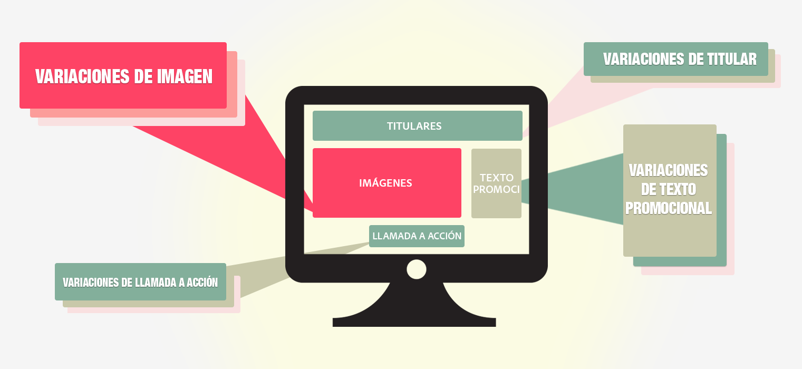

# Información general sobre pruebas multivariable

La [!UICONTROL prueba multivariada] (MVT) en [!DNL Adobe Target] compara combinaciones de ofertas de elementos en una página para determinar qué combinación ofrece el mejor rendimiento para una audiencia específica, además de identificar qué elemento tiene el mayor impacto en el éxito de la actividad.

## Información general de MVT {#section_C73A2D1409EC42C9B0EDD4B976651C5E}

Las pruebas multivariable sirven para descubrir la influencia relativa que cada elemento tiene en la conversión en comparación con otros elementos de la página. También sirven para acotar una combinación de elementos que han demostrado ser eficaces.

Una de las ventajas que ofrece una prueba multivariable con respecto a una prueba A/B es la posibilidad de mostrar qué elementos de la página tienen una mayor influencia en la conversión. Esto también se conoce como el “efecto principal”. Esta información resulta útil, ya que ayuda a determinar, por ejemplo, dónde colocar el contenido que debe captar una mayor atención.

Las pruebas multivariable también ayudan a encontrar efectos compuestos entre dos o más elementos en una página. Por ejemplo, un anuncio concreto podría generar más conversiones si se combinara con un determinado banner o una imagen a pantalla completa (hero). Esto también se conoce como el “efecto interacción”.

[!DNL Target] usa pruebas multivariable factoriales completas para ayudarle a optimizar su contenido. Una prueba multivariable factorial completa prueba todas las combinaciones posibles de contenido con la misma probabilidad. Por ejemplo, si tiene dos elementos de página con tres ofertas cada uno, hay nueve combinaciones posibles (3x3). Cuando hay tres elementos, de los cuales dos contienen tres ofertas posibles y uno tiene dos ofertas, se generan 18 opciones (3x3x2).

En Target, cada combinación es una experiencia. La prueba multivariable compara cada experiencia para que pueda saber qué combinaciones tienen mayor éxito. Al mismo tiempo, se recopilan y analizan datos para comprender en qué medida influyen las ubicaciones y las ofertas en la métrica de éxito.

Debido al número de combinaciones que se puede generar, una prueba multivariable requiere más tiempo y tráfico que una prueba A/B. La página debe recibir tráfico suficiente para generar resultados relevantes estadísticamente para cada experiencia. Para obtener resultados útiles, debe conocer la cantidad de tráfico que recibe su página y probar el número óptimo de combinaciones durante la cantidad adecuada de tiempo, a fin de obtener los resultados deseados. El [estimador de tráfico](/help/c-activities/c-multivariate-testing/t-create-multivariate-test/traffic-estimator.md#task_71AA6922AFD447EA8C5E610A78ABA714) de Target puede ayudarle a diseñar una prueba que funcione con su tráfico. Antes de usar el estimador de tráfico, debe disponer de estadísticas fiables que muestren el número de impresiones y conversiones que normalmente recibe su sitio. Considere los niveles de tráfico por día. Cuantas más experiencias haya en una actividad, la actividad deberá incluir más tráfico o deberá ejecutarse durante más tiempo. Si su tráfico no es muy elevado, deberá probar un pequeño número de combinaciones; de lo contrario, se necesitará demasiado tiempo para que la prueba genere resultados significativos y resulte útil.

## Terminología de MVT {#section_DF475CA7F34B4CFDB7BE7363761D64AE}

Cuando configure una prueba multivariable, le resultará útil conocer alguna terminología básica.

Hay varios términos que se utilizan de manera distinta en el sector. En esta sección explicamos los términos que se utilizan en [!DNL Target].

**Combinación:** las variaciones de contenido que se crean al probar varias opciones de contenido en varias ubicaciones. Por ejemplo, si va a probar tres ubicaciones, cada una de ellas con tres opciones de contenido, entonces hay 27 combinaciones posibles (3x3x3). Un visitante del sitio verá una combinación, también denominada experiencia.

**Contenido:** el texto o la imagen que contiene una variación de prueba dentro de una ubicación. En una prueba multivariable, se compara un número de opciones de contenido dentro de varias ubicaciones. En la metodología de las pruebas MVT, el contenido a menudo se denomina *nivel*.

**Elemento:** elemento DOM que tiene las variaciones de contenido que se van a probar en la prueba MVT. Vea también *Ubicación*.

**Ubicación:** área específica de contenido en una página, a menudo incluida en un solo elemento de DOM. En la metodología de las pruebas MVT, la ubicación a menudo se denomina *factor*. Una prueba multivariable factorial completa compara todas las combinaciones posibles de las ofertas en las ubicaciones.

## Cuándo usar MVT o A/B {#section_3D2B966B6671406C861A1843EA41D28C}

Las pruebas multivariable (MVT) se pueden utilizar junto con las pruebas A/B para optimizar la página. Estos son algunos ejemplos de cuándo puede interesarle usar las dos pruebas:

* Utilice una prueba A/B para optimizar el diseño de la página, seguida de una prueba MVT para determinar cuál es el mejor contenido en cada elemento de la página..

   Una prueba A/B puede proporcionar información importante sobre el diseño, mientras que una prueba MVT es excelente para probar contenido dentro de los elementos del diseño de la página. Si ejecuta una prueba A/B sobre el diseño antes de probar varias opciones de contenido, podrá determinar cuál es el mejor diseño y qué contenido logra un mayor impacto.

* Utilice una prueba MVT para determinar qué elemento es el más importante y, después, realice una prueba A/B que se centre en ese elemento.

   Cuando el número de experiencias diferentes es superior a cinco y abarca dos o más elementos, es aconsejable realizar una prueba MVT antes de ejecutar las pruebas A/B. La prueba multivariable muestra qué áreas de la página tienen más posibilidad de mejorar la conversión. Estos son los elementos en los que debería centrarse un especialista en marketing. Por ejemplo, la prueba MVT podría mostrar que la llamada a la acción es el elemento más importante para lograr sus objetivos. Una vez que haya determinado qué elementos y contenido son los más útiles para ayudarle a lograr sus objetivos, puede ejecutar una prueba A/B para restringir aún más los resultados, como probar dos imágenes específicas entre sí, o comparar las palabras o los colores de una llamada a la acción. Si después de una prueba MVT se realizan una o varias pruebas A/B, puede determinar el mejor contenido posible para los resultados que desea obtener.

## Consideraciones {#section_979FE3F398654C1EA1C86E7DBC9A8DAD}

* Utilice una prueba MVT cuando tenga al menos tres elementos que probar. Si tiene menos, ejecute una serie de  pruebas A/B.
* Seleccione los elementos de página que crea que tendrán un impacto más significativo en los resultados.
* No incluya demasiados elementos o ubicaciones en una prueba. Cuanto mayor sea el número, más tiempo durará la prueba.
* Planifique el diseño de la prueba con antelación. No es aconsejable editar una prueba después de que se ponga en marcha y los datos empiecen a recopilarse y analizarse.
* Es recomendable que los elementos sean independientes entre sí.

   Por ejemplo, no realice una prueba del diseño y del contenido a la vez.

* Planifique más tiempo para el control de calidad debido al aumento del número de experiencias. También puede utilizar pruebas factoriales parciales para reducir la cantidad de tráfico necesario para una prueba multivariable. Para obtener más información, consulte Pruebas factoriales parciales a continuación:

## Pruebas parciales-factoriales

[!DNL Target] ofrece pruebas multivariable totalmente factoriales como opción de actividad integrada. En estadística, Diseño de experimentos ofrece muchos enfoques, o diseños, para determinar qué factores influyen en los resultados. Uno de estos enfoques es el [Método Taguchi](https://en.wikipedia.org/wiki/Taguchi_methods) para pruebas factoriales parciales. Taguchi permite a los expertos en marketing realizar una serie de suposiciones que limitan el número de permutaciones de experiencias que se deben probar, lo que a su vez reduce los requisitos de tráfico para una prueba multivariable. Esta funcionalidad y enfoque de prueba puede aprovecharse en [!DNL Target] con esta [hoja de cálculo sin conexión](/help/assets/MVT-Taguchi-Partial-Factorial-Design-02102017.xlsx).

Si su equipo utiliza otros enfoques de Diseño de experimentos, puede utilizar esta hoja de cálculo como implementación de referencia para diseños de experimentos personalizados.

Al utilizar la hoja de cálculo sin conexión, tenga en cuenta las siguientes sugerencias:

* Escoja los elementos que desea cambiar y el número de versiones de cada elemento (3x2, 4x3, etcétera).
* Sea coherente en la numeración. Por ejemplo, si el botón es el Elemento 1 y las opciones son Azul, Verde y Amarillo, el botón azul es 1-1, el verde es 1-2 y el amarillo es 1-3.
* La hoja de cálculo sin conexión ofrece el número apropiado de experiencias (cuatro para 3x2, nueve para 4x3, etcétera).
* Cree las experiencias en el flujo de trabajo A/B con el [Compositor de experiencias visuales (VEC)](/help/c-experiences/experiences.md). Puede utilizar código personalizado, editar HTML, WYSIWYG o cualquier combinación.
* Una vez terminada la actividad (en función del calculador de tamaño de muestra), ejecute los resultados en la hoja de cálculo para obtener los demás detalles.

Para obtener más consideraciones y prácticas recomendadas, consulte [Prácticas recomendadas de pruebas multivariable](/help/c-activities/c-multivariate-testing/best-practices.md#reference_53635817FFB741EF8C4E56CC70688EDD).

## Vídeos de formación

Los siguientes vídeos contienen más información sobre los conceptos mencionados en este artículo.

### Tipos de actividades (9:03) 

En este vídeo de información general se describen los tipos de actividades disponibles en Target Standard/Premium. Las pruebas multivariable se describen a partir del minuto 4:20.

* Describe los tipos de actividades incluidas en [!DNL Adobe Target]
* Seleccionar el tipo de actividad adecuado para lograr los objetivos
* Describir el flujo de trabajo guiado de tres pasos que sirve para todos los tipos de actividad

>[!VIDEO](https://video.tv.adobe.com/v/17386)

### Creación de pruebas multivariable (9:25) 

En este vídeo se explica qué es una prueba multivariable, cómo planificarla y cómo crearla siguiendo el flujo de trabajo guiado de tres pasos de Target.

* Definir y diseñar una prueba multivariable
* Crear una prueba multivariable

>[!VIDEO](https://video.tv.adobe.com/v/17395)
