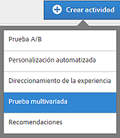

# Crear una prueba multivariable{#create-a-multivariate-test}

El [!UICONTROL Compositor] de experiencias visuales (VEC) facilita [!DNL Target] la creación de la prueba directamente en una página con Target habilitado y la modificación de partes de la página en [!DNL Target].

El editor de &quot;apuntar y hacer clic&quot; de Target permite elegir cualquier ubicación y añadirle varias ofertas.

La prueba [!UICONTROL multivariable] (MVT) toma un informe de página. Es decir, la prueba se ejecuta en una determinada dirección URL, con las experiencias que diseño para esa página.

1. Haga clic en **[!UICONTROL Crear actividad]** &gt; **[!UICONTROL Prueba multivariable]**.

   

1. (Condicional) Si es cliente de Target Premium, [elija un espacio de trabajo](/help/administrating-target/c-user-management/property-channel/property-channel.md).

   >[!NOTE]
   >
   >La opción [!UICONTROL Elegir lugar de trabajo] de la ilustración anterior es una [función de Target Premium](/help/c-intro/intro.md) . Su organización tiene una licencia de Target Standard si no ve esta opción.]

1. [Especifique la URL](../../../c-activities/c-multivariate-testing/t-create-multivariate-test/url.md#concept_C12E4A85FF3B4E518E3110F6CF1AF9C0) de la página que desee probar y haga clic **[!UICONTROL en Siguiente]**.

   >[!NOTE]
   >
   >Utilice una dirección URL completa, incluido el HTTP o HTTPS del principio.

   Si aparece un mensaje pidiendo que habilite el navegador para contenido mixto, siga las instrucciones del mensaje. Después de habilitar el navegador para contenido mixto, vuelva a comenzar por el Paso 1.

   Se abrirá el Compositor de experiencias visuales.

   Para obtener información acerca de la solución de problemas del VEC, en caso de problemas, consulte [Solución de problemas del Compositor de experiencias visuales](/help/c-experiences/c-visual-experience-composer/r-troubleshoot-composer/troubleshoot-composer.md).

1. Escriba un nombre para la actividad.

   

   No se permite usar los caracteres siguientes en el nombre de una actividad:

   | Carácter | Descripción |
   |--- |--- |
   | / | Barra oblicua |
   | ? | Signo de interrogación |
   | # | Signo de número |
   | : | Dos puntos |
   | = | Igual a |
   | + | Más |
   | - | Menos |
   | @ | Arroba |

1. [Cree las ofertas en cada ubicación](../../../c-activities/c-multivariate-testing/t-create-multivariate-test/add-offers.md#concept_DCE6B45C30F7419B8EC17AFDEE8D8AA6).

   

   Puede añadir los siguientes tipos de oferta:

   * HTML
   * Imagen
   * Texto

1. Haga clic **[!UICONTROL en Vista preliminar]** para [obtener una vista previa de las experiencias](/help/c-activities/c-multivariate-testing/t-create-multivariate-test/preview-experiences.md).

   

   Puede ver cada experiencia y excluir aquellas que no quiere incluir en la prueba.

1. [Utilice el estimador de tráfico](../../../c-activities/c-multivariate-testing/t-create-multivariate-test/traffic-estimator.md#task_71AA6922AFD447EA8C5E610A78ABA714) para probar la viabilidad de su plan de prueba.

     

1. Haga clic **en [! UICONTROL Next** to advance to the [!UICONTROL Targeting] page.]

1. Elija la audiencia y el porcentaje de visitantes correspondiente que desea que participen de la actividad.

   

   Por ejemplo, podría limitar las entradas al 50 % de todos los visitantes o al 45 % de la audiencia de California.

   >[!NOTE]
   >
   >Además de seleccionar una audiencia existente, puede combinar varias audiencias para crear audiencias combinadas específicas en lugar de crear una nueva. Para obtener más información, consulte [Combinar varias audiencias](../../../c-target/combining-multiple-audiences.md#concept_A7386F1EA4394BD2AB72399C225981E5).

1. [Revise el resumen de la prueba](../../../c-activities/c-multivariate-testing/t-create-multivariate-test/test-summary.md#reference_971AB225963A4DC18EEB5B0E20F0A4A7), realice cualquier cambio necesario y, después, haga clic en **[!UICONTROL Siguiente]**..

1. [Especifique los objetivos y la configuración](../../../c-activities/c-multivariate-testing/t-create-multivariate-test/goals-and-settings.md#reference_B25389FD6F3A4989801E740364B089CC) para la prueba.

1. Haga clic en **[!UICONTROL Guardar y cerrar]** para crear la actividad.

## Vídeo de formación: Creación de pruebas multivariable (9:25)

En este vídeo explicamos cómo planificar y crear una prueba multivariable siguiendo el flujo de trabajo guiado de tres pasos de Target.

* Definir y diseñar una prueba multivariable
* Crear una prueba multivariable

>[!VIDEO](https://video.tv.adobe.com/v/17395?captions=spa)
