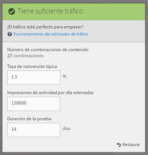
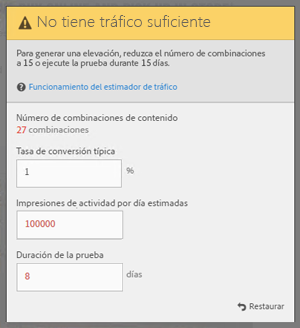

# Crear una prueba multivariable{#create-a-multivariate-test}

El [!UICONTROL Compositor de experiencias visuales] (VEC) en [!DNL Adobe Target] le permite crear su prueba directamente en una página compatible con Target y modificar partes de la página en [!DNL Target], todo ello de una manera sencilla.

El editor [!DNL Target] de apuntar y hacer clic le permite elegir cualquier ubicación y agregar varias ofertas.

La [!UICONTROL prueba multivariada] (MVT) toma un informe centrado en una página. Es decir, la prueba se ejecuta en una determinada dirección URL, con las experiencias que diseño para esa página.

1. Haga clic en **[!UICONTROL Crear actividad]** > **[!UICONTROL Prueba multivariable]**.

   

   >[!NOTE]
   >
   >Los tipos de actividades disponibles dependen de su cuenta de Target. Algunos tipos de actividades podrían no aparecer en su lista. Por ejemplo, [!UICONTROL Automated Personalization] es una funcionalidad de [Target Premium](/help/c-intro/intro.md#premium).
   >
   >Para obtener más información sobre los distintos tipos de actividades disponibles en [!DNL Target] y sus diferencias, consulte [Actividades](/help/c-activities/activities.md#concept_D317A95A1AB54674BA7AB65C7985BA03). Consulte [Tipos de actividades de Target](/help/c-activities/target-activities-guide.md) para ayudarle a decidir qué tipo de actividad encaja con sus necesidades.

1. Seleccione **[!UICONTROL Visual (Predeterminado)]**, si es necesario.

   

   >[!NOTE]
   >
   >Para obtener información acerca de la solución de problemas del VEC, en caso de problemas, consulte [Solución de problemas del Compositor de experiencias visuales](/help/c-experiences/c-visual-experience-composer/r-troubleshoot-composer/troubleshoot-composer.md).
   >
   >La opción [!UICONTROL Elegir lugar de trabajo] de la ilustración anterior es una [función de Target Premium](/help/c-intro/intro.md). Su organización tiene una licencia de Target Standard si no ve esta opción.

1. (Condicional) Si es cliente de Target Premium, [elija un espacio de trabajo](/help/administrating-target/c-user-management/property-channel/property-channel.md).

1. [Especifique la dirección URL](/help/c-activities/c-multivariate-testing/t-create-multivariate-test/url.md#concept_C12E4A85FF3B4E518E3110F6CF1AF9C0) para la página que desea probar y haga clic en **[!UICONTROL Siguiente]**.

   >[!NOTE]
   >
   >Utilice una dirección URL completa, incluido el HTTP o HTTPS del principio.

   Si aparece un mensaje pidiendo que habilite el navegador para contenido mixto, siga las instrucciones del mensaje. Después de habilitar el navegador para contenido mixto, vuelva a comenzar por el Paso 1.

   Se abrirá el Compositor de experiencias visuales.

1. Escriba un nombre para la actividad.

   

   No se permite usar los caracteres siguientes en el nombre de una actividad:

   | Carácter | Descripción |
   |--- |--- |
   | / | Barra oblicua |
   | ? | Signo de interrogación |
   | # | Signo de número |
   | :: | Dos puntos |
   | = | Igual a |
   | + | Más |
   | - | Menos |
   | @ | Arroba |

1. [Cree las ofertas en cada ubicación](/help/c-activities/c-multivariate-testing/t-create-multivariate-test/add-offers.md#concept_DCE6B45C30F7419B8EC17AFDEE8D8AA6).

   

   Puede añadir los siguientes tipos de oferta:

   * HTML
   * Imagen
   * Texto

1. Haga clic en **[!UICONTROL Vista preliminar]** para [obtener una vista previa de las experiencias](/help/c-activities/c-multivariate-testing/t-create-multivariate-test/preview-experiences.md).

   

   Puede ver cada experiencia y excluir aquellas que no quiere incluir en la prueba. Para excluir una o varias experiencias, seleccione las casillas que desee y haga clic en **[!UICONTROL Excluir]**.

   

1. [Utilice el estimador de tráfico](/help/c-activities/c-multivariate-testing/t-create-multivariate-test/traffic-estimator.md#task_71AA6922AFD447EA8C5E610A78ABA714) para probar la viabilidad de su plan de prueba.

   

   La siguiente ilustración indica que la actividad no tiene tráfico suficiente.

   

   La siguiente ilustración indica que la actividad no tiene tráfico suficiente.

   

1. Haga clic en **[!UICONTROL Siguiente]** para avanzar a la página [!UICONTROL Segmentación.]

1. Elija la audiencia y el porcentaje de visitantes correspondiente que desea que participen de la actividad.

   

   Por ejemplo, podría limitar las entradas al 50 % de todos los visitantes o al 45 % de la audiencia de California.

   >[!NOTE]
   >
   >Además de seleccionar una audiencia existente, puede combinar varias audiencias para crear audiencias combinadas específicas en lugar de crear una nueva. Para obtener más información, consulte [Combinar varias audiencias](/help/c-target/combining-multiple-audiences.md#concept_A7386F1EA4394BD2AB72399C225981E5).

1. [Revise el resumen de la prueba](/help/c-activities/c-multivariate-testing/t-create-multivariate-test/test-summary.md#reference_971AB225963A4DC18EEB5B0E20F0A4A7), realice cualquier cambio necesario y, después, haga clic en **[!UICONTROL Siguiente]**.

1. [Especifique los objetivos y la configuración](/help/c-activities/c-multivariate-testing/t-create-multivariate-test/goals-and-settings.md#reference_B25389FD6F3A4989801E740364B089CC) para la prueba.

1. Haga clic en **[!UICONTROL Guardar y cerrar]** para crear la actividad.

## Vídeo de capacitación: Creación de pruebas multivariable (9:25) 

En este vídeo explicamos cómo planificar y crear una prueba multivariable siguiendo el flujo de trabajo guiado de tres pasos de Target.

* Definir y diseñar una prueba multivariable
* Crear una prueba multivariable

>[!VIDEO](https://video.tv.adobe.com/v/17395)
