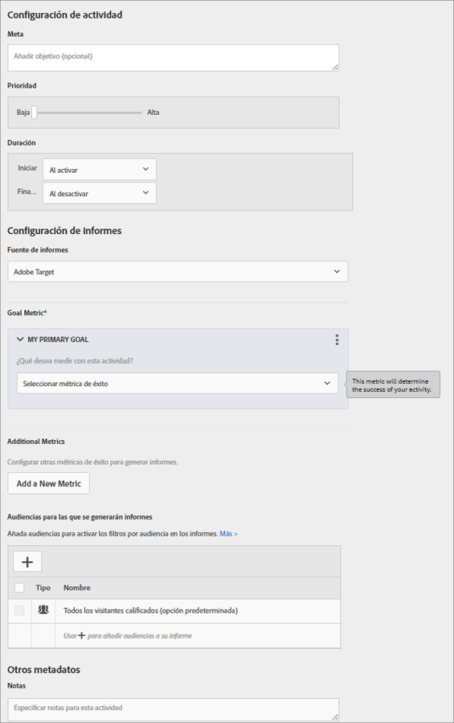

# Configuración y objetivos{#goals-and-settings}

La página Configuración y objetivos es donde se especifica información sobre los objetivos de la prueba.

* Configuración de actividades
* Configuración de informes
* Otros metadatos

La configuración disponible depende de si usa Target o Analytics como fuente de datos.

## Configuración de actividades {#section_DCBDC354261F420EBD4B43EA34947BAC}

Las configuraciones disponibles son las siguientes:

### Objetivo

Escriba un objetivo opcional. El objetivo puede ser cualquier información que le ayude a usted y a su equipo a identificar la campaña.

### Prioridad

La interfaz de usuario y las opciones de Prioridad varían en función de la configuración. Puede usar la configuración heredada de bajo, medio o alto, o habilitar prioridades específicas de 0 a 999.

La prioridad se utiliza si se asignan varias actividades a la misma ubicación con la misma audiencia. Si se asignan dos o más actividades a una ubicación, se mostrará la actividad con la prioridad más alta.

If this option is not enabled in S[!UICONTROL Administration] > [!UICONTROL Reporting] (the default), specify a priority: Low, Medium, or High.

To enable fine-grained priorities, click [!UICONTROL Administration] > [!UICONTROL Reporting], then toggle the Enable Fine-Grained Priorities option to the &quot;On&quot; position.

Si esta opción está habilitada, indique un valor entre 0 y 999:

* 0 = Bajo
* 999 = Alto

En las actividades creadas en versiones anteriores de Target Standard/Premium, el nivel bajo de prioridad se convierte en 0; el medio, en 5; y el alto, en 10. Si lo necesita, puede ajustar estos valores.

>[!NOTE]
>
>Para deshabilitar esta opción después de usar las prioridades específicas, hay que volver a establecer todas las prioridades en 0, 5 y 10.

### Duración

La actividad se puede iniciar cuando se aprueba, o bien se puede establecer una fecha y hora específicas. Igualmente, la actividad puede finalizar cuando está desactivada o se puede establecer una fecha y hora. El selector de hora usa un reloj de 24 horas, donde 00:00 equivale a medianoche. La zona horaria se establece según la zona horaria configurada en el navegador. Para usar una zona horaria distinta, configure el navegador para otra zona horaria y reinícielo.

## Configuración de informes.  {#section_13119392051044FBA6387D9B3B1C43CF}

Las configuraciones disponibles son las siguientes:

### Solución de creación de informes

Especifique si los datos se recopilan desde Adobe Target o Adobe Analytics. Consulte [Adobe Analytics como fuente de informes para Target](/help/c-integrating-target-with-mac/a4t/a4t.md) para conocer las diferencias entre las distintas soluciones de creación de informes y las ventajas que ofrece cada una.

Si selecciona Analytics como fuente de informes para Target, debe seleccionar también un grupo de informes de Analytics en el que recibir los datos de la actividad en Target. Para ello, elija primero una de las empresas de Analytics a la que esté asociada su cuenta y, a continuación, seleccione el grupo de informes adecuado para la actividad. Solo se podrán seleccionar los grupos de informes que estén aprovisionados para conectarse a Adobe Target. Si no ve los grupos de informes previstos, cierre la sesión y vuelva a iniciarla en Adobe Experience Cloud para probar de nuevo. Si aún no aparece el grupo de informes en la lista, póngase en contacto con el Servicio de atención al cliente.

Analytics for Target requiere un servidor de seguimiento para registrar los resultados correctamente. En el campo Servidor de seguimiento, aparecerá un servidor de seguimiento predeterminado. Si usa más de un servidor de seguimiento, debe asegurarse de incluir el servidor correcto en este campo. Consulte [Usar un servidor de seguimiento de Analytics](/help/c-integrating-target-with-mac/a4t/analytics-tracking-server.md#task_72077BA7E93C4A65A715A18F32228823) para obtener más información.

Si especifica una solución de creación de informes en la configuración de la cuenta, se utilizará la solución especificada y este ajuste no será visible.

>[!NOTE]
>
>La fuente de informes no se puede cambiar una vez publicada la actividad. Esto permite mantener la coherencia en los informes.

### Objetivo

Seleccione la acción realizada por un visitante para conseguir el objetivo. Por ejemplo, elija una métrica de Conversión y defina los parámetros que determinan cuándo se logra el éxito.

>[!NOTE]
>
>Si se elige Analytics como solución de creación de informes, la única métrica de objetivo disponible es Conversión. Las métricas de Analytics no se pueden seleccionar como un objetivo.

Cuando selecciona la métrica de éxito, se muestra un selector. Utilice el selector para elegir los datos específicos de la métrica de éxito.

Si está habilitado, el valor estimado del campo Conversión (no disponible para la métrica Puntuación de página) proporciona un valor para el objetivo, pero no para el resto de métricas. Este valor permite a Target calcular un alza estimada de ingresos. Este campo es opcional; sin embargo, los ingresos en aumento de las métricas sin ingresos no se pueden calcular sin él. Para todas las métricas de ingresos (Ingresos por visitante, Valor de pedido promedio, Ventas totales y Pedidos), el cálculo usa Ingresos por visitante. El tipo de datos es moneda.

Después de alcanzar el objetivo de la actividad, un visitante continúa viendo el contenido de esta, a menos que cumpla los requisitos de una actividad de prioridad más alta. Si alcanza el objetivo nuevamente, se cuenta como otra conversión. Observe que es diferente al comportamiento predeterminado en Target Classic, que cuenta los visitantes como nuevos si ven la prueba otra vez.

### Métricas adicionales

Cree métricas de éxito adicionales.

Este ajuste no está disponible si la solución de creación de informes es Analytics. En este caso, se aplican las métricas definidas para el grupo de informes de Analytics.

Audiencias para los informes

### De manera predeterminada, en los informes se muestran resultados de todos los visitantes cualificados. Puede agregar audiencias de informes para mostrar únicamente información sobre audiencias específicas.

## Configuración avanzada {#section_E2FE441AFB324E498793ABB025ED9974}

La Configuración avanzada está disponible para métricas de objetivo de Prueba multivariable.

>[!NOTE]
>
>Si usa Adobe Analytics como fuente de informes, el servidor de Analytics administra la configuración. La opción de configuración avanzada no estará disponible.

### ¿Qué métrica de éxito debe alcanzarse antes de incrementar esta métrica?

Use esta opción para contar solamente que alguien alcanza la métrica de éxito si alcanzó previamente una métrica de éxito diferente. Por ejemplo, una conversión de prueba podría ser válida únicamente si el visitante hace clic en la oferta, o alcanza una página concreta antes de la conversión.

Dispone de dependencia respecto a varias métricas y tiene la posibilidad de elegir si una métrica debe alcanzarse o no para que su contador aumente.

Debe definir ambas (o varias) métricas de éxito antes de poder hacer una dependiente de la otra.

La opción Añadir dependencia permite que la métrica de éxito aumente si se alcanza otra métrica de éxito (o todo lo contrario, si no se alcanza).

Para agregar una dependencia:

1. Después de agregar métricas adicionales, haga clic en **[!UICONTROL Configuración avanzada]**.
2. Haga clic en la opción Añadir dependencia:

   

3. Arrastre y suelte las métricas deseadas del panel izquierdo al panel derecho y, a continuación, haga clic en **[!UICONTROL Alcanzado]** para alternar el valor entre Alcanzado y No alcanzado.

   

Puede editar o eliminar dependencias después de añadirlas.

### ¿Qué ocurrirá después de que un usuario encuentre esta métrica de objetivo?

Existen tres opciones para lo que ocurre después de que un visitante alcance la métrica de objetivo:

* Seleccione Aumentar recuento y mantener el usuario en la actividad para especificar cómo se aumenta el recuento.
* Seleccione Aumentar recuento, liberar usuario y permitir la reentrada para especificar la experiencia que el usuario ve si vuelve a entrar a la actividad.
* Seleccione Aumentar recuento, liberar usuario y bloquear su reentrada para especificar qué ve el usuario en lugar del contenido de la actividad.

Para obtener más información sobre la configuración avanzada, consulte [Métricas de éxito](/help/c-activities/r-success-metrics/success-metrics.md#reference_D011575C85DA48E989A244593D9B9924).

## Otros metadatos {#section_2E8917BEFB954480A4206B9E9E917F80}

La configuración disponible es la siguiente:

### Notas

Escriba la información sobre la actividad que sea útil tener disponible para el equipo. El panel Notas se puede redimensionar.

## Vídeos de formación

Los siguientes vídeos contienen más información sobre los conceptos mencionados en este artículo.

### Distintivo de 

Este vídeo incluye información sobre la configuración de las actividades.

* Establecer un objetivo para la actividad
* Fijar el nivel de prioridad de las actividades
* Programar las horas de inicio y fin de las actividades
* Añadir audiencias para los informes a fin de crear filtros de informes
* Escribir notas en las actividades

>[!VIDEO](https://video.tv.adobe.com/v/17381)

### Creación de una insignia de 

En este vídeo se explica cómo crear una prueba multivariable siguiendo el flujo de trabajo guiado de tres pasos de Target. Los objetivos y la configuración se describen a partir del minuto 7:00.

* Definir y diseñar una prueba multivariable
* Crear una prueba multivariable

>[!VIDEO](https://video.tv.adobe.com/v/17395)