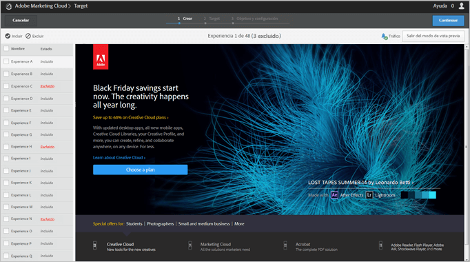

# Previsualizar experiencias para una prueba multivariable{#preview-experiences-for-a-multivariate-test}

Dado que una [!UICONTROL prueba multivariada] en [!DNL Adobe Target] compara varias experiencias en una página, resulta útil realizar una previsualización de la página con cada experiencia.

1. En el Compositor de experiencias visuales (VEC), haga clic en **[!UICONTROL Previsualización]**.

   Se muestra una lista de todas las experiencias.

   

1. Haga clic en una experiencia de la lista para verla.

1. Para excluir una o varias experiencias de la prueba multivariada, seleccione las experiencias que desee y haga clic en **[!UICONTROL Excluir]**.

   

   Puede excluir una experiencia que muestre variaciones que entran en conflicto o una experiencia que no esté equilibrada desde el punto de vista estético.

   >[!NOTE]
   >
   >Ahora, al crear pruebas multivariable, puede excluir más del 10 % de las experiencias de la prueba siempre y cuando tenga en cuenta la advertencia de utilizar la creación de informes sin conexión para el análisis.

   De manera predeterminada, todas las experiencias se incluyen en la prueba multivariable. Para incluir una experiencia que se había excluido, seleccione la experiencia excluida y haga clic en **[!UICONTROL Incluir]**.

Haga clic en **[!UICONTROL Salir del modo de vista previa]** para volver al Compositor de experiencias y realizar cambios, o haga clic en **[!UICONTROL Continuar]** para ir al resumen de la prueba.

