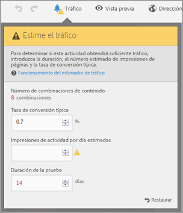
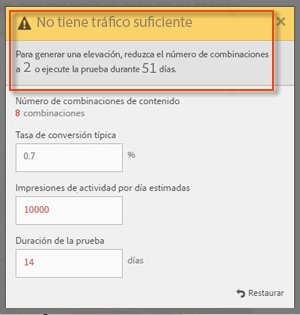
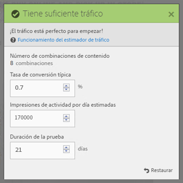

# Calcular el tráfico necesario para una prueba de éxito{#estimate-the-traffic-required-for-a-successful-test}

Dado que una prueba multivariable compara varias experiencias, es importante conocer cuánto tráfico se requiere para proporcionar resultados significativos. El estimador de tráfico usa datos estadísticos sobre su página y el número de experiencias que se están probando para calcular la cantidad de tráfico y la duración de la prueba necesarios para que la prueba se realice con éxito.

El estimador de tráfico predice qué tamaño de muestra se necesita para garantizar lo siguiente:

* Confianza del 95 %

   Esto significa que las probabilidades de indicar un falso positivo si no hay un alza real son del 5 % (100 % de nivel de confianza)
* Potencia estadística del 80 %

   Esto significa que la prueba tiene un 80 % de probabilidad de detectar un alza verdadera de un 25 % o más.
* Alza mínima fiable detectable del 25 %

   Target calcula la cantidad de tráfico necesario para tener un 80 % de probabilidades de detectar un alza verdadera del 25 % o más.

La prueba utiliza la corrección de Bonferroni para corregir varias comparaciones. Se sabe que este método es conservador, así que para equilibrarlo se aplica un alza mínima fiable detectable que es relativamente grande.

El estimador de tráfico también proporciona información que le permite conocer si tiene tráfico suficiente para que tenga éxito la prueba que ha diseñado.

1. **[!UICONTROL En el Compositor de experiencias, haga clic en el icono Tráfico]**.

   Se abre el estimador de tráfico. Para ocultar el calculador de Tráfico, vuelva a hacer clic en el icono **[!UICONTROL Tráfico]**.

   

1. Indique la tasa de conversión típica, la estimación de visitantes al día y la duración de la prueba.

   * [!UICONTROL Número de combinaciones de contenido]: se calcula automáticamente según el número de experiencias que se crean como parte de la actividad después de cualquier exclusión.
   * [!UICONTROL Tasa de conversión típica]: la tasa de conversión se expresa como porcentaje según los datos o las estimaciones anteriores procedentes del sistema de Analytics
   * [!UICONTROL Visitantes estimados por día]: es el número de visitantes que tienen probabilidades de ver esta página según los criterios de segmentación. Esta cifra puede estar basada en los datos de Analytics.
   * [!UICONTROL Duración de la prueba]: número de días durante los cuales quiere ejecutar la actividad.

   El estimador de tráfico utiliza estas estadísticas para determinar qué ajustes se necesitan para ejecutar una prueba con éxito.

   Cerca de la parte superior del estimador de tráfico, se calculan los valores que ha indicado y se muestran los resultados.

   

   Al cambiar estos números, también cambian las estimaciones. Por ejemplo, si va a probar un gran número de experiencias y la tasa de conversión y las impresiones son demasiado bajas, el estimador de tráfico muestra el tiempo que deberá ejecutarse la prueba para que tenga éxito. O, si el tráfico es escaso, es posible que el estimador de tráfico sugiera un menor número de experiencias para poder ejecutar la prueba durante el número de días que desee.

   Si no tiene tráfico suficiente, puede hacer una de estas acciones, o las dos:

   * Reduzca el número de combinaciones de las ofertas y el número de ubicaciones.
   * Aumentar la duración de la prueba.

   Ajuste las cifras hasta que el estimador de tráfico le indique que tiene tráfico suficiente y, después, diseñe la prueba según corresponda.

   

