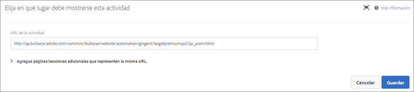

# URL de actividad{#activity-url}

La dirección URL de actividad determina la página que se usa en la prueba y que se abre cuando se diseña la prueba.

Cuando se le pida durante la creación de la actividad, indique la dirección URL de la actividad. Escriba la URL completa (incluido `https://`) y haga clic en **[!UICONTROL Crear actividad]**.

>[!NOTE]
>
>[!DNL Target] no diferencia entre los protocolos URL ( [!DNL https] y [!DNL http]). Esto quiere decir que tanto [!DNL `https://www.adobe.com`] como [!DNL `http://www.adobe.com`] coinciden.

De manera predeterminada, el Compositor de experiencias visuales abre la página que se ha especificado en sus Preferencias de cuenta. Puede especificar una página diferente durante la creación de la actividad.

Para mostrar una página diferente después de que se abra el Compositor de experiencias visuales, haga clic en **[!UICONTROL Configurar]**, seleccione **[!UICONTROL URL]** y luego introduzca la URL en el cuadro URL de la actividad.

Haga clic en **[!UICONTROL Agregar regla de plantilla]para agregar más páginas o secciones a la actividad.**

Las reglas adicionales pueden basarse en cualquiera de los siguientes aspectos:

* Dirección URL
* Dominio
* Ruta
* Fragmento hash (#)
* Consulta
* Parámetro de mbox

Se pueden unir reglas adicionales a la dirección URL de la actividad con Y u O. Todas las reglas que agregue se evalúan entre sí con Y.

Haga clic en **[!UICONTROL Guardar]cuando haya finalizado.**

>[!NOTE]
>
>Si escribe una dirección URL de un sitio que no incluye el código de JavaScript de Target Standard, no podrá seleccionar elementos de página.

De manera predeterminada, el [!UICONTROL compositor de experiencias visuales] no permite realizar cambios en elementos que contengan JavaScript, como banners giratorios. Puede desactivar **[!UICONTROL Representar con JavaScript]** si quiere modificar estos elementos con el [!UICONTROL compositor de experiencias visuales].

>[!NOTE]
>
>Si cambia la dirección URL después de realizar cambios en una página para una o más experiencias, la experiencia se restablecerá con la nueva página y se perderán los cambios que haya realizado.

