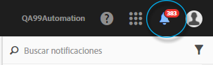
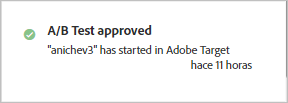
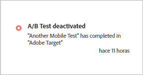
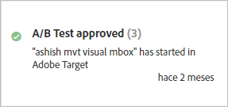
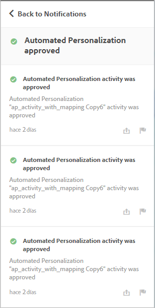

# Notificaciones de actividades{#activity-notifications}

Target puede intercambiar notificaciones con otras soluciones de Adobe Experience Cloud mediante Adobe Pulse. Target envía dos tipos de notificaciones para todos los tipos de actividades: cuando se activa y se desactiva una actividad.

Las notificaciones de [!DNL Target] se pueden ver en todas las soluciones los usuarios que tengan un [!DNL Experience Cloud] contexto de producto de [!DNL Target Standard/Premium].

For information about setting up Notifications, see [Enable notifications](https://docs.adobe.com/content/help/en/core-services/interface/manage-users-and-products/getting-started-experience-cloud.html#concept_0105453AD71847B8BFCAF4A40915F157) in the [!DNL Adobe Experience Cloud] documentation.

Obtenga acceso a las Notificaciones desde cualquier lugar en [!DNL Target], excepto desde dentro del flujo de trabajo de creación de actividades. Haga clic en el icono de la campana que hay en el encabezado de la página para mostrar u ocultar el widget de notificaciones.

[!DNL Target] envía dos tipos de notificaciones para todos los tipos de actividad:

* Cuando una actividad se activa y comienza la entrega de oferta:

   Por ejemplo:

   

* Cuando una actividad se desactiva y termina la entrega de oferta:

   Por ejemplo:

   

También aparecen notificaciones de este tipo cuando una actividad programada llega a su fecha de inicio y cuando termina, al acercarse la fecha de fin.

Todas las notificaciones de [!DNL Target] muestran el nombre de la actividad que se aprobó o desactivó, e incluyen las palabras “Adobe Target” para facilitar la identificación.

Si una sola actividad envía varias notificaciones del mismo tipo, se combinan en una sola tarjeta que indica el número de notificaciones. Por ejemplo:

Haga clic en la tarjeta de notificación para ver los detalles de cada notificación.

Por ejemplo, si hace clic en la tarjeta que aparece más arriba, se muestran las tres notificaciones:

## Limitaciones {#section_B466EB20B2554CE7B1915374B39F4322}

* Las notificaciones no indican quién aprobó, desactivó o importó la actividad.
* Las notificaciones de MVT aparecen como “Prueba A/B” porque se sincronizan como campañas A/B en [!DNL Target Classic].

