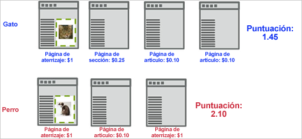
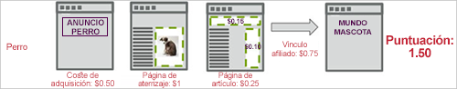

# Puntuación de captación{#capture-score}

The Capture Score engagement metric calculates an aggregated score based on the value assigned to pages visited on the site, from the point the visitor first sees the campaign&#39;s first display [!DNL Target] request.

En el siguiente ejemplo se muestra cómo se calcula la participación de puntuación en una campaña que prueba dos experiencias: una con la imagen de un gato y otra con la imagen de un perro.

En este ejemplo, el visitante experimenta en primer lugar la experiencia del gato. Assume that a global [!DNL Target] request passes in a page score based on the value of the page. If the marketer has captured page count engagement on a success metric associated with `**any Target request**`, the visit score accumulates for any request seen after the display request around the cat image.

La primera página añade 1 a la puntuación, la segunda página 0,25, la tercera 0,10 y la cuarta 0,10 para un total de 1,45. Esto puede interpretarse como puntos o moneda. En una visita independiente, un visitante experimenta la experiencia Dog (Perro) y, aunque el visitante ve menos páginas, la puntuación es 2,10, mayor que la de la otra visita; esto se debe a que el visitante ha visualizado páginas con más valor.

Puede tener en cuenta los costos de adquisición de la cuenta y los ingresos de vínculos afiliados pasando AdBoxes y redirectores, tal como se muestra en el flujo de páginas siguiente. Notice that, in this example, both [!DNL Target] requests on the article page pass a score, possibly representing a known CPM.

**Asignación de una puntuación de página**

Puede asignar un valor a cualquier página de su sitio en función de la importancia que dicha página tenga para usted. Por ejemplo, un sitio de cocina puede vender anuncios por más dinero en la característica de artículos de características que en la sección de experiencia. Debido a ello, los artículos de características son más valiosos que la sección de experiencia. La puntuación de página permite desarrollar un “value” (valor) global de una visita, por lo que la persona que lee más artículos de características obtiene más puntos que alguien que solo navega a través de las experiencias.

Existen dos métodos para asignar una puntuación a una página:

* En la [!DNL Target] solicitud, cree un parámetro denominado `mboxPageValue`.

   Ejemplo: `('global_mbox', 'mboxPageValue=10');`

   The specified value is added to the score every time the page with that [!DNL Target] request is viewed. Si varias solicitudes de la página incluyen valores de puntuación, la puntuación de la página es el total de todos los valores de solicitud. `mboxPageValue` es un parámetro reservado que se utiliza para pasar valores en una solicitud de Destinatario para capturar una puntuación de participación. Se pueden pasar valores positivos y negativos. La suma se calcula al final de la visita de cada visitante para obtener la puntuación total de la visita.

* Transmita el parámetro `?mboxPageValue=n` en la dirección URL de la página.

   Ejemplo: `https://www.mydomain.com?mboxPageValue=5`

   Using this method, the specified value is added to the score for each [!DNL Target] request on the page. For example, if you pass the parameter `?mboxPageValue=10`and there are three [!DNL Target] requests on the page, the score for the page is 30.

>[!NOTE]
>
>Las solicitudes de destinatario ubicadas por encima de la primera solicitud de visualización [!DNL Target] de la actividad no se incluirán en la puntuación.

Best practice is to assign values in the [!DNL Target] request. Esto le permite precisar los valores que mide en función del contenido de cada solicitud.

>[!NOTE]
>
>Para facilitar el mantenimiento puede configurar cada asignación de valor de puntuación de página del sitio en el archivo [!DNL at.js] o [!DNL mbox.js] con alguna lógica JavaScript condicional. De este modo se elimina la necesidad de añadir más código a las páginas. Póngase en contacto con su consultor de cuentas para solicitar asistencia.

Puede combinar ambos métodos, pero esto dará como resultado una puntuación mayor de la esperada. For example, if you assign a value of 10 to each of three [!DNL Target] requests and no score to a fourth request, then pass the URL parameter `?mboxPageValue=5`, your page score will be 50, 30 for the three requests with assigned values, and then 5 for each of the four requests on the page.

El contador inicio con la primera solicitud de visualización, no con la solicitud de entrada. Por ejemplo, si introduce la actividad en la página principal que no tiene una solicitud de visualización y, a continuación, vincula a la página de catálogo que contiene una solicitud de visualización, el contador comenzará cuando se desplace a la página de catálogo.

También puede pasar valores negativos en determinadas páginas que le cuesten dinero o que no sean adecuadas para que las vea un visitante. Los valores negativos también afectan a la puntuación global. Esta técnica se puede usar en una página a la que los visitantes accedan desde un anuncio, para que pueda conocer cuánto era el CPC. O bien, por ejemplo, los puede usar para una página de asistencia o de contacto, donde sabe que los visitantes pueden llamar o solicitar asistencia desde esta página.
