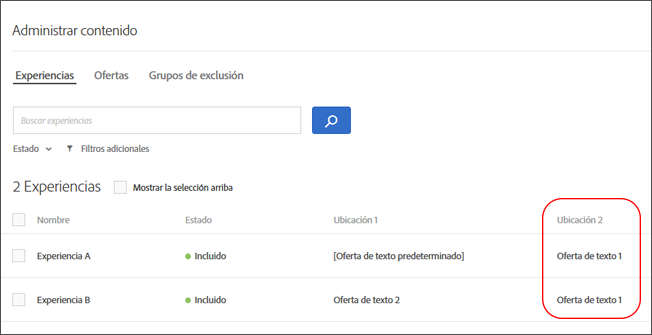
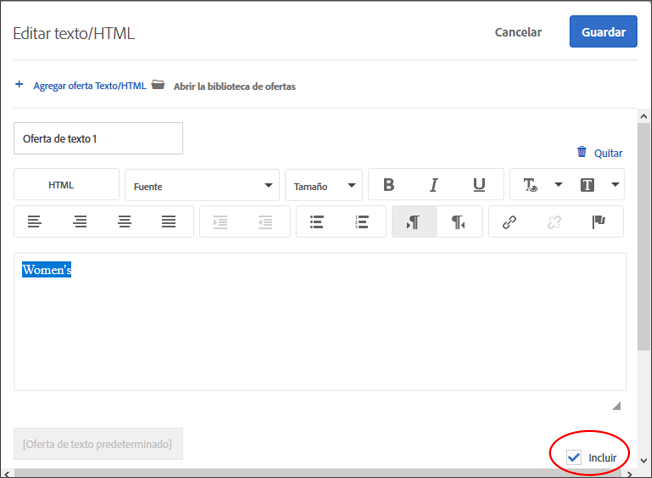
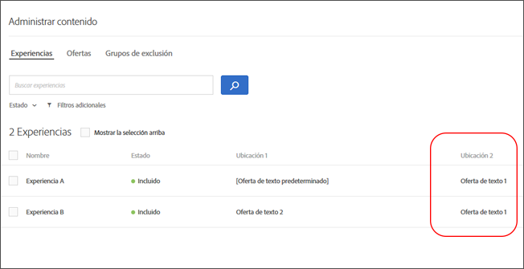

#  Administrar exclusiones

Administre exclusiones creando grupos de exclusión, excluyendo ofertas duplicadas, experiencias específicas y contenido predeterminado en actividades [!UICONTROL Automated Personalization] (AP) en actividades [!DNL Adobe Target] [!UICONTROL Automated Personalization] (AP).

## Creación de grupos de exclusión {#task_AAAA6C7239A84F7696C8492F04B575A2}

Cree grupos de exclusión en actividades de personalización automatizada (AP) para asegurar que las experiencias con las ofertas designadas se excluyan automáticamente.

Los grupos de exclusión son un modo excelente de asegurar que no se presenten ofertas incompatibles en la misma experiencia en distintas ubicaciones. Por ejemplo, suponga que tiene dos ofertas: una es de un 20 % de descuento en todos los artículos, y otra de un 15 %. Nunca querría que estas dos ofertas se presentaran a los visitantes en la misma experiencia. Si añade ambas ofertas a un grupo de exclusión, se asegura de que eso nunca suceda.

También puede limitar qué audiencias pueden ver ofertas específicas en actividades AP. Para obtener más información, consulte [ofertas de Automated Personalization de Target](/help/c-activities/t-automated-personalization/ap-target-offers.md).

**Para crear un grupo de exclusión:**

1. Mientras [crea o edita una actividad AP](/help/c-activities/t-automated-personalization/create-ap-activity.md), haga clic en **[!UICONTROL Administrar contenido]** en la barra de encabezado.

   

1. En el cuadro de diálogo [!UICONTROL Administrar contenido], haga clic en **[!UICONTROL Grupos de exclusión]**.

   

   Si había creado grupos de exclusión previamente, estos se muestran en la lista. Si todavía no ha creado ningún grupo de exclusión, se le indicará que lo haga.

1. Haga clic en **[!UICONTROL Crear grupo de exclusión]**.

   

1. (Obligatorio) Especifique un nombre descriptivo para el grupo de exclusión.

   Un nombre descriptivo le ayuda a usted y a los demás a localizar rápidamente un grupo y comprender su propósito.

1. Localice y seleccione las ofertas que desee agregar al grupo de exclusión.

   Puede seleccionar varias ofertas desde la misma ubicación de un grupo de exclusión.

1. Haga clic en **[!UICONTROL Guardar]**.

Las ofertas en el grupo de exclusión se excluirán automáticamente en adelante de las mismas experiencias.

## Excluir ofertas duplicadas {#concept_4EF78013F80E48EFA024AE0274C9F037}

Impida que las ofertas de la biblioteca de ofertas se dupliquen cuando se utilicen en distintas ubicaciones en las actividades de [!UICONTROL Personalización automatizada].

Por ejemplo, puede tener una actividad con seis ubicaciones en una página con 12 ofertas. Una misma oferta podría colocarse en una o varias de las ubicaciones de la actividad. Esta función evita que las ofertas duplicadas se muestren al mismo tiempo en diferentes ubicaciones dentro de la misma actividad.

Haga clic en **[!UICONTROL Configurar]** > **[!UICONTROL Ofertas duplicadas]** y luego haga clic en **[!UICONTROL Permitir duplicados]** o **[!UICONTROL No permitir duplicados]**.

## Excluir experiencias específicas {#task_C17D36EF58AF4908B17A3D84CA6DE85A}

Excluya experiencias específicas si desea excluir ciertas combinaciones de ofertas de su actividad de Personalización automatizada.

Puede haber ciertas combinaciones que no funcionen bien juntas, o puede estar limitando el número de experiencias probadas para disminuir los requisitos de tráfico para su actividad.

1. Mientras [crea o edita una actividad AP](/help/c-activities/t-automated-personalization/create-ap-activity.md), haga clic en **Administrar contenido** en la barra de encabezado.

   

   La lista de [!UICONTROL Experiencias] muestra cada experiencia generada a partir de las permutaciones de todas las opciones de contenido y ubicación.

1. Excluir experiencias como quiera.

   Puede excluir experiencias específicas pasando el puntero sobre la experiencia deseada y luego haciendo clic en el icono de exclusión.

   

   O puede excluir/incluir experiencias por lotes seleccionando la casilla de las experiencias relevantes y luego haciendo clic en el botón **[!UICONTROL Excluir]** en la esquina superior derecha del cuadro de diálogo. El botón [!UICONTROL Excluir] aparece cuando se verifican una o más experiencias.

   

   Puede filtrar esta vista de lista para ver solo actividades excluidas o incluidas haciendo clic en la lista desplegable [!UICONTROL Estado].

   Ahora, las experiencias se excluirán de la actividad y su [!UICONTROL Estado] se mostrará como [!UICONTROL Excluido].

   

## Excluir contenido predeterminado {#task_DCB4528989DF4C05A3A4729E5891D18F}

En algunos casos, es posible que no desee incluir su contenido predeterminado como parte de su actividad de Personalización automatizada. La forma de acceder a esta configuración es diferente a crear grupos de exclusión. Puede utilizar este método para tener una sola oferta (diferente de su contenido predeterminado) en una ubicación como parte de su actividad de AP.

Excluir el contenido predeterminado es una excelente manera de cambiar la apariencia del resto de la página para adaptarla a las ofertas que está probando con su actividad de AP. Por ejemplo, suponga que desea hacer coincidir la paleta de colores de las ofertas que está probando, puede cambiar el color de fondo de su página y excluir el color de fondo predeterminado.

**Para excluir el contenido predeterminado usando Visual Experience Composer (VEC):**

1. Mientras [crea o edita una actividad AP](/help/c-activities/t-automated-personalization/create-ap-activity.md), seleccione el contenido que desea reemplazar y haga clic para acceder a **[!UICONTROL Cambiar texto/HTML]**, **[!UICONTROL Cambiar imagen]** o **[!UICONTROL Cambiar color de fondo]**.
1. En el cuadro de diálogo, cree su nuevo contenido y desmarque **Incluir** a la derecha del contenido predeterminado (o desmarque la Imagen/Vídeo predeterminado en la pantalla Seleccionar contenido).

   Dependiendo del tipo de contenido/oferta, la casilla [!UICONTROL Incluir] está en un lugar ligeramente diferente.

   Para el contenido del texto/HTML:

   

   Para el contenido de imagen/vídeo:

   

   Para el color de fondo:

   

1. Haga clic en **[!UICONTROL Guardar]**.

   Puede ver las experiencias creadas a partir de las ofertas que especificó en [!UICONTROL Administrar contenido]. Notará que no se crean experiencias en [!UICONTROL Administrar contenido] con la oferta predeterminada que excluyó.

   

**Para excluir el contenido predeterminado utilizando el Compositor basado en la experiencia del formulario:**

1. Al crear o editar una actividad de AP, haga clic en **[!UICONTROL Cambiar texto/HTML]** o **[!UICONTROL Cambiar oferta de imagen]** en el **[!UICONTROL Contenido]**.
1. En el cuadro de diálogo, cree su nuevo contenido y desmarque **[!UICONTROL Incluir]** a la derecha del contenido predeterminado (o desmarque la Imagen/Vídeo predeterminado en la pantalla Seleccionar contenido).

   Dependiendo del tipo de contenido/oferta, la casilla Incluir estará en un lugar ligeramente diferente.

   Para el contenido del texto/HTML:

   

   Para el contenido de imagen/vídeo:

   

1. Haga clic en **[!UICONTROL Guardar]**.

   Puede ver las experiencias creadas a partir de las ofertas que especificó en [!UICONTROL Administrar contenido]. Notará que no se crean experiencias en [!UICONTROL Administrar contenido] con la oferta predeterminada que excluyó.

   
