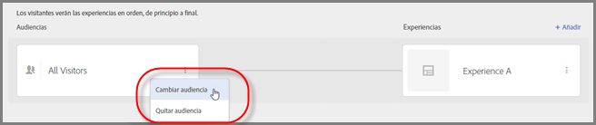
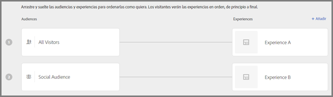
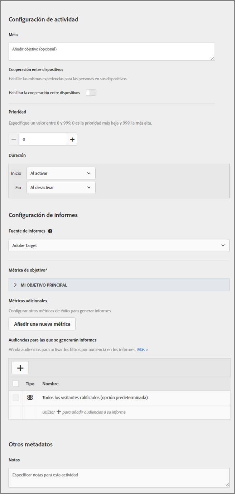

# Crear una actividad de segmentación de experiencias{#create-an-experience-targeting-activity}

Use el Compositor de experiencias visuales para crear una actividad de segmentación de experiencias en una página con Target habilitado y para modificar partes de la página en Target.

1. En la lista [!UICONTROL Actividades], haga clic en **[!UICONTROL Crear actividad]** &gt; **[!UICONTROL Segmentación de experiencias]**.

   

   >[!NOTE]
   >
   >Los tipos de actividades disponibles dependen de su cuenta de Target. Algunos tipos de actividades podrían no aparecer en su lista.

   Para obtener más información sobre los tipos de actividades, consulte   [Actividades](../../../c-activities/activities.md#concept_D317A95A1AB54674BA7AB65C7985BA03).
1. Introduzca la [dirección URL de la actividad](../../../c-activities/t-experience-target/t-xt-create/xt-activity-url.md#concept_D28549AAA0A14E3BB5F05F32BE8ABC90)y haga clic en **[!UICONTROL Siguiente]**.

   

   Si la cuenta se configura con una dirección URL predeterminada, esa dirección URL aparece de manera predeterminada. Puede cambiar la dirección URL predeterminada con otra dirección.

   Para obtener información acerca de la solución de problemas del VEC, en caso de problemas, consulte [Solución de problemas del Compositor de experiencias visuales](../../../c-experiences/c-visual-experience-composer/r-troubleshoot-composer/troubleshoot-composer.md#reference_77743144F10143A3A89D56E116D296E4).

   Si prefiere usar el Compositor de experiencias basadas en formularios, seleccione esa opción. Consulte [Compositor de experiencias basadas en formularios](https://marketing.adobe.com/resources/help/en_US/target/target/t_form_experience_composer.html).

   Se abre el Compositor de experiencias visuales con la página especificada en la dirección URL.
1. Escriba un nombre para la actividad en el espacio proporcionado.

   

   No se permite usar los caracteres siguientes en el nombre de una actividad:

   | Carácter | Descripción |
   |--- |--- |
   | `/` | Barra oblicua |
   | `?` | Signo de interrogación |
   | `#` | Signo de número  |
   | `:` | Dos puntos |
   | `=` | Igual a |
   | `+` | Más |
   | `-` | Menos |
   | `@` | Arroba |

1. [Cree experiencias nuevas](../../../c-activities/t-experience-target/t-xt-create/xt-add-experience.md#task_454646F2895242D3B92DC395A0CE1A00) cambiando los elementos de la página.

   El Compositor de experiencias (consulte [Experiencias](../../../c-experiences/experiences.md#concept_1D011219034B492BB03C08B3BB80E3F0)) abre la página que se especifica en Preferencias de cuenta. Para mostrar una página distinta, haga clic en el icono del globo, escriba la dirección URL en el cuadro de selección de dirección URL del Compositor de experiencias y haga clic en **[!UICONTROL Continuar]**. Si escribe una dirección URL de un sitio que no incluye el código de JavaScript de Target Standard, no podrá seleccionar elementos de página.

   De manera predeterminada, el compositor de experiencias visuales no permite realizar cambios en elementos que contengan JavaScript, como banners giratorios. Puede deshabilitar JavaScript si quiere poder modificar estos elementos con el Compositor de experiencias visuales.

   >[!NOTE]
   >
   >Si cambia la dirección URL después de realizar cambios en una página para una o más experiencias, la experiencia se restablecerá con la nueva página y se perderán los cambios que haya realizado.

   Al desplazar el cursor sobre los elementos de la página, estos se resaltarán. Los elementos resaltados se pueden modificar con el Compositor de experiencias.

   Si creó un mbox en la página mediante Target Classic (antes denominado Test&amp;Target), ese mbox aparece como un elemento que muestra el nombre del mbox y se puede modificar como cualquier otro elemento.

   >[!NOTE]
   >
   >Si entrega una imagen desde un origen distinto a la página principal (por ejemplo, una imagen alojada en akamai.net y entregada en dell.com), dicha imagen no se mostrará en la miniatura de la página mostrada en el diagrama de flujo.

1. Haga clic en **[!UICONTROL Siguiente]**.

   Se abrirá el diagrama de flujo.

   

   El diagrama de flujo le guía durante el procedimiento para seleccionar una audiencia para la actividad y configurar las experiencias.
1. Pase el cursor sobre la audiencia, haga clic en el icono **[!UICONTROL Editar]** (tres elipses verticales), haga clic en **[!UICONTROL Cambiar audiencia]** y, a continuación, seleccione la audiencia para la primera experiencia de su actividad.

   

   Se mostrará la biblioteca de audiencias. La biblioteca de audiencias contiene las audiencias que se han definido anteriormente, entre las que se incluyen algunas audiencias comunes predefinidas como parte de Target. Seleccione una audiencia de la biblioteca o    [cree una audiencia nueva](../../../c-target/c-audiences/audiences.md#concept_65BE870D290E412D8BBF557EEA67C271). Para mostrar la misma experiencia a todos los participantes, seleccione Todos los visitantes.

   >[!NOTE]
   >
   >Además de seleccionar una audiencia existente, puede combinar varias audiencias para crear audiencias combinadas específicas en lugar de crear una nueva. Para obtener más información, consulte [Combinar varias audiencias](../../../c-target/combining-multiple-audiences.md#concept_A7386F1EA4394BD2AB72399C225981E5).

   Al crear una audiencia puede seleccionar una ubicación (mbox) y especificar parámetros para dicha ubicación. En Parámetros personalizados, seleccione el mbox y especifique los parámetros que desee.

   >[!NOTE]
   >
   >Las audiencias se importan automáticamente en segundo plano cuando abre la lista de audiencias y las audiencias importadas tienen más de diez minutos de antigüedad.

   Puede hacer clic en el icono [!UICONTROL Editar] (tres elipses verticales) que se muestra y, a continuación, hacer clic en [!UICONTROL Eliminar audiencia] para eliminar una audiencia existente.
1. Haga clic en **[!UICONTROL Añadir segmentación de experiencias]**.

   >[!NOTE]
   >
   >Si va a segmentar una experiencia a una audiencia, debe seleccionar la audiencia antes de añadir la experiencia. Aparecerá un mensaje para recordarle que elija una audiencia.

1. (Opcional) Haga clic en **[!UICONTROL Agregar]** y configure otras experiencias segmentadas.

   

   Haga clic en **[!UICONTROL Continuar]cuando haya completado este paso.**
1. Especifique los [objetivos y la configuración](../../../c-activities/t-experience-target/t-xt-create/xt-goals-and-settings.md#reference_B25389FD6F3A4989801E740364B089CC) para la actividad.

   

1. Haga clic en **[!UICONTROL Guardar y cerrar]**.
