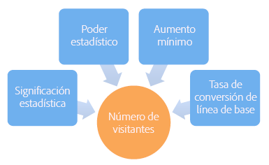
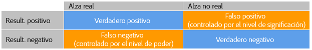
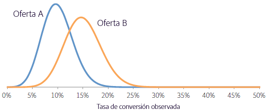
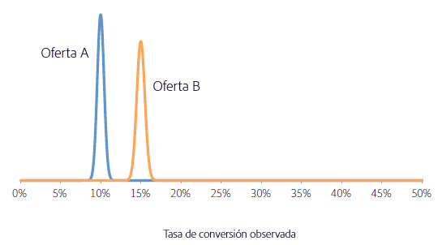
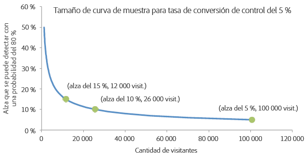

# ¿Durante cuánto tiempo se debe ejecutar una prueba A/B?

A successful [!UICONTROL A/B Test] activity requires an adequate number of visitors (sample size) to improve your conversion rate, but how do you know how long to run an A/B test? This article contains information about [!UICONTROL Auto-Allocate] activities and the [!UICONTROL Adobe Target] Sample Size Calculator to help you ensure that your activity has a sufficient number of visitors to achieve your goals.

Es tentador detener una actividad si una de las ofertas muestra un rendimiento mucho mejor o peor que las otras en los primeros días de la actividad. Sin embargo, cuando el número de observaciones es reducido, existe una alta probabilidad de observar un alza positiva o negativa solo por casualidad, puesto que la tasa de conversión se promedia a partir de un número bajo de visitantes. A medida que la actividad recopila más puntos de datos, las tasas de conversión convergen hacia sus verdaderos valores a largo plazo.

>[!IMPORTANT]
>
>Detener una actividad prematuramente es uno de los diez escollos significativos a los que podría caer presa al realizar pruebas A/B. Para obtener más información, consulte [Diez escollos comunes de prueba A/B y cómo evitarlos](/help/c-activities/t-test-ab/common-ab-testing-pitfalls.md#concept_578A7947C9554868B30F12DFF9E3F8E3).

[!DNL Target] proporciona herramientas que le ayudan a garantizar que su actividad tenga un tamaño de muestra lo suficientemente grande como para lograr sus objetivos de conversión: Asignación automática.

## Asignación automática {#auto-allocate}

An [Auto-Allocate](/help/c-activities/automated-traffic-allocation/automated-traffic-allocation.md) activity is a type of A/B test that identifies a winner among two or more experiences and automatically reallocates more traffic to the winner to increase conversions while the test continues to run and learn.

Las pruebas A/B estándar tienen un coste inherente. Debe invertir tráfico para medir el rendimiento de cada experiencia y utilizar el análisis para determinar la experiencia ganadora. La distribución del tráfico sigue siendo fija incluso después de reconocer que el rendimiento de algunas experiencias supera al de otras. Además, es complicado determinar el tamaño de la muestra, y la actividad debe haber finalizado para poder tomar medidas con la mejor experiencia. Después de todo esto, existe la posibilidad de que la mejor experiencia identificada en realidad no sea la mejor.

The solution is [!UICONTROL Auto-Allocate]. [!UICONTROL La asignación automática reduce este coste y gastos derivados de determinar una experiencia ganadora. ] [!UICONTROL La asignación automática supervisa el rendimiento de la métrica de objetivos de todas las experiencias y envía a más participantes de manera proporcional a las experiencias de mayor rendimiento. ] Se reserva bastante tráfico para explorar el resto de las experiencias. Puede ver los beneficios de la actividad en los resultados, incluso mientras la actividad aún se esté ejecutando: la optimización se produce en paralelo con el aprendizaje.

[!UICONTROL La asignación automática envía a los visitantes de forma gradual hacia las experiencias ganadoras, en vez de hacerles esperar hasta que la actividad acabe para determinar un ganador. ] Saca provecho del alza más rápidamente porque a los visitantes de la actividad a los que se ha enviado a experiencias con peor rendimiento se les muestran experiencias que potencialmente son las ganadoras.

Al utilizar la función de [!UICONTROL asignación automática], [!DNL Target] muestra un distintivo en la parte superior de la página de la actividad indicando “Ningún ganador aún” hasta que la actividad alcance el número mínimo de conversiones con suficiente confianza. [!DNL Target] luego declara la experiencia ganadora al mostrar un distintivo en la parte superior de la página de la actividad.

For more information, see [Auto-Allocate overview](/help/c-activities/automated-traffic-allocation/automated-traffic-allocation.md).

## Calculadora de tamaño de muestra de Adobe Target.  {#section_6B8725BD704C4AFE939EF2A6B6E834E6}

If you choose to use a manual [!UICONTROL A/B Test] activity rather than [!UICONTROL Auto-Allocate], the [!DNL Target] Sample Size Calculator helps you determine the sample size needed for a successful test. Una prueba A/B manual es una prueba de horizonte fijo, por lo que la calculadora resulta extremadamente útil. El uso de la calculadora para una actividad de asignación  automática es opcional porque la asignación  automática le declara ganador. La calculadora proporciona una estimación aproximada del tamaño de la muestra necesario. Siga leyendo para obtener más información sobre cómo usar la calculadora.

Before setting up your A/B test, access the Adobe Target [sample size calculator](https://docs.adobe.com/content/target-microsite/testcalculator.html).

Es importante determinar un tamaño de muestra adecuado (número de visitantes) antes de realizar una prueba A/B para determinar el tiempo que debe ejecutarse la actividad antes de evaluar los resultados. La simple supervisión de la actividad hasta que se alcance la relevancia estadística hace que el intervalo de confianza se subestime enormemente, lo que hace que la prueba sea poco fiable. La intuición que hay tras el resultado es que, en el caso de que se detecte un resultado estadísticamente relevante, se detendrá la prueba y se declarará un ganador. Sin embargo, si el resultado no es estadísticamente relevante, se permite que la prueba siga realizándose. Este procedimiento favorece enormemente un resultado positivo, que aumenta la tasa de falsos positivos y, por tanto, distorsiona el nivel de relevancia estadística de la prueba.

Esto puede generar un gran número de falsos positivos, que puede ocasionar que se implementen ofertas que no ofrecen el alza predicha a largo plazo. Un alza deficiente en sí es un resultado insatisfactorio, pero una consecuencia aún más grave es que, con el tiempo, la incapacidad de predecir el alza con precisión erosiona la confianza de la organización en las pruebas como práctica.

En este artículo se comentan los factores que deben equilibrarse cuando se determina un tamaño de muestra y se presenta una herramienta en hoja de cálculo que permite calcular un tamaño adecuado de la muestra. Si calcula el tamaño de la muestra con la calculadora de tamaño de la muestra (encontrará el vínculo más arriba) antes de iniciar cualquier prueba A/B, tendrá la garantía de que siempre se ejecuten pruebas A/B de nivel superior que cumplan los estándares estadísticos.

Hay cinco parámetros definidos por el usuario que definen una prueba A/B. Estos parámetros están interconectados, así que cuatro de ellos están establecidos y el quinto se puede calcular:

* Relevancia estadística
* Potencia estadística
* Alza mínima fiable detectable
* Tasa de conversión de línea de base
* Número de visitantes

Para una prueba A/B, el analista fija la relevancia estadística, la eficacia estadística, el alza mínima fiable detectable y la tasa de conversión de línea de base, y el número de visitantes se calcula a partir de estos valores. En este artículo se comentan estos elementos y se ofrecen directrices para ajustarlos para una determinada prueba.

En la siguiente imagen se muestran los cuatro resultados posibles de una prueba A/B:

Es deseable no obtener falsos positivos ni falsos negativos. Sin embargo, esto nunca se puede garantizar mediante una prueba estadística. Siempre es posible que las tendencias observadas no sean representativas de las tasas de conversión subyacentes. Por ejemplo, en una prueba para ver si la cara o la cruz de una moneda era más probable, incluso con una moneda justa, se podía conseguir diez caras en diez lanzamientos por casualidad. La relevancia y la potencia estadísticas nos permiten cuantificar las tasas de falsos positivos y falsos negativos, y mantenerlos en niveles razonables para una determinada prueba.

### Relevancia estadística {#section_8230FB9C6D1241D8B1786B72B379C3CD}

El nivel de relevancia de una prueba determina la probabilidad de que la prueba arroje una diferencia significativa en las tasas de conversión entre dos ofertas diferentes cuando, de hecho, no hay ninguna diferencia real. Esto se conoce como falso positivo o error de tipo I. El nivel de relevancia es un umbral especificado por el usuario y es una compensación entre la tolerancia de falsos positivos y el número de visitantes que deben incluirse en la prueba.

En una prueba A/B, inicialmente se presupone que las dos ofertas tienen la misma tasa de conversión. Después, la probabilidad del resultado observado se calcula en función de esta presuposición. If this probability (the p-value) is smaller than some predefined threshold (the significance level), [!DNL Target] concludes that the initial assumption--that both offers have the same conversion rate--is incorrect and, therefore, the conversion rates of A and B are statistically different at the given significance level.

Un nivel de relevancia usado comúnmente en las pruebas A/B es el 5 %, que corresponde a un nivel de confianza del 95 % (nivel de confianza = 100 % - nivel de relevancia). Un nivel de confianza del 95 % significa que cada vez que realice una prueba, hay un 5 % de probabilidades de detectar un alza estadísticamente relevante, aunque no haya ninguna diferencia entre las ofertas.

Las interpretaciones típicas del nivel de confianza se resumen en la siguiente tabla:

| Nivel de confianza | Interpretación |
|--- |--- |
| &lt; 90 % | No hay ninguna evidencia de que haya diferencia entre las tasas de conversión. |
| 90-95 % | Hay una evidencia débil de que haya diferencia entre las tasas de conversión. |
| 95-99 % | Hay una evidencia moderada de que haya diferencia entre las tasas de conversión. |
| 99-99,9 % | Hay una fuerte evidencia de que haya diferencia entre las tasas de conversión. |
| +99,9 % | Hay una evidencia muy fuerte de que haya una diferencia entre las tasas de conversión. |

Se recomienda usar siempre un nivel de confianza del 95 % o superior.

Es preferible usar el mayor nivel de confianza posible, para que la prueba arroje pocos falsos positivos. Sin embargo, un nivel de confianza mayor requiere un gran número de visitantes, lo que aumenta el tiempo necesario para realizar la prueba. Además, un aumento en el nivel de confianza ocasiona una reducción en la potencia estadística.

### Potencia estadística {#section_1169C27F8E4643719D38FB9D6EBEB535}

La potencia estadística de una prueba A/B es la probabilidad de detectar una diferencia real en la tasa de conversión de una determinada magnitud. Debido a la naturaleza aleatoria (estocástica) de los eventos de conversión, es posible que no se observe una diferencia con relevancia estadística (solo por casualidad) aunque haya una diferencia real en la tasa de conversión entre las dos ofertas. Esto se conoce como falso negativo o error de tipo II.

La potencia estadística a menudo se ignora porque en una prueba A/B no es necesario determinarla, al contrario de lo que ocurre con la relevancia estadística. Sin embargo, si se ignora la potencia estadística, hay una posibilidad considerable de que las diferencias reales entre las tasas de conversión de diferentes ofertas no se detecten en la prueba porque el tamaño de la prueba es demasiado pequeño. La consecuencia es que las pruebas estarán repletas de falsos positivos.

Es preferible tener una potencia estadística elevada para que la prueba tenga muchas probabilidades de identificar una diferencia real en las tasas de conversión y genere menos falsos positivos. Sin embargo, se necesita un elevado número de visitantes para aumentar la potencia estadística de detectar cualquier alza dada, lo que aumenta el tiempo necesario para realizar la prueba.

Un valor usado comúnmente para la potencia estadística es el 80 %, lo que supone que la prueba tiene una probabilidad del 80 % de detectar una diferencia igual al alza mínima fiable detectable. La prueba tiene una probabilidad menor de detectar altas menores y una probabilidad mayor de detectar alzas mayores.

### Alza mínima fiable detectable {#section_6101367EE9634C298410BBC2148E33A9}

La mayoría de las organizaciones desean medir la menor diferencia posible en la tasa de conversión, porque merece la pena implementar incluso un alza pequeña. Sin embargo, si quiere que la prueba A/B tenga una alta probabilidad de detectar un alza muy pequeña, el número de visitantes que debe incluirse en la prueba sería altísimo. El motivo de esto es que, si la diferencia en la tasa de conversión es pequeña, las dos tasas de conversión deberán calcularse con alta precisión para identificar la diferencia, lo que requiere un gran número de visitantes. Por tanto, el alza mínima fiable detectable deberá determinarse según los requisitos de la empresa, teniendo en cuenta el equilibrio que hay que mantener entre detectar las alzas pequeñas y ejecutar la prueba durante largos períodos de tiempo.

Por ejemplo, supongamos que dos ofertas (A y B) tienen tasas de conversión verdaderas del 10 y el 15 % respectivamente. Si estas ofertas se muestran a 100 visitantes cada una, hay un 95 % de probabilidades de observar tasas de conversión de entre 4 y 16 % para la oferta A, y de entre 8 y 22 % para la oferta B, debido a la naturaleza estocástica de las conversiones. En estadística, estos rangos se conocen como intervalos de confianza. Representan la confianza en la precisión de las tasas de conversión estimadas. Cuando mayor sea el tamaño de la muestra (más visitantes), tendrá mayor certeza de que las estimaciones de las tasas de conversión serán precisas.

En la siguiente imagen se muestran estas distribuciones de probabilidad.

Debido al gran solapamiento entre los dos rangos, la prueba no puede determinar si las tasas de conversión son diferentes. Por tanto, esta prueba con 100 visitantes no puede distinguir entre las dos ofertas. Sin embargo, si exponemos las ofertas a 5000 visitantes cada una, hay un 95 % de posibilidades de que las tasas de conversión observadas entren dentro de los rangos de 9-11 % y 14-16 % respectivamente.

En este caso, es muy poco probable que la prueba llegue a una conclusión equivocada, por lo que la prueba con 5000 visitantes puede distinguir entre las dos ofertas. La prueba con 5000 visitantes tiene un intervalo de confianza de +/-1 % aproximadamente. Esto significa que la prueba puede detectar diferencias de alrededor del 1 %. Por tanto, se necesitarían incluso más visitantes si las tasas de conversión reales de las ofertas fueran, por ejemplo, del 10 % y el 10,5 %, en lugar del 10 % y el 15 %.

### Tasa de conversión de línea de base {#section_39380C9CA3C649B6BE6E1F8A06178B05}

La tasa de conversión de línea de base es la tasa de conversión de la oferta de control (oferta A). A menudo, puede disponer de un buen sentido del nivel de conversión para la oferta, basado en su experiencia anterior. Si este no es el caso, por ejemplo porque es un nuevo tipo de oferta o es creativa, se puede realizar la prueba durante un día aproximadamente, para obtener una estimación aproximada de la tasa de conversión de línea de base que se puede usar en el cálculo del tamaño de la muestra.

### Número de visitantes {#section_19009F165505429E95291E6976E498DD}

Puede resultar difícil equilibrar los costes de oportunidad que conlleva ejecutar una prueba durante mucho tiempo, con el riesgo de falsos positivos y falsos negativos. Obviamente, no deseará tomar decisiones equivocadas, pero tampoco resulta deseable quedar paralizado por estándares de pruebas demasiado estrictos o demasiado rígidos.

Como guía general, se recomienda un nivel de confianza del 95 % y una potencia estadística del 80 %.

En la calculadora de tamaño de la muestra (encontrará el vínculo más arriba), se le pedirá que tome una decisión sobre la relevancia estadística (se recomienda el 95 %) y la potencia estadística (se recomienda el 80 %). Tras indicar la tasa de conversión de línea de base y el tráfico diario en todas las ofertas, la hoja de cálculo muestra el número de visitantes necesarios para detectar un alza de 1 %, 2 %, 5 %, 10 %, 15 % y 20 % con una probabilidad igual a la potencia especificada en la prueba. La hoja de cálculo también permite al usuario indicar un valor personalizado para el alza mínima fiable detectable. Además, la hoja de cálculo muestra el número de semanas necesarias para realizar la prueba, en función del nivel de tráfico indicado por el usuario. Este número de semanas se redondea hasta la semana completa más próxima, para evitar cualquier efecto de día de la semana que pueda influir en los resultados.

Existe un equilibrio entre el alza mínima que la prueba puede detectar de manera fiable y el número de visitantes necesario. En la imagen de abajo, que es válida para una tasa de conversión de línea de base (control) del 5 %, se muestra una fuerte reducción de los valores devueltos conforme aumenta el número de visitantes. El alza mínima que se puede detectar de manera fiable mejora considerablemente cuando se agregan algunos de los primeros visitantes a la prueba, pero toma un número de visitantes cada vez mayor para mejorar la prueba. La imagen ayuda a encontrar un equilibrio adecuado entre el tiempo necesario para realizar la prueba (según viene determinado por el número de visitantes necesario y el tráfico del sitio) y el alza mínima que la prueba puede detectar de manera fiable.

En este ejemplo, es posible que considere adecuado poder detectar un alza del 5 % (correspondiente a una tasa de conversión de la oferta alternativa (100 % + 5 %)*5 % = 5,25 %) en 80 de 100 pruebas, por lo que necesitará un tamaño de muestra de 100 000 visitantes para cada oferta. Si el sitio tiene 20 000 visitantes al día y realiza la prueba de dos ofertas, la prueba debería permitir ejecutar 2*100 000/20 000 = 10 días, antes de poder determinar si la oferta alternativa tiene una relevancia estadística superior a la de la oferta de control.

Una vez más, se recomienda que el tiempo necesario se redondee siempre a la semana completa más próxima, para evitar cualquier efecto de día de la semana. Por tanto, en este ejemplo, la prueba se realizaría durante dos semanas antes de evaluar los resultados.

### Métrica de ingresos por visita.  {#section_C704C0861C9B4641AB02E911648D2DC2}

Cuando se usan los ingresos por visita (RPV) como métrica, se añade una fuente de varianza adicional, ya que RPV es el producto de los ingresos por pedido y la tasa de conversión (RPV = ingresos/nº visitantes = (ingresos por pedido * nº de pedidos)/nº de visitantes = ingresos por pedido * (nº de visitantes * CTR)/nº de visitantes = ingresos por pedido * CTR), cada uno con su propia varianza. La varianza de la tasa de conversión puede estimarse directamente utilizando un modelo matemático, pero la varianza de los ingresos por pedido es específica de la actividad. Por lo tanto, utilice el conocimiento de esta varianza de actividades pasadas o ejecute la prueba A/B durante unos días para calcular la varianza en los ingresos. La varianza se calcula a partir de los valores de Suma de ventas, Suma de ventas al cuadrado y Número de Visitantes que se encuentran en el archivo de descarga CSV. Una vez establecida, utilice la hoja de cálculo para calcular el tiempo necesario para completar la prueba.

La calculadora de tamaño de la muestra (vínculo proporcionado arriba) puede ayudarle a configurar la métrica de RPV. When you open the calculator, you&#39;ll see a tab labeled [!UICONTROL RPV Metric]. Necesitará la siguiente información al usar la versión de RPV de la calculadora:

* Número de visitantes a la oferta de control
* Ingresos totales para la oferta de control

   Asegúrese de seleccionar el filtro de pedido extremo.

* La suma de ingresos al cuadrado para la oferta de control

   Asegúrese de que el filtro de pedidos extremos esté seleccionado.

En general, el uso de RPV como métrica requiere entre un 20 y un 30 % más de tiempo para lograr el mismo nivel de confianza estadística para el mismo nivel de alza medida. Esto se debe a que RPV tiene la varianza agregada de diferentes tamaños de pedido por conversión. Esto debería ser una consideración a la hora de elegir entre tasa de conversión recta y RPV como métrica en la cual basar su decisión comercial final.

## Correction for comparing multiple offers {#section_1474113764224D0B85472D8B023CCA15}

Cada vez que compara dos ofertas, las posibilidades de obtener un falso positivo (es decir, observar una diferencia con relevancia estadística aunque no haya diferencia en la tasa de conversión) son iguales al nivel de relevancia. Por ejemplo, si hay cinco ofertas, A/B/C/D/E, y A es la oferta control, se realizan las cuatro comparaciones (control frente a B, control frente a C, control frente a D y control frente a E), y la probabilidad de obtener un falso positivo es del 18,5 % aunque el nivel de confianza sea del 95 % porque Pr (al menos un falso positivo) = 1 - Pr (sin falsos positivos) = 1 - 0,95 = 18,5 %. En este contexto, un falso positivo se define como la notificación de que el control es mejor que la alternativa, o que la alternativa es mejor que el control cuando, de hecho, no hay ninguna diferencia entre ellos.

## Conclusión.  {#section_AEA2427B90AE4E9395C7FF4F9C5CA066}

By using an [!UICONTROL Auto-Allocate] activity, [!DNL Target] identifies a winner among two or more experiences and automatically reallocates more traffic to the winner to increase conversions while the test continues to run and learn. [!UICONTROL La asignación automática facilita el logro de sus objetivos de conversión y elimina las suposiciones.]

Al usar la calculadora de tamaño de la muestra (encontrará el vínculo más arriba) que se detalla en este artículo y permitir que la prueba se realice durante la cantidad de tiempo sugerida por esta herramienta, tendrá la seguridad de que siempre realizará pruebas A/B de calidad que se ajusten a las tasas de falsos positivos y falsos negativos que considera que son adecuadas para la prueba específica. Esto garantiza que sus pruebas sean coherentes y capaces de detectar el alza que está buscando.
