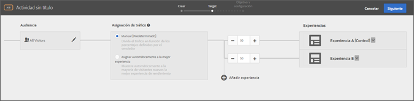

# Añadir experiencia{#add-experience}

El Compositor de experiencias visuales proporciona una interfaz visual para editar las experiencias en la página.

Para obtener más información sobre las experiencias, consulte [Experiencias](../../../c-experiences/experiences.md#concept_A2E10F6AFB3D4AEAB6951EE14688848D).

1. Haga clic en **[!UICONTROL Agregar experiencia]**.

   >[!NOTE]
   >
   >Si va a segmentar una experiencia a una audiencia, debe seleccionar la audiencia antes de añadir la experiencia. Aparecerá un mensaje para recordarle que elija una audiencia.

1. Cuando se le pida, introduzca la dirección URL de la actividad. Escriba la dirección URL completa (incluido `https://`) y haga clic en **[!UICONTROL Continuar]**.

   El Compositor de experiencias (consulte [Experiencias](../../../c-experiences/experiences.md#concept_1D011219034B492BB03C08B3BB80E3F0)) abre la página que se especifica en Preferencias de cuenta. Para mostrar una página distinta, haga clic en el icono del globo, escriba la dirección URL en el cuadro de selección de dirección URL del Compositor de experiencias y haga clic en **[!UICONTROL Continuar]**. Si escribe una dirección URL de un sitio que no incluye el código de JavaScript de Target Standard, no podrá seleccionar elementos de página.

   De manera predeterminada, el compositor de experiencias visuales no permite realizar cambios en elementos que contengan JavaScript, como banners giratorios. Puede deshabilitar JavaScript si quiere poder modificar estos elementos con el Compositor de experiencias visuales.

   >[!NOTE]
   >
   >Si cambia la dirección URL después de realizar cambios en una página para una o más experiencias, la experiencia se restablecerá con la nueva página y se perderán los cambios que haya realizado.

1. Seleccione los elementos que quiera cambiar y realice los cambios necesarios.

   Al desplazar el cursor sobre los elementos de la página, estos se resaltarán. Los elementos resaltados se pueden modificar con el Compositor de experiencias.

   Si creó un mbox en la página mediante Target Classic (antes denominado Test&amp;Target), ese mbox aparece como un elemento que muestra el nombre del mbox y se puede modificar como cualquier otro elemento.

   Para obtener una lista de las acciones que se pueden realizar en un elemento de la página mostrada para cambiar la experiencia, consulte [Opciones del Compositor de experiencias visuales](/help/c-experiences/c-visual-experience-composer/viztarget-options.md).

   >[!NOTE]
   >
   >Si entrega una imagen desde un origen distinto a la página principal (por ejemplo, una imagen alojada en akamai.net y entregada en dell.com), dicha imagen no se mostrará en la miniatura de la página mostrada en el diagrama de flujo.

1. Haga clic en el botón de la marca de verificación cuando haya terminado de diseñar la experiencia.

   Se muestra el diagrama de actividad:

   

   Si una experiencia incluye contenido entre dominios, es posible que la miniatura no se muestre de forma precisa y que sea reemplazada por un icono.

1. Especifique el porcentaje de visitantes que verán las experiencias de la actividad.

   Se pueden mostrar varias experiencias a la misma audiencia. La audiencia seleccionada se mostrará en un diagrama junto con las experiencias que haya añadido a la actividad. Especifique el porcentaje de veces que quiere que se muestre cada experiencia. Puede dividir los porcentajes de manera uniforme entre todas las experiencias, o especificar porcentajes superiores o inferiores para cada experiencia. El total de todas las experiencias debe ser igual al 100%. También puede hacer clic en **[!UICONTROL Agregar experiencia]para agregar otra experiencia a la actividad.**

   Haga clic en **[!UICONTROL Continuar]cuando haya completado este paso.**

## Cambiar nombre, editar o eliminar una experiencia

Tenga en cuenta que puede hacer clic en el icono Más (tres elipses verticales) de una experiencia en una prueba A/B o una actividad de Segmentación de experiencias (XT) y elegir de las siguientes opciones la que necesite:

* Cambiar nombre
* Editar  
* Eliminar

Tenga en cuenta que cuando nombra o renombra una experiencia, no se permiten los siguientes caracteres:

| Carácter | Descripción |
|--- |--- |
| / | Barra oblicua |
| ? | Signo de interrogación |
| # | Signo de número    |
| : | Dos puntos |
| = | Igual a |
| + | Más |
| - | Menos |
| @ | Arroba |

## Duplicar experiencias

Puede copiar una experiencia en una prueba A/B para poder realizar cambios menores sin tener que volver a crear la experiencia desde cero.

En la página **[!UICONTROL Experiencias]** (el primer paso del flujo de trabajo guiado de tres pasos), haga clic en las tres elipses verticales &gt; **[!UICONTROL Duplicar]**.

## Vídeo de formación: Uso del Compositor de experiencias visuales

El siguiente vídeo proporciona información sobre cómo usar las opciones del Compositor de experiencias visuales. (7:17)

* Cambiar el contenido de una página
* Cambiar el diseño de una página

>[!VIDEO](https://video.tv.adobe.com/v/17399)
