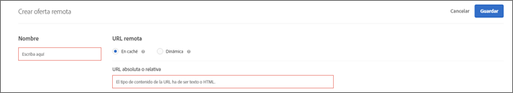

# Crear más ofertas{#create-remote-offers}

Utilice las ofertas remotas para alojar contenido fuera de Target al que Target haga referencia y que entregue a los sitios web de los usuarios. Este contenido puede encontrarse en un sistema de gestión de contenido o de otro tipo por cuestiones de comodidad o de seguridad.

>[!NOTE]
>
>Las ofertas remotas solo se pueden crear en el compositor basado en formularios. El contenido se insertará en las ubicaciones de solicitud [!DNL Target], por lo que es muy probable que no sean apropiadas para una solicitud global [!DNL Target].
>
>[!DNL Target Classic] incluía funciones similares: [!UICONTROL Oferta en su sitio] y [!UICONTROL Oferta fuera de Test&amp;Target].

Algunos ejemplos de ofertas remotas son:

* Diferentes versiones de las ventas cruzadas
* Mensajes dinámicos de carro de compras
* Formularios
* Calculadoras
* Actualizaciones de la tasa de interés

**Para crear una oferta remota:**

1. Haga clic en **[!UICONTROL Ofertas]** y seleccione la pestaña **[!UICONTROL Ofertas de código]**.
1. Haga clic en **[!UICONTROL Crear]** > **[!UICONTROL Oferta remota]**.

   

1. Escriba un nombre descriptivo para la oferta.

   Un nombre descriptivo permite encontrar la oferta rápidamente en la biblioteca [!UICONTROL Activos].

1. Indique la dirección URL remota de la oferta remota:

   | Opción | Descripción |
   |--- |--- |
   | En caché | El contenido de una oferta remota en caché se suministra desde Target. Cada dos horas, [!DNL Target] busca el contenido en la dirección URL remota y luego almacena el contenido dentro de Target. Cuando los visitantes cargan un sitio con una experiencia que incluye una oferta remota, la oferta se envía a través de Target. Las ofertas remotas en caché proporcionan una seguridad mejorada, ya que alguien que haya iniciado sesión en Target no podrá cambiar el contenido. Para cambiar el contenido, la persona tendría que iniciar sesión en el sistema de gestión de contenido o en otro tipo sistema y cambiarlo desde ahí. En una oferta remota en caché, puede especificar una dirección URL absoluta o relativa. |
   | Dinámica | Una oferta remota dinámica se suministra desde el sistema de gestión de contenido o desde otro, no desde Target. Es posible que no quiera que el contenido se almacene en caché regularmente y que luego Target lo envíe cuando los visitantes carguen un sitio con una experiencia que incluya una oferta remota. Quizás prefiera llamar al sistema que aloja el contenido y pasar una información determinada para que la oferta devuelta pueda ser dinámica o distinta para cada usuario. Por ejemplo, si un usuario inicia sesión en un sitio web de una tarjeta de crédito que incluye una experiencia con una oferta remota dinámica, podría pasar parámetros en la dirección URL relativos a la información de cuenta del usuario. Después, el sitio web podría dar información sobre el usuario, como el saldo de la cuenta. Haga clic en  [!UICONTROL Añadir ] parámetro para agregar una o más  [!DNL Target] solicitudes o parámetros de solicitud. |

1. Haga clic en **[!UICONTROL Guardar]**.

## Prácticas recomendadas para el uso de ofertas remotas {#section_7718512D08E14121B6F6B8C38134F4BC}

Prácticas recomendadas para el uso de ofertas remotas en las actividades:

* Si la oferta reside en el mismo dominio que las solicitudes [!DNL Target], el uso de la opción [!UICONTROL Caché] permite utilizar direcciones URL relativas para describir la ubicación de la oferta.

   Esto supone que, cuando traslade la actividad de los servidores de ensayo a producción, el contenido pasará a ser accesible automáticamente, sin necesidad de cambiar la dirección URL manualmente.

* Si la prueba incluye datos que el servidor haya generado dinámicamente, tal vez [!UICONTROL Dinámica] sea la opción conveniente.
* Si solo planea comprobar la apariencia que tiene el contenido de la oferta remota existente, utilice el [!UICONTROL Compositor de experiencias visuales] para cambiar el aspecto del contenido que devuelve el sistema de gestión de contenido.
* Utilice la matriz de selección de ofertas remotas para seleccionar más fácilmente la mejor oferta adaptada a su caso. Si tiene alguna pregunta, consulte con su representante de cuentas.

## Cómo funcionan las ofertas remotas dinámicas {#concept_CC2A969420B34364A9FA78C1CE251818}

Las ofertas remotas dinámicas utilizan la tecnología de su página dinámica para pasar los valores a la oferta.

La oferta se ejecuta después de que procese la página. Un iframe invisible recopila los datos, los copia del marco y los inserta en la página, cargando así los valores transmitidos.

## Matriz de selección de ofertas remotas {#reference_B23BEDD29DDD47709A7651AFD27E776B}

La matriz de selección de ofertas remotas ayuda a decidir qué tipo de oferta remota utilizar: [!UICONTROL En caché] o [!UICONTROL Dinámica].

| Función | En caché | Dinámica |
|--- |--- |--- |
| Se actualiza cada vez que un visitante hace una solicitud | No | Sí |
| Actualizaciones de contenido | En caché cada 2 horas | Se actualiza de forma inmediata en cada solicitud |
| Tiempo de carga | Más rápido | Más lento debido al procesamiento de solicitudes |
| Se puede ver JavaScript en la página | Sí | No, pero se puede transmitir por URL |
| Las ofertas pueden incluir JavaScript | Sí | Sí |
| URL de la oferta | Absoluta o relativa | Relativo |
| Equipo solicitante | Servidores de Adobe | El equipo del visitante, que lleva las cookies del visitante |