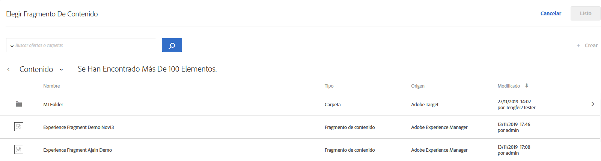

# Fragmentos de experiencia de AEM{#aem-experience-fragments}

Information about using experience fragments created in [!DNL Adobe Experience Manager] (AEM) in [!DNL Target] activities to aid optimization or personalization.

>[!NOTE]
>
>This feature requires that you are an [!DNL Adobe Experience Manager] ([!DNL AEM]) customer. Consulte [Requisitos](/help/c-experiences/c-manage-content/aem-experience-fragments.md#section_AE6F0971E1574B3AA324003599B96E5A), a continuación, para obtener más información.

## Información general {#section_95A91830530F493B81C5C9CDB9B783EA}

Using experience fragments created in [!DNL AEM] in [!DNL Target] activities lets you combine the ease-of-use and power of [!DNL AEM] with powerful Automated Intelligence (AI) and Machine Learning (ML) capabilities in [!DNL Target] to test and personalize experiences at scale.

[!DNL AEM] aúna todos sus contenidos y recursos en una ubicación centralizada que potencia su estrategia de personalización. [!DNL AEM] le permite crear fácilmente contenido para equipos de escritorio, tabletas y dispositivos móviles en una misma ubicación y sin tener que escribir código. No es necesario crear páginas para cada dispositivo. [!DNL AEM] ajusta automáticamente cada experiencia con el contenido.

[!DNL Target] le permite ofrecer experiencias personalizadas a escala empleando una combinación de enfoques de aprendizaje automático basados en reglas y dirigidos por AI que incorporan variables de comportamiento, contextuales y sin conexión. With [!DNL Target] you can easily set up and run [A/B Test](/help/c-activities/t-test-ab/test-ab.md) and [Multivariate](/help/c-activities/c-multivariate-testing/multivariate-testing.md) (MVT) activities to determine the best offers, content, and experiences.

Experience fragments represent a huge step forward to link the content/experience creators and managers to the optimization and personalization professionals who are driving business outcomes using [!DNL Target].

## Requisitos.  {#section_AE6F0971E1574B3AA324003599B96E5A}

Debe contar con la funcionalidad de fragmentos de experiencia dentro de [!DNL Target]. In addition, you must be using [!DNL AEM] 6.3 with the appropriate service pack or [!DNL AEM] 6.4 (or later). El representante de cuentas puede ayudar a garantizar el cumplimiento de los requisitos para usar esta función:

* [!DNL Adobe Experience Manager] 6.4 (o posterior).
* [!DNL Adobe Experience Manager] 6.3 SP2 (o posterior).
* [!DNL Adobe Target Standard] o [!DNL Adobe Target Premium] cuenta.
* Contact [Adobe Target Customer Care](/help/cmp-resources-and-contact-information.md#reference_ACA3391A00EF467B87930A450050077C) to enable the integration and to provide you with authentication details.

## Creating and configuring experience fragments in [!DNL AEM] {#section_745C8EFE29F547A2958FDBF61A5ADF7B}

In order to use [!DNL AEM] experience fragments in [!DNL Target], you must perform the following steps:

### Paso 1: Integrar [!DNL AEM] con [!DNL Target]

Para obtener más información, consulte:

* **[!DNL AEM]6.3**: [Si opta por Adobe Analytics y Adobe Target](https://docs.adobe.com/docs/en/aem/6-3/administer/integration/marketing-cloud/opt-in.html) en la documentación de _Adobe Experience Manager 6.3_ .
* **[!DNL AEM]6.4**: [Si opta por Adobe Analytics y Adobe Target](https://helpx.adobe.com/experience-manager/6-4/sites/administering/using/opt-in.html) en la documentación de _Adobe Experience Manager 6.4_ .
* **[!DNL AEM]6.5**: [Si opta por Adobe Analytics y Adobe Target](https://helpx.adobe.com/experience-manager/6-5/sites/administering/using/opt-in.html) en la documentación de *Adobe Experience Manager 6.5* .

### Paso 2: Crear el fragmento de experiencia

Los fragmentos de experiencia se crean en [!DNL AEM]. Para obtener más información, consulte:

* **[!DNL AEM]6.3**: [Fragmentos](https://docs.adobe.com/docs/en/aem/6-3/author/experience-fragments.html) de experiencia en la documentación de *Adobe Experience Manager 6.3* .
* **[!DNL AEM]6.4**: [Fragmentos](https://helpx.adobe.com/experience-manager/6-4/sites/authoring/using/experience-fragments.html) de experiencia en la documentación de *Adobe Experience Manager 6.4* .
* **[!DNL AEM]6.5**: [Fragmentos](https://helpx.adobe.com/experience-manager/6-5/sites/authoring/using/experience-fragments.html) de experiencia en la documentación de *Adobe Experience Manager 6.5* .

### Step 3: Configure [!DNL AEM] to share the experience fragment with [!DNL Target]

1. From within [!DNL AEM], select the desired experience fragment or its containing folder, then click **[!UICONTROL Properties]**.
2. Haga clic en la pestaña **[!UICONTROL Servicios de nube]** y a continuación, en la lista desplegable **[!UICONTROL Configuración de Servicio de nube]**, seleccione **[!UICONTROL Adobe Target]**.

   >[!NOTE]
   >
   >The previous step assumes that someone in your organization has created the [!DNL Adobe Target] configuration.

3. Haga clic en **[!UICONTROL Guardar y cerrar]**.

### Paso 4: Publicar el fragmento de experiencia y exportarlo en [!DNL Target]

En función de su [!DNL AEM] versión, consulte los siguientes vínculos para obtener instrucciones paso a paso:

* **[!DNL AEM]6.3**: [Exportación de un fragmento de experiencia a Destinatario](https://helpx.adobe.com/experience-manager/6-3/sites/administering/using/experience-fragments-target.html) en la documentación de *Adobe Experience Manager 6.3* .
* **[!DNL AEM]6.4**: [Exportación de un fragmento de experiencia a Destinatario](https://experienceleague.adobe.com/docs/experience-manager-64/administering/integration/experience-fragments-target.html) en la documentación de *Adobe Experience Manager 6.4* .
* **[!DNL AEM]6.5**: [Exportación de un fragmento de experiencia a Destinatario](https://helpx.adobe.com/experience-manager/6-5/sites/administering/using/experience-fragments-target.html) en la documentación de *Adobe Experience Manager 6.5* .

## Using experience fragments in Target activities {#section_17CE4BE6B2B74CCEBAE0C68DEB84ABB9}

Después de realizar las tareas anteriores, el fragmento de experiencia se muestra en la página [!UICONTROL Ofertas] de [!DNL Target].

>[!NOTE]
>
>[!DNL Target] busca fragmentos de experiencia para importar cada diez minutos. The imported experience fragment should be available in [!DNL Target] within ten minutes, but this time frame should shorten going forward.

>[!IMPORTANT]
>
>The experience fragment is currently imported into [!DNL Target] as an HTML offer. Note that the experience fragment &quot;primary&quot; version remains in [!DNL AEM]. No puede editar el fragmento de experiencia en [!DNL Target].

Puede pasar el ratón por encima de un fragmento de experiencia en la lista y, a continuación, hacer clic en el icono de [!UICONTROL Vista] de la  para ver información adicional sobre el fragmento de experiencia, incluida la dirección URL del envío de oferta pública y su [!DNL AEM] ruta.

You can consume experience fragments in [!DNL Target] activities using the [Visual Experience Composer](/help/c-experiences/c-visual-experience-composer/visual-experience-composer.md) (VEC) or the [Form-Based Experience Composer](/help/c-experiences/form-experience-composer.md).

>[!NOTE]
>
>To fully utilize the [!DNL Target] AI and ML functionality, you can select [Auto-Allocate](/help/c-activities/automated-traffic-allocation/automated-traffic-allocation.md#concept_A1407678796B4C569E94CBA8A9F7F5D4) or [Auto-Allocate](/help/c-activities/automated-traffic-allocation/automated-traffic-allocation.md) while creating an A/B Test.

**Para consumir fragmentos de experiencia con el VEC:**

1. En [!DNL Target], mientras crea o edita una experiencia en el Compositor [de experiencias](/help/c-experiences/experiences.md#concept_A2E10F6AFB3D4AEAB6951EE14688848D)visuales, haga clic en la ubicación de la página en la que desea insertar [!DNL AEM] contenido y, a continuación, seleccione la opción deseada para mostrar la lista [!UICONTROL Elegir un fragmento] de experiencias.

   * [!UICONTROL Insertar antes]
   * [!UICONTROL Insertar después]
   * [!UICONTROL Intercambiar con fragmento de experiencia]

   La lista [!UICONTROL Fragmento de experiencia][!DNL AEM] muestra todo el contenido creado en que ahora está disponible de forma nativa dentro de [!DNL Target].

   >[!NOTE]
   >
   >La opción [!UICONTROL Intercambiar con fragmento de experiencia] no está disponible para imágenes. Si desea utilizar esta opción con una imagen, haga clic en el elemento contenedor que contenga la imagen deseada.

   

1. Select the desired experience fragment, then click **[!UICONTROL Done]**.
1. Termine de configurar la actividad.

   Para obtener más información acerca de la configuración de los distintos tipos de actividad, consulte los temas siguientes:

   * **Prueba A/B:** [Crear una prueba A/B](/help/c-activities/t-test-ab/t-test-create-ab/test-create-ab.md)
   * **Asignación automática:** [Asignación automática](/help/c-activities/automated-traffic-allocation/automated-traffic-allocation.md#concept_A1407678796B4C569E94CBA8A9F7F5D4)
   * **Destinatario automático:** [Destinatario automático](/help/c-activities/auto-target/auto-target-to-optimize.md)
   * **Personalización automatizada (AP):** [Creación de una actividad de personalización automatizada](/help/c-activities/t-automated-personalization/create-ap-activity.md#task_8AAF837796D74CF893CA2F88BA1491C9)
   * **Segmentación de experiencias (XT):** [Crear una actividad de segmentación de experiencias](/help/c-activities/t-experience-target/t-xt-create/xt-create.md#task_D6B3429AC31549E1A70EDF04B3DDC765)
   * **Prueba multivariable (MVT):** [Crear una prueba multivariable](/help/c-activities/c-multivariate-testing/t-create-multivariate-test/create-multivariate-test.md#task_BF870FA60A8245AB8F0B775BE32EA710)
   * **Recommendations:** [Crear una actividad de Recommendations](/help/c-recommendations/t-create-recs-activity/create-recs-activity.md#task_6874328773C64C44A73F0A130AD3F96F)

**Para consumir fragmentos de experiencia con el Compositor de experiencias basadas en formularios:**

1. In [!DNL Target], while creating or editing an experience in the [Form-Based Experience Composer](/help/c-experiences/form-experience-composer.md#task_FAC842A6535045B68B4C1AD3E657E56E), select the location on the page where you want to insert [!DNL AEM] content, then select **[!UICONTROL Change Experience Fragment]** to display the [!UICONTROL Choose an Experience Fragment] list.

   

   La lista [!UICONTROL Fragmento de experiencia][!DNL AEM] muestra todo el contenido creado en que ahora está disponible de forma nativa dentro de [!DNL Target].

1. Seleccione el fragmento de experiencia deseado y, a continuación, haga clic en **[!UICONTROL Guardar]**.
1. Termine de configurar la actividad.

## Consideraciones {#considerations}

* [!DNL Target] busca fragmentos de experiencia para importar cada diez minutos. The imported experience fragment should be available in [!DNL Target] within ten minutes, but this time frame should shorten going forward.
* The experience fragment is currently imported into [!DNL Target] as an HTML offer. Note that the experience fragment &quot;primary&quot; version remains in [!DNL AEM]. No puede editar el fragmento de experiencia en [!DNL Target].
* Puede importar ofertas JSON como fragmentos de experiencia en [!DNL Target]. Sin embargo, estas ofertas se importan como ofertas HTML. Actualmente, las ofertas JSON (fragmentos de experiencia) no son totalmente compatibles con la [!DNL Target] interfaz de usuario.
* No se pueden crear fragmentos de experiencia con E/S de Adobe. Debe crear fragmentos de experiencia con AEM, como se explica más arriba.

## Training video: Using AEM experience fragments with Adobe Target  {#section_C0EDC54063464F41A182492D2045BC64}

El siguiente vídeo muestra cómo configurar y utilizar fragmentos de experiencia:

>[!VIDEO](https://video.tv.adobe.com/v/22383)

>[!NOTE]
>
>Se ha eliminado la función de [!DNL AEM] vínculo profundo que se describe a las 4:54.

Para obtener más información, consulte [Uso de fragmentos de experiencia con Adobe Target](https://experienceleague.adobe.com/docs/experience-manager-learn/sites/personalization/experience-fragment-target-offer-feature-video-use.html) en la página Vídeos y Tutorials *de* AEM Sites.
