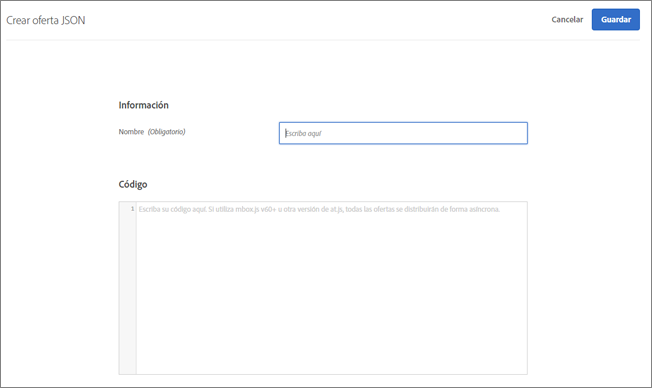
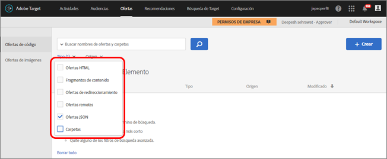

# Creación de ofertas JSON{#create-json-offers}

Cree ofertas JSON en la biblioteca de ofertas para utilizarlas en el Compositor de experiencias basadas en formularios.

Las ofertas JSON se pueden utilizar en actividades basadas en formularios por las cuales se habiliten casos de uso cuando se requiera tomar decisiones de Target para enviar una oferta en formato JSON para consumir en integraciones de marco de SPA o del lado de servidor.

Cuando trabaje con ofertas JSON, tenga en cuenta la información siguiente:

* En estos momentos las ofertas JSON están disponibles solo para actividades AB y XT.
* Las ofertas JSON solo se pueden utilizar en actividades basadas en formularios.
* La oferta JSON se puede recuperar directamente cuando usa Server Side API, Mobile SDK o NodeJS SDK.
* En el explorador, las ofertas JSON se pueden recuperar SOLAMENTE a través de at.js 1.2.3 (o versiones posteriores) y utilizando   [getOffer()](/help/c-implementing-target/c-implementing-target-for-client-side-web/adobe-target-getoffer.md) filtrando acciones usando la acción `setJson`.
* Las ofertas JSON se proporcionan como objetos JSON nativos en vez de como cadenas. Los consumidores de estos objetos ya no son necesarios para gestionar objetos como cadenas y convertirlos en objetos JSON.
* Las ofertas JSON no se aplican automáticamente, a diferencia de otras ofertas (como la ofertas HTML), porque las ofertas JSON son ofertas no visuales. Los desarrolladores deben escribir código para obtener explícitamente la oferta utilizando   [getOffer()](/help/c-implementing-target/c-implementing-target-for-client-side-web/adobe-target-getoffer.md).
* Las ofertas JSON no son compatibles si usa mbox.js.

## Creación de una oferta JSON {#section_BB9C72D59DEA4EFB97A906AE7569AD7A}

1. Haga clic en **[!UICONTROL Ofertas]** y seleccione la pestaña **[!UICONTROL Ofertas de código]**.
1. Haga clic en **[!UICONTROL Crear]** > **[!UICONTROL Oferta JSON]**.

   

1. Escriba el nombre de una oferta.
1. Escriba o pegue su código JSON en el recuadro **[!UICONTROL Código]**.
1. Haga clic en **[!UICONTROL Guardar]**.

## Ejemplo {#section_A54F7BB2B55D4B7ABCD5002E0C72D8C9}

Las ofertas JSON solo se admiten en actividades creadas con el Compositor de experiencias basadas en formularios. En estos momentos, la única forma de poder utilizar las ofertas JSON es mediante llamadas directas a API.

Vea el siguiente ejemplo:

```json
adobe.target.getOffer({ 
  mbox: "some-mbox", 
  success: function(actions) { 
    console.log('Success', actions); 
  }, 
  error: function(status, error) { 
    console.log('Error', status, error); 
  } 
});
```

Las acciones pasadas a llamada de retorno de éxito son una matriz de objeto. Si tenemos una sola oferta JSON con este contenido:

```json
{ 
  "demo": {"a": 1, "b": 2} 
}
```

La matriz de acciones tendrá esta estructura:

```json
[ 
 { 
   action: "setJson", 
   content: [{ 
     "demo": {"a": 1, "b": 2} 
   }] 
 }  
]
```

Para extraer la oferta JSON, debe iterar a través de acciones y encontrar la acción `setJson`, para después iterar mediante la matriz de contenido.

## Caso de uso {#section_85B07907B51A43239C8E3498EF58B1E5}

Pongamos que la siguiente oferta JSON se entrega a su página web:

```json
{ 
    "_id": "5a65d24d8fafc966921e9169", 
    "index": 0, 
    "guid": "7c006504-c6f7-468d-a46f-f72531ea454c", 
    "isActive": true, 
    "balance": "$2,075.06", 
    "picture": "https://placehold.it/32x32", 
    "tags": [ 
      "esse", 
      "commodo", 
      "excepteur", 
    ], 
    "friends": [ 
      { 
        "id": 0, 
        "name": "Carla Lyons" 
      }, 
      { 
        "id": 1, 
        "name": "Ollie Mooney" 
      }, 
    ], 
    "greeting": "Hello, Stephenson Fernandez! You have 4 unread messages.", 
    "favoriteFruit": "strawberry" 
} 
  
```

El código siguiente muestra cómo acceder al atributo “bienvenida”:

```json
adobe.target.getOffer({   
  "mbox": "name_of_mbox", 
  "params": {}, 
  "success": function(offer) {           
        console.log(offer[0].content[0].greeting); 
  },   
  "error": function(status, error) {           
      console.log('Error', status, error); 
  } 
});
```

## Filtrado de ofertas por tipo de oferta JSON   {#section_52533555BCE6420C8A95EB4EB8907BDE}

Puede filtrar la biblioteca de ofertas por tipo de oferta JSON haciendo clic en la lista desplegable **[!UICONTROL Tipo]** y después marcando la casilla de selección **[!UICONTROL JSON.]**



