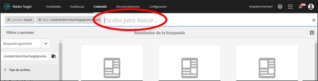
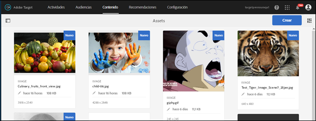

# Buscar contenido y crear colecciones inteligentes{#search-content-and-create-smart-collections}

Busque activos por palabra clave y guarde carpetas de búsqueda, llamadas colecciones inteligentes, que se actualizan automáticamente con los resultados de búsqueda.

Esta sección contiene la información siguiente:

* [Buscar activos por palabra clave](/help/c-experiences/c-manage-content/filter-and-search-content.md#section_2465A71BC95942588F586B1EC8B9E5DB)
* [Guardar colecciones inteligentes](/help/c-experiences/c-manage-content/filter-and-search-content.md#section_5C95159543B5405EB8C8E47B518DF4AB)

## Buscar activos por palabra clave   {#section_2465A71BC95942588F586B1EC8B9E5DB}

1. Haga clic en **[!UICONTROL Ofertas]** > **[!UICONTROL Ofertas de imágenes]** para acceder a la [!UICONTROL Biblioteca de activos].

   Puede hacer clic en el icono [!UICONTROL Vista de tarjeta] que se encuentra en la esquina superior derecha para mostrar los activos en el formato de vista de tarjeta.

   O

   Puede hacer clic en el icono [!UICONTROL Vista de lista] que se encuentra en la esquina superior derecha para mostrar los activos en el formato de vista de lista.

1. Haga clic en el icono **[!UICONTROL Solo contenido]** que se encuentra en la esquina superior izquierda para mostrar el cuadro de búsqueda.

   

1. En el cuadro de búsqueda, escriba una palabra clave para el activo que quiera encontrar y luego presione Intro.

## Guardar colecciones inteligentes   {#section_5C95159543B5405EB8C8E47B518DF4AB}

Puede crear búsquedas guardadas, llamadas colecciones inteligentes, para ahorrar tiempo al realizar búsquedas parecidas. Una búsqueda guardada crea una colección inteligente que se actualiza automáticamente con los resultados de búsqueda.

1. Haga clic en **[!UICONTROL Ofertas]** > **[!UICONTROL Ofertas de imágenes]** para acceder a la [!UICONTROL Biblioteca de activos].

   

1. Haga clic en el icono **[!UICONTROL Solo contenido]** que se encuentra en la esquina superior izquierda para mostrar el panel [!UICONTROL Filtro y opciones] en el carril izquierdo.
1. Haga clic en el icono **[!UICONTROL Examinar]** para mostrar el cuadro de diálogo [!UICONTROL Seleccionar ruta].

   

1. Busque la carpeta donde quiere guardar la colección inteligente y selecciónela. A continuación, haga clic en el icono **[!UICONTROL Confirmar]**.

   

1. (Opcional) Seleccione las distintas opciones para restringir el filtro, por ejemplo, el tipo de archivo y el tamaño.
1. Haga clic en **[!UICONTROL Guardar colecciones inteligentes]**, al final del panel [!UICONTROL Filtro y opciones], para mostrar las opciones de Guardar.

   

1. Elija un nombre para la colección inteligente, marque la casilla de verificación **[!UICONTROL Pública]** si quiere que todos los usuarios de su cuenta de [!DNL Target] puedan acceder a esta colección inteligente y luego haga clic en **[!UICONTROL Guardar]**.

   La colección inteligente se añade a lista de búsquedas guardadas para el uso futuro:

   

Si quiere editar una colección inteligente guardada, selecciónela en la lista desplegable [!UICONTROL Búsquedas guardadas] para abrirla y luego haga clic en [!UICONTROL Editar colección inteligente].
