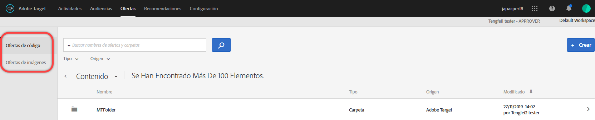
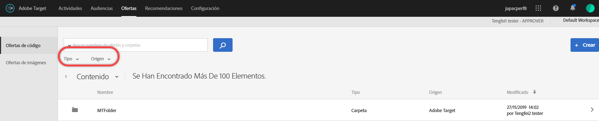
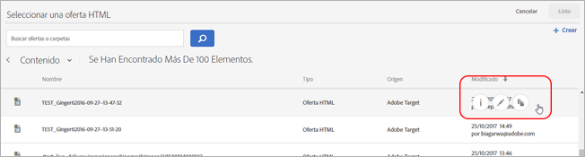
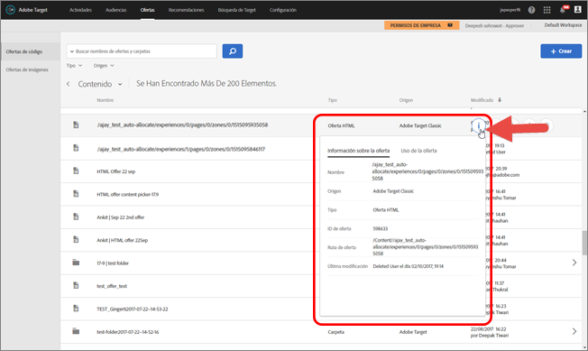
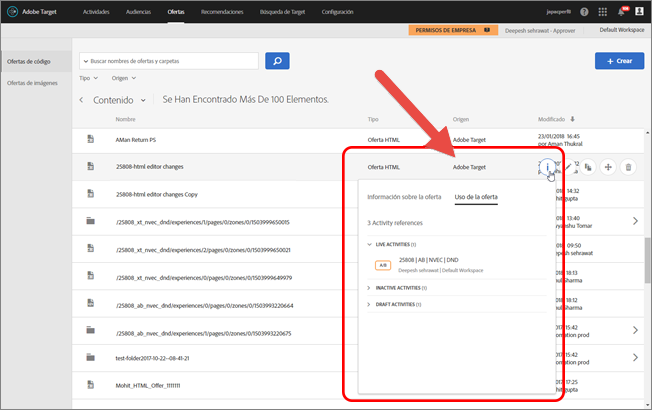
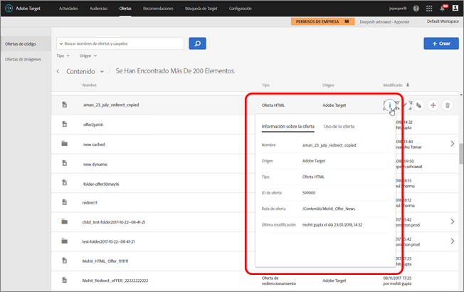
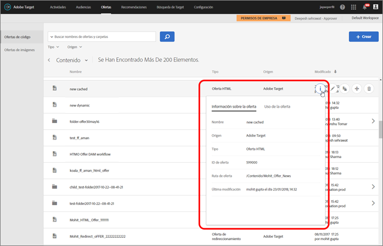

# Ofertas{#offers}

Use la biblioteca de Ofertas para administrar el contenido de ofertas de código y ofertas de imagen.

>[!NOTE]
>
>En la versión de enero de 2017, las ofertas creadas mediante [!DNL Target Classic], [!DNL Adobe Experience Manager] (AEM), [!DNL Adobe Mobile Services] (AMS) y API pueden visualizarse en [!DNL Target Standard/Premium]la interfaz de usuario. Las ofertas actualizadas en los últimos dos años que usen estos métodos serán visibles (es decir, de enero de 2015 en adelante). La sincronización inicial se producirá la primera vez que cualquier usuario de su organización abra la página [!UICONTROL Ofertas]. La cantidad de tiempo de la sincronización inicial dependerá de la cantidad de datos. Tras la sincronización inicial, los datos se sincronizarán de forma incremental. Si tuviera código e imágenes en la misma carpeta antes de esta versión, [!DNL Target] lo separará en dos carpetas duplicadas. Tenga en cuenta que la fecha y la hora de actualización se refieren al momento en el que se migró la carpeta y no refleja la fecha de creación original de la carpeta.

Haga clic en **[!UICONTROL Ofertas]** para abrir la biblioteca. La biblioteca contiene las ofertas que se han configurado mediante [!DNL Target Standard/Premium], [!DNL Target Classic], [!DNL Adobe Experience Manager] (AEM), [!DNL Adobe Mobile Services] (AMS) y API. Las ofertas creadas en [!DNL Target Classic] o en otras soluciones pueden editarse en [!DNL Target Standard/Premium].

La página [!UICONTROL Ofertas] tiene dos fichas a la derecha: Ofertas de código y Ofertas de imágenes, que le permite visualizar las ofertas por tipo.

Puede filtrar ofertas por tipo (oferta HTML, oferta de redireccionamiento, oferta remota o carpeta) y por fuente (Adobe Target, Adobe Target Classic, Adobe Experience Manager, Adobe Mobile Services, or API).

Puede editar o copiar una carpeta u oferta pasando el puntero sobre el elemento deseado y, a continuación, haciendo clic en los iconos Editar o Copiar.

## Visualización de definiciones de oferta   {#section_6B059DD121434E6292CAB393507D010E}

Puede ver los detalles de una definición de oferta en forma de tarjeta emergente en la biblioteca de ofertas, sin necesidad de abrir la oferta.

Por ejemplo, a la siguiente tarjeta de definición de una oferta HTML se accede pasando el puntero sobre una oferta en la lista de contenidos y, a continuación, haciendo clic en el icono de información:

Está disponible la siguiente información:

* Nombre
* Fuente
* Tipo
* ID de oferta
* Ruta de oferta
* Última modificación

En cada tarjeta emergente de definición de la oferta, puede hacer clic en la pestaña [!UICONTROL Uso de la oferta] para ver las actividades que hacen referencia a una oferta de código. Esta funcionalidad no se aplica a ofertas de imagen. De esta forma, puede evitar que otras actividades se vean influidas mientras edita las ofertas. La información incluye actividades en directo y actividades inactivas.

La siguiente es la tarjeta de definición de una oferta de redireccionamiento:

Está disponible la siguiente información:

* Nombre
* Fuente
* Tipo
* ID de oferta
* Ruta de oferta
* Última modificación
* URL de redireccionamiento
* Incluir todos los parámetros de URL (activado o desactivado)
* Pasar ID de sesión mbox (activado o desactivado)

La siguiente es la tarjeta de definición de una oferta remota:

Está disponible la siguiente información:

* Nombre
* Fuente
* Tipo
* ID de oferta
* Ruta de oferta
* Última modificación
* Tipo de URL de redireccionamiento
* URL absoluta o relativa

## Vídeo de formación: El repositorio de contenido 

Este vídeo incluye información sobre la administración de ofertas.

* Conexión entre la [biblioteca de activos de Experience Cloud](https://experienceleague.adobe.com/docs/core-services/interface/assets/creative-cloud.html) y la biblioteca de contenido de Target
* Ofertas HTML personalizadas
* Oferta HTML personalizada en el Compositor de experiencias visuales

>[!VIDEO](https://video.tv.adobe.com/v/17387)