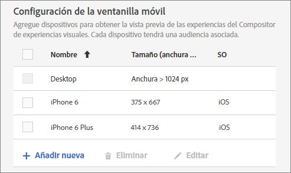
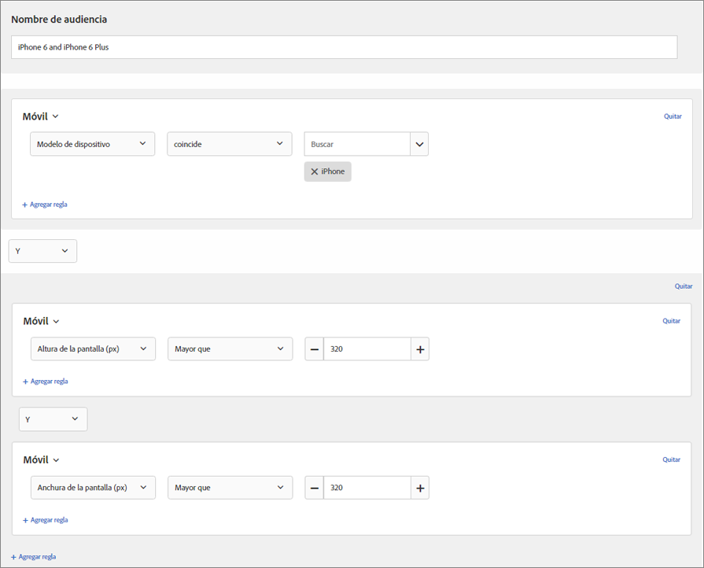

# Ventanillas móviles para experiencias interactivas

Las ventanillas móviles le ayudan a previsualización la forma en que aparecen sus actividades [!DNL Adobe Target] en pantallas de distintos tamaños.

La función de previsualización de ventanilla móvil está diseñada para sitios interactivos que funcionan bien en distintos dispositivos, ventanas o tamaños de pantalla. Los sitios interactivos se ajustan automáticamente y se adaptan a cualquier tamaño de pantalla, incluidos equipos de escritorio, portátiles, tabletas o teléfonos móviles.

>[!NOTE]
>
> * Use ventanillas móviles si su sitio se adapta y si en la página móvil se usan los mismos elementos que en su página de escritorio, con otra configuración. Si tiene un sitio móvil independiente con una estructura separada, como `m.mysite.com`, utilice una [actividad de varias páginas](/help/c-experiences/c-visual-experience-composer/multipage-activity.md#concept_277E096063E14813AC5D8EDFA1D2ED48) en su lugar.
   >
   >
* Las ventanillas móviles no están disponibles si quedan superpuestas por una superposición de oferta de redireccionamiento.

Una ventanilla móvil está definida por el tamaño del rectángulo que se rellena con una página web en la pantalla. Es el tamaño de la ventana del navegador menos las barras de desplazamiento y las de herramientas. Los navegadores usan “píxeles de CSS”. Para muchos dispositivos, como los que tienen pantallas de retina, la ventanilla móvil es menor que la resolución anunciada para el dispositivo.

A continuación tiene las ventanillas móviles y las resoluciones de algunos dispositivos populares. No se olvide de usar el tamaño de la ventanilla móvil en [!DNL Target]. Diversos sitios web enumeran los tamaños de las ventanillas para dispositivos populares. Por ejemplo, consulte [https://viewportsizer.com/devices/](https://viewportsizer.com/devices/) o el sitio Web del fabricante del dispositivo.

| Dispositivo | Tamaño de la ventanilla móvil | Resolución del dispositivo |
|---|---|---|
| iPhone SE | 375 ancho x 667 alto | 750 ancho x 1.334 alto |
| iPhone 11 Pro Max | 414 ancho x 896 alto | 1242 ancho x 2688 alto |
| iPhone 11 Xs máx. | 414 ancho x 896 alto | 1242 ancho x 2688 alto |
| iPhone 11 | 414 ancho x 896 alto | 828 ancho x 1792 alto |
| iPhone 11 Xr | 414 ancho x 896 alto | 828 ancho x 1792 alto |
| iPhone 11 Pro | 375 ancho x 812 alto | 1125 ancho x 2436 alto |
| iPhone 11 X | 375 ancho x 812 alto | 1125 ancho x 2436 alto |
| iPhone 11 Xs | 375 ancho x 812 alto | 1125 ancho x 2436 alto |
| iPhone X | 375 ancho x 812 alto | 1125 ancho x 2436 alto |
| iPhone 8 Plus | 414 ancho x 736 alto | 1080 ancho x 1920 alto |
| iPhone 8 | 375 ancho x 667 alto | 750 ancho x 1.334 alto |
| iPhone 7 Plus | 414 ancho x 736 alto | 1080 ancho x 1920 alto |
| iPhone 7 | 375 ancho x 667 alto | 750 ancho x 1.334 alto |
| iPhone 6s Más | 414 ancho x 736 alto | 1080 ancho x 1920 alto |
| iPhone 6s | 375 ancho x 667 alto | 750 ancho x 1.334 alto |
| iPhone 6 Plus | 414 ancho x 736 alto | 1080 ancho x 1920 alto |
| iPhone 6 | 375 ancho x 667 alto | 750 ancho x 1.334 alto |
| iPad Pro | 1024 ancho x 1366 alto | 2048 ancho x 2732 alto |
| iPad de tercera y cuarta generación | 768 ancho x 1024 alto | 1.536 ancho x 2.048 alto |
| iPad Air 1 y 2 | 768 ancho x 1024 alto | 1.536 ancho x 2.048 alto |
| iPad Mini | 768 ancho x 1024 alto | 768 ancho x 1024 alto |
| iPad Mini 2 y 3 | 768 ancho x 1024 alto | 1.536 ancho x 2.048 alto |
| Nexus 6P | 411 ancho x 731 alto | 1440 ancho x 2560 alto |
| Nexus 5X | 411 ancho x 731 alto | 1080 ancho x 1920 alto |
| Google Pixel | 411 ancho x 731 alto | 1080 ancho x 1920 alto |
| Google Pixel XL | 411 ancho x 731 alto | 1440 ancho x 2560 alto |
| Google Pixel 2 | 411 ancho x 731 alto | 1080 ancho x 1920 alto |
| Google Pixel 2 XL | 411 ancho x 823 alto | 1440 ancho x 2880 alto |
| Samsung Galaxy Note 5 | 480 ancho x 853 alto | 1440 ancho x 2560 alto |
| LG G5 | 480 ancho x 853 alto | 1440 ancho x 2560 alto |
| One Plus 3 | 480 ancho x 853 alto | 1080 ancho x 1920 alto |
| Samsung Galaxy S9 | 360 ancho x 740 alto | 1440 ancho x 2960 alto |
| Samsung Galaxy S9+ | 360 ancho x 740 alto | 1440 ancho x 2960 alto |
| Samsung Galaxy S8 | 360 ancho x 740 alto | 1440 ancho x 2960 alto |
| Samsung Galaxy S8+ | 360 ancho x 740 alto | 1440 ancho x 2960 alto |
| Samsung Galaxy S7 | 360 ancho x 640 alto | 1440 ancho x 2560 alto |
| Samsung Galaxy S7 Edge | 360 ancho x 640 alto | 1440 ancho x 2560 alto |
| Nexus 7 (2013) | 600 ancho x 960 alto | 1200 ancho x 1920 alto |
| Nexus 9 | 768 ancho x 1024 alto | 1.536 ancho x 2.048 alto |
| Samsung Galaxy Tab 10 | 800 ancho x 1280 alto | 800 ancho x 1280 alto |
| Chromebook Pixel | 1280 ancho x 850 alto | 2560 ancho x 1700 alto |

Si quiere ofrecer una actividad en un dispositivo concreto, elija la audiencia adecuada para ese dispositivo en el diagrama de la actividad. Use el Compositor web móvil para editar la página en la actividad de dicho dispositivo. Si quiere llevar a cabo una actividad en toda la experiencia digital y asegurarse de que el aspecto sea satisfactorio en todos los dispositivos, no aplique segmentación y use ventanillas móviles para previsualizar la actividad en cada tamaño de pantalla.

Si tiene un sitio adaptable, se suele diseñar para que se abra en una vista diferente cuando accede un dispositivo con un tamaño de pantalla concreto. Los tamaños de pantalla que activan las vistas nuevas se conocen como puntos de interrupción CSS. Los puntos de interrupción CSS son puntos en los que el contenido del sitio web responde en función del ancho del dispositivo para mostrar el diseño óptimo a los visitantes. Los puntos de interrupción CSS también se denominan [consultas de medios](https://developer.mozilla.org/en-US/docs/Web/CSS/Media_Queries/Using_media_queries).

Guarde los puntos de interrupción de CSS en [!DNL Target] para que pueda realizar la previsualización de sus experiencias con cada vista que defina. Cada una de estas experiencias se muestra en una ventanilla móvil en la interfaz [!DNL Target]. En la parte superior de la pantalla, haga clic en la ventanilla móvil correspondiente para abrir la vista de cada tamaño de pantalla.

Aunque su sitio no sea adaptable, puede usar el Compositor web móvil para ver un sitio si la actividad está dirigida a un dispositivo concreto.

>[!IMPORTANT]
>
>Aunque puede editar una experiencia desde ventanillas móviles, estos cambios se aplican a todas las ventanillas móviles y dispositivos, no solo a la ventanilla móvil en la que está trabajando. De modo similar, si edita una experiencia en la vista de escritorio normal, se cambia la página en todos los tamaños de pantalla, no solo en la vista de escritorio. En estos momentos, no se admiten los cambios en páginas específicas de cada ventanilla móvil.

## Configuración de ventanilla móvil {#task_B4B161499DC0470584ED922A4D20FCAB}

Configure todas las ventanillas móviles que quiera que estén disponibles cuando cree sus experiencias.

1. Haga clic en **[!UICONTROL Administración]** > **[!UICONTROL Compositor de experiencias visuales]**.
1. Para agregar una nueva ventanilla móvil, en la sección **[!UICONTROL Configuración de ventanillas móviles]**, haga clic en **[!UICONTROL Añadir]**.

   

   Para cambiar la configuración de una ventanilla móvil existente, seleccione esa ventanilla y haga clic en el icono [!UICONTROL Editar] (lápiz).

1. Escriba un nombre para la ventanilla móvil.

   Póngale un nombre descriptivo para que sea fácil reconocerla. El nombre puede tener hasta 36 caracteres.

1. Introduzca el tamaño de pantalla del dispositivo móvil, tanto la anchura como la altura.

   La anchura puede estar entre 150 y 968 píxeles. La altura puede estar entre 150 y 1.280 píxeles.

1. (Opcional) Seleccione el sistema operativo del dispositivo.

   Opciones:

   * Android
   * iOS
   * Windows
   * Symbian
   * BlackBerry

   Si usa el [Compositor de experiencias mejorado](/help/c-experiences/experiences.md#section_34265986611B4AB8A0E4D6ACC25EF91D) y elige un sistema operativo,  imita ese dispositivo cuando visualiza la página. [!DNL Target] Si, por ejemplo, hay un aspecto diferente para Android que para iOS en el sitio interactivo, [!DNL Target] imita ese comportamiento.

1. Haga clic en **[!UICONTROL Guardar]**.

>[!NOTE]
>
>Si intenta eliminar una ventanilla móvil que está en uso, se muestra el siguiente mensaje: &quot;Esta ventanilla está asociada actualmente a una o varias actividades. Debe quitar la ventanilla de esas actividades antes de poder eliminarla&quot;.

## Crear una experiencia adaptable {#task_D6332438B5EE48CCA8AF199270F1CAEF}

Añada ventanillas móviles a sus actividades [!DNL Target] para crear experiencias adaptables para pantallas móviles.

1. Cree la [actividad deseada](/help/c-activities/activities.md).
1. En el Compositor de experiencias visuales, haga clic en el icono de engranaje de **[!UICONTROL Configuración]** y, a continuación, seleccione **[!UICONTROL Agregar ventanillas móviles]**.

   

1. Haga clic en el icono de **[!UICONTROL Dispositivos]** y, a continuación, active todos los dispositivos que deban tener una ventanilla móvil.

   

   Las ventanillas móviles se muestran de la más grande a la más pequeña en anchura.

1. Edite las ventanillas móviles según quiera.

   Todos los cambios que realice en la experiencia (por ejemplo, si cambia el texto de un título) se aplicarán a la experiencia en todos los dispositivos.

   Pase el cursor por encima del nombre de una ventanilla móvil para ver su tamaño.

   

1. Si lo desea, puede alternar entre los modos vertical y horizontal haciendo clic en el icono de orientación deseado.

   

## Caso de uso: Destinatario dos versiones de iPhone {#task_CC3144BF5BA54034996E1D3DB0BC1A35}

Este caso de uso muestra cómo configurar experiencias para dos versiones de iPhone: iPhone 6 y iPhone 6 Plus.

1. Haga clic en **[!UICONTROL Administración]** > **[!UICONTROL Compositor de experiencias visuales]**.
1. En la sección **[!UICONTROL Configuración de ventanilla móvil]**, cree ventanillas móviles para iPhone 6 y iPhone 6 plus.

   Aplique los ajustes siguientes para cada ventanilla:

   | Nombre | Anchura | Altura | Sistema operativo |
   |---|---|---|---|
   | iPhone 6 | 375 | 667 | iOS |
   | iPhone 6 Plus | 414 | 736 | iOS |

   

1. Cree una actividad con la experiencia que desee destinatario.
1. Seleccione la experiencia que quiere dirigir a los visitantes que accedan al sitio desde un iPhone 6 o un iPhone 6 Plus.
1. Al seleccionar el objetivo, haga clic en **[!UICONTROL Crear audiencia]** y configure una audiencia tal como se muestra en la imagen siguiente:

   

   Como el teléfono podría girarse para colocarse en horizontal, el requisito de definir una altura y anchura simultáneas de más de 320 crea una condición que solo los dispositivos 6 y 6 Plus pueden satisfacer al combinarse con el modelo de dispositivo iPhone.
1. Haga clic en **[!UICONTROL Guardar]**.
1. Continúe configurando la actividad con normalidad.

## Vídeos de formación

Los siguientes vídeos contienen más información sobre los conceptos mencionados en este artículo.

### Compositor de experiencias visuales (2 de 2) (7:29)  

El siguiente vídeo de demostración incluye información sobre cómo usar el Compositor de experiencias visuales para trabajar con ventanillas móviles:

* Cambiar el nombre de una experiencia y duplicarla
* Crear una experiencia de redirección
* Segmentar una actividad en una sola dirección URL o un grupo de direcciones URL
* Crear una actividad de varias páginas
* Obtener una vista previa y generar experiencia para sitios web adaptables
* Usar superposiciones para destacar tipos de elementos

>[!VIDEO](https://video.tv.adobe.com/v/17401)

### Preferencias de cuenta en Adobe Target 

Este vídeo incluye información sobre la configuración de ventanillas móviles a partir de las 4:40 del vídeo.

>[!VIDEO](https://video.tv.adobe.com/v/17379)