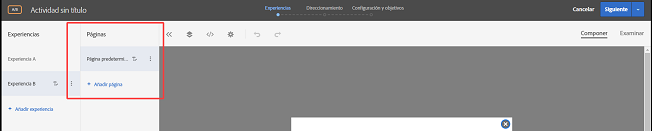
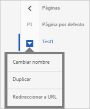

# Actividad de varias páginas

Una actividad de varias páginas en [!DNL Adobe Target] permite crear un artículo en varias páginas, con un diseño específico para cada página.

Por ejemplo, podría querer probar una oferta para envío gratuito con compras superiores a cierto monto. Podría querer que esa oferta apareciera en su página de aterrizaje, una página de categoría y ciertas páginas de producto, pero desea que tenga un tamaño diferente y esté en una ubicación diferente en cada tipo de página. Podría mostrar una oferta destacada en su página de inicio y luego reforzar esa oferta con ofertas más pequeñas en otras páginas relevantes.

También puede usar una actividad de varias páginas para definir diferentes diseños para sus sitios de escritorio y los móviles que no responden. Si el sitio tiene un sitio móvil independiente como [!DNL m.mysite.com], en lugar de [!DNL `www.mysite.com`], debe crear una [actividad de varias páginas](/help/c-experiences/c-visual-experience-composer/multipage-activity.md#concept_277E096063E14813AC5D8EDFA1D2ED48), agregar [!DNL m.mysite.com] como páginas separadas y, luego, aplicar la edición móvil para realizar los cambios correspondientes en la versión de escritorio y la versión móvil en la misma experiencia. Para sitios móviles adaptables, utilice el [editor de experiencias móviles](/help/c-experiences/c-visual-experience-composer/mobile-viewports.md#concept_8E45527C4ABC41D59AA3553BEDC76FA5).

>[!NOTE]
>
>Las actividades de varias páginas están diseñadas para actividades en las que la misma oferta tiene una apariencia diferente en varias páginas. Si la oferta aparece igual en todas las páginas, una [prueba de plantilla](/help/c-experiences/c-visual-experience-composer/temtest.md#task_2539D51A18044F82B0D9895636546781) es más eficaz.

Puede especificar reglas de plantilla para cada página en la prueba de varias páginas. Por ejemplo, puede ejecutar una prueba de varias páginas en toda la página de inicio y en todas las páginas de categoría al aplicar reglas de plantilla a la página de categoría en la prueba de varias páginas. Consulte [Incluir la misma experiencia en páginas similares](/help/c-experiences/c-visual-experience-composer/temtest.md#task_2539D51A18044F82B0D9895636546781).

Para agregar páginas a una prueba:

1. Haga clic en el icono de engranaje **[!UICONTROL Configurar]**.
1. Haga clic en **[!UICONTROL Agregar páginas adicionales]**.

   Aparece una barra de navegación en el lado izquierdo de la pantalla.

   

1. Use esa barra de navegación para especificar las páginas y establecer la página predeterminada.

   Haga clic en **[!UICONTROL Agregar página]** para agregar una página adicional.

   Haga clic en el icono de tres elipses verticales para mostrar un menú de acción:

   

   Utilice este menú para cambiar el nombre de las páginas, realizar una prueba de redirección desde la actividad de varias páginas o eliminar la página.

1. Use el Compositor de experiencias visuales para diseñar la manera en que se muestra la oferta en cada página.

