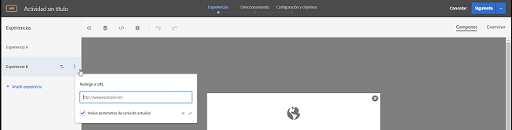

# Redirigir a una dirección URL{#redirect-to-a-url}

Use esta opción cuando desee enviar al visitante a una página diferente en lugar de mostrar el contenido en la misma página.

Es posible que tenga dos páginas completamente distintas para probarlas, en lugar de simplemente cambiar partes de contenido dentro de una página. En ese caso, la prueba A/B compara la página A con la B. Configure una campaña de prueba A/B con dos experiencias: una que apunte a la página A predeterminada y otra que redireccione a la página B. En el menú Acción de experiencia, que aparece al hacer clic en la etiqueta de carta para la experiencia, elija **[!UICONTROL Redireccionar a dirección URL]** y especifique la dirección URL de la página B. La oferta se configura para redireccionar al visitante hacia una página diferente.

La oferta de redireccionamiento ejecuta código JavaScript para redirigir el navegador. Utiliza el `window.location.replace();`método de modo que la página desde la cual se redirige al visitante no se almacene en el historial del explorador. Esto permite que el visitante siga usando el botón de retorno del navegador.

Las ofertas de redireccionamiento tienen ciertas limitaciones:

* Para redireccionar ofertas en actividades que utilizan A4T, su implementación debe satisfacer ciertos requisitos mínimos. Además, hay información importante que debe conocer. Para obtener más información, consulte las [preguntas más frecuentes de A4T sobre las ofertas de redireccionamiento](../../c-integrating-target-with-mac/a4t/r-a4t-faq/a4t-faq-redirect-offers.md#concept_21BF213F10E1414A9DCD4A98AF207905).
* Cuando use el Compositor de experiencias basado en formularios, las ofertas de redireccionamiento no se deberían usar en mboxes que formen parte de la página. Una alternativa de redireccionamiento solo se debería usar desde una etiqueta de script que forme parte de la etiqueta del HTML `<head>`. Debería usar siempre la creación automática y establecer la oferta de redireccionamiento para el mbox global.

>[!NOTE]
>
>Si se desea pasar el valor de referente de la página de aterrizaje, se recomienda usar una oferta HTML en lugar de una oferta de redireccionamiento.

Para crear una oferta de redireccionamiento:

1. Cree una experiencia.
1. Pase el ratón sobre una experiencia y haga clic en el icono Redireccionar a dirección URL ().

   

1. Escriba la dirección URL.
1. Si lo desea, seleccione la opción para incluir los parámetros de consulta actuales.

   Si se selecciona esta opción, cualquier carácter después de ? en la dirección URL del visitante se adjuntará a la dirección URL de redirección cuando se redireccione.

   Esta opción está seleccionada de manera predeterminada.
1. (Opcional) Crear reglas adicionales.

   Las reglas adicionales pueden basarse en cualquiera de los siguientes aspectos:

   * Dirección URL
   * Dominio
   * Ruta
   * Fragmento hash (#)
   * Consulta
   * Parámetro de mbox
   Se pueden unir reglas adicionales a la dirección URL de la actividad con Y u O. Todas las reglas que agregue se evalúan entre sí con Y.
