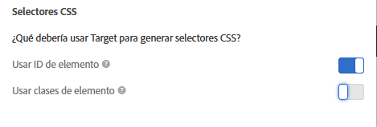

# Selectores de elementos utilizados en el Compositor de experiencias visuales

Un selector de elementos es una expresión CSS que puede identificar un elemento o más.

Puede encontrar información básica sobre selectores CSS en el documento [Selectores](https://developer.mozilla.org/en-US/docs/Web/Guide/CSS/Getting_started/Selectors) en Mozilla Developer Network (MDN).

Puede determinar si desea usar ID de elementos o clases de elementos en las preferencias de la cuenta. Haga clic en **[!UICONTROL Administración > Compositor de experiencias visuales]** y, a continuación, elija los selectores CSS preferidos.



>[!NOTE]
>
>Las clases de elementos están disponibles como selectores en las actividades de Prueba A/B, Personalización automatizada y Prueba multivariable.

Para obtener información sobre cuándo utilizar selectores CSS y cuándo utilizar Ids. únicos, consulte [Prácticas recomendadas y limitaciones del Compositor de experiencias visuales](/help/c-experiences/c-visual-experience-composer/experience-composer-best-practices.md#concept_E284B3F704C04406B174D9050A2528A6).

## Cómo Adobe Target genera un selector para un elemento {#section_D89D954BCBFB486CA081BE183776A475}

Target usa un algoritmo simple para crear un selector. A continuación, encontrará una breve explicación de la lógica de generación:

1. Si un elemento tiene un Id., por ejemplo `id="container"`, el selector para el elemento es `#container`.

   Por ejemplo:

   ```html
   <div class="wrapper">
     <div id="container"> <!-- Selector is computed for this element -->
       <ul class="navigation">
         <li class="item active"> Home </li>
         <li class="item"> Men </li>
         <li class="item"> Women </li>
         <li class="item"> Kids </li>
       </ul>
     </div>
   </div>
   ```

1. Si un elemento contiene un atributo de clase, Target intenta aprovechar la primera clase de las clases presentes en el elemento.

   Target intenta analizar el elemento principal hasta encontrar el elemento `<HTML>` o un elemento con un Id. Siempre que un elemento contenga un id. y el selector se calcule en su elemento secundario, el id. de este elemento contribuirá al selector.

   Por ejemplo:

   ```html
   <div class="wrapper">
     <div id="container"> <!-- id is present here. It contributes to selector -->
       <ul class="navigation">
         <li class="item active"> Home </li> <!-- Selector is computed for this element -->
         <li class="item"> Men </li>
         <li class="item"> Women </li>
         <li class="item"> Kids </li>
       </ul>
     </div>
   </div>
   ```

   En este ejemplo:

   Selector: `#container` > `ul.navigation:eq(0)` > `li.item:eq(0)` (“ > ” indica el elemento secundario inmediato).

   `eq` indica al índice que existe un elemento que tiene &quot;tagName=UL&quot; y la primera clase es `navigation`. Por lo tanto, `index` es 0. Consulte el artículo [Selectores](https://developer.mozilla.org/en-US/docs/Web/Guide/CSS/Getting_started/Selectors) de MDN para obtener más información.

1. Si un elemento no contiene una clase, Target usa `tagName` para el elemento y atraviesa el elemento principal hasta encontrar el elemento `<HTML>` o un elemento con una ID.

   Por ejemplo:

   ```html
   <div class="wrapper">
     <div id="container"> <!-- id is present here. It contributes to selector -->
       <ul class="navigation">
         <li> Home </li>
         <li> Men </li>
         <li class="active"> Women </li>
         <li> Kids </li><!-- Selector is computed for this element -->
       </ul>
     </div>
   </div>
   ```

   Selector: `#container` > `ul.navigation(0)` > `li:nth-of-type(4)`

   Puede obtener más información sobre [nth-of-type en la página web de trucos de CSS](https://css-tricks.com/almanac/selectors/n/nth-of-type/).

En el proceso anterior:

* Puede usar cualquier selector CSS siempre y cuando identifique de manera unívoca a un elemento en DOM.
* El enfoque de arriba es el que Target usa. Target no lo obliga a usar este enfoque. Puede agregar cualquier selector siempre que el punto 1 sea verdadero.
* Puede usar cualquier atributo en el selector. Este documento solo usa el nombre de la clase como ejemplo.

