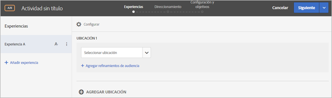
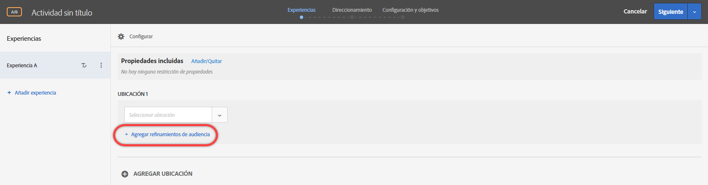
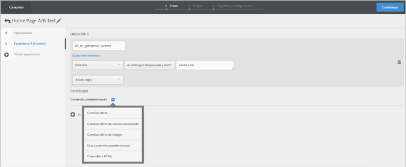
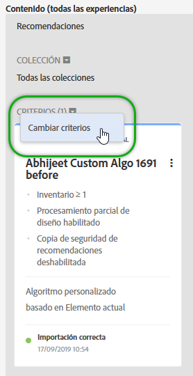
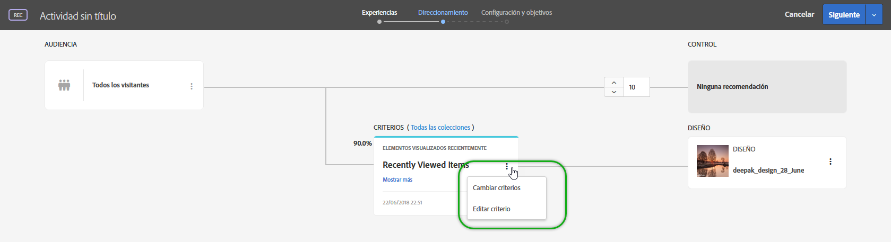

# Compositor de experiencias basadas en formularios{#form-based-experience-composer}

El [!DNL Adobe Target] [!UICONTROL Compositor de experiencias basadas en formularios] es una interfaz de creación de ofertas y experiencias no visuales que resulta útil para crear experiencias que se pueden usar en actividades A/B Tests, Segmentación de experiencias, Automated Personalization y Recommendations cuando el Compositor de experiencias visuales no está disponible o resulta práctico para su uso. Por ejemplo, puede utilizar el Compositor basado en formularios para crear experiencias y ofertas para su envío en correos electrónicos, kioscos y asistentes de voz.

Si va a crear una actividad de Recommendations, no hay experiencias. Elija sus criterios y su diseño. Si elige varios criterios o diseños, Target genera las experiencias automáticamente.

1. Haga clic en **[!UICONTROL Crear actividad]** y luego seleccione el tipo de actividad que desee crear.

   El Compositor de experiencias basadas en formularios está disponible para pruebas A/B y para actividades de segmentación de experiencias, personalización automatizada y de Recommendations.
1. Seleccione **[!UICONTROL Compositor de experiencias basadas en formularios]** del cuadro de diálogo [!UICONTROL Nueva actividad].

   Se abre el Compositor de experiencias basadas en formularios.

   

   Esta pantalla es diferente si va a crear una actividad de Recommendations. Las actividades de Recommendations no incluyen experiencias.
1. Asigne un nombre a la actividad.
1. Seleccione una ubicación.

   Al hacer clic en el cuadro [!UICONTROL Seleccionar ubicación], aparece una lista de ubicaciones disponibles. Seleccione una de esas ubicaciones. Para elegir la ubicación global entregada mediante target.js, elija “target-global-mbox”.

   También puede especificar una ubicación que no aparece en esta lista. Esto puede ser útil si el mbox todavía no se ha creado ni visto en una página. Escriba el nombre de la ubicación. Tenga cuidado al especificar una ubicación que no existe aún. Si la ortografía o las mayúsculas no coinciden con las que se usaron cuando se creó el mbox, la actividad no se publicará. Las ubicaciones introducidas manualmente se guardan en la lista de ubicaciones disponibles. La próxima vez que intente seleccionar una ubicación introducida manualmente, estará disponible en la lista desplegable [!UICONTROL Seleccionar ubicación] para esa actividad.

   >[!NOTE]
   >
   >La creación de una ubicación introducida manualmente durante la creación de la actividad no crea automáticamente una nueva ubicación. El nombre de la ubicación solo se guarda en el contexto de la actividad. La ubicación se crea cuando hay una llamada de envío de contenido. Una vez creada la ubicación, estará disponible para su uso en otras actividades, para crear audiencias, etc. en la lista desplegable de ubicaciones disponibles.

1. Haga clic en **[!UICONTROL Agregar refinamientos de audiencia]** y, a continuación, elija una o varias [audiencias](/help/c-target/target.md#concept_A782F8481A5041EBA75103CB26376522) para esta actividad.

   

   En el Compositor de experiencias basadas en formularios, los refinamientos se han sustituido por funciones de audiencia completas. Los refinamientos para las actividades existentes se han migrado a  [audiencias solo de actividad](/help/c-target/creating-activity-only-audience.md#concept_A6BADCF530ED4AE1852E677FEBE68483).
1. Seleccione el tipo de contenido que desea que aparezca en esa ubicación.

   

1. Para el tipo de contenido seleccionado, especifique el contenido.

   **Cambiar oferta HTML:** Elija una oferta HTML.

   **Cambiar oferta de imagen:** elija una imagen guardada en la biblioteca de contenido en Target.

   También puede agregar un vínculo a una imagen (pulsación, destino, aterrizaje, etc.).

   1. Haga clic en [!UICONTROL Cambiar oferta de imagen].
   1. Seleccione la imagen que quiera y luego haga clic en [!UICONTROL Editar vínculos].
   1. Indique la dirección URL o la página de su sitio y haga clic en [!UICONTROL Actualizar].

   **Cambiar oferta JSON:** Elija una oferta json.

   **Cambiar fragmento de experiencia:** elija un fragmento de experiencias.

   **Cambiar oferta de redireccionamiento:** elija una oferta de redireccionamiento.

   **Cambiar oferta remota:** elija una oferta remota.

   **Crear oferta HTML:**

   1. Haga clic en [!UICONTROL Ofertas] y seleccione la pestaña [!UICONTROL Ofertas de código].
   1. Haga clic en [!UICONTROL Crear] > [!UICONTROL Oferta HTML].
   1. Escriba el nombre de una oferta.
   1. Escriba o pegue su código HTML en el recuadro Código.
   1. Haga clic en [!UICONTROL Guardar].

   **Crear ofertas JSON:**

   1. Haga clic en [!UICONTROL Ofertas] y seleccione la pestaña [!UICONTROL Ofertas de código].
   1. Haga clic en [!UICONTROL Crear] > [!UICONTROL Oferta JSON].
   1. Escriba el nombre de una oferta.
   1. Escriba o pegue su código JSON en el recuadro Código.
   1. Haga clic en [!UICONTROL Guardar].

   Para una actividad de Recommendations, la lista desplegable Contenido ofrece la opción Agregar recomendación. Haga clic en **[!UICONTROL Agregar recomendación]** y seleccione el tipo de página. Después siga los pasos habituales que se definen en la interfaz para [crear una actividad de Recomendaciones](/help/c-recommendations/t-create-recs-activity/create-recs-activity.md).

   Cuando se seleccionan los criterios de Recommendations en el Compositor de experiencias basadas en formularios, ahora existe un vínculo directo a la tarjeta de criterios seleccionada de modo que pueda editarlos de forma rápida y sencilla.

   

   En la página Segmentación del flujo de trabajo guiado de tres pasos de Target:

   

1. (Opcional, para actividades A/B, Automated Personalization y Segmentación de experiencias) Para repetir este proceso en ubicaciones adicionales, haga clic en **[!UICONTROL Añadir ubicación]** y configure la ubicación y el contenido.
1. Haga clic en **[!UICONTROL Siguiente]** y complete los pasos de creación de actividades como de costumbre para el tipo de actividad.

* [Crear una prueba A/B](/help/c-activities/t-test-ab/t-test-create-ab/test-create-ab.md)
* [Crear una actividad de segmentación de experiencias](/help/c-activities/t-experience-target/t-xt-create/xt-create.md#task_D6B3429AC31549E1A70EDF04B3DDC765)
* [Crear una actividad de Recommendations](/help/c-recommendations/t-create-recs-activity/create-recs-activity.md#task_6874328773C64C44A73F0A130AD3F96F)

## Vídeo de formación: Compositor basado en formularios  

Este vídeo proporciona una demostración del compositor basado en formularios.

* Crear una actividad con el Compositor de experiencias basadas en formularios
* Entender cuándo usar el Compositor de experiencias basadas en formularios o el Compositor de experiencias visuales
* Usar refinamientos para segmentar una ubicación

>[!VIDEO](https://video.tv.adobe.com/v/17390)