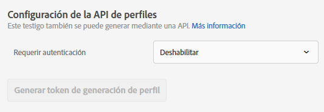
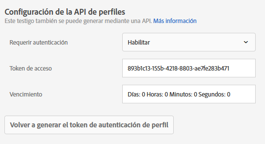

# Configuración de la API de perfil

Habilite o deshabilite la autenticación para actualizaciones en lote mediante API [!DNL Adobe Target] y genere un token de autenticación de perfil.

[!DNL Adobe Target] crea y mantiene un perfil para cada usuario individual. Este perfil se almacena en el clúster perimetral [!DNL Target] y se actualiza en tiempo real después de cada visita; sin embargo, puede actualizar un perfil de forma individual o en lote mediante API.

Como seguridad adicional, puede requerir que la llamada a la API de actualización por lotes solicite que se pase un token de acceso válido en el encabezado de la solicitud.

**Para requerir autenticación y generar un token de acceso mediante la interfaz de usuario de Target:**

1. Haga clic en **[!UICONTROL Administración]** > **[!UICONTROL Implementación]**.
1. En **[!UICONTROL API de perfil]**, deslice la opción **[!UICONTROL Requerir autenticación]** a la posición habilitada o deshabilitada.

   

1. (Condicional) Si habilitó los requisitos de autenticación, haga clic en **[!UICONTROL Generar nuevo token de autenticación de perfil]**.

   

   El token caduca de acuerdo con los tiempos indicados en el cuadro [!UICONTROL Caduca en].

   Debe tener uno de los siguientes permisos de usuario para generar un token de autenticación:

   * Al menos [!UICONTROL permiso del Editor] (o [!UICONTROL Aprobador])

      Para obtener más información para los clientes de [!DNL Target Standard], consulte [Especificar funciones y permisos](/help/administrating-target/c-user-management/c-user-management/user-management.md#roles-permissions) en *Usuarios*. Para obtener más información para los clientes [!DNL Target Premium], consulte [Configuración de permisos de Enterprise](/help/administrating-target/c-user-management/property-channel/properties-overview.md).

   * Función de administrador en el nivel de espacio de trabajo/perfil de producto

      Los espacios de trabajo solo están disponibles para los clientes [!DNL Target Premium] . Para obtener más información, consulte [Configuración de permisos de Enterprise](/help/administrating-target/c-user-management/property-channel/properties-overview.md).

   * Derechos de administrador (permiso Sysadmin) en el nivel de producto [!DNL Adobe Target]
   >[!NOTE]
   >
   >También puede generar un token de autentificación de perfil mediante API. Para obtener más información, consulte [Perfiles](https://developers.adobetarget.com/api/#profiles) en el [sitio web de desarrolladores de Adobe Target](https://developers.adobetarget.com/).

1. Copie el token e inclúyalo en el encabezado de la solicitud con el formato: “Autorización” : “Portador ”

Haga clic en [!UICONTROL Generar nuevo token de autenticación de perfil] para volver a generar el token según sea necesario.

>[!IMPORTANT]
>
>Restablecer este token provoca que las llamadas a API realizadas con el token actual resulten fallidas. Deberá actualizar cualquier script o aplicación que utilice este token.
