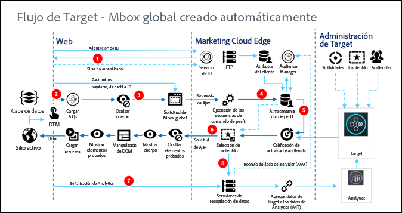

# Cómo funciona at.js{#how-at-js-works}

Para implementar [!DNL Adobe Target] del lado del cliente, debe utilizar la biblioteca at.js.

En una implementación del lado del cliente de [!DNL Adobe Target], [!DNL Target] envía las experiencias asociadas con una actividad directamente al explorador del cliente. El explorador decide qué experiencia mostrar y lo hace. Con una implementación del lado del cliente, puede utilizar un editor WYSIWYG, el [Compositor de experiencias visuales](/help/c-experiences/c-visual-experience-composer/visual-experience-composer.md) (VEC) o una interfaz no visual, el [Compositor de experiencias basadas en formularios](/help/c-experiences/form-experience-composer.md), para crear experiencias de prueba y personalización.

## ¿Qué es at.js?

La [biblioteca at.js](/help/c-implementing-target/c-implementing-target-for-client-side-web/t-mbox-download/c-target-atjs-implementation/target-atjs-implementation.md#concept_8AC8D169E02944B1A547A0CAD97EAC17) es la nueva biblioteca de implementación para Target. La biblioteca at.js mejora los tiempos de carga de página en implementaciones web y proporciona mejores opciones de implementación en aplicaciones de una sola página. at.js es la biblioteca de implementación recomendada y se actualiza con frecuencia con nuevas capacidades. Recomendamos que todos los clientes implementen o migren a  [la versión más reciente de at.js](/help/c-implementing-target/c-implementing-target-for-client-side-web/target-atjs-versions.md#reference_DBB5EDB79EC44E558F9E08D4774A0F7A).

Para obtener más información, consulte [Bibliotecas de JavaScript de Target](/help/c-intro/how-target-works.md#libraries).

En la implementación de [!DNL Target] que puede ver a continuación, se han implementado las siguientes soluciones de [!DNL Adobe Experience Cloud]: Analytics, Target y Gestión de público Además, se han implementado los siguientes servicios principales de Experience Cloud: Adobe Launch, Audiencias y el servicio de ID de visitante

## ¿Cuál es la diferencia entre At.js 1¿Diagramas de flujo de trabajo de *x* y at.js 2.x?

Para obtener más información sobre las diferencias introducidas en 2.O de 1, consulte [Actualización de at.js 1.x a at.js 2.x](/help/c-implementing-target/c-implementing-target-for-client-side-web/upgrading-from-atjs-1x-to-atjs-20.md).*x*.

En términos generales, existen un par de diferencias entre las dos versiones:

* at.js 2 no tiene un concepto de solicitud de mbox global sino una solicitud de carga de página. La solicitud de carga de página se puede ver como una solicitud para recuperar contenido que debería aplicarse en la carga inicial de página del sitio web.
* at.js 2.x administra los conceptos de vistas que se utilizan para las aplicaciones de una sola página (SPA). at.js 1.*x* no tiene en cuenta este concepto.

## Diagramas de at.js 2.x

Los siguientes diagramas le ayudan a comprender el flujo de trabajo de at.js 2.x con Vistas y cómo esto mejora la integración de SPA. Para obtener una mejor introducción a los conceptos utilizados en at.js 2.x, consulte [Implementación de aplicación de una sola página](/help/c-implementing-target/c-implementing-target-for-client-side-web/how-to-deployatjs/target-atjs-single-page-application.md).

| Paso | Detalles |
| --- | --- |
| 1 | La llamada devuelve el [!DNL Experience Cloud ID] si el usuario se autentica, y otra llamada sincroniza el ID del cliente. |
| 2 | La biblioteca de at.js carga de forma sincronizada y oculta el cuerpo del documento. at. js también se puede cargar asincrónicamente con un fragmento de ocultamiento predeterminado implementado en la página. |
| 3 | Se solicita una carga de página que incluye todos los parámetros configurados (MCID, SDID y el ID del cliente). |
| 4 | Se ejecutan los scripts de perfiles y se incluyen en el Almacenamiento de perfiles. El Almacenamiento solicita audiencias de la Biblioteca de audiencias que cumplan los requisitos (por ejemplo, audiencias compartidas de Adobe Analytics, Gestión de público, etc.). Se envían los atributos del cliente al Almacenamiento de perfiles en un procesamiento de lotes. |
| 5 | Según los parámetros de la solicitud de la URL y los datos de perfil, [!DNL Target] decide qué actividades y experiencias vuelven al visitante para la página actual y las vistas futuras. |
| 6 | El contenido dirigido se devuelve a la página, incluyendo, de manera opcional, los valores de perfil para una personalización adicional. El contenido dirigido se muestra en la página actual lo más rápido posible y sin parpadeo del contenido predeterminado. Contenido dirigido para vistas que se muestran como resultado de acciones del usuario en una SPA almacenada en caché en el explorador, de modo que se pueda aplicar instantáneamente sin una llamada al servidor adicional cuando se activan las vistas `triggerView()`. |
| 7 | Se envían los datos de Analytics a los servidores de recopilación de datos. |
| 8 | Se comparan los datos de Target con los datos de Analytics mediante el SDID y se procesan en el almacén de informes de Analytics. Por lo tanto, los datos de Analytics se pueden visualizar tanto en Analytics como en Target mediante los informes de Analytics for Target (A4T). |

Ahora, independientemente de que se implemente `triggerView()` en la SPA, las vistas y acciones se recuperan de la caché y se muestran al usuario sin una llamada al servidor. `triggerView()` también realiza una solicitud de notificaciones al back-end [!DNL Target] para aumentar y registrar los recuentos de impresión. Para obtener más información sobre at.js para las SPA con vistas, consulte [Implementación de aplicación de una sola página](/help/c-implementing-target/c-implementing-target-for-client-side-web/how-to-deployatjs/target-atjs-single-page-application.md).

| Paso | Detalles |
| --- | --- |
| 1 | En la SPA, se llama a `triggerView()` para procesar la vista y aplicar acciones para modificar los elementos visuales. |
| 2 | El contenido dirigido para la vista se lee desde la caché. |
| 3 | El contenido dirigido se muestra lo más rápido posible y sin parpadeo del contenido predeterminado. |
| 4 | La solicitud de notificación se envía al Almacenamiento de perfiles de [!DNL Target] para contar al visitante en la actividad e incrementar las métricas. |
| 5 | Los datos de Analytics se envían a los servidores de recopilación de datos. |
| 6 | Se comparan los datos de Target con los datos de Analytics mediante el SDID y se procesan en el almacén de informes de Analytics. Por lo tanto, los datos de Analytics se pueden visualizar tanto en Analytics como en Target mediante los informes de A4T. |

## Diagrama de at.js 1.x

| Paso | Descripción | La llamada | Descripción |
|--- |--- |--- |--- |
| 1 | La llamada devuelve el [!DNL Experience Cloud ID] (MCID) si el usuario se autentica; otra llamada sincroniza el ID del cliente. | 2 | La biblioteca de at.js carga de forma sincronizada y oculta el cuerpo del documento. |
| 3 | Se realiza una solicitud de mbox global que incluye todos los parámetros, MCID, SDID e ID de cliente (opcional) configurados. | 4 | Se ejecutan los scripts de perfiles y se incluyen en el Almacenamiento de perfiles. El Almacenamiento solicita audiencias de la [!UICONTROL Biblioteca de audiencias] que cumplan los requisitos (por ejemplo, audiencias compartidas de [!DNL Adobe Analytics], [!DNL Audience Manager], etc.). Los atributos del cliente se envían a [!DNL Profile Store] en un procesamiento de lotes. |
| 5 | Según la URL, los parámetros de mbox y los datos de perfil, [!DNL Target] decide qué actividades y experiencias vuelven al visitante. | 6 | Se devuelve el contenido dirigido a la página, incluyendo de manera opcional los valores de perfil para una personalización adicional. Se muestra la experiencia lo más rápido posible sin parpadeos del contenido predeterminado. |
| 7 | Se envían los datos de [!DNL Analytics] a los servidores de recopilación de datos. | 8 | Se comparan los datos de [!DNL Target] con los datos de [!DNL Analytics] mediante el SDID y se procesan en el almacén de informes de [!DNL Analytics]. Por lo tanto, los datos de [!DNL Analytics] se pueden visualizar tanto en [!DNL Analytics] como en [!DNL Target] mediante los informes de [!DNL Analytics for Target] (A4T). |

## Vídeo de formación: Diagrama arquitectónico de at.js 2.x

at.js 2.x mejora la compatibilidad de Adobe Target con las SPA e integra otras soluciones de Experience Cloud. Este vídeo explica cómo se vincula todo.

>[!VIDEO](https://video.tv.adobe.com/v/26250?captions=spa)

See [Understanding how at.js 2.x works](https://helpx.adobe.com/target/kt/using/atjs20-diagram-technical-video-understand.html) for more information.