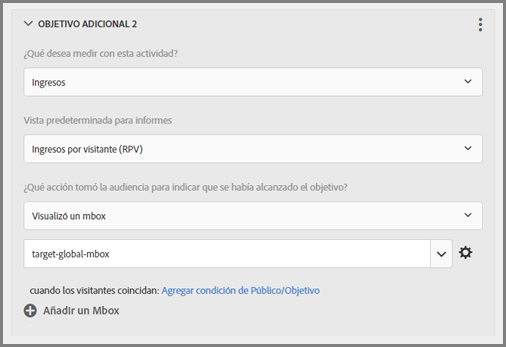

# Preguntas más frecuentes sobre mbox global{#global-mbox-frequently-asked-questions}

Lista de las preguntas más frecuentes (FAQ) sobre los mboxes globales.

## ¿Puedo tener más de un mbox global si mi cuenta de Target está establecida en múltiples dominios?{#section_B7252BA6C3BB4EF4AE9E53F47FD58ABD}

Se admite un único mbox global en su cuenta.

Puede limitar dónde se ejecutan sus actividades añadiéndoles reglas de URL. Para obtener más información, consulte [Incluir la misma experiencia en páginas similares](/help/c-experiences/c-visual-experience-composer/temtest.md#task_2539D51A18044F82B0D9895636546781).

También puede transferir un parámetro en la página utilizando [targetPageParams](/help/c-implementing-target/c-implementing-target-for-client-side-web/targetpageparams.md) y, a continuación, seleccionar esos parámetros en la sección “configurar URL” del [!UICONTROL Compositor de experiencias visuales] (VEC) o añadiendo los parámetros como “refinamientos” en el Compositor de experiencias basadas en formularios.

## ¿Cómo paso los datos de ingresos en un mbox global de Target?{#section_17AEA933BADA4D169CCEDF5833C41306}

Para recabar ingresos e información de pedidos en target-global-mbox, se deben enviar a Target “parámetros de mbox”. Estos parámetros son pares de nombre/valor que se utilizan para enviar más información a Target. Target busca automáticamente estos parámetros (son nombres reservados) para rellenar los datos de ingresos.

Para `orderConfirmPage`, debe transferir `orderTotal`, `orderId` y `productPurchasedId`. Para obtener más información, consulte [Crear un mbox de confirmación de pedido: mbox.js](/help/c-implementing-target/c-implementing-target-for-client-side-web/t-mbox-download/orderconfirm-create.md#task_0036D5F6C062442788BB55E872816D82).

Estos mismos parámetros deben enviarse a target-global-mbox mediante `targetPageParams()`. Para obtener más información, consulte [Transferencia de parámetros a un mbox global](/help/c-implementing-target/c-implementing-target-for-client-side-web/t-mbox-download/c-understanding-global-mbox/pass-parameters-to-global-mbox.md#concept_33362A04146C4E3C8E7089B65F38B5E5).

También conviene añadir segmentación a la pieza de conversión, de forma que Target solo cuente las conversiones en target-global-mbox cuando se visualice la página de confirmación de pedido, como se muestra abajo:

La sección Páginas del sitio arriba ilustrada contiene las siguientes selecciones: Página actual, URL, contiene, orderconfirm.

Las opciones en la imagen anterior incluyen los siguientes ajustes.

* **Qué se quiere medir con esta actividad:** ingresos
* **Vista predeterminada para informes:** ingresos por visitante (RPV)
* **¿Qué acción realizó su audiencia para indicar que se ha alcanzado su objetivo?** Visualizó un mbox, target-global-mbox