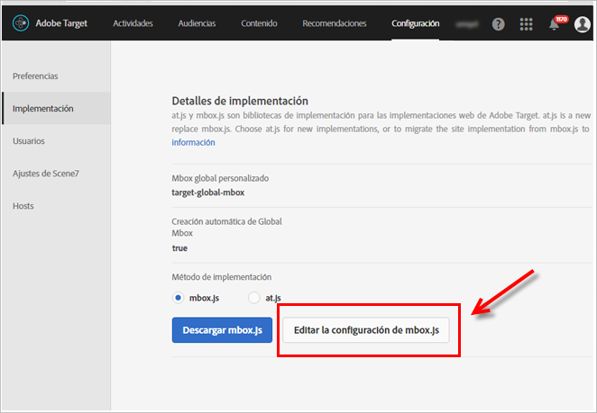
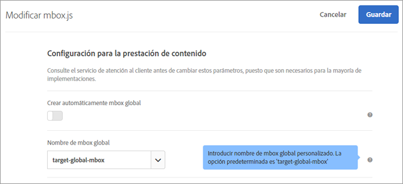
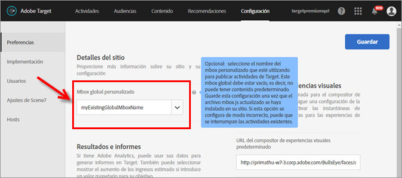

# Personalizar un mbox global{#customize-a-global-mbox}

Información para personalizar un mbox global en at.js y en mbox.js.

1. Editar mbox.js.

   Go to **[!UICONTROL Target]** > **[!UICONTROL Administration]** > **[!UICONTROL Implementation]**.

   * Para mbox.js, haga clic en **[!UICONTROL Editar la configuración de mbox.js]**.
   * Para [!DNL at.js]**[!UICONTROL , seleccione at.js]**, en Método de implementación, y luego haga clic en **[!UICONTROL Editar la configuración de mbox.js]**.

   

1. Edite [!DNL mbox.js] o [!DNL at.js].

   Deshabilite **[!UICONTROL Crear automáticamente mbox global]** y luego añada el nombre del mbox global personalizado que quiere usar para publicar actividades desde [!DNL Target Standard/Premium]. Este mbox global personalizado también se usa para el rastreo de clics.

   

   Haga clic en **[!UICONTROL Guardar]** cuando termine.
1. Implemente la biblioteca [!DNL mbox.js] o [!DNL at.js] en el sitio.

* Para mbox.js, consulte [Implementación de mbox.js](../../../../c-implementing-target/c-implementing-target-for-client-side-web/t-mbox-download/mbox-download.md#task_4EAE26BB84FD4E1D858F411AEDF4B420).
* Para at.js, consulte [Implementación de at.js](../../../../c-implementing-target/c-implementing-target-for-client-side-web/t-mbox-download/c-target-atjs-implementation/target-atjs-implementation.md#concept_8AC8D169E02944B1A547A0CAD97EAC17).

1. Programe la transición según su versión.

   Cuando esté listo para que [!DNL Target Standard/Premium] empiece a usar el mbox global en todas las actividades futuras, proceda con este paso.

   Actualice el nombre del mbox global personalizado para que coincida con el nombre usado en el paso 2 anterior.

   

   >[!IMPORTANT]
   >
   >Cuando se guarda, todas las actividades de la cuenta se sincronizan con este mbox. Si este mbox no está en su sitio, todas las actividades dejarán de funcionar.

   Haga clic en **[!UICONTROL Guardar]**.
