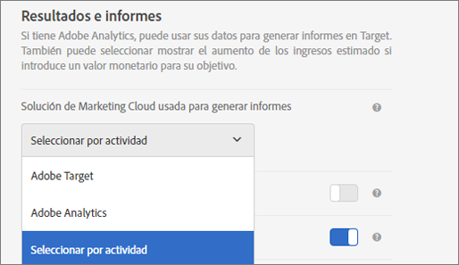

# Configuración de actividades: preguntas más frecuentes sobre A4T{#activity-settings-a-t-faq}

En este tema encontrará respuestas a preguntas que se plantean a menudo sobre la configuración de actividades y el uso de Analytics como fuente de informes para Target (A4T).

## ¿Qué tipos de actividades son compatibles con Analytics como fuente de informes (A4T)?{#section_5E4F58CD25A5424E869E6FE0803968EF}

Para obtener una lista completa, consulte “Tipos de actividades compatibles” en [Adobe Analytics como Fuente de informes para Adobe Target (A4T)](../../../c-integrating-target-with-mac/a4t/a4t.md#concept_7540C8C04259434AB6EE33B09F47A1DE).

## Acabo de crear una actividad. ¿Por qué no entran datos? {#section_9F8092BE4225442896F926540292F221}

Cuando se crea una actividad, Target envía un archivo de clasificación a Analytics. Aunque Analytics esté recopilando datos y procesándolos, no se muestran en los informes hasta que se actualice el archivo de clasificación. Este proceso puede tardar hasta 24 horas. Si al cabo de 48 horas no ve los datos, [contacte con ClientCare](/help/cmp-resources-and-contact-information.md#reference_ACA3391A00EF467B87930A450050077C). De forma alternativa, si sabe que va a iniciar una actividad, puede crearla con unos días de antelación y el archivo de clasificación se enviará cuando se guarde la actividad. De este modo, aparecerán datos en el informe en cuanto se inicie la actividad. Tenga en cuenta que los datos tardan entre 45 y 90 minutos en procesarse en Analytics.

## ¿Por qué no puedo seleccionar Analytics como fuente de informes cuando creo una actividad nueva?   {#section_9F4F69C3085F4C2480AF439127EB27CD}

Puede cambiar las opciones de Configuración de Sistema de informes en Administración.

1. In Adobe Target, click **[!UICONTROL Administration]**.
1. En la lista desplegable **[!UICONTROL Solución de Experience Cloud utilizada para la creación de informes]**, haga clic en **[!UICONTROL Seleccionar por actividad]**.

La lista desplegable **[!UICONTROL Fuente de informes]** está habilitada en la pantalla **[!UICONTROL Objetivo y configuración]** para crear y editar actividades.

To always use Analytics as the reporting source, select **[!UICONTROL Adobe Analytics]** from the drop-down list in Administration.
