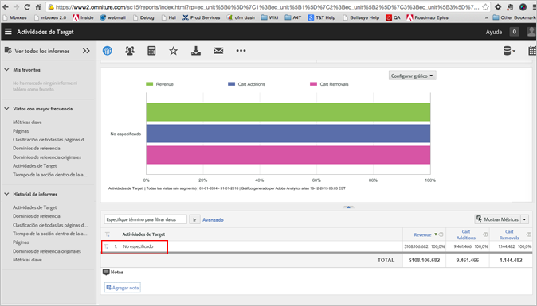

# Ver informes: preguntas más frecuentes sobre A4T{#view-reports-a-t-faq}

En este tema encontrará respuestas a preguntas que se plantean a menudo sobre la visualización de informes al usar Analytics como fuente de informes para Target (A4T).

## ¿Cuál es la metodología de recuento y cómo se usa?{#section_E9C21C47B5BE4E54BABF0CD7F03D3945}

La metodología de recuento especifica lo que Target usa como denominador para las tasas de conversión. Estas son las opciones:

* Impresiones
* Visitantes
* Visitas

## ¿Puedo establecer una métrica predeterminada para los informes de Target?  {#section_50C20D286AA042CCA958184C9C0767DD}

En el informe de actividades, los administradores pueden cambiar la métrica predeterminada para que cada vez que se realice el informe se reflejen las mismas métricas. De lo contrario, el informe usa la última métrica aplicada al último informe.

For more information, see [Select default report metrics](https://docs.adobe.com/content/help/en/analytics/analyze/reports-analytics/metrics.html) in the *Analytics Analyze Guide*.

## ¿Cuándo se aplica un segmento a la métrica (con una métrica calculada) y cuándo se aplica el segmento al informe?{#section_BC29DEE6D2734911A5CD6FBF1189EB89}

Los segmentos aplicados a los informes son como aplicar segmentos a la versión de Target Classic. La mayor utilidad de esta técnica es que permite ver cómo afecta una prueba a un subconjunto de personas (por ejemplo, qué resultado ha tenido esta prueba entre la gente de España?).

Se pueden aplicar segmentos a métricas con una métrica calculada. Esto se suele hacer si se quiere crear un nuevo tipo de evento con éxito. Por ejemplo, si quiere ver cuántos visitantes de retorno ha generado su actividad o cuántos visitantes han llegado a una cierta página. Tenga en cuenta que actualmente el alza y la confianza no se pueden generar para las métricas calculadas.

## ¿Debería usar visitantes, impresiones de actividad o visitas cuando consulto los informes?  {#metrics}

Existen varias opciones, cada una con sus propias ventajas:

* ***Visitantes únicos*** aumenta cuando un usuario reúne por primera vez los requisitos para una actividad.
* ***Visitas*** aumenta para cada sesión cuando un usuario (visitante único) accede a una actividad, incluso si la actividad no se visualiza en visitas posteriores.
* ***Impresiones de actividad*** aumenta cada vez que se sirve el contenido de la actividad. (medida mediante Target)
* ***Instancias*** aumenta una vez por página cuando se sirve el contenido de la actividad (medida mediante Analytics)

Cuando un visitante ve una página que contiene una actividad, se establece una variable para ese visitante que incluye el nombre de esa actividad. Consulte los escenarios detallados que se muestran a continuación para ver cómo se compara cada metodología de recuento.

Tenga en cuenta lo siguiente:

* Todas las métricas anteriores se activan cuando un usuario reúne los requisitos para una actividad y el contenido se devuelve de [!DNL Target]. Esto no significa necesariamente que el usuario haya visto la oferta. Si una experiencia de actividad está por debajo del pliegue y el usuario no se desplaza hacia abajo en la página significa que [!DNL Target] proporcionó la oferta, pero el usuario no la vio.
* [!UICONTROL Impresiones de actividad] (medida mediante [!DNL Target]) e [!UICONTROL Instancias] (medida mediante [!DNL Analytics]) son iguales, a menos que haya varias llamadas de mbox en la misma página de la misma actividad. De esta forma se contabilizan varias [!UICONTROL Impresiones de actividad], pero una sola [!UICONTROL Instancia].
* Al utilizar las métricas Impresiones  de actividad y Conversiones [!UICONTROL de] actividad en [!DNL Analysis Workspace], asegúrese de que ambas métricas tengan aplicados modelos de atribución de [!UICONTROL mismo toque] . Los modelos se pueden aplicar haciendo clic en el engranaje de configuración de columna, activando modelos [!UICONTROL de atribución]no predeterminados y seleccionando [!UICONTROL Mismo toque]. Obtenga más información sobre la atribución en Información general [de IQ de](https://docs.adobe.com/content/help/en/analytics/analyze/analysis-workspace/panels/attribution.html) atributos en la Guía *de herramientas de* Analytics.

## ¿Qué significa “conversiones de la actividad” si el especialista en marketing elige una métrica de Analytics durante la configuración de la actividad?{#section_F3EBACF85AF846E9B366A549AAB64356}

“Conversiones de la actividad” no tendrá datos si se ha seleccionado una métrica de Analytics como métrica de conversión de la actividad.

## ¿Por qué pone “sin especificar” en los informes de Analytics? ¿Qué quiere decir? {#unspecified}

En otros informes, “sin especificar” significa que los datos no cumplían una regla de clasificación, pero esto no debería suceder nunca en A4T. Si ve “sin especificar”, aún no se ha ejecutado el servicio de clasificación. Los datos de actividad generalmente tardan entre 24 y 72 horas en aparecer en los informes. Aunque las actividades no aparecen en este informe hasta llegado ese momento, todos los datos de visitantes asociados a esas actividades se recopilan y aparecerán cuando se complete la clasificación.

Tras el periodo de clasificación, los datos aparecen en estos informes aproximadamente una hora después de recabarse del sitio web. Todas las métricas, los segmentos y los valores de los informes proceden del grupo de informes que seleccionó cuando configuró la actividad.

## ¿Por qué se envían métricas de Target a Analytics aunque la actividad se haya desactivado?{#section_38AA8380A4D54A18972F1EF3E73E22EF}

La variable de [!DNL Target] enviada a [!DNL Analytics] caduca, de forma predeterminada, en un plazo de 90 días. ClientCare puede ajustar este plazo de caducidad, si es necesario. Sin embargo, esta configuración es global para todas las actividades, por lo que no se debería cambiar para un caso.

Puede ver que se envían variables de Target a Analytics pasado el plazo de caducidad porque, aunque este es de 90 días, esto solo sucede si el usuario no ve ninguna otra actividad de Target habilitada para A4T. Si un usuario regresa al sitio el día 45 y ve otra actividad, el contador del valor de la eVar de A4T se restablece a 90 días. Esto significa que la primera campaña del día 1 podría perdurar durante un total de 45 + 90 = 135 días. Si el usuario sigue volviendo, podrían llegar a enviarse métricas a Analytics en los informes de actividades mucho más antiguas. Cuando los usuarios eliminan las cookies y dejan de volver al sitio, las cifras de esa actividad caen, pero se siguen viendo.

Esto significa que la actividad sigue recibiendo visualizaciones de página, visitas, etc., 90 días después del momento en que finaliza la actividad para los visitantes que participaron en ella mientras estaba activa. Sin embargo, si consulta la métrica [!UICONTROL Impresiones de actividad], no debería ver ninguna impresión una vez finalizada la actividad.

Este comportamiento es normal. La variable de A4T funciona como cualquier otra eVar: el valor está asociado al usuario hasta que se alcanza la fecha de caducidad (90 días). En consecuencia, si una actividad solo está activa durante dos semanas, el valor seguirá estando asociado al usuario durante al menos los siguientes 90 días.

La práctica recomendada consiste en ver solamente los informes de la actividad que correspondan al periodo de tiempo en el cual dicha actividad estaba activa. Las fechas deberían aparecer correctamente de forma predeterminada al ver la actividad en Analytics, así que, a menos que haya prolongado la fecha de forma manual, no habrá problemas con las fechas en los informes.

Vamos a suponer, por ejemplo, que la variable de A4T caduca pasados 90 días y que nuestra prueba está activa del 1 al 15 de enero.

El 1 de enero, el usuario llega al sitio, ve la actividad XYZ una vez y, después, efectúa cinco vistas de página. En las dos semanas siguientes, el usuario no regresa al sitio. Los datos referentes a ese usuario serían los siguientes:

| Nombre de la actividad | Instancias (impresiones) | Vistas de páginas | Visitas | Visitantes únicos |
|--- |--- |--- |--- |--- |
| XYZ | 1 | 5 | 1 | 1 |

El usuario vuelve el 1 de febrero y ve otras cinco páginas. No encuentra más actividades de Target y la actividad original ya no está activa. Aunque ya no está activa, la actividad todavía sigue al usuario mediante la persistencia de eVar. Los datos de este momento son estos:

| Nombre de la actividad | Instancias (impresiones) | Vistas de páginas | Visitas | Visitantes únicos |
|--- |--- |--- |--- |--- |
| XYZ | 1 | 10 | 2 | 1 |

El usuario vuelve el 1 de marzo y ve una actividad nueva: ABC. Esta vez también ve cinco páginas. Como la actividad XYZ todavía sigue al usuario mediante la persistencia y este ve después la actividad ABC, observaremos dos líneas en el informe:

| Nombre de la actividad | Instancias (impresiones) | Vistas de páginas | Visitas | Visitantes únicos |
|--- |--- |--- |--- |--- |
| XYZ | 1 | 15 | 3 | 1 |
| ABC | 1 | 5 | 1 | 1 |

El usuario regresa el 1 de abril, ve otras cinco páginas y realiza una compra. El periodo de caducidad de 90 días del primer valor de eVar se restableció el 1 de abril y esto se refleja en el informe. Se atribuye el origen de la conversión a todas las actividades de Target que el usuario ve, pero el número total de conversiones se desduplica:

| Nombre de la actividad | Instancias (impresiones) | Vistas de páginas | Visitas | Visitantes únicos | Pedidos |
|--- |--- |--- |--- |--- |--- |
| XYZ | 1 | 20 | 4 | 1 | 1 |
| ABC | 1 | 10 | 2 | 1 | 1 |
| Total | 2 | 20 | 3 | 1 | 1 |

Puesto que las dos experiencias se vieron antes de la conversión, ambas son las “responsables” del pedido. Sin embargo, en el sistema solo se ha efectuado un pedido y esto se refleja en el total. A la hora de crear informes de Target, no importa que el origen se atribuya a todas las actividades que vio el usuario, ya que no se están comparando actividades de Target para ver cuál ha generado mejores resultados. Lo que se compara son los resultados de dos elementos de una misma actividad y, como un usuario no puede ver distintas experiencias en la misma actividad, no hay que preocuparse por la contaminación de los orígenes de los pedidos.

For more information, see [Conversion Variables (eVar](https://docs.adobe.com/content/help/en/analytics/admin/admin-tools/conversion-variables/conversion-var-admin.html)) in the *Analytics Admin Guide*.

## ¿Por qué Analytics y Analytics for Target (A4T) calculan las cifras de la métrica Visitantes únicos de distinta forma?{#section_0C3B648AB54041F9A2AA839D51791883}

Una de las presuposiciones que se dan al ejecutar una prueba A/B, que emplea la prueba T de estudiante (la métrica de confianza) para elegir al ganador de una prueba, es que hay un plazo de tiempo fijo. La prueba solo es válida estadísticamente si se mira este tamaño de muestra fijo.

La métrica Visitantes únicos solo es distinta en Analytics y Target cuando se observa un intervalo de tiempo inferior al de la propia prueba. Si no se ha alcanzado el tamaño de la muestra, la prueba no es tan fiable. Consulte [Cómo no ejecutar una prueba A/B](https://www.evanmiller.org/how-not-to-run-an-ab-test.html) en [el sitio web de Evan Miller](https://www.evanmiller.org/index.html) para obtener más información.

La métrica Visitantes únicos muestra el número de personas que han estado expuestas a la prueba y que han visitado el sitio durante el periodo de tiempo especificado. Esas personas siguen formando parte de la prueba y se deben contabilizar. Si desea ver solo el número de personas que han estado expuestas durante una semana, puede crear un segmento de visitantes que efectuaron una impresión de actividad y aplicarlo al informe.

Puede reducir a una sesión la cantidad de tiempo que la variable de Target persiste. No obstante, esto suele dar problemas en las pruebas donde no hay tanta probabilidad de que el evento de conversión se dé en la misma sesión.

## ¿Por qué en Analytics a veces se cuenta el mismo visitante en diferentes experiencias?  {#section_1397E972D31C4207A142E4D2D6D794A2}

A continuación se explican los motivos por los que puede ser que el mismo visitante se cuente en varias experiencias en Analytics:

* El perfil de Target caducó, pero la cookie de Analytics sigue allí. En esta situación, Target vuelve a evaluar el usuario, pero Analytics considera que el visitante es la misma persona.
* Si el visitante utiliza `mbox3rdPartyId`, cuando el visitante anónimo se fusiona con su perfil de ID de terceros, Target podría poner al visitante en una experiencia distinta para emparejarlo con el ID de terceros. Para obtener más información, consulte [Sincronización de perfiles en tiempo real para mbox con ID de terceros](../../../c-target/c-visitor-profile/3rd-party-id.md#concept_BF4113593F614987B1D3E359AE1C5732).
* Puede ser que Analytics haga el seguimiento de diferentes dispositivos como si fuera el mismo visitante de forma distinta al seguimiento que hace Target de esos dispositivos, ya que la configuración del ID de terceros en Target es diferente que en Analytics.

## ¿Admite A4T grupos de informes virtuales?

Los grupos de informes virtuales *no* se incluyen en la lista de grupos de informes y las audiencias de los grupos de informes virtuales no se admiten en los informes de A4T.

## ¿Puedo cambiar el porcentaje de asignación de tráfico en una actividad que utiliza A4T después de activar la actividad?

Cambiar el porcentaje de asignación de tráfico en una actividad después de la activación puede generar informes incoherentes en Analytics porque el cambio solo afecta a los nuevos visitantes. Los visitantes que regresan no se ven afectados.

Se recomienda detener la actividad existente y luego crear una nueva, en lugar de cambiar el porcentaje después de la activación. Los informes de la nueva actividad comienzan con los nuevos visitantes y los datos de los visitantes que regresan no provocarán informes incoherentes.

## ¿Puedo ver mis datos de actividad de Target en Adobe Analysis Workspace?

Puede utilizar [!DNL Adobe Analysis Workspace] para profundizar y visualizar los datos o descubrir la información oculta bajo la superficie.

For detailed information and examples, open the [Analytics &amp; Target: Best Practices for Analysis tutorial](https://spark.adobe.com/page/Lo3Spm4oBOvwF/), provided by Adobe Experience League.