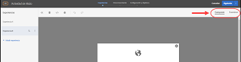
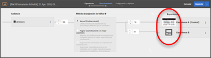

# Preguntas más frecuentes sobre la optimización y personalización de Target

Una lista de preguntas más frecuentes sobre el uso de las funciones de Adobe Target, junto con información y vínculos para obtener más información.

## Información general {#section_CE5713B5AAC341C9A75586C107797FA3}

**¿Cómo puedo ver cómo han aprovechado otros clientes Adobe Target para obtener mejores resultados?**

[Estas son solo algunas de las historias de éxito de nuestros clientes](https://www.adobe.com/es/marketing-cloud/target/resources.html#x). Vea cómo clientes como usted han aprovechado Target para mejorar la optimización y la personalización para lograr los objetivos comerciales.

Tenga en cuenta que algunos de estos estudios de casos han aprovechado las capacidades de Adobe Target Premium.

**¿Dónde puedo obtener información sobre las últimas funciones de Target?**

Consulte nuestras [Notas de la versión](/help/r-release-notes/release-notes.md#reference_8FE40B43A5A34DDF8F26A53D55EE036A) para ver los detalles de la última versión. La información sobre nuestras versiones [anteriores](/help/r-release-notes/release-notes-for-previous-releases.md) también está disponible en línea.

**¿Tiene Adobe una Comunidad/Foro donde pueda encontrar respuestas y más información sobre Target?**

Consulte el [Foro de la comunidad de Target](/help/cmp-resources-and-contact-information.md#concept_9C203A8AED054DFFA9A504811DB6BA42), donde ayudamos a los clientes pero, lo más importante, nos gusta que los practicantes de Adobe Target como usted se ayuden entre sí. Después de todo, el éxito de una comunidad y de un foro depende de la participación activa de sus miembros. Conviértase en parte de la comunidad y contribuya y busque respuestas a sus preguntas.

**¿Qué navegadores admite Target?**

Lea nuestros [exploradores permitidos](/help/c-implementing-target/c-considerations-before-you-implement-target/supported-browsers.md#reference_01B4BF99E7D545A7998773202A2F6100) admitidos para obtener más información. Tenga en cuenta que hay dos aspectos: el soporte de la interfaz Target Standard/Premium Experience Cloud y el soporte del navegador del usuario final en el escritorio/dispositivos.

## Actividades {#section_CB95B3BF9934445DB98E8A7E22FC2CF6}

**¿Puedo realizar una actividad estadísticamente rigurosa para encontrar una experiencia ganadora y perdedora al usar una experiencia de control?**

[Pruebas A/B](/help/c-activities/t-test-ab/test-ab.md#task_05E33EB15C4D4459B5EAFF90A94A7977) (opción de segmentación manual) junto con la [calculadora de tamaño de muestra](/help/c-activities/t-test-ab/sample-size-determination.md#section_286EB6E671184239BB1552F0387DAEB5) para obtener mejores resultados.

**¿Cómo sé cuándo detener una actividad?**

Detener las actividades antes de tiempo puede dar lugar a conclusiones erróneas. Tenga en cuenta los [pbstáculos comunes y asegúrese de realizar prácticas para evitarlas](/help/c-activities/t-test-ab/common-ab-testing-pitfalls.md#section_DF01A97275E44CA5859D825E0DE2F49F). Consulte también [¿Durante cuánto tiempo se debe ejecutar una prueba A/B?](/help/c-activities/t-test-ab/sample-size-determination.md)

**¿Cómo puedo realizar una actividad si la ventana de tiempo es pequeña?**

**¿Puedo optimizar mi objetivo mientras lo pruebo?**

Use nuestros [informes para determinar la experiencia ganadora](/help/c-activities/automated-traffic-allocation/determine-winner.md#concept_5741A89ED7224E1285A3BC34B2CCD0F9).

**¿Puedo realizar una actividad con un nivel de personalización como parte integral de la actividad?**

Consulte la opción [Segmentación automática](/help/c-activities/auto-target/auto-target-to-optimize.md).

**¿Cómo puedo saber qué tipo de actividad se ajusta mejor a mis necesidades?**

Lea la [Guía de actividades de Target](/help/c-activities/target-activities-guide.md#concept_D974B0918EB74B3B8CB07ACD32BF37A1) para conocer las situaciones de aplicación de cada una de las opciones disponibles en Adobe Target.

Asegúrese de tener en cuenta las [actividades de Recommendations](/help/c-recommendations/recommendations.md#concept_7556C8A4543942F2A77B13A29339C0C0).

**¿Cómo puedo descubrir qué combinaciones de elementos contribuyen al éxito de mi página y hasta qué punto ayuda cada elemento?**

Consulte nuestras [actividades multivariables factoriales completas (MVT)](/help/c-activities/c-multivariate-testing/multivariate-testing.md#concept_628695CDC71B449B8DCC2F5654C11499) con análisis de contribución de elementos para ver si satisfacen sus necesidades.

Tenga en cuenta que el requisito de tráfico aumenta con las actividades de MVT.

**¿Puedo ejecutar una actividad que abarque varias páginas donde la estructura de la página sea diferente?**

**¿Puedo aplicar ofertas en diferentes ubicaciones (por ejemplo, el embudo de pago)?**

Pruebe la [función Actividad multipágina](/help/c-experiences/c-visual-experience-composer/multipage-activity.md#concept_277E096063E14813AC5D8EDFA1D2ED48) que permite usar varias páginas dentro de las experiencias.

**¿Cómo puedo asegurarme de que una vez que se ha alcanzado un objetivo (primario o secundario), un usuario no vuelva a ingresar a la actividad y, en cambio, vea una actividad diferente en el futuro?**

Esto es fácil de lograr mediante el uso de la opción [Configuración avanzada](/help/c-activities/t-test-ab/t-test-create-ab/ab-goals-and-settings.md#section_E2FE441AFB324E498793ABB025ED9974) disponible con cada objetivo. Tiene opciones para decidir qué debe suceder después de que el usuario alcance el objetivo y cómo desea que se incremente el recuento.

Por lo tanto, en este caso, puede elegir “Recuento de incrementos, Liberar usuario y barra de la reentrada” junto con “Contenido predeterminado/de otra actividad” para lograr el objetivo. Compruebe también otras opciones.

**He creado múltiples objetivos en mi actividad. ¿Puedo crear una cadena de objetivos como un embudo para fines de informes y análisis?**

**Por ejemplo, quiero considerar el Objetivo B cuando el usuario ha alcanzado el Objetivo A para poder seguir los números de un embudo en particular.**

Target tiene una forma sólida de lograr esto con nuestra función Dependencia de métricas. Simplemente [agregue dependencias en otras métricas de éxito](/help/c-activities/r-success-metrics/success-metrics.md#section_7CE95A2FA8F5438E936C365A6D43BC5B). Tiene opciones como “Alcanzado” y “No alcanzado”, junto con la capacidad de combinar métricas de múltiples maneras para crear la combinación que desee.

**¿Cómo puedo tener claro cómo configurar una actividad para lograr mis objetivos?**

Aquí es donde llegan los [objetivos](/help/c-activities/t-test-ab/t-test-create-ab/ab-goals-and-settings.md#reference_B25389FD6F3A4989801E740364B089CC).

Debería comenzar por saber qué quiere optimizar. ¿Es el ingreso, la conversión o la participación? Cada una de estas opciones está disponible en la sección de objetivos. Y para cada uno de estos, puede definir qué acción tomará un usuario en su sitio para calificar que se ha alcanzado el objetivo.

Esto es posible gracias a la configuración del objetivo primario en el paso 3 del flujo de trabajo guiado de tres partes. También puede agregar objetivos adicionales, lo que puede ayudarle a generar mejores informes

**¿Puedo programar que una actividad comience y termine en un tiempo fijo?**

Utilice la función Programación en el paso [Objetivos y configuración](/help/c-activities/t-test-ab/t-test-create-ab/ab-goals-and-settings.md#section_DCBDC354261F420EBD4B43EA34947BAC) del flujo de trabajo de actividad de tres partes especificando las fechas de inicio y finalización.

Recuerde activar la actividad. Solo las actividades en vivo cumplen con la programación especificada. Una vez que se alcanza la fecha de finalización, la actividad entra en el estado Terminado.

**¿Puedo hacer un cambio solo en el paso de segmentación y no pasar por todo el flujo de trabajo guiado de tres pasos para editar?**

Puede hacerlo fácilmente [introduciendo directamente el paso deseado de su elección desde la página Información general de actividad](/help/c-activities/edit-activity.md#concept_BB064C0D4A194BD1A1AE7CCA1E6BB8F0) y luego saliendo de ese paso utilizando la opción Guardar y cerrar.

**¿Puedo permanecer en un paso en particular, seguir modificando la actividad (ofrecer texto o código personalizado, por ejemplo) y luego realizar un control de calidad en otra pestaña?**

Esto también es posible. Simplemente [use la opción Guardar disponible para realizar cambios incrementales sin abandonar el paso](/help/c-activities/edit-activity.md#concept_BB064C0D4A194BD1A1AE7CCA1E6BB8F0).

**¿Cómo puedo obtener una vista previa y un control de calidad de una actividad que acabo de crear?**

Use nuestra [potente función modo QA](/help/c-activities/c-activity-qa/activity-qa.md) para realizar el control de calidad. Puede compartir vínculos con su equipo de control de calidad y también probar la actividad de principio a fin, incluidos los informes, para estar completamente seguro de que, después de que la actividad esté activa, funcione según lo previsto y probado.

**¿Cómo puedo utilizar el poder de decisión de Target para recibir una experiencia/oferta que se pueda usar en aplicaciones de una sola página (SPA) o integraciones del lado del servidor?**

Utilice el poder de [las actividades basadas en formularios](/help/c-experiences/form-experience-composer.md#task_FAC842A6535045B68B4C1AD3E657E56E) con [ofertas JSON](/help/c-experiences/c-manage-content/create-json-offer.md#concept_63C7BEE1F0DB4A7596D997219B7C136D) para alcanzar su objetivo.

**He configurado dos actividades. ¿Cómo sé cuál terminará viendo un visitante?**

**¿Puedo establecer el orden de prioridad de algunas actividades?**

Use la configuración Prioridad disponible en el paso 3 del flujo de trabajo guiado de tres partes de Target (página Objetivos y configuración) para [definir la prioridad de las actividades](/help/c-activities/t-test-ab/t-test-create-ab/ab-goals-and-settings.md#section_DCBDC354261F420EBD4B43EA34947BAC).

Existen dos opciones:

* Predeterminado, con tres niveles (bajo/medio/alto)
* Personalizado, con un rango de 0 a 999. Para Personalizar, habilite la característica Prioridades específicas (Administración > Compositor de experiencias visuales).

## Audiencias {#section_FA6314777ABC46D8B198D6F388051460}

**¿Puedo crear un segmento de audiencia en una actividad que sea específica para la actividad? No creo que se cree una audiencia así en la Biblioteca de audiencias porque no hay factor de reutilización.**

Empiece usando nuestra [función Audiencia solo de actividad](/help/c-target/creating-activity-only-audience.md#concept_A6BADCF530ED4AE1852E677FEBE68483) para definir audiencias que sean locales para la actividad.

**¿Cómo puedo orientarme a los usuarios según su ubicación?**

Pruebe [audiencias geográficas](/help/c-target/c-audiences/c-target-rules/geo.md#concept_5B4D99DE685348FB877929EE0F942670). Lea sobre los niveles de precisión de esta característica.

**¿Puedo orientar a los usuarios según algunos de los atributos de la página de la sesión?**

La mejor manera sería utilizar mboxes y audiencias [personalizadas](/help/c-target/c-audiences/c-target-rules/custom-parameters.md#concept_C4C6E00D7C5A4BE9B72D471DB2E3027B) para ofrecer la experiencia correcta.

**¿Puedo entregar experiencias basadas en los atributos de los visitantes en múltiples visitas?**

**¿Puedo dividir aleatoriamente el tráfico en dos grupos?**

Pruebe la [función Scripts de perfil](/help/c-target/c-visitor-profile/profile-parameters.md#concept_8C07AEAB0A144FECA8B4FEB091AED4D2). Es una forma poderosa de personalizar experiencias, aunque requiere que escriba el código.

**¿Puedo comenzar una actividad con menos visitantes?**

Utilice los controles de asignación porcentual disponibles desde el [paso 2 del flujo de trabajo guiado de tres partes de (página de segmentación)](/help/c-activities/t-test-ab/t-test-create-ab/ab-audience.md#concept_A268236C1224451DB7844BF67F41A087) para decidir cómo desea configurar la actividad.

**También tengo Adobe Analytics y quiero aprovecharlo con Target. ¿Qué capacidades clave obtengo al integrar las dos soluciones?**

Eche un vistazo a los siguientes aspectos del producto:

* [Analytics for Target (A4T) ](/help/c-integrating-target-with-mac/a4t/a4t.md#concept_7540C8C04259434AB6EE33B09F47A1DE)
* [Atributos del cliente](/help/c-target/c-visitor-profile/working-with-customer-attributes.md#concept_16C5C434D32D4EB1AD44A71821F3DEE8)
* [Audiencias](/help/c-integrating-target-with-mac/mmp.md)

## Experiencias {#section_5959536B8D6A4BEA8FAA1273338F3451}

**¿Puedo ejecutar una actividad en varias páginas donde la estructura de la página sea común?**

Revise las [reglas de plantilla](/help/c-experiences/c-visual-experience-composer/temtest.md#task_2539D51A18044F82B0D9895636546781) para incluir muchas páginas estructuradas similares a la actividad mientras se sigue creando la experiencia en la única URL provista.

**Estoy cansado del mensaje “Permitir que tu navegador cargue secuencias de comandos” cuando intento cargar mi página en el Compositor de experiencias visuales (VEC). ¿Cómo puedo evitar esto?**

Esto se debe a que su sitio tiene contenido mixto; es un sitio que obtiene recursos HTTP y HTTPS. Solicite que su equipo de TI se mueva completamente a HTTPS.

Hasta que esto suceda, siga las instrucciones en  [Habilitar contenido mixto en el explorador](/help/c-experiences/c-visual-experience-composer/r-troubleshoot-composer/mixed-content.md#concept_46D022D50280468C9EF6D5DF6EFC911C) para que el explorador cargue contenido mixto. Esta es una característica de seguridad de la mayoría de los navegadores modernos.

**¿Puedo probar el Compositor de experiencias visuales (VEC) en mi sitio aunque la biblioteca Target at.js aún no se haya desplegado?**

Intente cargar la página con el [Compositor de experiencia mejorada](/help/c-experiences/experiences.md#section_34265986611B4AB8A0E4D6ACC25EF91D).

**¿Por qué mi sitio no se carga dentro del Compositor de experiencias visuales (VEC)?**

Pruebe la [información de solución de problemas](/help/c-experiences/c-visual-experience-composer/r-troubleshoot-composer/troubleshoot-composer.md#reference_77743144F10143A3A89D56E116D296E4) descrita en la página de ayuda. Póngase en contacto con [soporte de Adobe](/help/cmp-resources-and-contact-information.md#reference_ACA3391A00EF467B87930A450050077C) si ninguno de estas opciones funciona.

También tenemos un [método basado en formularios](/help/c-experiences/form-experience-composer.md#task_FAC842A6535045B68B4C1AD3E657E56E) que puede desbloquearlo.

Lea también cuándo y por qué puede ser útil el [Compositor de experiencia mejorada](/help/c-experiences/experiences.md#section_34265986611B4AB8A0E4D6ACC25EF91D). Es posible que deba comunicarse con su departamento de TI para  [incluya también en la lista de permitidos los servidores](/help/c-experiences/c-visual-experience-composer/experience-composer-best-practices.md#concept_E284B3F704C04406B174D9050A2528A6) proxy de Adobe.

**Tengo un sitio adaptable. Al crear una actividad, ¿cómo puedo estar seguro de que estoy considerando dispositivos clave?**

Pruebe la función [Ventanillas móviles](/help/c-experiences/c-visual-experience-composer/mobile-viewports.md#concept_8E45527C4ABC41D59AA3553BEDC76FA5). Tenga en cuenta que solo funciona cuando el Compositor de experiencia mejorada está habilitado.

**Tengo varios dominios. Uno de los dominios necesita el Compositor de experiencia mejorada habilitado, mientras que otros necesitan que esté deshabilitado. ¿Cómo puedo hacer esto?**

Siempre puede usar la opción del [Compositor de experiencia mejorada en el nivel de actividad](/help/c-experiences/experiences.md#section_34265986611B4AB8A0E4D6ACC25EF91D) para anular la configuración predeterminada (Administración > Compositor de experiencia visual).

**¿Por qué no veo una opción para intercambiar imágenes?**

Póngase en contacto con Adobe para [asegurarse de que su cuenta está configurada para Scene7](/help/administrating-target/scene7-settings.md#task_37AD0768EFBA4E588955FE3D5DD670A5). Una vez aprovisionado, podrá intercambiar una imagen por otra imagen con facilidad.

**Quiero probar entre dos experiencias diferentes, por ejemplo, descuento plano frente a descuento porcentual, pero quiero enfocar adecuadamente las experiencias (mostrar diferentes idiomas locales o monedas diferentes para personas que vienen de diferentes países). ¿Cómo puedo hacer esto?**

Puede conseguirlo fácilmente con nuestra [función Varias versiones de experiencias](/help/c-activities/t-test-ab/t-test-create-ab/target-experience-to-multiple-audiences.md#task_0138112E283A4A5B9F8AB9AAF2FBC2FF). Tenga en cuenta los matices en torno a la entrega en estas pruebas

**¿Cómo puedo ver qué modificaciones hice en el Compositor de experiencia mejorada (VEC)?**

Siempre mostramos sus cambios en el [Editor de código](/help/c-experiences/c-visual-experience-composer/c-vec-code-editor/vec-code-editor.md#concept_B3A6E9EE3A60406DB640E205EA1745B5). La pestaña Modificaciones muestra el selector CSS o mbox que aplicó a su oferta.

Tenga en cuenta que el selector de CSS es un Selector de Sizzle. Puede usar esta sección para hacer modificaciones menores o eliminar ciertas ofertas rápidamente.

**Deseo entregar JavaScript como parte del experimento/actividad para realizar modificaciones sobre la marcha de algunos elementos dinámicos o simplemente para enviar una llamada a una solución de terceros. ¿Cómo puedo hacer esto?**

Una de las formas es utilizar el [Editor de código personalizado](/help/c-experiences/c-visual-experience-composer/c-vec-code-editor/vec-code-editor.md#concept_B3A6E9EE3A60406DB640E205EA1745B5). Coloque su JavaScript en la sección para que se entregue. Tiene la opción de entregarlo en el encabezado o en la parte superior del cuerpo, según sus necesidades.

**¿Por qué no puedo pasar de la página de inicio de sesión en el Compositor de experiencias visuales (VEC) o a una página oculta para la que no tengo una URL específica?**

Utilice las funciones de composición y exploración para ir a la página que ha elegido y comenzar a crear su experiencia.

**¿Cómo puedo ir a la experiencia que he elegido desde el Paso 2 del flujo de trabajo guiado de tres partes de Target (página de orientación)?**

Haga clic en la miniatura en frente del nombre de la experiencia en el Paso 2 y llegará a la experiencia de su elección.

**Soy un usuario anterior de Target Classic. ¿Puedo aprovechar mis mboxes para algunos casos de uso?**

Use el [enfoque basado en formularios](/help/c-experiences/form-experience-composer.md#task_FAC842A6535045B68B4C1AD3E657E56E) para crear actividades.

**¿Puedo asegurar que la misma experiencia se entregue de manera consistente en todos los dispositivos que un usuario pueda tener?**

Eche un vistazo a nuestro [Dispositivo Co-op](https://experienceleague.adobe.com/docs/device-co-op/using/home.html?lang=es) que le permite vincular de manera determinista y probabilística múltiples dispositivos de un usuario a través del poder de una cooperativa.

Si está en la Co-op, un simple indicador en la página Objetivos y configuración habilitará la función. Ahora, los informes también cambian para reflejar a las personas en lugar de a los visitantes. Hable con su contacto de Adobe para obtener más información sobre esta característica, ya que no está disponible en todas las regiones.

**¿Por qué no veo la oferta/experiencia deseada y, en cambio, estoy viendo alguna otra actividad?**

Use nuestro [depurador](/help/c-activities/c-troubleshooting-activities/content-trouble.md#concept_D2548B486C984B1E97ED7A72075B8EEA) y compruebe [conflictos de actividades](/help/c-experiences/c-visual-experience-composer/activity-collisions.md#concept_0BC6B929592744DFA7DA01FF4F91052E).

## Ofertas {#section_A547B1EAD0B34FD38D3B87AAF62E3963}

**No quiero probar cambios menores, sino que quiero probar una página completamente nueva y completamente diferente.**

**Quiero dirigir a los usuarios a una página de aterrizaje, por ejemplo, un nuevo lanzamiento.**

**¿Cómo puedo hacer esto?**

Contamos con [Redirigir la función de la URL](/help/c-experiences/c-manage-content/offer-redirect.md#task_33C80CD722564303B687948261484F94) que le permite redirigir a los usuarios a la página que haya elegido (con o sin los parámetros de consulta actuales).

**¿Por qué no se realiza la entrega de contenido en mi proceso de control de calidad?**

Es posible que su sitio tenga identificadores dinámicos, ID duplicados o clases dinámicas en elementos. Puede que tenga que evaluar las opciones de preferencia del sitio en el nivel de la cuenta (o en el nivel de actividad si el problema es específico de un dominio o una página). Consulte [Selectores CSS](/help/administrating-target/visual-experience-composer-set-up.md#css).

**¿Por qué no veo la oferta/experiencia deseada y, en cambio, estoy viendo alguna otra actividad?**

Use nuestro [depurador](/help/c-activities/c-troubleshooting-activities/content-trouble.md#concept_D2548B486C984B1E97ED7A72075B8EEA) y compruebe [conflictos de actividades](/help/c-experiences/c-visual-experience-composer/activity-collisions.md#concept_0BC6B929592744DFA7DA01FF4F91052E).

**¿Puedo utilizar el poder de decisión de Target para recibir una experiencia/oferta que se pueda usar en aplicaciones de una sola página (SPA) o integraciones del lado del servidor?**

Utilice el poder de [las actividades basadas en formularios](/help/c-experiences/form-experience-composer.md#task_FAC842A6535045B68B4C1AD3E657E56E) con [ofertas JSON](/help/c-experiences/c-manage-content/create-json-offer.md#concept_63C7BEE1F0DB4A7596D997219B7C136D) para alcanzar su objetivo.

## Informes (Incluyendo Analytics for Target—A4T) {#section_8AECC69BEEB7422E894E7EC44A50BA0A}

**También tengo Adobe Analytics y quiero aprovecharlo con Target. ¿Qué capacidades clave obtengo al integrar las dos soluciones?**

Eche un vistazo a los siguientes aspectos del producto:

* [Analytics for Target (A4T) ](/help/c-integrating-target-with-mac/a4t/a4t.md#concept_7540C8C04259434AB6EE33B09F47A1DE)

* [Atributos del cliente](/help/c-target/c-visitor-profile/working-with-customer-attributes.md#concept_16C5C434D32D4EB1AD44A71821F3DEE8)

* [Audiencias](/help/c-integrating-target-with-mac/mmp.md)

**¿Puedo cortar y fragmentar los informes en múltiples segmentos de usuarios?**

Aquí es donde aparece la [función audiencias para informes](/help/c-activities/t-test-ab/t-test-create-ab/ab-goals-and-settings.md#section_13119392051044FBA6387D9B3B1C43CF) disponible en la página objetivos y configuraciones en el paso 3 del flujo de trabajo de actividades guiadas de tres partes.

Tiene la opción de agregar 50 de esos segmentos y también el punto de aplicación (Entrada de actividad o una métrica específica) para tener una forma potente para cortar y fragmentar.

Tenga en cuenta que Target recopila los datos a este respecto desde el momento en que agrega estas audiencias, por lo que si olvida agregar segmentos antes de ejecutar la prueba, no tendrá suerte.

**No puedo definir audiencias antes de ejecutar la actividad. Considero que este aspecto de informar a las audiencias en las actividades de Target es restrictivo.**

**¿Qué puedo hacer para facilitar este proceso?**

Es allí donde [Analytics for Target (A4T)](/help/c-integrating-target-with-mac/a4t/a4t.md#concept_7540C8C04259434AB6EE33B09F47A1DE) resulta más práctico. Si tiene Adobe Analytics, simplemente elija una fuente como Analytics, que elimina esta restricción. Ahora puede realizar análisis en cualquier audiencia en cualquier punto y no necesita definir las audiencias de informes por adelantado.

**¿Puedo realizar cálculos de informes sin conexión?**

Use [Exportar informes a CSV y descargar detalles de pedidos a las opciones de CSV](/help/c-reports/downloading-data-in-csv-file.md#concept_3F276FF2BBB2499388F97451D6DE2E75) en la página Informes para descargar los datos de informes deseados.

**¿Puedo cambiar la experiencia de control para evaluar informes o cambiar la metodología de conteo de Visitantes a Visitas?**

Haga estos cambios usando los  [ajustes en la página de informes](/help/c-reports/c-report-settings/report-settings.md#concept_4BB6A7FDAB6F4806A632F9CD989B8BFA). Lea más sobre estos ajustes para comprender cómo varían los cálculos.

**¿Cómo debo interpretar los informes?**

Hemos intentado hacer informes lo más intuitivos posible con características como  [las barras de intervalo de confianza, los límites de ascenso, la significancia/confianza y múltiples selecciones de métricas, vistas de tablas y gráficos, promedios de carrera y más](/help/c-reports/c-report-settings/report-settings.md#concept_4BB6A7FDAB6F4806A632F9CD989B8BFA) para permitir análisis de informes potentes pero fáciles. Obviamente, puede comprobar Analytics si utiliza [Analytics for Target (A4T)](/help/c-integrating-target-with-mac/a4t/a4t.md#concept_7540C8C04259434AB6EE33B09F47A1DE) para un análisis más amplio de las audiencias.

## Tokens de respuesta {#section_C2A7118B4B62482A9D630C2212112A3D}

**¿Puedo realizar una integración con un sistema de terceros, como Google Analytics o ClickTale, para pasar la información de la actividad entregada a un usuario final para su análisis?**

También tenemos una solución para esto con nuestra [función Tokens de respuesta](/help/administrating-target/response-tokens.md#concept_2B21B222F6A344D68CA5929817E836C4).

## Resolución de problemas {#section_6B8B4DC62AE34066A8C55915E9EC6C19}

**¿Cómo puedo saber el estado de disponibilidad de Adobe Target?**

Utilice [la página Estado del sistema de Adobe](/help/r-release-notes/system-status-updates.md#concept_5CBDF506BEFA40E483CC7DE0DA915EAD) para ver el estado de los productos de Adobe y las soluciones de Experience Cloud, incluyendo Target. Esta página permite determinar si los problemas que pueden tener lugar se deben a las actualizaciones del sistema o a las labores de mantenimiento periódicas.

**¿Tiene una guía de solución de problemas?**

Lamentamos que tenga problemas. Consulte [Solución de problemas de Target](/help/r-troubleshooting-target/troubleshooting-target.md#reference_A9DB82675D044BD8861F6752A4EE6839) para ver vínculos a muchos temas de solución de problemas.

## Aplicaciones móviles de Target {#section_07BA89F2C38747158ECD5B153274AEAF}

**Tenemos un SKU móvil. ¿Puedo crear actividades móviles?**

Para optimizar y personalizar en dispositivos móviles, necesita utilizar [actividades basadas en formularios](/help/c-experiences/form-experience-composer.md#task_FAC842A6535045B68B4C1AD3E657E56E) junto con el [SDK de Adobe](/help/c-target-mobile-app/mobile-enable-target-in-sdk.md#task_FCA99AD0785A44E995468776AE76FE91). Consulte más detalles sobre [Target para aplicaciones móviles](/help/c-target-mobile-app/target-mobile-app.md#concept_80126FF457724DE788CE37264A047559).

## API de Target {#section_714E85EFF6E3400389EF2E40D538E1DA}

**¿Dónde puedo obtener más información sobre las API de Target?**

Tenemos documentación exhaustiva sobre las API. Consulte [API de entrega, SDK de NodeJS y documentación de la API de Recommendations](/help/c-implementing-target/c-api-and-sdk-overview/api-and-sdk-overview.md).
