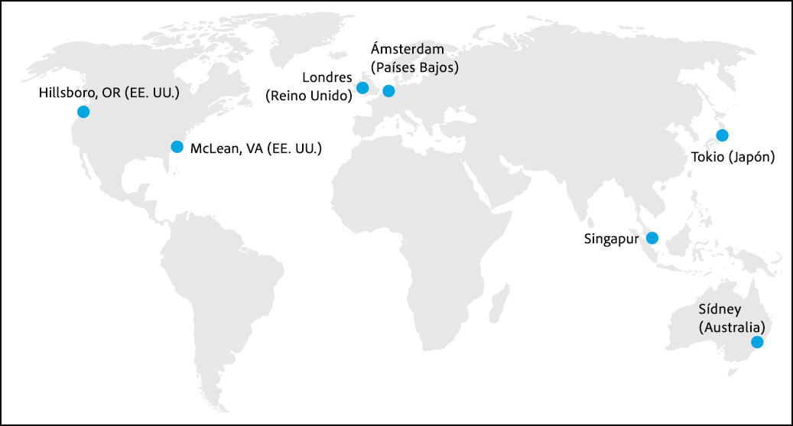

# Cómo funciona Adobe Target{#how-adobe-target-works}

Información sobre cómo funciona Adobe Target, incluida la información sobre las bibliotecas de JavaScript de Target (at.js y mbox.js) y los distintos tipos de actividades incluidos en Target.

## Bibliotecas de JavaScript de Target {#libraries}

Adobe Target se integra con los sitios web mediante una de las dos bibliotecas de JavaScript: at. js o mbox. js

* **at.js:** la [biblioteca at.js](../c-implementing-target/c-implementing-target-for-client-side-web/t-mbox-download/c-target-atjs-implementation/target-atjs-implementation.md#concept_8AC8D169E02944B1A547A0CAD97EAC17) es la nueva biblioteca de implementación para Target. La biblioteca at.js mejora los tiempos de carga de página en implementaciones web y proporciona mejores opciones de implementación en aplicaciones de una sola página. at.js es la biblioteca de implementación recomendada y se actualiza con frecuencia con nuevas capacidades. Recomendamos que todos los clientes implementen o migren a  [la versión más reciente de at.js](../c-implementing-target/c-implementing-target-for-client-side-web/target-atjs-versions.md#reference_DBB5EDB79EC44E558F9E08D4774A0F7A).
* **mbox.js:** la biblioteca mbox.js es la biblioteca de implementación heredada para Target. La biblioteca mbox.js se sigue admitiendo, pero sus características ya no se actualizarán.

>[!IMPORTANT]
>
>Todos los clientes deberían migrar a at.js. Para obtener más información, consulte [Migrar a at.js desde mbox.js](../c-implementing-target/c-implementing-target-for-client-side-web/t-mbox-download/c-target-atjs-implementation/target-migrate-atjs.md#task_DE55DCE9AC2F49728395665DE1B1E6EA)

Debe hacer referencia al archivo de biblioteca JavaScript de Target en todas las páginas del sitio. Por ejemplo, puede añadirlo a su encabezado global. Alternatively, consider using [Adobe Launch tag manager](/help/c-implementing-target/c-implementing-target-for-client-side-web/how-to-deployatjs/cmp-implementing-target-using-adobe-launch.md)

Cada vez que un visitante solicita una página que ha sido optimizada para Target, se envía una solicitud al sistema de segmentación para determinar qué contenido se mostrará al visitante. Este proceso se produce en tiempo real— cada vez que se carga una página, el sistema realiza y completa una solicitud del contenido. El contenido está regido por reglas de actividades y experiencias controladas por especialistas en marketing y se segmenta para cada visitante del sitio. A cada visitante del sitio se le muestra el contenido que ofrece más probabilidades de que el visitante responda, interactúe y, en última instancia, compre los productos: la finalidad es lograr las máximas tasas de respuesta, de adquisición y de ingresos.

En Target, cada elemento de la página forma parte de una única experiencia para la página completa. Cada experiencia puede incluir varios elementos en la página.

El contenido que se muestra a los visitantes depende del tipo de actividad que cree:

### Prueba A/B

Para obtener más información, consulte [Creación de pruebas A/B](../c-activities/t-test-ab/t-test-create-ab/test-create-ab.md#task_68C8079BF9FF4625A3BD6680D554BB72).

El contenido que se muestra en una prueba A/B básica se selecciona aleatoriamente de los recursos que asigna a la actividad, según los porcentajes que elija para cada experiencia. Esta división aleatoria del tráfico puede provocar que se consuma una gran cantidad de tráfico inicial antes de que se nivelen los porcentajes. Por ejemplo, si crea una campaña con dos experiencias, la experiencia inicial se elige de forma aleatoria. Si hay poco tráfico, es posible que el porcentaje de visitantes se desvíe hacia una experiencia. A medida que aumente el tráfico, los porcentajes deberían de igualarse.

Se pueden especificar los objetivos de porcentaje para cada experiencia. En este caso, se genera un número aleatorio que se utiliza para elegir la experiencia que se mostrará. Es posible que los porcentajes resultantes no coincidan exactamente con los objetivos especificados, pero con más tráfico resulta necesario dividir las experiencias para aproximarse a los objetivos.

1. Un cliente solicita una página al servidor y esta se muestra en el navegador.
2. Se establece una cookie de origen en el navegador del cliente para almacenar su comportamiento.
3. La página realiza una llamada al sistema de segmentación.
4. El contenido se muestra en función de las reglas de su actividad.

### Asignación automática

Para obtener más información, consulte [Asignación automática](../c-activities/automated-traffic-allocation/automated-traffic-allocation.md#concept_A1407678796B4C569E94CBA8A9F7F5D4).

Asignación automática identifica un ganador entre dos o más experiencias y reasigna automáticamente más tráfico a la experiencia ganadora para aumentar las conversiones mientras la prueba sigue ejecutándose y aprendiendo.

### Segmentación automática (AT)

Para obtener más información, consulte [Segmentación automática](../c-activities/auto-target-to-optimize.md#concept_67779E5B7F67427A97D7EA2A6FB919B3).

La segmentación automática utiliza aprendizaje automático avanzado para seleccionar entre varias experiencias de alto nivel de rendimiento definidas por expertos en marketing y ofrece a cada visitante la experiencia más adaptada en función de su perfil de cliente y del comportamiento de visitantes anteriores con perfiles similares, con el fin de personalizar el contenido y dirigir las conversiones.

### Personalización automatizada (AP)

Para obtener más información, consulte [Personalización automatizada](../c-activities/t-automated-personalization/automated-personalization.md#task_8AAF837796D74CF893CA2F88BA1491C9).

Personalización automatizada (AP) combina ofertas o mensajes, y utiliza aprendizaje automático avanzado para asignar diferentes variaciones de ofertas a cada visitante en función de su perfil de cliente, con el fin de personalizar el contenido y dirigir las conversiones.

### Segmentación de experiencias (XT)

[Segmentación de experiencias](../c-activities/t-experience-target/experience-target.md#task_A53DF336CB9F4D7BB87EF2106099EFC4)

Segmentación de experiencias (XT) ofrece contenido a una audiencia específica en función de un conjunto de reglas y criterios definidos por expertos en marketing.

La segmentación de experiencias, incluyendo Geotargeting, sirve para definir reglas que dirigen un contenido o experiencia determinados a una audiencia concreta. En una actividad se pueden definir varias reglas para entregar diversas variaciones de contenido a distintas audiencias. Cuando los visitantes ven el sitio, Segmentación de experiencias (XT) los evalúa para determinar si cumplen los criterios establecidos. En caso afirmativo, participan en la actividad y se les muestra la experiencia diseñada para clasificar audiencias. Puede crear experiencias para varias audiencias dentro de una misma actividad.

### Prueba multivariable (MVT)

Consulte [Prueba multivariable](../c-activities/c-multivariate-testing/multivariate-testing.md#concept_628695CDC71B449B8DCC2F5654C11499) para obtener más información.

La prueba multivariable (MVT) compara combinaciones de ofertas de elementos en una página para determinar qué combinación ofrece el mejor rendimiento para una audiencia específica, además de identificar qué elemento tiene el mayor impacto en el éxito de la actividad.

### Las actividades de

Para obtener más información, consulte [Recommendations](../c-recommendations/recommendations.md#concept_7556C8A4543942F2A77B13A29339C0C0).

Las actividades de Recommendations muestran automáticamente productos o contenido que podría interesar a sus clientes en función de la actividad previa del usuario u otros algoritmos. Recommendations le ayuda a dirigir a los clientes hacia artículos relevantes que es posible que no conozcan de otra manera.

## La red de Edge {#concept_0AE2ED8E9DE64288A8B30FCBF1040934}

“Edge” es una arquitectura de servidores distribuidos geográficamente que garantiza tiempos de respuesta óptimos para usuarios finales que solicitan contenido desde cualquier lugar del mundo.

Para mejorar los tiempos de respuesta, los entornos de Edge solo hospedan lógica de actividad, perfil almacenado en caché y información de ofertas. Las bases de datos de actividades y contenido, los datos de [!DNL Analytics], las API y las interfaces de usuario de los especialistas en marketing se hospedan en los entornos de datos centrales de Adobe. Las actualizaciones se envían a los nodos de Edge. Los entornos centrales y los nodos de Edge se sincronizan automáticamente para actualizar continuamente los datos de actividad almacenados en caché. El modelado 1:1 también se almacena en cada Edge, de modo que estas solicitudes más complejas también se pueden procesar en Edge.

Cada nodo de Edge dispone de toda la información necesaria para responder a la solicitud de contenido del usuario y realizar un seguimiento de los datos de análisis de dicha solicitud. Las solicitudes de los usuarios se dirigen al nodo de Edge más próximo.

Las ubicaciones de sitios principales y perimetrales contienen un centro de recopilación de datos y un centro de procesamiento de datos. Las ubicaciones de sitios perimetrales contienen solamente un centro de recopilación de datos. Cada grupo de informes está asignado a un centro de procesamiento de datos específico.

Adobe posee actualmente centros de datos en varios continentes, incluidas ubicaciones regionales en Norteamérica, Europa y Asia.

En lugar de responder a todas las solicitudes de segmentación desde una sola ubicación, las solicitudes son procesadas por el entorno Edge más cercano al visitante, mitigando así el impacto del tiempo de transferencia de red o Internet.

>[!IMPORTANT]
>
>[!DNL Adobe Target] actualmente no tiene una red Edge en China y el rendimiento del usuario final se seguirá limitando para [!DNL Target] los clientes de China. Because of the Great Firewall and the lack of Edge nodes within the country, the experiences of sites with [!DNL Target] deployed will be slow to render and page loads will be affected. Also, marketers may experience latency when using the [!DNL Target] Authoring UI.

## Experiencia del usuario protegida {#concept_40A5E781D90A41E4955F80EA9E5F8F96}

Adobe garantiza que la disponibilidad y el rendimiento de la infraestructura de segmentación sea lo más segura posible. Sin embargo, la interrupción de las comunicaciones entre el navegador del usuario final y los servidores de Adobe puede imposibilitar la entrega de contenido.

To safeguard against service interruptions and connectivity issues, all locations are set up to include default content (defined by the client), which is displayed if the user’s browser cannot connect to [!DNL Target].

No se realizan cambios en la página si el explorador del usuario no puede conectarse dentro de un período de tiempo de espera definido (de forma predeterminada: 15 segundos). Si se alcanza este umbral de tiempo de espera, se muestra el contenido de ubicación predeterminado.

Adobe protege la experiencia del usuario al optimizar y garantizar el rendimiento.

* Adobe garantiza pruebas de referencia de rendimiento que se basan en estándares del sector (avaladas por el contrato de nivel de servicio de Adobe).
* La red de Edge garantiza que la entrega de datos se realice a tiempo.
* Adobe utiliza un enfoque de varios niveles para garantizar sus aplicaciones y proporcionar la máxima disponibilidad y fiabilidad a sus clientes.
* Los servicios de asesoramiento de [!DNL Target] ofrecen asistencia para la implementación y soporte continuado para los productos.

## Pruebas fáciles para la optimización de los motores de búsqueda (SEO){#concept_C0C865663CAB4251B66A1F250FD25E6A}

[!DNL Adobe Target] se adhiere a las directrices de motores de búsqueda en las pruebas.

Google promueve las pruebas de usuario y afirma en su documentación que las pruebas A/B y multivariable no afectan a las clasificaciones de los motores de búsqueda orgánica cuando se siguen unas sencillas directrices.

Para obtener más información, consulte los siguientes recursos de Google:

* [Pruebas en sitios web y Búsqueda de Google](https://webmasters.googleblog.com/2012/08/website-testing-google-search.html)
* [Experimentos y encubrimiento](https://support.google.com/analytics/answer/2576845?hl=en&ref_topic=1745207)

Las directrices se publicaron en una entrada del [blog Google Webmaster Central](https://webmasters.googleblog.com/2012/08/website-testing-google-search.html). Aunque la publicación es de 2012, sigue siendo la información más reciente de Google sobre este tema y las directrices continúan vigentes.

* **Sin encubrimiento**: el encubrimiento consiste en mostrar un conjunto de contenidos a los usuarios y otro conjunto distinto a los bots de los motores de búsqueda, lo cual se hace identificándolos específicamente y suministrándoles distintos contenidos.

   Target, como plataforma, se ha configurado para que trate a los bots de los motores de búsqueda como a cualquier usuario. Esto significa que los bots podrían incluirse en las pruebas que realice, si se seleccionan al azar, y “ver” las variaciones de las pruebas.

* **Usar rel=&quot;canonical&quot;**: algunas veces, hay que configurar una prueba A/B con distintas direcciones URL para las variaciones. En estos casos, todas las variaciones deben contener una etiqueta de `rel="canonical"` que haga referencia a la URL (de control) original. Por ejemplo, si Adobe probara su página de inicio utilizando distintas URL para cada variación, la siguiente etiqueta canónica para la página principal iría en la etiqueta `<head>` de todas las variaciones:

   `<link rel="canonical" href="https://www.adobe.com" />`

* **Usar redireccionamientos 302 (temporales)**: en los casos en que se usan URL distintas para las páginas de variación en una prueba, Google recomienda usar un redireccionamiento 302 para redirigir el tráfico hacia las variaciones de prueba. Esto les dice a los motores de búsqueda que el redireccionamiento es temporal, y este solo estará activo durante la realización de la prueba.

   Un redireccionamiento 302 se efectúa en el servidor y Target, así como la mayoría de los proveedores de optimización, utiliza capacidades de cliente. Por lo tanto, en esta área Target no cumple del todo las recomendaciones de Google. No obstante, esto solo afecta a un pequeño número de pruebas. El método habitual de realizar pruebas a través de Target exige cambiar el contenido en una sola URL, de modo que no es necesario ningún redireccionamiento. Hay casos en que los clientes necesitan usar varias URL para representar las variaciones de la prueba. En estas situaciones, Target usa el comando `window.location` de JavaScript para dirigir a los usuarios hacia las variaciones de la prueba, lo cual no señala si el redireccionamiento es de tipo 301 o 302.

   Aunque seguimos buscando soluciones viables para cumplir todas las directrices de motores de búsqueda, en el caso de los clientes que tienen que usar URL distintas en las pruebas, creemos que la correcta implementación de las etiquetas canónicas citadas arriba mitigará el riesgo asociado con este método.

* **Realizar experimentos solo cuando sea necesario**: para nosotros, “cuando sea necesario” significa cuando haya que alcanzar la relevancia estadística. Target [sugiere prácticas recomendadas](https://docs.adobe.com/content/target-microsite/testcalculator.html) para determinar el momento en que una prueba ha alcanzado este punto. Le recomendamos que incorpore la implementación incrustada en el código de las pruebas ganadoras en el flujo de trabajo de pruebas y asigne los recursos apropiados.

   Se desaconseja usar la plataforma de Target para “publicar” pruebas ganadoras como solución permanente, pero si la prueba se publica para el 100 % de los usuarios el 100 % de las veces, este método se puede utilizar mientras se completa el proceso de incrustar en el código la prueba ganadora.

   También es importante tener en cuenta lo que la prueba ha cambiado. Actualizar el color de los botones u otros artículos pequeños que no sean de texto en la página no influirá en las clasificaciones orgánicas. No obstante, los cambios realizados en el texto se deben incrustar en el código.

   Tampoco hay que olvidar la accesibilidad de la página que se está probando. Si la página no es accesible para los motores de búsqueda y no se diseñó para aparecer en primer lugar en la búsqueda orgánica, como una página de aterrizaje para una campaña de correo electrónico, no se aplica ninguna de las consideraciones anteriores.

Google establece que, siguiendo estas instrucciones, las pruebas tienen un impacto pequeño o nulo en el sitio en los resultados de búsqueda.»

Además de estas directrices, Google también proporciona otra pauta en la documentación de la herramienta Experimentos con contenido:

* “Las páginas de variación deben mantener la esencia del contenido en las páginas originales. Estas variaciones no deben cambiar la percepción general ni el significado de esta que el usuario tiene del contenido original”.

Google pone el ejemplo de que “si la página original de un sitio se carga con palabas clave que no están relacionadas con las combinaciones que se muestran a los usuarios, nos reservamos el derecho a eliminar el sitio de nuestro índice”.

Creemos que es difícil cambiar sin querer el significado del contenido original en las variaciones de prueba, pero le recomendamos que consulte los temas de palabras clave de una página y los mantenga. Al cambiar el contenido de una página, especialmente añadiendo o eliminando palabras clave importantes, puede variar la clasificación de la URL en la búsqueda orgánica. Le recomendamos que incluya al socio de SEO en el protocolo de prueba.
