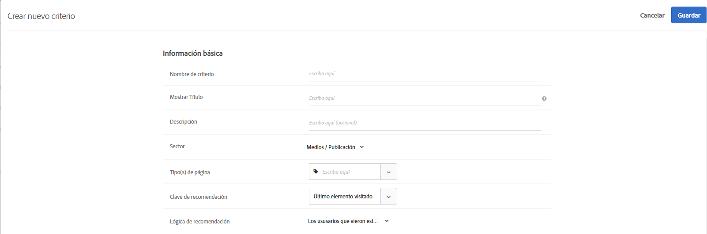

#  Criterios

Los criterios de [!DNL Adobe Target] [!DNL Recommendations] son reglas que determinan qué productos o contenido se recomiendan en función de un conjunto predeterminado de comportamientos del visitante. Los criterios se pueden basar en tendencias populares, los comportamientos actuales y pasados de un visitante o productos y contenido similares. Puede probar distintos tipos de recomendaciones entre sí si se agregan varios criterios.

En las secciones siguientes se explica más sobre las claves de criterios y la lógica de recomendación que puede usar para cada clave. Haga clic en los vínculos para obtener información más detallada.

## Sector {#section_936BCFCF234C49A2BEC1C38AAC2D71AF}

Mientras crea un criterio, selecciona un sector en función de los objetivos de su actividad de recomendaciones.

| Sector | Objetivo |
|--- |--- |
| Venta minorista/Comercio electrónico | Conversión que termina en compra |
| Generación de vanguardia/B2B/Servicios financieros | Conversión sin compra |
| Medios/Publicación | Participación |

Otras opciones de criterios cambian según el sector que seleccione. Puede establecer el sector predeterminado en la página **[!UICONTROL Recommendations > Configuración]** o especificar el sector para cada criterio.

## Tipo de algoritmo {#section_885B3BB1B43048A88A8926F6B76FC482}

El tipo de algoritmo seleccionado determina los algoritmos disponibles. Existen varios tipos de algoritmos que se representan como tarjetas de criterio cuando configura una actividad [!DNL Recommendations].

En la tabla siguiente se explican los distintos tipos de algoritmos y los algoritmos que los acompañan.

| Tipo de algoritmo | Cuándo se utiliza | Algoritmos disponibles |
| --- | --- | --- |
| [!UICONTROL Basado en popularidad] | Haga recomendaciones en función de la popularidad general de un artículo en todo el sitio o de la popularidad de artículos dentro de la categoría, marca, género, etc. favorita del usuario o los más vistos. | <ul><li>Más visitados en todo el sitio</li><li>Más visitados por categoría</li><li>Más visitados por atributo de artículo</li><li>Principales vendedores del sitio</li><li>Principales vendedores por categoría</li><li>Principales vendedores por atributo de artículo</li><li>Principales por métrica de Analytics</li></ul> |
| [!UICONTROL Basado en elementos] | Realice recomendaciones basadas en la búsqueda de artículos similares a un elemento que el usuario esté viendo o que haya visto recientemente. | <ul><li>Los usuarios que vieron esto, vieron aquello.</li><li>Los usuarios que vieron esto, compraron aquello.</li><li>Los usuarios que compraron esto, compraron aquello.</li><li>Elementos con atributos similares</li></ul> |
| [!UICONTROL Basado en el usuario] | Recomendaciones basadas en el comportamiento del usuario. | <ul><li>Artículos vistos recientemente. </li><li>Recomendado para usted</li></ul> |
| Basado en el carro de compras | (Próximamente) Haga recomendaciones en función del contenido del carro de compras del usuario. | <ul><li>Los usuarios que vieron esto, vieron aquéllos</li><li>Los usuarios que vieron esto, compraron aquéllos</li><li>Las personas que compraron estos, compraron esos</li></ul> |
| [!UICONTROL Criterios personalizados] | Realice recomendaciones basadas en un archivo personalizado que cargue. | <ul><li>Algoritmo personalizado</li></ul> |

Para obtener más información sobre cada algoritmo, consulte [Basar la recomendación en una clave de recomendación](/help/c-recommendations/c-algorithms/base-the-recommendation-on-a-recommendation-key.md).

## Uso de una clave de recomendación personalizada {#custom-key}

También puede basar las recomendaciones en el valor de un atributo de perfil personalizado.

>[!NOTE]
>
>Los parámetros de perfil personalizados se pueden pasar a [!DNL Target] a través de JavaScript, API o integraciones. Para obtener más información sobre los atributos de perfil personalizados, consulte [Perfiles de visitante](/help/c-target/c-visitor-profile/visitor-profile.md).

Por ejemplo, supongamos que desea mostrar películas recomendadas basadas en la película que agregó un usuario más recientemente a la cola.

1. Haga clic en **[!UICONTROL Recommendations]** > **[!UICONTROL Criterios]**.

1. Haga clic en **[!UICONTROL Crear criterio]** > **[!UICONTROL Crear criterio]**.

1. Rellene la información de la sección [Información básica](/help/c-recommendations/c-algorithms/create-new-algorithm.md#info).

1. En la sección [Algoritmo recomendado](/help/c-recommendations/c-algorithms/create-new-algorithm.md#rec-algo), seleccione **[!UICONTROL Basado en elementos]** en la lista **[!UICONTROL Tipo de algoritmo]**.

1. Seleccione **[!UICONTROL Personas que vieron esto, Vieron aquello]** en la lista **[!UICONTROL Algoritmo]**.

1. Seleccione su atributo de perfil personalizado en la lista **[!UICONTROL Clave de recomendación]** (por ejemplo, [!UICONTROL Última visualización agregada a la lista de observación]).

   

## Visualización de la información de criterios {#section_7162DE58E4594FD688A4D7FDB829FD8B}

Para ver los detalles de los criterios de una tarjeta emergente, pase el cursor sobre una tarjeta y haga clic en el icono Información sin necesidad de abrir los criterios.

Haga clic en la pestaña **[!UICONTROL Información del algoritmo]** para ver información general sobre los criterios seleccionados, como Nombre, Descripciones, Sector, Tipos de página, Clave de recomendación, Lógica de recomendación e ID del algoritmo.

Haga clic en la pestaña **[!UICONTROL Uso del algoritmo]** para ver una lista de actividades que hacen referencia a los criterios seleccionados. La tarjeta enumera las actividades activas, inactivas y de borrador. Haga clic en las listas desplegables Actividades activas/Actividades inactivas/Actividades de borrador para ver la lista completa de actividades que hacen referencia a ese criterio. Puede hacer clic en el vínculo de la actividad para abrirla y modificarla.

>[!NOTE]
>
>Actualmente, la función [!UICONTROL Uso del algoritmo] solo es compatible con las actividades de Recommendations. Actualmente, esta función no es compatible con las actividades Prueba A/B, Asignación automática, Segmentación automática y Segmentación de experiencias (XT) que incluyen [recomendaciones como oferta](/help/c-recommendations/recommendations-as-an-offer.md).
