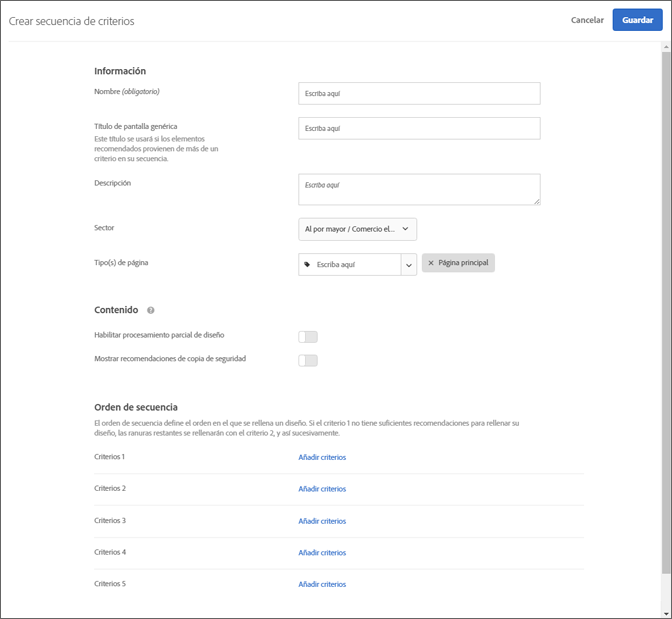
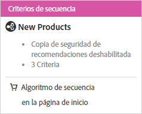

#  Creación de secuencias de criterios{#create-criteria-sequences}

Utilice secuencias de hasta cinco criterios para ejercer un mayor control sobre los elementos que aparecen en las actividades de recomendaciones.

>[!NOTE]
>
>Las secuencias de criterios no se pueden usar con las actividades de [!UICONTROL Recommendations] creadas antes de la versión de octubre de 2016 de [!DNL Target Premium].

Para crear una secuencia de criterios, debe crear primero los criterios que desea incluir en la secuencia. Consulte [Creación de criterios](../../c-recommendations/c-algorithms/create-new-algorithm.md#task_8A9CB465F28D44899F69F38AD27352FE) para obtener más información.

Si utiliza una secuencia de criterios, puede ofrecer recomendaciones personalizadas adicionales, en lugar de utilizar más recomendaciones secundarias genéricas, cuando un criterio no obtenga suficientes resultados para llenar el diseño. Normalmente, las secuencias de criterios empezarán ofreciendo una segmentación más específica, que puede generar menos resultados, y acabarán ofreciendo una segmentación más generalizada, que suele generar más resultados.

Por ejemplo, una secuencia de criterios en una página de productos podría seguir este orden:

1. Basado en el elemento actual, para la misma marca
1. Basado en el elemento actual, para todas las marcas
1. Basado en similitudes de contenido
1. Basado en los productos más vendidos
1. Basado en los elementos más visitados en todo el sitio

Una secuencia de criterios en una página de inicio podría seguir este orden:

1. Basado en la última compra del visitante
1. Basado en el elemento favorito del visitante
1. Basado en la categoría favorita del visitante
1. Basado en los productos más vendidos
1. Basado en lo más visitado en todo el sitio

Existen varias maneras de llegar a la pantalla [!UICONTROL Crear secuencia de criterios]. Algunas opciones de pantalla dependen de cómo llega a la pantalla.

* Cuando esté creando una actividad de [!UICONTROL Recomendaciones], haga clic en **[!UICONTROL Crear nuevo]** > **[!UICONTROL Crear secuencia de criterios]** en la pantalla [!UICONTROL Seleccionar criterios]. Tendrá la opción de guardar la nueva secuencia de criterios para usarla con otras actividades de [!UICONTROL Recommendations].
* Cuando esté editando una actividad de [!UICONTROL Recommendations], haga clic en el cuadro [!UICONTROL Ubicación de Recommendations] de la página y seleccione **[!UICONTROL Cambiar criterios]**. En la pantalla [!UICONTROL Seleccionar criterios], haga clic en **[!UICONTROL Crear nuevo]** > **[!UICONTROL Crear secuencia de criterios]**. Tendrá la opción de guardar los nuevos criterios para usarlos con otras actividades de [!UICONTROL Recommendations].
* En la pantalla de la biblioteca **[!UICONTROL Recomendaciones]** > **[!UICONTROL Criterios]**, haga clic en **[!UICONTROL Crear criterio]** > **[!UICONTROL Crear secuencia de criterios]**. Los criterios que crea aquí quedan disponibles automáticamente para todas las actividades de [!UICONTROL Recommendations].

1. Haga clic en **[!UICONTROL Crear criterios]** o **[!UICONTROL Crear nuevo]**.

   

1. Seleccione **[!UICONTROL Crear secuencia de criterios]**.

   

1. Introduzca un **[!UICONTROL Nombre]** para la secuencia.

   Es el nombre “interno” que se usa para describir la secuencia de criterios. Los visitantes de su sitio web no verán este nombre.
1. Escriba un **[!UICONTROL Título genérico]** de orientación pública que se mostrará en la página si se utilizan varios criterios de la secuencia para llenar el diseño de [!UICONTROL Recommendations].

   Por ejemplo, es posible que quiera reemplazar “Los clientes que han consultado esto, también han consultado...” por “Recomendado para ti” si el diseño incluye elementos basados en más de una clave de [!UICONTROL Recommendations].
1. Escriba una breve **[!UICONTROL Descripción]** de la secuencia de criterios.

   La descripción le ayudará a identificar la secuencia de criterios y puede incluir información sobre su propósito.
1. Seleccione un **[!UICONTROL Segmento de mercado vertical]**.

   Se mostrará automáticamente su sector predeterminado.
1. Seleccione un **[!UICONTROL Tipo de página]**.

   Puede seleccionar varios tipos de página.

   En conjunto, el sector y los tipos de página se usan para categorizar la secuencia de criterios guardada, lo que facilita su reutilización para otras actividades de [!UICONTROL Recommendations].
1. Establezca las reglas de **[!UICONTROL Contenido]**.

   Cuando crea una secuencia de criterios, se ignora la configuración de representación de diseño parcial y recomendaciones secundarias para los criterios individuales que forman la secuencia. Para utilizar una representación de diseño parcial y recomendaciones secundarias, debe habilitarlas para la secuencia. Seleccione las conmutaciones adecuadas. Si decide admitir las recomendaciones secundarias, también puede decidir si desea aplicar las reglas de inclusión a dichas recomendaciones.
1. Defina el orden de la secuencia.

1. Haga clic en **[!UICONTROL Agregar criterio]**.
1. En la pantalla Agregar criterio, seleccione un criterio.
1. Haga clic en **[!UICONTROL Agregar]**.

   Puede agregar hasta cinco criterios en una secuencia.
1. Haga clic en **[!UICONTROL Guardar]**.

   La secuencia de criterios se mostrará en la lista de criterios.

   

   Para obtener más información sobre opciones de lógica de recomendación, consulte [Criterios](../../c-recommendations/c-algorithms/algorithms.md#concept_4BD01DC437F543C0A13621C93A302750).

## Vídeo de formación: Crear criterios en Recommendations (12:33) 

Este vídeo contiene la información siguiente:

* Crear criterios
* Crear secuencias de criterios
* Cargar criterios personalizados

>[!VIDEO](https://video.tv.adobe.com/v/27694?quality=12)
