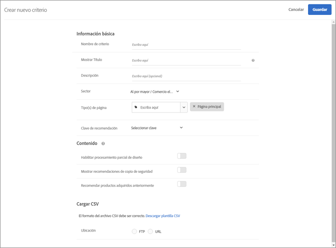

#  Cargar criterios personalizados{#upload-custom-criteria}

Cargue un archivo CSV para personalizar las recomendaciones.

Existen varias maneras de llegar a la pantalla [!UICONTROL Crear nuevos criterios]. Algunas opciones de pantalla dependen de cómo llega a la pantalla.

* Cuando esté creando una actividad de [!UICONTROL Recommendations], haga clic en **[!UICONTROL Crear nuevo]** en la pantalla [!UICONTROL Seleccionar criterios]. Tendrá la opción de guardar los nuevos criterios para usarlos con otras actividades de [!UICONTROL Recommendations].
* Cuando esté editando una actividad de [!UICONTROL Recommendations], haga clic en el cuadro [!UICONTROL Ubicación de Recommendations] de la página y seleccione **[!UICONTROL Cambiar criterios]**. En la pantalla [!UICONTROL Seleccionar criterios], haga clic en **[!UICONTROL Crear nuevo]**. Tendrá la opción de guardar los nuevos criterios para usarlos con otras actividades de [!UICONTROL Recommendations].
* En la pantalla de la biblioteca **[!UICONTROL Recomendaciones]** > **[!UICONTROL Criterios]**, haga clic en **[!UICONTROL Crear criterios]**. Los criterios que crea aquí quedan disponibles automáticamente para todas las actividades de [!UICONTROL Recommendations].

1. Haga clic en **[!UICONTROL Crear criterios]**.

   

1. Seleccione **[!UICONTROL Cargar criterios personalizados]**.

   

1. Escriba un **[!UICONTROL Nombre de criterio]**.

   Es el nombre “interno” que se usa para describir los criterios.  Por ejemplo, quizá use el nombre “Productos con más margen” para los criterios, pero es probable que no quiera que ese título se muestre al público. Consulte el paso siguiente para establecer el título que se presenta al público.
1. Escriba un **[!UICONTROL Título]** que se mostrará a la audiencia para que aparezca en la página para todas las recomendaciones que usen este criterio.

   Por ejemplo, una idea es mostrar “Las personas que han visto esto también vieron” o “Productos similares” cuando use estos criterios para mostrar recomendaciones.
1. Escriba una breve **[!UICONTROL Descripción]** del criterio.

   La descripción debería ayudarle a identificar el criterio y puede incluir información sobre la finalidad del criterio.
1. Seleccione un **[!UICONTROL Segmento de mercado vertical]**.

   Otras opciones de criterios pueden cambiar según el sector que seleccione.

1. Seleccione un **[!UICONTROL Tipo de página]**.

   Puede seleccionar varios tipos de página.

   En conjunto, el sector y los tipos de página se usan para categorizar los criterios guardados, facilitando su reutilización para otras actividades de [!UICONTROL Recommendations].
1. Seleccione una **[!UICONTROL Clave de recomendación]**.

   Para obtener más información, consulte [Basar la recomendación en una clave de recomendación](/help/c-recommendations/c-algorithms/base-the-recommendation-on-a-recommendation-key.md).
1. Establezca las reglas de **[!UICONTROL Contenido]**.

   Las reglas de contenido determinan qué sucede si el número de artículos recomendados no completa su diseño. Por ejemplo, si el diseño tiene espacio para cinco artículos, pero los criterios hacen que solo se recomienden tres artículos, puede dejar vacío el espacio restante, o puede usar recomendaciones de copia de seguridad para completar el espacio adicional. Seleccione las conmutaciones adecuadas. Consulte [Especifique la configuración](/help/c-recommendations/c-algorithms/create-new-algorithm.md#content)del contenido.
1. Establezca las **[!UICONTROL Reglas de inclusión]**.

   Las reglas de inclusión le ayudan a reducir el número de artículos que aparecen en las recomendaciones. See [Specify inclusion rules](/help/c-recommendations/c-algorithms/create-new-algorithm.md#inclusion). 1. Seleccione la **[!UICONTROL Ubicación]** del archivo CSV.

   El archivo CSV debe tener el formato correcto para que se pueda cargar. Haga clic en **[!UICONTROL Descargar plantilla CSV]** para obtener un archivo CSV con el formato correcto.

   Tiene dos opciones de ubicación:

   * **FTP:** para cargar el archivo CSV desde un servidor FTP, seleccione **[!UICONTROL FTP]** e introduzca la información requerida. Tiene la opción de usar SSL, que emplea el protocolo FTPS para transferir el archivo CSV de forma segura.
   * **URL:** para cargar el archivo CSV desde una dirección URL, seleccione **[!UICONTROL Dirección URL]** e introduzca una dirección URL.

1. Haga clic en **[!UICONTROL Guardar]**.

   >[!NOTE]
   >
   >Las entidades de criterios personalizados (filas) pueden contener 1000 artículos recomendados (columnas).

Las actualizaciones de criterios personalizados son “acumulativas” de forma predeterminada. Los nuevos pares de clave-valor especificados en el archivo de carga CSV sobrescribirán los pares existentes. Los pares de clave-valor existentes que no tengan claves especificadas en la carga de CSV seguirán estando disponibles para su envío y caducarán en 31 días desde la última vez que se carguen como parte del archivo CSV.

Póngase en contacto con el servicio de atención al cliente si desea activar la configuración que descarta los resultados existentes que no están incluidos en la siguiente carga CSV. Si esta opción está activada, solo estarán disponibles para su envío las claves presentes en el archivo CSV personalizado. Esta configuración se aplica a todos los criterios personalizados.

Los criterios personalizados se actualizan una vez cada 24 horas.

Puede ver el estado de carga y sincronización de los criterios personalizados en la parte inferior de cada tarjeta de criterios, en la página Recommendations > Criterios. También puede ver el estado en el cuadro de diálogo de edición al editar los criterios personalizados.

El flujo de una carga sin errores debería ser Programado > Descargando el archivo de fuente > Importando > Correcto.

Algunos de los posibles mensajes de error que podría recibir si Target detectará un problema con la carga son los siguientes:

| Mensaje de error | Detalles |
|--- |--- |
| Error desconocido | Indica un error técnico interno. |
| Error de análisis | Probablemente exista un problema con el formato del archivo fuente. Corrija el formato del archivo y vuelva a guardar el algoritmo, que reiniciará el proceso de descarga del archivo. |
| Servidor no encontrado | Proporcione una IP o un nombre de servidor que sea visible en Internet. |
| Error de credenciales | Proporcione un usuario y una contraseña válidos para una cuenta activa en el servidor. |
| No se ha encontrado el directorio | Indique un directorio que exista en el servidor. |
| No se ha encontrado el archivo | Indique el nombre de un archivo que exista en el servidor del directorio indicado. |

## Vídeo de formación: Crear criterios en Recommendations (12:33) 

Este vídeo contiene la siguiente información (los detalles sobre la carga de criterios personalizados comienzan a las 11:43):

* Crear criterios
* Crear secuencias de criterios
* Cargar criterios personalizados

>[!VIDEO](https://video.tv.adobe.com/v/27694?quality=12)