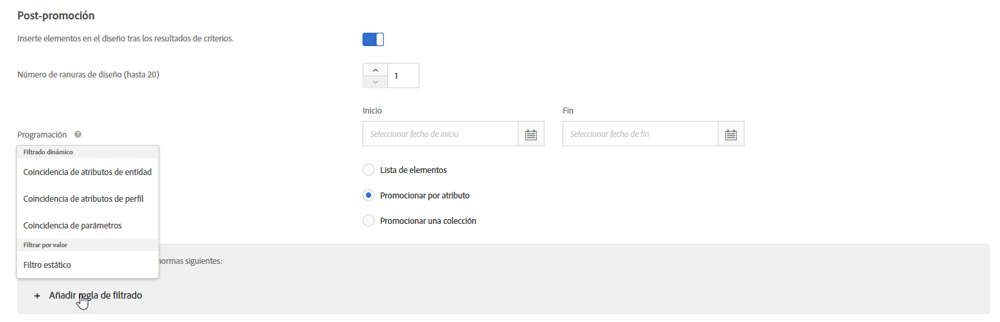

#  Uso de reglas de inclusión dinámicas y estáticas{#use-dynamic-and-static-inclusion-rules}

Información acerca de la creación de reglas de inclusión para criterios y promociones, y agregación de reglas de filtrado dinámicas o estáticas adicionales para lograr mejores resultados.

El proceso de creación y uso de reglas de inclusión para criterios y promociones es similar, al igual que los casos de uso y los ejemplos. En este tema se tratan los criterios y las promociones, así como el uso de reglas de inclusión.

## Agregación de reglas de filtrado a los criterios {#section_CD0D74B8D3BE4A75A78C36CF24A8C57F}

Mientras [crea criterios](../../c-recommendations/c-algorithms/create-new-algorithm.md#task_8A9CB465F28D44899F69F38AD27352FE), haga clic en **[!UICONTROL Agregar regla de filtrado]** en **[!UICONTROL Reglas de inclusión]**.


Las opciones disponibles varían en función del sector seleccionado y la clave de recomendación.

## Agregación de reglas de filtrado a las promociones   {#section_D59AFB62E2EE423086281CF5D18B1076}

Mientras [crea una promoción](../../c-recommendations/t-create-recs-activity/adding-promotions.md#task_CC5BD28C364742218C1ACAF0D45E0E14), seleccione **[!UICONTROL Promocionar por atributo]** y, a continuación, haga clic en **[!UICONTROL Agregar regla de filtrado]**.



## Tipos de filtro {#section_0125F1ED10A84C0EB45325122460EBCD}

La siguiente tabla indica los tipos de opciones de filtrado para criterios y promociones:

| Tipo | Opción | Operadores disponibles |
|--- |--- |--- |
| **Filtrado dinámico** | **Coincidencia de atributos de entidad:** filtra dinámicamente comparando un conjunto de posibles elementos recomendados con un elemento específico con el que los usuarios han interactuado.<br>Por ejemplo, recomendar solo elementos que coincidan con la marca del elemento actual. | igual<br>no igual<br>está entre<br>contiene<br>no contiene<br>empieza por<br>termina por<br>valor presente<br>valor no presente<br>mayor que o igual a<br>menor que o igual a |
|  | **Coincidencia de atributos de perfil:** filtra dinámicamente comparando elementos (entidades) con un valor del perfil del usuario.<br>Por ejemplo, recomendar solo elementos que coincidan con la marca favorita del visitante. | igual<br> no igual<br>contiene<br>no contiene<br>empieza por<br>acaba por<br>es mayor que o igual a<br>es menor que o igual a<br>está entre |
|  | **Coincidencia de parámetros:** filtra dinámicamente comparando elementos (entidades) con un valor de la solicitud (API o mbox).<br>Por ejemplo, recomendar solo contenido que coincida con el parámetro de página “sector”.<br>**Importante:** Si la actividad se creó antes del 31 de octubre de 2016, el envío fallará si utiliza el filtro “Coincidencia de parámetros”. Para evitar este problema:<ul><li>Cree una nueva actividad y añádale sus criterios.</li><li>Use criterios que no contengan el filtro “Coincidencia de parámetros”.</li><li>Elimine el filtro “Coincidencia de parámetros” de sus criterios.</li></ul> | igual<br>no igual<br>contiene<br>no contiene<br>empieza por<br>termina por<br>mayor que o igual a<br>menor que o igual a<br>está entre |
| **Filtrar por valor** | **Filtro estático:** introduzca manualmente uno o más valores estáticos con los que filtrar.<br>Por ejemplo, recomendar solo contenido con una clasificación MPAA de “G” o “PG”. | igual<br>no igual<br>contiene<br>no contiene<br>empieza por<br>termina por<br>valor presente<br>valor no presente<br>mayor que o igual a<br>menor que o igual a |

>[!NOTE]
>
>Si está familiarizado con el modo en que se configuraban las reglas de inclusión antes de la versión de Target 17.6.1 (junio de 2017), notará que algunas de las opciones y operadores han cambiado. Solo se muestran los operadores aplicables a la opción seleccionada y el nombre de algunos ha cambiado (“coincide” es ahora “es igual que”), de modo que la experiencia sea más coherente e intuitiva. Todas las reglas de inclusión creadas antes de esta versión se migran automáticamente a la nueva estructura. No es necesaria reestructuración alguna por su parte.

Puede crear tantas reglas de inclusión como necesite. Las reglas de inclusión se unen mediante un operador Y. Deben cumplirse todas las reglas para incluir un artículo en una recomendación.

Los criterios y promociones dinámicos son mucho más potentes que los estáticos y ofrecen mejores resultados y una mayor participación. En los ejemplos siguientes encontrará ideas para usar las promociones dinámicas en las campañas de marketing:

**es igual que:** usando el operador “es igual que” en las promociones dinámicas, cuando un visitante está viendo un elemento en nuestro sitio web (como un producto, un artículo, una película, etc.), podemos promocionar otros elementos de:

* la misma marca
* la misma categoría
* la misma categoría Y la marca propia
* la misma tienda

**no es igual:** usando el operador “no es igual” en las promociones dinámicas, cuando un visitante está viendo un elemento en nuestro sitio web (como un producto, un artículo, una película, etc.), podemos promocionar otros elementos de:

* una serie de televisión distinta
* un género distinto
* una serie de productos distinta
* un ID de estilo distinto

**está entre**: Usando el operador “está entre” en las promociones dinámicas, cuando un visitante está viendo un elemento en nuestro sitio web (como un producto, un artículo, una película, etc.), podemos promocionar otros elementos que:

* sean más caros
* sean menos caros
* cuesten un 30 % más o menos
* sean episodios posteriores de la misma temporada
* sean los primeros libros de una saga

## Gestión de valores en blanco al filtrar por coincidencia de atributos de entidad, coincidencia de atributos de perfil y coincidencia de parámetros   {#section_7D30E04116DB47BEA6FF840A3424A4C8}

Puede elegir varias opciones para gestionar los valores en blanco al filtrar los criterios y promociones de salida por coincidencia de atributos de entidad, coincidencia de atributos de perfil y coincidencia de parámetros.

Anteriormente, si un valor estaba en blanco no se devolvía ningún resultado. La lista desplegable “Si *x* está en blanco” le permite elegir la acción que se debe realizar si los criterios contienen valores en blanco, como se muestra en la siguiente ilustración:


Para seleccionar la acción deseada, pase el ratón sobre el icono del engranaje () y, a continuación, elija la acción deseada:

| Acción | Disponible para | Detalles |
|--- |--- |--- |
| Ignorar esta regla de filtrado | Coincidencia de atributo de perfil<br> Parámetro de coincidencia | Esta es la acción predeterminada para la coincidencia de atributos de perfil y la coincidencia de parámetros.<br>Esta opción especifica que la regla se ignora. Por ejemplo, si hay tres reglas de filtrado y la tercera no pasa ningún valor, en vez de no devolver resultado alguno, puede simplemente ignorar la tercera regla con valores en blanco. |
| No mostrar ningún resultado para estos criterios | Coincidencia de atributos de entidad<br>Coincidencia de atributo de perfil<br> Parámetro de coincidencia | Esta es la acción predeterminada para la coincidencia de atributos de entidad.<br>Esta acción es el modo en que Target gestiona los valores en blanco antes de la agregación de esta opción: no se mostrarán más resultados para este criterio. |
| Uso de un valor estático | Coincidencia de atributos de entidad<br>Coincidencia de atributo de perfil<br> Parámetro de coincidencia | Si un valor está en blanco, puede optar por usar un valor estático. |

## Ejemplos de coincidencia de atributos de perfil {#section_9873E2F22E094E479569D05AD5BB1D40}

[!UICONTROL La coincidencia] de atributos de perfil permite recomendar solo los elementos que coinciden con un atributo del perfil del visitante, como en los ejemplos siguientes.

**Ejemplo 1: Artículos de recomendación de la marca** favorita del usuario. Por ejemplo, puede utilizar la opción Coincidencia [!UICONTROL de atributos de] Perfil para crear una regla que recomiende artículos solo donde la marca sea igual al valor o al texto almacenado en `profile.favoritebrand`. Con una regla así, si un visitante está buscando pantalones de deporte cortos de una marca particular, solo se mostrarán las recomendaciones que coincidan con la marca favorita del usuario (el valor almacenado en `profile.favoritebrand` en el perfil del visitante).

```
Profile Attribute Matching
brand - equals - the value/text stored in - profile.favoritebrand
```

**Ejemplo 2: Coincidencia de trabajos con solicitantes** de empleo Supongamos que está intentando relacionar los trabajos con los que buscan empleo. Solo desea recomendar los trabajos que se encuentran en la misma ciudad que el buscador de trabajo.

Puede utilizar reglas de inclusión para comparar la ubicación de un buscador de trabajo desde el perfil de su visitante con una lista de trabajos, como en el siguiente ejemplo:

```
Profile Attribute Matching
jobCity - equals - the value/text stored in - profile.usersCity
```

## Ejemplos de coincidencia de atributos de entidad

[!UICONTROL La coincidencia] de atributos de entidad permite recomendar únicamente los elementos que coinciden con un atributo del artículo que el usuario está viendo actualmente, el artículo que el usuario ha visto más recientemente, el artículo que el usuario compró más recientemente, el artículo que el usuario ha visto con más frecuencia o un artículo almacenado en un atributo personalizado en el perfil del visitante, como en los ejemplos siguientes.

**Ejemplo 3: Venta al por mayor a un producto** más caro Supongamos que usted es un minorista de ropa y desea animar a los usuarios a considerar artículos de mayor precio y, por lo tanto, más rentables. Puede utilizar los operadores &quot;es igual que&quot; y &quot;está entre&quot; para promocionar artículos más caros que procedan de la misma categoría y de la misma marca. Por ejemplo, un visitante que ve la compañía para correr puede promocionar zapatillas más caras en un esfuerzo por vender un visitante mirando zapatillas para correr.

```
Entity Attribute Matching
category - equals - current item's - category 
And 
Entity Attribute Matching
brand - equals - current item's - brand 
And 
Entity Attribute Matching
value - is between - 100% and 1000% of - current item's - value
```

**Ejemplo 4: Promoción de productos** con etiquetas privadas Puede combinar filtros dinámicos y estáticos para promocionar productos con etiquetas privadas. Por ejemplo, una compañía de suministro de oficina puede promocionar cartuchos de tóner de la marca propia de la compañía para llevar a cabo una venta más rentable de un visitante mirando el tóner, y promocionar plumas de la marca propia de la compañía para llevar a cabo una venta más rentable de plumas para un visitante mirando las plumas.

```
Entity Attribute Matching
category - equals - current item's - category 
And
Static Filter
IsHouseBrand - equals - true
```

## Advertencias {#section_A889FAF794B7458CA074DEE06DD0E345}

>[!IMPORTANT]
>
>Es posible que no se puedan usar atributos de tipo de datos diferentes en los criterios dinámicos o promociones durante el tiempo de ejecución con los operadores “es igual que” y “no es igual que”. Use de forma acertada los valores “Value”, “Margin”, “Inventory” y “Environment” en la parte de la derecha si la parte de la izquierda tiene atributos predefinidos o personalizados.


La tabla siguiente contiene reglas eficaces y reglas que pueden no ser compatibles durante el tiempo de ejecución:

| Reglas compatibles | Reglas potencialmente incompatibles |
|--- |--- |
| value - está entre - 90 % and 110 % de Elemento actual - salesValue | salesValue - está entre - 90 % y 110% de Elemento actual - value |
| value - está entre - 90 % y 110 % de Elemento actual - value | clearancePrice - está entre - 90 % y 110 % de Elemento actual - margin |
| margin - está entre - 90 % y 110 % de Elemento actual - margin | storeInventory - es igual que - Elemento actual - inventory |
| inventory - es igual que - Elemento actual - inventory |  |
