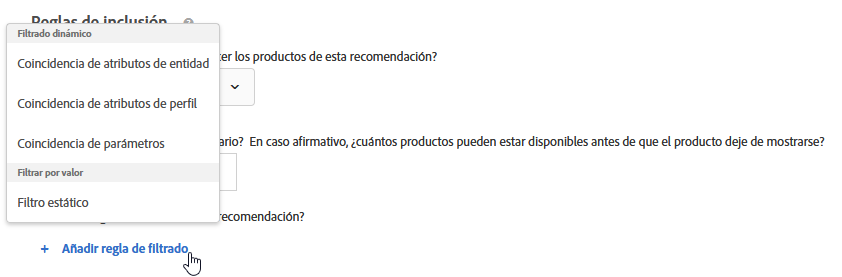
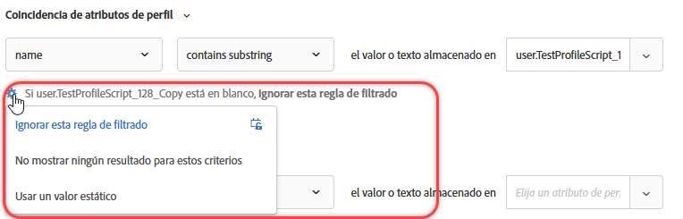
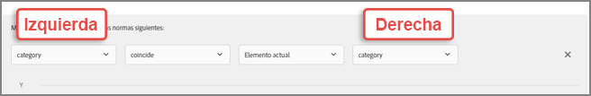

#  Uso de reglas de inclusión dinámicas y estáticas{#use-dynamic-and-static-inclusion-rules}

Information about creating inclusion rules for criteria and promotions in [!DNL Adobe Target] and adding additional dynamic or static filtering rules to achieve better results for your recommendations.

>[!NOTE]
>
>El proceso de creación y uso de reglas de inclusión para criterios y promociones es similar, al igual que los casos de uso y los ejemplos. Tanto los criterios como las promociones y el uso de las reglas de inclusión están cubiertos en esta sección.

## Agregación de reglas de filtrado a los criterios {#section_CD0D74B8D3BE4A75A78C36CF24A8C57F}

Mientras [crea criterios](/help/c-recommendations/c-algorithms/create-new-algorithm.md#task_8A9CB465F28D44899F69F38AD27352FE), haga clic en **[!UICONTROL Agregar regla de filtrado]** en **[!UICONTROL Reglas de inclusión]**.

Las opciones disponibles varían en función del sector seleccionado y la clave de recomendación.

## Agregación de reglas de filtrado a las promociones   {#section_D59AFB62E2EE423086281CF5D18B1076}

Mientras [crea una promoción](/help/c-recommendations/t-create-recs-activity/adding-promotions.md#task_CC5BD28C364742218C1ACAF0D45E0E14), seleccione **[!UICONTROL Promocionar por atributo]** y, a continuación, haga clic en **[!UICONTROL Agregar regla de filtrado]**.

## Tipos de filtro {#section_0125F1ED10A84C0EB45325122460EBCD}

Las siguientes secciones lista los tipos de opciones de filtrado para el filtrado  dinámico y [!UICONTROL el filtro por valor] para criterios y promociones:

### Filtrado dinámico

Las reglas de inclusión dinámicas son más potentes que las reglas de inclusión estáticas y ofrecen mejores resultados y participación. Tenga en cuenta lo siguiente:

* Las reglas de inclusión dinámica ofrecen recomendaciones al hacer coincidir un atributo en el parámetro de perfil de un usuario o en una llamada de mbox.

   Por ejemplo, puede crear una recomendación &quot;Criterios más populares&quot; y luego del conjunto de recomendaciones devueltas, luego filtrar cualquier recomendación (en tiempo real) con un atributo que se pase cuando el usuario acceda a una página donde se muestran las recomendaciones.

* Utilice reglas estáticas para limitar qué artículos se incluyen en la recomendación (en lugar de utilizar colecciones).

* Puede crear tantas reglas de inclusión dinámicas como sea necesario. Las reglas de inclusión se unen mediante un operador Y. Deben cumplirse todas las reglas para incluir un artículo en una recomendación.

Las siguientes opciones están disponibles para el filtrado dinámico:

| Opción de filtrado dinámico | Detalles |
| --- | --- |
| [Coincidencia de atributos de entidad](/help/c-recommendations/c-algorithms/entity-attribute-matching.md) | Filtre dinámicamente comparando un grupo de posibles elementos de recomendaciones con un elemento específico con el que los usuarios han interactuado. Utilice la coincidencia [!UICONTROL de atributos de] entidad cuando desee mostrar las recomendaciones que tengan más posibilidades de atraer al visitante, como la marca favorita del visitante. |
| [Coincidencia de atributos de perfil](/help/c-recommendations/c-algorithms/profile-attribute-matching.md) | Filtre dinámicamente comparando elementos (entidades) con un valor en el perfil del usuario. Utilice Coincidencia [!UICONTROL de atributos de] Perfil cuando desee mostrar recomendaciones que coincidan con un valor almacenado en el perfil del visitante, como tamaño o marca favorita. |
| [Coincidencia de parámetros](/help/c-recommendations/c-algorithms/parameter-matching.md) | Filtre dinámicamente comparando elementos (entidades) con un valor de la solicitud (API o mbox). Utilice la coincidencia de [!UICONTROL parámetros] para recomendar contenido que coincida con los parámetros de página o los parámetros del visitante, como dimensiones del dispositivo o ubicación geográfica. |

### Filtrar por valor

La siguiente opción está disponible para filtrar por valor:

| Filtrado por valor, opción | Detalles |
| --- | --- |
| [Filtro estático](/help/c-recommendations/c-algorithms/static-value.md) | Introduzca manualmente uno o varios valores estáticos para filtrar. |

## Criterios dinámicos y ejemplos de promoción

Los criterios y promociones dinámicos son mucho más potentes que los estáticos y ofrecen mejores resultados y participación.

Los siguientes ejemplos proporcionan ideas generales sobre cómo puede utilizar las promociones dinámicas en sus esfuerzos de mercadotecnia:

| Operador | Ejemplos |
| --- | --- |
| Es igual a | Con el operador &quot;es igual que&quot; en las promociones dinámicas, cuando un visitante está viendo un elemento en el sitio web (como un producto, un artículo o una película), puede promocionar otros elementos desde:<ul><li>la misma marca</li><li>la misma categoría</li><li>la misma categoría Y la marca propia</li><li>la misma tienda</li></ul> |
| No es igual a | Con el operador &quot;no es igual que&quot; en las promociones dinámicas, cuando un visitante está viendo un elemento en el sitio web (como un producto, un artículo o una película), puede promocionar otros elementos de:<ul><li>una serie de televisión distinta</li><li>un género distinto</li><li>una serie de productos distinta</li><li>un ID de estilo distinto</li></ul> |
| está entre | Con el operador &quot;está entre&quot; en las promociones dinámicas, cuando un visitante está viendo un elemento en el sitio web (como un producto, un artículo o una película), puede promocionar otros elementos que:<ul><li>sean más caros</li><li>sean menos caros</li><li>cuesten un 30 % más o menos</li><li>sean episodios posteriores de la misma temporada</li><li>sean los primeros libros de una saga</li></ul> |

## Handling empty values when filtering by Entity Attribute Matching, Profile Attribute Matching, and Parameter Matching {#section_7D30E04116DB47BEA6FF840A3424A4C8}

You can choose several options to handle empty values when filtering by [!UICONTROL Entity Attribute Matching], [!UICONTROL Profile Attribute Matching], and [!UICONTROL Parameter Matching] for exit criteria and promotions.

Anteriormente, si un valor estaba en blanco no se devolvía ningún resultado. La lista desplegable “Si *x* está en blanco” le permite elegir la acción que se debe realizar si los criterios contienen valores en blanco, como se muestra en la siguiente ilustración:

Para seleccionar la acción deseada, pase el ratón sobre el icono del engranaje () y, a continuación, elija la acción deseada:

| Acción | Disponible para | Detalles |
|--- |--- |--- |
| [!UICONTROL Ignorar esta regla de filtrado] | [!UICONTROL Coincidencia] de atributos de perfil[!UICONTROL y coincidencia de parámetros] | This is the default action for [!UICONTROL Profile Attribute Matching] and [!UICONTROL Parameter Matching]. Esta opción especifica que la regla se ignora. Por ejemplo, si hay tres reglas de filtrado y la tercera no pasa ningún valor, en vez de no devolver resultado alguno, puede simplemente ignorar la tercera regla con valores en blanco. |
| [!UICONTROL No mostrar ningún resultado para este criterio] (solo criterios) | [!UICONTROL Coincidencia]de atributos de entidad, Coincidencia [!UICONTROL de atributos de]Perfil y Coincidencia [!UICONTROL de parámetros] | This is the default action for [!UICONTROL Entity Attribute Matching]. [!DNL Target]Esta acción es el modo en que gestiona los valores en blanco antes de la agregación de esta opción: no se mostrarán más resultados para este criterio. |
| [!UICONTROL No promocionar ningún elemento (solo promociones)] | [!UICONTROL Coincidencia]de atributos de entidad, Coincidencia [!UICONTROL de atributos de]Perfil y Coincidencia [!UICONTROL de parámetros] | This is the default action for [!UICONTROL Entity Attribute Matching]. [!DNL Target]Esta acción es el modo en que gestiona los valores en blanco antes de la agregación de esta opción: no se mostrarán más resultados para este criterio. |
| [!UICONTROL Uso de un valor estático] | [!UICONTROL Coincidencia]de atributos de entidad, Coincidencia [!UICONTROL de atributos de]Perfil y Coincidencia [!UICONTROL de parámetros] | Si un valor está en blanco, puede optar por usar un valor estático. |

## Advertencias {#section_A889FAF794B7458CA074DEE06DD0E345}

>[!IMPORTANT]
>
>Es posible que no se puedan usar atributos de tipo de datos diferentes en los criterios dinámicos o promociones durante el tiempo de ejecución con los operadores “es igual que” y “no es igual que”. You should use [!UICONTROL Value], [!UICONTROL Margin], [!UICONTROL Inventory], and [!UICONTROL Environment] values wisely on the right hand side if the left hand side has predefined attributes or custom attributes.

La tabla siguiente contiene reglas eficaces y reglas que pueden no ser compatibles durante el tiempo de ejecución:

| Reglas compatibles | Reglas potencialmente incompatibles |
|--- |--- |
| value - está entre - 90 % and 110 % de Elemento actual - salesValue | salesValue - está entre - 90 % y 110% de Elemento actual - value |
| value - está entre - 90 % y 110 % de Elemento actual - value | clearancePrice - está entre - 90 % y 110 % de Elemento actual - margin |
| margin - está entre - 90 % y 110 % de Elemento actual - margin | storeInventory - es igual que - Elemento actual - inventory |
| inventory - es igual que - Elemento actual - inventory |  |
