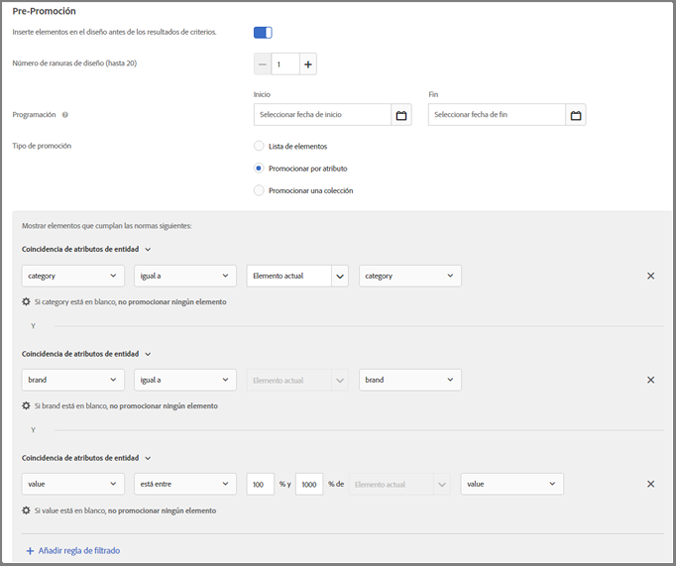
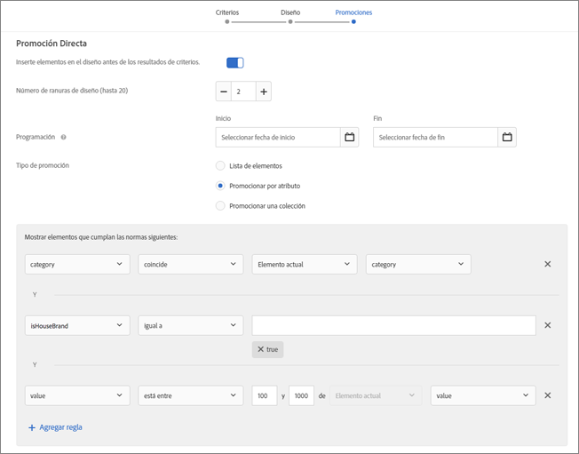
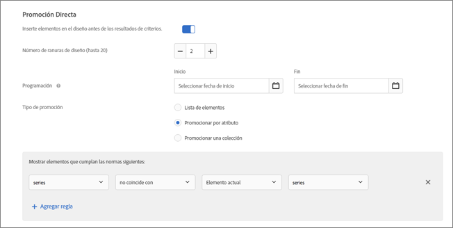
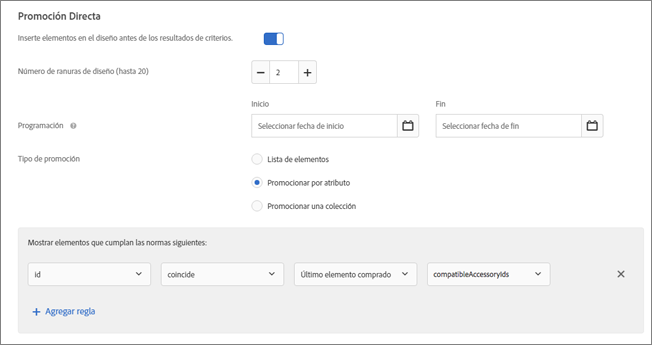
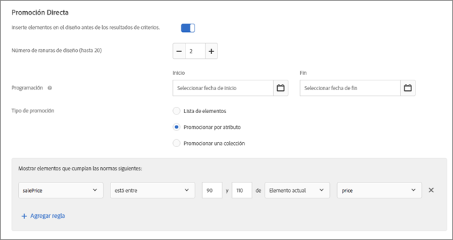
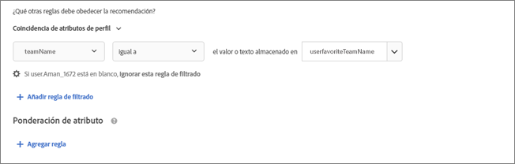
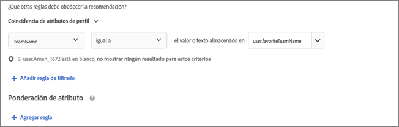
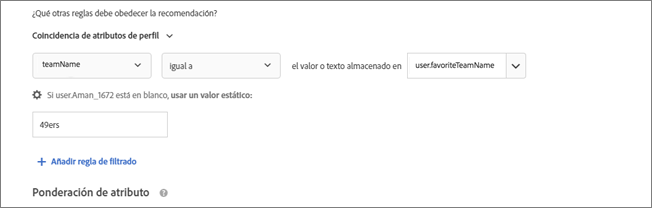

#  Uso de reglas de inclusión dinámicas y estáticas{#use-dynamic-and-static-inclusion-rules}

Información acerca de la creación de reglas de inclusión para criterios y promociones, y agregación de reglas de filtrado dinámicas o estáticas adicionales para lograr mejores resultados.

El proceso de creación y uso de reglas de inclusión para criterios y promociones es similar, al igual que los casos de uso y los ejemplos. En este tema se tratan los criterios y las promociones, así como el uso de reglas de inclusión.

## Agregación de reglas de filtrado a los criterios {#section_CD0D74B8D3BE4A75A78C36CF24A8C57F}

Mientras [crea criterios](../../c-recommendations/c-algorithms/create-new-algorithm.md#task_8A9CB465F28D44899F69F38AD27352FE), haga clic en **[!UICONTROL Agregar regla de filtrado]** en **[!UICONTROL Reglas de inclusión]**.


Las opciones disponibles varían en función del sector seleccionado y la clave de recomendación.

## Agregación de reglas de filtrado a las promociones   {#section_D59AFB62E2EE423086281CF5D18B1076}

Mientras [crea una promoción](../../c-recommendations/t-create-recs-activity/adding-promotions.md#task_CC5BD28C364742218C1ACAF0D45E0E14), seleccione **[!UICONTROL Promocionar por atributo]** y, a continuación, haga clic en **[!UICONTROL Agregar regla de filtrado**].


## Tipos de filtro {#section_0125F1ED10A84C0EB45325122460EBCD}

La siguiente tabla indica los tipos de opciones de filtrado para criterios y promociones:

| Tipo | Opción | Operadores disponibles |
|--- |--- |--- |
| **Filtrado dinámico** | **Coincidencia de atributos de entidad:** filtra dinámicamente comparando un conjunto de posibles elementos recomendados con un elemento específico con el que los usuarios han interactuado.<br>Por ejemplo, recomendar solo elementos que coincidan con la marca del elemento actual. | igual<br>no igual<br>está entre<br>contiene<br>no contiene<br>empieza por<br>termina por<br>valor presente<br>valor no presente<br>mayor que o igual a<br>menor que o igual a |
|  | **Coincidencia de atributos de perfil:** filtra dinámicamente comparando elementos (entidades) con un valor del perfil del usuario.<br>Por ejemplo, recomendar solo elementos que coincidan con la marca favorita del visitante. | igual<br> no igual<br>contiene<br>no contiene<br>empieza por<br>acaba por<br>es mayor que o igual a<br>es menor que o igual a<br>está entre |
|  | **Coincidencia de parámetros:** filtra dinámicamente comparando elementos (entidades) con un valor de la solicitud (API o mbox).<br>Por ejemplo, recomendar solo contenido que coincida con el parámetro de página “sector”.<br>**Importante:** Si la actividad se creó antes del 31 de octubre de 2016, el envío fallará si utiliza el filtro “Coincidencia de parámetros”. Para evitar este problema:<ul><li>Cree una nueva actividad y añádale sus criterios.</li><li>Use criterios que no contengan el filtro “Coincidencia de parámetros”.</li><li>Elimine el filtro “Coincidencia de parámetros” de sus criterios.</li></ul> | igual<br>no igual<br>contiene<br>no contiene<br>empieza por<br>termina por<br>mayor que o igual a<br>menor que o igual a<br>está entre |
| **Filtrar por valor** | **Filtro estático:** introduzca manualmente uno o más valores estáticos con los que filtrar.<br>Por ejemplo, recomendar solo contenido con una clasificación MPAA de “G” o “PG”. | igual<br>no igual<br>contiene<br>no contiene<br>empieza por<br>termina por<br>valor presente<br>valor no presente<br>mayor que o igual a<br>menor que o igual a |

>[!NOTE]
>
>Si está familiarizado con el modo en que se configuraban las reglas de inclusión antes de la versión de Target 17.6.1 (junio de 2017), notará que algunas de las opciones y operadores han cambiado. Solo se muestran los operadores aplicables a la opción seleccionada y el nombre de algunos ha cambiado (“coincide” es ahora “es igual que”), de modo que la experiencia sea más coherente e intuitiva. Todas las reglas de inclusión creadas antes de esta versión se migran automáticamente a la nueva estructura. No es necesaria reestructuración alguna por su parte.

Puede crear tantas reglas de inclusión como necesite. Las reglas de inclusión se unen mediante un operador Y. Deben cumplirse todas las reglas para incluir un artículo en una recomendación.

Los criterios y promociones dinámicos son mucho más potentes que los estáticos y ofrecen mejores resultados y una mayor participación. En los ejemplos siguientes encontrará ideas para usar las promociones dinámicas en las campañas de marketing:

**es igual que:** usando el operador “es igual que” en las promociones dinámicas, cuando un visitante está viendo un elemento en nuestro sitio web (como un producto, un artículo, una película, etc.), podemos promocionar otros elementos de:

* la misma marca
* la misma categoría
* la misma categoría Y la marca propia
* la misma tienda

**no es igual:** usando el operador “no es igual” en las promociones dinámicas, cuando un visitante está viendo un elemento en nuestro sitio web (como un producto, un artículo, una película, etc.), podemos promocionar otros elementos de:

* una serie de televisión distinta
* un género distinto
* una serie de productos distinta
* un ID de estilo distinto

**está entre**: Usando el operador “está entre” en las promociones dinámicas, cuando un visitante está viendo un elemento en nuestro sitio web (como un producto, un artículo, una película, etc.), podemos promocionar otros elementos que:

* sean más caros
* sean menos caros
* cuesten un 30 % más o menos
* sean episodios posteriores de la misma temporada
* sean los primeros libros de una saga

## Gestión de valores en blanco al filtrar por coincidencia de atributos de entidad, coincidencia de atributos de perfil y coincidencia de parámetros   {#section_7D30E04116DB47BEA6FF840A3424A4C8}

Puede elegir varias opciones para gestionar los valores en blanco al filtrar los criterios y promociones de salida por coincidencia de atributos de entidad, coincidencia de atributos de perfil y coincidencia de parámetros.

Anteriormente, si un valor estaba en blanco no se devolvía ningún resultado. La lista desplegable “Si *x* está en blanco” le permite elegir la acción que se debe realizar si los criterios contienen valores en blanco, como se muestra en la siguiente ilustración:


Para seleccionar la acción deseada, pase el ratón sobre el icono del engranaje () y, a continuación, elija la acción deseada:

| Acción | Disponible para | Detalles |
|--- |--- |--- |
| Ignorar esta regla de filtrado | Coincidencia de atributo de perfil<br> Parámetro de coincidencia | Esta es la acción predeterminada para la coincidencia de atributos de perfil y la coincidencia de parámetros.<br>Esta opción especifica que la regla se ignora. Por ejemplo, si hay tres reglas de filtrado y la tercera no pasa ningún valor, en vez de no devolver resultado alguno, puede simplemente ignorar la tercera regla con valores en blanco. |
| No mostrar ningún resultado para estos criterios | Coincidencia de atributos de entidad<br>Coincidencia de atributo de perfil<br> Parámetro de coincidencia | Esta es la acción predeterminada para la coincidencia de atributos de entidad.<br>Esta acción es el modo en que Target gestiona los valores en blanco antes de la agregación de esta opción: no se mostrarán más resultados para este criterio. |
| Uso de un valor estático | Coincidencia de atributos de entidad<br>Coincidencia de atributo de perfil<br> Parámetro de coincidencia | Si un valor está en blanco, puede optar por usar un valor estático. |

Como ejemplo de gestión de valores en blanco, considere la [Escenario 9](../../c-recommendations/c-algorithms/use-dynamic-and-static-inclusion-rules.md#section_9873E2F22E094E479569D05AD5BB1D40) siguiente:

## Escenarios de filtrado dinámico   {#section_9873E2F22E094E479569D05AD5BB1D40}

**Escenario 1:** en vez de buscar coincidencias entre elementos de catálogo mediante un filtro estático, puede utilizar un filtro dinámico que busque coincidencias entre un elemento de un catálogo y un atributo del perfil del visitante.

Por ejemplo, podría usar la opción [!UICONTROL Coincidencia de atributos de perfil] para crear una regla que recomiende solo elementos cuya marca ses igual al valor o texto almacenado en `profile.favoritebrand`. Con una regla así, si un visitante está buscando pantalones de deporte cortos de una marca particular, solo se mostrarán las recomendaciones que coincidan con la marca favorita del usuario (el valor almacenado en `profile.favoritebrand` en el perfil del visitante).

**Escenario 2:** antes de que Target agregara la capacidad para utilizar información de los atributos del perfil de un visitante, para configurar ofertas de empleo que se mostraran solo a los buscadores de empleo de una ubicación concreta y con un determinado título universitario era preciso configurar muchas actividades con distintas audiencias (una por cada ciudad y título). Si tiene ofertas de empleo en muchas ciudades, esta tarea se hacía tediosa.

Ahora puede utilizar las reglas de inclusión para buscar coincidencias entre la ubicación y la titulación de un buscador de empleo, información contenida en su perfil del visitante, y los requisitos de una oferta de empleo, como se muestra en el siguiente ejemplo:


La oferta de empleo de la izquierda requiere que el visitante esté en San Francisco, Nueva York o Los Ángeles (`entity.jobCity`), y que cuente con un título BSCS o MBA ( `entity.requiredDegree`).

Este buscador de empleo de la derecha está en Los Ángeles (`profile.usersCity`) y tiene un título MBA ( `profile.degree`).

Utilizando un filtro dinámico con coincidencia de atributos de perfil, puede crear el filtro que se muestra en la parte inferior de la ilustración anterior, que recomienda únicamente ofertas de empleo para las que el visitante esté cualificado en virtud de su ubicación y titulación.

Los criterios para estos filtros son los siguientes:

```
entity.jobCity - equals - the value/text stored in - profile.usersCity
```

y

```
entity.requiredDegree - equals - the value/text stored in - profile.degree
```

Los filtros dinámicos con coincidencia de atributos de perfil le permiten hacer más con menos actividades, como se muestra abajo:


El diagrama en la parte superior de la ilustración anterior muestra cómo funcionan los filtros dinámicos empleando atributos de perfil. Puede crear una audiencia que utilice criterios (en el escenario anterior, ciudad y titulación) para mostrar una oferta de empleo para la que el visitante esté cualificado. Este filtro funciona para un número casi infinito de posibilidades en cuanto a ubicación y titulación.

Los diagramas en la parte inferior de la ilustración muestran solo dos de las muchas audiencias que hubiera tenido que configurar de no haber configurado un criterio o promoción con filtros dinámicos mediante atributos de perfiles. Hubiera sido necesario configurar una audiencia distinta para cada ciudad y cada titulación. El número de audiencias necesarias podría llegar rápidamente a ser inmanejable, sobre todo si tiene un gran número de ofertas de empleo en distintas ciudades.

Sin el uso de atributos de perfiles, sus audiencias y experiencias tendrían el aspecto de la mitad superior de la siguiente ilustración, pero con pares adicionales de audiencia/experiencia para cada escenario concebible.


Los filtros dinámicos que utilizan atributos de perfil para buscar coincidencias entre atributos de entidad y atributos de los usuarios permiten configurar una sola audiencia que de forma dinámica, sobre l marcha, ofrece la experiencia deseada, como se muestra en la mitad inferior de la ilustración anterior.

Mientras tenga la información requerida integrada en cada oferta de empleo y capture la información adecuada de los perfiles de usuario, crear y gestionar audiencias y experiencias resulta mucho más sencillo.

**Escenario 3:** una empresa deportiva quiere que su sitio web muestre artículos de los equipos pertinentes para el visitante. Podría incluirse en todos los artículos un campo `entity.featuredTeams` que contenga todos los equipos a los que el artículo atañe. Los atributos de perfil podrían tener un listado de equipos favoritos a los que el usuario está “suscrito”.

Un ejemplo de regla de inclusión podría tener un aspecto así:

Se incluye solo cuando `entity.featuredTeam` tiene uno o más valores que coinciden con `profile.favoriteTeams`.

Al considerar los siguientes ejemplos, recuerde que al menos un valor de cadena entero tiene que coincidir (completamente). Si ninguna cadena coincide, no hay coincidencia. Fíjese en el desacoplamiento de los atributos de entidad en las reglas de coincidencia. Esto permite buscar coincidencias entre distintos campos de metadatos.

Ejemplos/Descripciones

`"entity.featuredTeam" - "Athletics,Red Sox" equals "profile.favoriteTeams" - "Athletics"`

Se considera una coincidencia porque “Athletics” coincide, aunque no lo haga “Red Sox”.

`"entity.featuredTeam" - "Athletics,Red Sox" equals "profile.favoriteTeams" - "Athletics,Red Sox"`

Se considera una coincidencia porque “Athletics” y “Red Sox” coinciden, aunque no era necesario que lo hicieran ambos equipos.

`"entity.featuredTeam" - "Athletics" equals "profile.favoriteTeams" - "Athletics,Red Sox"`

Se considera una coincidencia porque “Athletics” coincide, aunque no lo haga “Red Sox”.

`"entity.featuredTeam" - "Athletics" equals "profile.favoriteTeams" - "Athletic"`

No coincide porque “Athletics” (plural) no es igual a “Athletic” (singular).

Podría haberse usado “contiene” en lugar de “es igual que” para que aquí hubiera una coincidencia.

`"entity.featuredTeam" - "Athletic" equals "profile.favoriteTeams" - "Athletics"`

No coincide porque “Athletic” (singular) no es igual a “Athletics” (plural).

Podría haberse usado “comienza con” en lugar de “es igual que” para que aquí hubiera una coincidencia.

**Escenario 4:** en la ilustración siguiente vemos cómo se usan los operadores “es igual que” y “está entre” para promocionar artículos más caros de la misma categoría y de la misma marca. Por ejemplo, una empresa de ropa deportiva puede promocionar unas zapatillas más caras con el objetivo de vendérselas a un visitante que esté mirando pantalones cortos para correr.



En este ejemplo se usan las reglas siguientes:

```
category - equals - current item's - category 
And 
brand - equals - current item's - brand 
And 
value - is between - 100% and 1000% of - current item's - value
```

>[!NOTE]
>
>No puede cambiar la clave en una promoción dinámica que tiene varias reglas (la tercera lista desplegable de las dos primeras reglas etiquetadas como “Elemento actual” en la ilustración).

**Escenario 5:** en la segunda ilustración vemos cómo se usan los operadores “es igual que” y “está entre” para promocionar elementos más caros que pertenecen a la misma categoría, a la misma marca y a la marca propia. Por ejemplo, una empresa de productos de oficina puede promocionar cartuchos de tóner más caros (tanto de la misma marca que se esté consultando como de la marca propia de la empresa) con el objeto de vendérselos a un visitante que esté mirando impresoras.



En este ejemplo se usan las reglas siguientes:

```
category - equals - current item's - category 
And 
IsHouseBrand - equals - true 
And 
value - is between - 100% and 1000% of - current item's - value
```

Observe que en este ejemplo hay dos reglas dinámicas y una estática.

**Escenario 6:** en la tercera ilustración vemos cómo se usa el operador “no es igual que” para promocionar una serie que no coincide con la que el visitante está viendo en este momento. Por ejemplo, un sitio web de contenido multimedia podría promocionar una serie de televisión distinta de la serie que el visitante está viendo en este momento.



En este ejemplo se usa la regla siguiente:

```
series - does not equal - current item's - series
```

**Escenario 7:** en la cuarta ilustración vemos cómo se promocionan elementos accesorios que son compatibles con el último elemento que compró el visitante. Por ejemplo, si alguien compró una televisión nueva, podría promocionarse de forma dinámica un cable HDMI.



En este ejemplo se usan las reglas siguientes:

```
id - equals - last purchased item's - compatibleAccessoryids
```

**Escenario 8:** en la siguiente ilustración vemos cómo se promocionan elementos que están a la venta por un precio que va del 90 al 110 % del elemento que el visitante está viendo en este momento. Por ejemplo, si alguien está mirando un televisor, podríamos promocionar de forma dinámica televisores parecidos en venta que estén, más o menos, en el mismo rango de precios.



En este ejemplo se usan las reglas siguientes:

```
salesPrice - is between - 90% and 110% of - current item's - price
```

**Escenario 9:** considere cómo el siguiente escenario de un sitio multimedia de deportes gestione los valores en blanco, como se ha explicado anteriormente en [Gestión de valores en blanco al filtrar por coincidencia de atributos de entidad, coincidencia de atributos de perfil y coincidencia de parámetros](../../c-recommendations/c-algorithms/use-dynamic-and-static-inclusion-rules.md#section_7D30E04116DB47BEA6FF840A3424A4C8):

El equipo de contenido de un sitio multimedia deportivo quiere mostrar a los usuarios contenido de sus equipos favoritos. Si un usuario ha especificado un equipo favorito, se quiere mostrar contenido de dicho equipo. Si un usuario no ha especificado ningún equipo favorito, se puede usar la lista desplegable “Si *x* está en blanco” para realizar una de las siguientes acciones:

* Utilizar la opción [!UICONTROL Ignorar esta regla de filtrado] para ignorar el filtro de equipo, como se muestra en la siguiente ilustración:

   

* Utilizar la opción [!UICONTROL No mostrar ningún resultado para estos criterios] para no mostrar ningún contenido como parte de estos criterios, como se muestra en la siguiente ilustración:

   

* Utilizar la opción [!UICONTROL Usar un valor estático] para mostrar contenido para un equipo específico (los 49ers, por ejemplo), como en la siguiente ilustración:

   

## Advertencias {#section_A889FAF794B7458CA074DEE06DD0E345}

>[!IMPORTANT]
>
>Es posible que no se puedan usar atributos de tipo de datos diferentes en los criterios dinámicos o promociones durante el tiempo de ejecución con los operadores “es igual que“ y “no es igual que”. Use de forma acertada los valores “Value”, “Margin”, “Inventory” y “Environment” en la parte de la derecha si la parte de la izquierda tiene atributos predefinidos o personalizados.


La tabla siguiente contiene reglas eficaces y reglas que pueden no ser compatibles durante el tiempo de ejecución:

| Reglas compatibles | Posibles reglas incompatibles |
|--- |--- |
| value - está entre - 90 % and 110 % de Elemento actual - salesValue | salesValue - está entre - 90 % y 110%  de Elemento actual - value |
| value - está entre - 90 % y 110 % de Elemento actual - value | clearancePrice - está entre - 90 % y 110 % de Elemento actual - margin |
| margin - está entre - 90 % y 110 % de Elemento actual - margin | storeInventory - es igual que - Elemento actual - inventory |
| inventory - es igual que - Elemento actual - inventory |