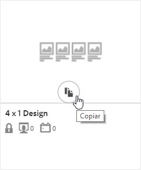
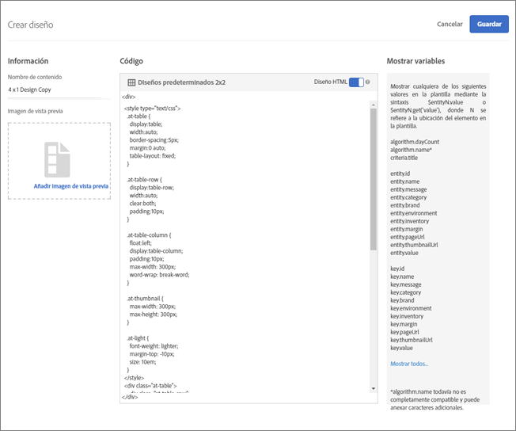
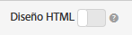

#  Crear un diseño{#create-a-design}

Un diseño define el modo en que las recomendaciones aparecen en una página.

Puede crear un diseño de [!UICONTROL Recommendations] usando un diseño predeterminado o creando uno personalizado. La pantalla **[!UICONTROL Recommendations > Diseños]** muestra tanto las tarjetas de diseño predeterminadas como los diseños que se han creado en la cuenta.

Tenga en cuenta la siguiente información cuando trabaje con diseños:

* Puede crear un diseño de recomendaciones utilizando un diseño predeterminado o puede crear un diseño personalizado.
* No se puede editar ni eliminar un diseño predeterminado.
* Puede editar, copiar o eliminar un diseño personalizado.
* Para crear un diseño basado en un diseño predeterminado, primero debe copiar el diseño y luego editar la copia.

Esta ilustración muestra el diseño predeterminado de 1 x 4:


Esta ilustración muestra un diseño personalizado:


Puede crear un diseño durante el proceso de creación de actividades desde el Compositor de experiencias visuales (VEC) o desde la biblioteca de diseño fuera de la creación de actividades. Las siguientes secciones suponen que está creando diseños desde la biblioteca, pero los pasos son similares.

## Creación de diseños

Puede crear un diseño basado en un diseño predeterminado o puede crear un diseño personalizado.

### Crear un diseño basado en un diseño predeterminado

1. Haga clic en **[!UICONTROL Recommendations]** > **[!UICONTROL Diseños]** para mostrar la biblioteca [!UICONTROL Diseños] .

   

1. Pase el ratón sobre la tarjeta del diseño que desee crear y, a continuación, haga clic en el icono **[!UICONTROL Copiar]** .

   

   Aparece el cuadro de diálogo [!UICONTROL Crear diseño] .

   

1. En el panel **[!UICONTROL Información]** , agregue un Nombre **[!UICONTROL de]** contenido y una imagen de previsualización opcional para mostrarlos en la tarjeta de diseño.

   When you use a default design, the design name and &quot;Copy&quot; appears in the **[!UICONTROL Content Name]** field. Puede editar el nombre. También puede seleccionar una imagen para mostrarla en la tarjeta de diseño.

1. (Condicional) Edite el **[!UICONTROL código]** de diseño como desee.

   Los diseños de Recommendations utilizan el lenguaje de diseño Velocity de código abierto. Puede encontrar información sobre Velocity en [https://velocity.apache.org](https://velocity.apache.org) y en [Personalizar un diseño con Velocity](/help/c-recommendations/c-design-overview/customizing-a-template.md).

   Un diseño puede ser HTML o no HTML. De forma predeterminada, los diseños HTML se encapsulan con una `<div>` etiqueta para permitir el seguimiento de clics en un entorno web. Los diseños que no son HTML son para entornos que no son de web donde los clics no se pueden rastrear. Deslice el conmutador Diseño  HTML a la posición &quot;desactivado&quot; para utilizar código que no sea HTML.

   >[!NOTE]
   >
   >El número máximo de entidades a las que se puede hacer referencia en un diseño, tanto codificadas como mediante bucles, es de 99.

1. Haga clic en **[!UICONTROL Guardar]**.

### Crear un diseño personalizado

1. Haga clic en **[!UICONTROL Recommendations]** > **[!UICONTROL Diseños]** para mostrar la biblioteca [!UICONTROL Diseños] .

1. Haga clic en **[!UICONTROL Crear diseño]**.

   Si desea basar el nuevo diseño personalizado en un diseño existente, pase el ratón sobre el diseño deseado y, a continuación, haga clic en el icono [!UICONTROL Copiar] . A continuación, puede editar la copia para crear un nuevo diseño personalizado.

1. Añada un nombre **[!UICONTROL de contenido]** y una imagen de previsualización opcional.

1. (Condicional) Edite el **[!UICONTROL código]** de diseño como desee.

   Consulte la información del paso 4 anterior para obtener más información.

1. Haga clic en **[!UICONTROL Guardar]**.

## Editar, copiar o eliminar un diseño

Recuerde que no puede editar ni copiar un diseño predeterminado; solo puede copiar diseños predeterminados.

Pase el ratón sobre el diseño deseado en la biblioteca de [!UICONTROL diseño] y, a continuación, haga clic en el icono correspondiente: editar, copiar o eliminar.


Puede copiar un diseño existente para crear un diseño de duplicado que luego pueda modificar. Esto le permite crear un diseño similar con menos esfuerzo.

Tenga en cuenta que los diseños están disponibles en toda la cuenta. Asegúrese de tener esto en cuenta antes de eliminar un diseño. Los diseños eliminados no se pueden recuperar.

## Ejemplo de JSON {#section_75BFB2537CFF4FBD9B560F59EB32C8DD}

El siguiente ejemplo muestra cómo se pueden devolver las respuestas JSON al configurar una actividad mediante el editor basado en formularios.

1. Cree un diseño desde la biblioteca de diseño o dentro del flujo de trabajo basado en formularios. Si intenta hacerlo desde el flujo de trabajo del Compositor de experiencias visuales (VEC), solo podrá crear diseños HTML, que se engloban dentro de   `<div>` para fines de seguimiento de clics.

1. Compruebe que la opción “Diseño HTML” esté desactivada:

   

1. El siguiente código es un ejemplo de lo que se puede pegar en el diseño:

   ```
       #* 
       * "Return a simple list of recommended entity ids"   
       *#
   
       {   
         "notes":{   
         "purpose": "Return a simple list of recommended entity ids",   
         "use-case": "Use this approach if you prefer to do a real-time lookup of entity attribute details (such as inventory, price, rating) from another system (such as a CMS, PIM or ecommerce platform)",   
         "version": "01"   
         },   
         "recommendedItems": {   
           "key": "$key.id",   
           "slot-01": "$entity1.id",   
           "slot-02": "$entity2.id",   
           "slot-03": "$entity3.id",   
           "slot-04": "$entity4.id",   
           "slot-05": "$entity5.id",   
           "slot-06": "$entity6.id",   
           "slot-07": "$entity7.id",   
           "slot-08": "$entity8.id",   
           "slot-09": "$entity9.id",   
           "slot-10": "$entity10.id"   
         }   
       }  
   ```

1. Set up a form-based [!DNL Recommendations] activity that uses this design.

   1. Navigate to the **[!UICONTROL Activities]** page.
   1. Haga clic en **[!UICONTROL Crear actividad]** > **[!UICONTROL Recomendaciones]**.
   1. En **[!UICONTROL Elegir el Compositor]** de experiencias, seleccione **[!UICONTROL Formulario]** y, a continuación, haga clic en **[!UICONTROL Siguiente]**.
   1. En Ubicación, introduzca el texto: “Sample_Recs_Response”
   1. En **[!UICONTROL Contenido predeterminado]**, haga clic en la flecha hacia abajo y, a continuación, haga clic en **[!UICONTROL Añadir recomendación]**.
   1. Elija un tipo de página. Esto determina el filtrado inicial de la siguiente pantalla.
   1. Seleccione una tarjeta Criterios y, a continuación, haga clic en **[!UICONTROL Siguiente]**.
   1. Select the design you created in the previous step, then click **[!UICONTROL Next]**.
   1. Complete el proceso de configuración.
   1. Haga clic en la flecha derecha situada junto a **[!UICONTROL Inactivo]** y, a continuación, seleccione **[!UICONTROL Activar]**.

1. Una vez configurada y activada la actividad, puede configurar una solicitud de muestra para recuperar la respuesta JSON limpia.

   From the time that you save your activity, [!DNL Target] will need to build a model to support the selected criteria configuration. En función de una serie de factores, esto puede llevar cierto tiempo. Los resultados aparecen una vez creado el modelo.

   Por ejemplo:

   ```
   https://[YOUR_CLIENT_CODE].tt.omtrdc.net/m2/YOUR_CLIENT_CODE/ubox/raw?mbox=[YOUR_MBOX_NAME]&mboxContentType=text/html&mboxXDomain=disabled&entity.id=[ENTITY_ID]&mboxHost=rawbox_sample&at_property=[AT_PROPERTY_TOKEN]&mboxNoRedirect=true&mboxPC=1234-4321&mboxSession=9876-7000
   ```

   donde

   | Parámetro | Valor |
   |--- |--- |
   | `[YOUR_CLIENT_CODE]` | Código de cliente de Target (disponible en ../target/products.html#recsSettings > Token de API de Recommendations > Código de cliente). |
   | `[YOUR_MBOX_NAME]` | Nombre seleccionado en la sección &quot;ubicaciones&quot; del Recommendations basado en formularios, en este caso Sample_Recs_Response. |
   | `[ENTITY_ID` | El `entity.id` de un artículo del catálogo. |
   | `[AT_PROPERTY_TOKEN]` | (Opcional) Añada este parámetro si ha seleccionado una Propiedad (parte de los permisos de empresa) durante la configuración de la actividad. |

Cuando se haya ejecutado el algoritmo y tenga los resultados, su respuesta tendría que parecerse a esta:

{width=&quot;575px&quot;}

## Additional JSON object tips and tricks {#section_C305673C68944749969DB239E3221DC2}

También puede enviar una sencilla lista de elementos delimitada por comas configurando un diseño con la sintaxis siguiente:

```
entity1.id, $entity2.id, $entity3.id, $entity4.id, $entity5.id, 
```

Alternativamente, también puede enviar información adicional en la respuesta. El siguiente archivo de código es un ejemplo más complejo que devuelve mucho más que los identificadores de la entidad con sus espacios asociados (solicitud). This design example also returns activity details, Target Profile details (as applicable), and other `entity.attributes` associated with the items returned.

```
    {   
     "adobeRecommendations": {   
      "notes": {   
       "purpose": "Return a list of entity ids with their associated entity.attributes",   
       "use-case": "Use this approach to avoid looking up attribute details after receiving a response from Target",   
       "version": "01"   
      },   
      "recommendedItems": {   
       "slot-01": "$entity1.id",   
       "slot-02": "$entity2.id",   
       "slot-03": "$entity3.id",   
       "slot-04": "$entity4.id",   
       "slot-05": "$entity5.id",   
       "slot-06": "$entity6.id",   
       "slot-07": "$entity7.id",   
       "slot-08": "$entity8.id",   
       "slot-09": "$entity9.id",   
       "slot-10": "$entity10.id"   
      },   
      "activityDetails": {   
       "mbox.name": "email-mbox",   
       "campaign.name": "\${campaign.name}",   
       "campaign.id": "\${campaign.id}",   
       "campaign.recipe.name": "\${campaign.recipe.name}",   
       "campaign.recipe.id": "\${campaign.recipe.id}",   
       "offer.name": "\${offer.name}",   
       "offer.id": "\${offer.id}",   
       "criteria.title": "$criteria.title",   
       "algorithm.name": "$algorithm.name",   
       "algorithm.dayCount": "$algorithm.dayCount"   
      },   
      "visitorProfile": {   
       "profile.favorite-category": "\${profile.favorite-category}",   
       "profile.test": "\${profile.test}",   
       "user.endpoint.lastPurchasedEntity": "\${user.endpoint.lastPurchasedEntity}",   
       "user.endpoint.lastViewedEntity": "\${user.endpoint.lastViewedEntity}",   
       "user.endpoint.mostViewedEntity": "\${user.endpoint.mostViewedEntity}",   
       "user.endpoint.categoryAffinity": "\${user.endpoint.categoryAffinity}",   
       "profile.geolocation.city": "\${profile.geolocation.city}",   
       "profile.geolocation.dma": "\${profile.geolocation.dma}",   
       "profile.geolocation.state": "\${profile.geolocation.state}",   
       "profile.geolocation.country": "\${profile.geolocation.country}",   
       "profile.sessionCount": "\${profile.sessionCount}",   
       "profile.averageDaysBetweenVisits": "\${profile.averageDaysBetweenVisits}",   
       "profile.browserTime": "\${profile.browserTime}",   
       "user.activeActivities": "\${user.activeActivities}",   
       "user.pcId": "\${user.pcId}",   
       "user.isFirstSession": "\${user.isFirstSession}",   
       "user.isNewSession": "\${user.isNewSession}",   
       "user.header": "\${user.header}",   
       "user.parameter": "\${user.parameter}"   
      },   
      "recKey": {   
       "recKeyDetails": {   
        "id": "$key.id",   
        "name": "$key.name",   
        "category": "$key.category",   
        "pageUrl": "$key.pageUrl",   
        "thumbnailUrl": "$key.thumbnailUrl"   
       }   
      },   
      "recDetailedResults": {   
       "recEntity1Details": {   
        "id": "$entity1.id",   
        "name": "$entity1.name",   
        "category": "$entity1.category",   
        "pageUrl": "$entity1.pageUrl",   
        "thumbnailUrl": "$entity1.thumbnailUrl"   
       },   
       "recEntity2Details": {   
        "id": "$entity2.id",   
        "name": "$entity2.name",   
        "category": "$entity2.category",   
        "pageUrl": "$entity2.pageUrl",   
        "thumbnailUrl": "$entity2.thumbnailUrl"   
       },   
       "recEntity3Details": {   
        "id": "$entity3.id",   
        "name": "$entity3.name",   
        "category": "$entity3.category",   
        "pageUrl": "$entity3.pageUrl",   
        "thumbnailUrl": "$entity3.thumbnailUrl"   
       },   
       "recEntity4Details": {   
        "id": "$entity4.id",   
        "name": "$entity4.name",   
        "category": "$entity4.category",   
        "pageUrl": "$entity4.pageUrl",   
        "thumbnailUrl": "$entity4.thumbnailUrl"   
       },   
       "recEntity5Details": {   
        "id": "$entity5.id",   
        "name": "$entity5.name",   
        "category": "$entity5.category",   
        "pageUrl": "$entity5.pageUrl",   
        "thumbnailUrl": "$entity5.thumbnailUrl"   
       },   
       "recEntity6Details": {   
        "id": "$entity6.id",   
        "name": "$entity6.name",   
        "category": "$entity6.category",   
        "pageUrl": "$entity6.pageUrl",   
        "thumbnailUrl": "$entity6.thumbnailUrl"   
       },   
       "recEntity7Details": {   
        "id": "$entity7.id",   
        "name": "$entity7.name",   
        "category": "$entity7.category",   
        "pageUrl": "$entity7.pageUrl",   
        "thumbnailUrl": "$entity7.thumbnailUrl"   
       },   
       "recEntity8Details": {   
        "id": "$entity8.id",   
        "name": "$entity8.name",   
        "category": "$entity8.category",   
        "pageUrl": "$entity8.pageUrl",   
        "thumbnailUrl": "$entity8.thumbnailUrl"   
       },   
       "recEntity9Details": {   
        "id": "$entity9.id",   
        "name": "$entity9.name",   
        "category": "$entity9.category",   
        "pageUrl": "$entity9.pageUrl",   
        "thumbnailUrl": "$entity9.thumbnailUrl"   
       },   
       "recEntity10Details": {   
        "id": "$entity10.id",   
        "name": "$entity10.name",   
        "category": "$entity10.category",   
        "pageUrl": "$entity10.pageUrl",   
        "thumbnailUrl": "$entity10.thumbnailUrl"   
       }   
      }   
     }   
    }  
```

## Training video: Create custom designs in Recommendations (3:20) 

Este vídeo contiene la información siguiente:

* Crear un diseño personalizado
* Cómo hacer referencia a las variables de visualización en los diseños

>[!VIDEO](https://video.tv.adobe.com/v/27687)
