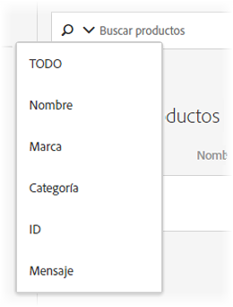

#  Búsqueda en el catálogo{#catalog-search}

The [!UICONTROL Catalog Search] page helps you locate the products or content in your catalog.

Los catálogos hacen referencia a todo el conjunto de productos (entidades). El catálogo puede contener muchas colecciones, una forma de organizar los productos en bloques lógicos.

To access the [!UICONTROL Catalog Search] page, click **[!UICONTROL Recommendations]** > **[!UICONTROL Catalog Search]**.

La tarea más básica que puede realizar en esta página es buscar un elemento. Además, puede cambiar el entorno; guardar los resultados de la búsqueda en colecciones o exclusiones; agregue, elimine o reorganice columnas en la tabla y agregue nuevas facetas de búsqueda al panel [!UICONTROL Filtros] .

## Buscar un elemento

Puede utilizar una búsqueda simple o avanzada para buscar elementos en el catálogo.

### Realizar una búsqueda simple

1. Escriba un término de búsqueda en el campo **[!UICONTROL Buscar productos]** .

1. (Opcional) Puede restringir la búsqueda seleccionando una opción de búsqueda en el menú de opciones que se muestra al hacer clic en la flecha hacia abajo del campo de búsqueda.

   

   Las opciones de búsqueda son las siguientes:

   * TODOS - Busca en todos los demás criterios de búsqueda, utilizando la lógica OR.
   * Nombre
   * Marca
   * Categoría
   * ID
   * Mensaje

1. Ahora puede desplazarse por los elementos de los resultados de búsqueda hasta las miniaturas de vista y otra información del producto.

   En la siguiente ilustración se muestran los resultados de &quot;bicicleta&quot; con la opción Todo.

   

   El número que se muestra junto a “Productos” es el número de productos que coincide con el término de búsqueda, con respecto al total disponible en el entorno especificado.

   Observe que puede utilizar la funcionalidad de búsqueda de autocompletar. En la siguiente ilustración, al escribir &quot;bik&quot; se devuelven todos los productos que contienen la palabra &quot;bici&quot;.

   

   >[!NOTE]
   >
   >Cuando se realiza una búsqueda de catálogo en un atributo personalizado con un valor numérico, los resultados tratan el atributo personalizado como un tipo de cadena en lugar de un valor numérico.
   >
   >Actualmente, no hay ninguna funcionalidad disponible que permita a los clientes cambiar el tipo de un atributo. Para realizar un cambio, [abra un problema](/help/cmp-resources-and-contact-information.md#reference_ACA3391A00EF467B87930A450050077C) de cliente que haga referencia a los atributos que necesitan que el tipo cambie de cadena a numérico.

1. También puede utilizar filtros para encontrar el producto deseado. En el siguiente ejemplo, expandiendo la faceta [!UICONTROL Colecciones] y seleccionando &quot;Herramientas de bicicleta&quot;, se muestran todas las herramientas de bicicleta del catálogo.

   

1. Puede buscar más en la lista de resultados introduciendo un término de búsqueda, por ejemplo &quot;chain&quot;.

   

### Realizar una búsqueda avanzada {#advanced-search}

Puede utilizar la búsqueda  avanzada para restringir aún más los resultados de búsqueda o para guardar los resultados de búsqueda como una [colección](/help/c-recommendations/c-products/collections.md) o [exclusión](/help/c-recommendations/c-products/exclusions.md).

1. Haga clic en el vínculo Búsqueda **** avanzada.

   

1. Utilice las listas desplegables para especificar el parámetro, el operador y los valores de la búsqueda.

1. (Opcional) Haga clic en **[!UICONTROL Añadir regla]** para agregar una regla de búsqueda adicional.

   Cada regla de búsqueda adicional se une con el operador Y.

1. Haga clic en **[!UICONTROL Buscar]**.

1. (Opcional) Haga clic en **[!UICONTROL Guardar como]** y, a continuación, en **[!UICONTROL Colección]** o **[!UICONTROL Exclusión]**.

   

   Para obtener más información, consulte [Crear una colección o exclusión basada en la búsqueda](#save-as) avanzada a continuación.

## Vista de los detalles de un elemento

Puede realizar la vista de los detalles de un elemento individual, incluso el ID, el nombre, el mensaje, la categoría, etc. mediante la visualización de sus detalles.

1. Haga clic en un elemento en los resultados de búsqueda para vista de sus detalles.

   

## Eliminar un elemento del catálogo

1. Haga clic en un elemento en los resultados de búsqueda para vista de sus detalles.

1. Haga clic en **[!UICONTROL Eliminar del catálogo]**.

1. Confirme que desea eliminar el elemento.

Toda la información sobre ese elemento se elimina del índice del catálogo. El elemento solo se incluirá en el catálogo si se vuelve a agregar en una fuente de datos. Un elemento eliminado debe eliminarse por separado de las fuentes.

## Actualizar el catálogo

El índice del catálogo se crea automáticamente al cargar la primera fuente y se actualiza según la programación especificada.

El catálogo se actualiza automáticamente cuando se reciben actualizaciones mediante archivos de fuentes, API o actualizaciones de mbox. Las actualizaciones se suelen completar en una hora. Si las actualizaciones están en curso, se muestra la hora en la que se inició la más reciente. Si no hay actualizaciones en curso, se muestra la hora de inicio y finalización de la más reciente.

## Crear una colección o exclusión basada en la Búsqueda avanzada {#save-as}

Puede crear [colecciones](/help/c-recommendations/c-products/collections.md) o [exclusiones](/help/c-recommendations/c-products/exclusions.md) con Búsqueda avanzada en la página Búsqueda en el catálogo ([!UICONTROL Recommendations] > [!UICONTROL Búsqueda en el catálogo] > [!UICONTROL Búsqueda avanzada]).

1. Realice una búsqueda avanzada.

1. Haga clic en **[!UICONTROL Guardar como]** y, a continuación, en **[!UICONTROL Colección]** o **[!UICONTROL Exclusión]**.

   

   >[!IMPORTANT]
   >
   >The [!UICONTROL Advanced Search] functionality is case-insensitive; however, products returned at the time of delivery are based on case-sensitive search. Esta diferencia puede llevar a confusiones. Ensure that you consider case-sensitivity when you create collections or exclusions based on results using the [!UICONTROL Advanced Search] functionality. Por ejemplo, si busca “Vacaciones”, obtendrá resultados que contienen “Vacaciones” y “vacaciones”. Si a continuación crea un catálogo con la intención de obtener productos que contengan “vacaciones”, solo se devolverán los productos que contienen “vacaciones”, pero no los productos que contengan “Vacaciones”. Las exclusiones se gestionan de forma similar.

## Cambiar el entorno

[Los entornos](/help/administrating-target/environments.md) le permiten organizar sus sitios y entornos de preproducción para facilitar la gestión y el sistema de informes separado.

1. Haga clic en el vínculo Entorno.

   

1. Seleccione el entorno que desee.

## Modificar la página Buscar en el catálogo (filtros y columnas)

Puede modificar temporalmente los filtros y las columnas disponibles en la página [!UICONTROL Buscar] en el catálogo de la sesión actual.

### Modificar filtros

Puede agregar facetas de filtro adicionales a la página Búsqueda [!UICONTROL de] catálogo.

1. En el panel **[!UICONTROL Filtros]** , haga clic en **[!UICONTROL Modificar]**.

   

1. Seleccione las facetas de búsqueda deseadas (ID, nombre, mensaje, etc.).

   

Tenga en cuenta que las facetas de filtro adicionales solo están disponibles en la sesión actual.

### Modificar columnas

Puede modificar temporalmente las columnas activas en la página Búsqueda [!UICONTROL de] catálogo.

1. Click the **[!UICONTROL Columns]** link.

   

1. (Condicional) Para reordenar el orden de las columnas activas, arrastre y suelte las columnas en la sección Columnas **** activas en el orden deseado.

1. (Condicional) Arrastre y suelte los elementos desde las columnas **** activas a las columnas **** inactivas (y viceversa), según lo desee.

   También puede hacer clic en el icono Eliminar ( x ) al lado de la columna que desee mover de la sección activa a inactiva.

Tenga en cuenta que los cambios que realice solo se aplicarán a la sesión actual.

