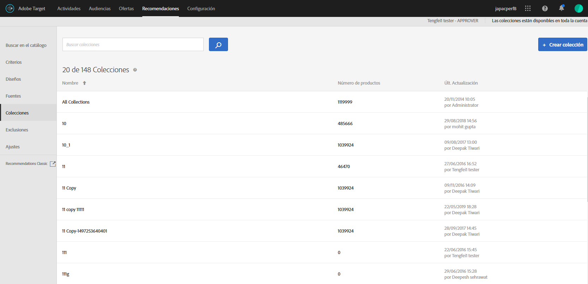

#  Colecciones

Una colección es un conjunto de productos o artículos que cumplen los criterios para ser mostrados como recomendación. Una colección se define especificando las condiciones que deben cumplir los elementos para formar parte de ella.

Normalmente, una colección es un conjunto de artículos similares o relacionados, como una única colección de productos. Sin embargo, puede agrupar cualquier artículo en una categoría que tenga sentido para su negocio, como los productos de una determinada gama de precios o color o los artículos que puedan resultar interesantes en una zona geográfica concreta.

Utilice las colecciones para organizar sus productos en bloques lógicos. Por ejemplo, si algunos artículos están disponibles en una región pero no en otra, puede crear una colección que excluya los artículos que no están disponibles en la región del visitante. También puede usar las colecciones para organizar los artículos por temporadas, o cualquier otro parámetro de organización que sea útil para su negocio.

Las [recomendaciones de copia de seguridad](/help/c-recommendations/c-algorithms/backup-recs.md) generadas para cada criterio dentro de la recomendación también utilizan esta colección. Por esta razón, en la recomendación de copia de seguridad solo se incluyen los artículos de la recomendación. Con las colecciones, tendrá la garantía de que solo se mostrarán aquellos productos que tenga sentido mostrar en una ubicación.

Las colecciones se vuelven a generar o se actualizan cada vez que se ejecuta un criterio.

Los artículos se pueden agrupar en catálogos y después crear recomendaciones independientes para cada colección.

Los criterios de inclusión permiten realizar cosas parecidas a las de una colección, pero deben configurarse cada vez que crea una actividad. Las colecciones permiten crear un conjunto de artículos de una sola vez, y luego usarla cada vez que resulte apropiado, sin tener que volver a configurarlas.

Al crear o editar una actividad de [!DNL Recommendations], el nombre de la colección aparece junto a la etiqueta [!UICONTROL Criterios] en el diagrama de actividades.

>[!NOTE]
>
>Las colecciones no se aplican al utilizar la clave de recomendación [!UICONTROL Artículos vistos recientemente].

## Creación de una colección {#task_1256DFF6842141FCAADD9E1428EF7F08}

Cree una colección para organizar los productos o el contenido que desee mostrar en sus recomendaciones.

1. Haga clic en **[!UICONTROL Recomendaciones]** > **[!UICONTROL Colecciones]** para visualizar la lista de colecciones existentes.

   

   La página [!UICONTROL Collections] muestra una lista de las colecciones existentes. Para crear nuevas colecciones, haga clic en el botón [!UICONTROL Crear colección]. También puede editar, copiar y eliminar colecciones existentes pasando el puntero sobre la colección deseada y haciendo clic en el icono deseado.

   

   El “Número de elementos” registrado para cada colección en la vista de la lista [!UICONTROL Colecciones] es el número de productos que coinciden con las reglas para esa colección en el [grupo de hosts](/help/administrating-target/hosts.md) (entorno) configurado como predeterminado en Recommendations. Para cambiar el grupo de hosts predeterminado, consulte [Configuración](/help/c-recommendations/plan-implement.md#concept_C1E1E2351413468692D6C21145EF0B84).

1. Haga clic en **[!UICONTROL Crear colección]**.

1. (Condicional) Elija un entorno del filtro **[!UICONTROL Entorno]** mientras crea (o actualiza) una colección para obtener una vista previa del contenido de dicha colección en ese entorno. De forma predeterminada, se muestran los resultados del grupo de hosts predeterminado.

   

1. Introduzca un **[!UICONTROL Nombre]** para la colección.

   También puede escribir una **[!UICONTROL Descripción opcional]**.

1. Defina las reglas que se usarán para compilar la colección.

   Por ejemplo, la colección se puede crear en función de un ID de producto, una categoría, un margen o cualquier otro parámetro de la lista.

   Puede añadir reglas para usar varios parámetros para definir una colección. Las reglas múltiples se unen con un operador AND. Todas las reglas especificadas deben coincidir con la colección que se va a aplicar.

1. Haga clic en **[!UICONTROL Guardar]**.

## Crear una colección utilizando Búsqueda avanzada

También puede crear colecciones utilizando Búsqueda avanzada en la página [Búsqueda en el catálogo](/help/c-recommendations/c-products/catalog-search.md#save-as) ([!UICONTROL Recommendations] > [!UICONTROL Búsqueda en el catálogo] > [!UICONTROL Búsqueda avanzada]).

Después de crear una búsqueda utilizando “id > contiene”, por ejemplo, puede hacer clic en [!UICONTROL Guardar como] > [!UICONTROL Colección].

>[!IMPORTANT]
>
>La función Búsqueda avanzada diferencia entre mayúsculas y minúsculas; sin embargo, los productos devueltos en el momento de la entrega se basan en la búsqueda que diferencia entre mayúsculas y minúsculas. Esta diferencia puede llevar a confusiones. Asegúrese de tener en cuenta las mayúsculas y minúsculas al crear colecciones basadas en resultados que utilizan la funcionalidad Búsqueda avanzada. Por ejemplo, si busca “Vacaciones”, obtendrá resultados que contienen “Vacaciones” y “vacaciones”. Si a continuación crea un catálogo con la intención de obtener productos que contengan “vacaciones”, solo se devolverán los productos que contienen “vacaciones”, pero no los productos que contengan “Vacaciones”.

## Editar, copiar o eliminar una colección

Pase el ratón sobre la colección que quiera de la lista y luego haga clic en el icono correspondiente: editar, copiar o eliminar.

Puede copiar una colección existente para crear una colección duplicada que luego pueda modificar. Esto permite crear una exclusión similar con menos esfuerzo.

Tenga en cuenta que las colecciones están disponibles en toda la cuenta. Asegúrese de tener esto en cuenta antes de eliminar una colección. Las colecciones eliminadas no se pueden recuperar.

## Uso de una colección en una actividad de Recommendations

1. Cree una colección utilizando uno de los métodos mencionados anteriormente.

1. Haga clic en **[!UICONTROL Actividades]** y [cree una nueva actividad de Recommendations](/help/c-recommendations/t-create-recs-activity/create-recs-activity.md) o edite una actividad existente.

1. Después de seleccionar un criterio y un diseño, se muestra la página [!UICONTROL Opciones] donde seleccionó la colección deseada.

   

1. (Condicional) Para cambiar una configuración de recopilación existente, en la página **[!UICONTROL Experiencias]** (paso 2 del flujo de trabajo guiado de tres partes), haga clic en una ubicación en la que colocó las recomendaciones, haga clic en **[!UICONTROL Cambiar colección]** y seleccione la colección que desee.

   

## Vídeo de formación: Creación de colecciones y exclusiones en Recommendations (7:05) 

Este vídeo contiene la información siguiente:

* Creación de una colección
* Creación de una exclusión

>[!VIDEO](https://video.tv.adobe.com/v/27689)
