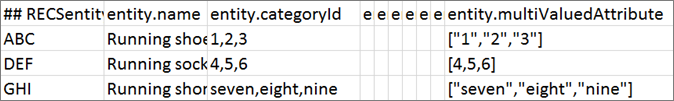

#  Atributos de entidad personalizados{#custom-entity-attributes}

Use single- and multi-value custom entity attributes in [!DNL Adobe Target Recommendations] to define additional information about items in your catalog.

## Límites {#limits}

Puede incluir hasta 100 atributos de entidad personalizados para definir información adicional sobre los artículos de su catálogo. Por ejemplo, puede crear un atributo personalizado llamado `entity.genre` para definir un libro o una película. O un vendedor de entradas podría crear atributos del lugar de celebración para incluir un actor secundario, como un equipo visitante en un evento deportivo o un acto de apertura en un concierto.

La longitud máxima de los atributos personalizados de entidad de un solo valor es de 15 000 caracteres (para idiomas con codificación UTF-8 de uno y dos bytes, como inglés y otros alfabetos latinos) o 10 000 caracteres (para lenguajes con codificación UTF-8 de tres bytes, como chino, japonés y coreano).

Los atributos personalizados de entidad de varios valores no pueden contener más de 500 valores. Cada valor individual está limitado a 100 caracteres. El número total de caracteres en todos los valores debe cumplir las limitaciones de la longitud máxima de atributos personalizados de entidad de un solo valor (véase arriba).

## Custom entity attribute values {#section_313331A9F8194A89B5EDD89363018651}

Los atributos de entidad personalizados pueden contener uno o varios valores. Los valores de los atributos de entidad se muestran en la vista del producto.


Un atributo de entidad personalizado con un solo valor tiene el mismo formato que un atributo de entidad predefinido de un solo valor:

`entity.genre=genre1`

Un atributo de entidad personalizado con varios valores se debe enviar como una matriz de JSON válida:

`entity.genre=[“genre1”, “genre2”]`

Estos son ejemplos de matrices de JSON válidas compatibles con [!DNL Recommendations]:

* `["AB","BC"]` todos los valores son cadenas
* `[1,2]` todos los valores son numéricos

>[!NOTE]
>
>[!DNL Recommendations] no admite mezclas de tipos de valores en los atributos de entidad de varios valores. Por ejemplo, `["AB",1,true, [1,2,3]]` es una matriz de JSON válida, pero [!DNL Recommendations] no la admite porque incluye una mezcla de tipos de valores (cadena, número, booleano, objeto).

Cuando un atributo personalizado se envía como matriz de JSON válida, se trata como un atributo de varios valores en todos los productos del catálogo.

>[!NOTE]
>
>Para cambiar un atributo de varios valores a otro que sea de un valor, tiene que eliminar el catálogo y cargar los datos de los productos corregidos. Al eliminar el catálogo, no se eliminan los datos históricos asociados con los identificadores de los productos. Consulte [Eliminar todos los artículos del sistema](/help/assets/adobe-recommendations-classic.pdf) en la documentación de *Adobe Recommendations Classic* para obtener más información.

**Restricciones**:

* No se pueden usar nombres de atributos de entidad predefinidos para atributos de entidad personalizados. (Consulte [Atributos de entidad](/help/c-recommendations/c-products/entity-attributes.md#reference_3BCC1383FB3F44F4A2120BB36270387F)).
* El atributo `entity.environment` se reserva para el sistema y no se puede usar en atributos de entidad personalizados. Se hará caso omiso de los intentos de pasar `entity.environment` usando `targetPageParams`, fuentes o API.
* Las matrices deben contener un solo tipo de valor. Las matrices con valores mezclados (`["AB",1,true]`) no se admiten.
* Un atributo de varios valores que incluye una matriz de JSON anidada (`[10,12,[1,2,3]]`) se trata como un atributo de un valor.

## Implementing multi-value attributes {#section_80FEFE49E8AF415D99B739AA3CBA2A14}

Los atributos de entidad personalizados de varios valores se admiten al usar fuentes (CSV), `targetPageParams`, la API Entrega y la API Guardar entidades para cargar productos. Los valores nuevos reemplazan a los actuales, no se adjuntan. Las matrices vacías ([]) se tratan como si no tuvieran valores.

Las comillas dobles se deben escapar. Por ejemplo, `"[""test"", ""value""]"` es una matriz JSON válida que se pueden usar en CSV.

Puede incluir hasta 500 valores en un atributo multivalor.

### Usar targetPageParams

En el siguiente ejemplo vemos cómo se utiliza  `targetPageParams`

```
function targetPageParams() { 
  return { 
    'entity.id':                   '123', 
    'entity.categoryId':            '["A", "A:B", "A:B:C", "A:B:C:D"]',        
    'entity.MultiValueAttribute':   '["X", "Y", "Z"]', 
    'entity.event.detailsOnly':     'true', 
    'excludedIds":                  '[123, 3232, 2323, 4344]', 
    'orderId":                      '123456', 
    'orderTotal":                   '195.32', 
    'productPurchaseId":            '[001,002,003]' 
  }; 
}
```

### Usar CSV

Puede administrar los archivos CSV sin procesar mediante un editor de texto o usar un programa de hojas de cálculo.

El CSV sin procesar tendrá este aspecto:


El mismo catálogo se verá del modo siguiente en una hoja de cálculo:



Al convertir al formato .csv, el programa de hojas de cálculo encierra entre comillas dobles el contenido de las celdas para evitar que las comas de la celda funcionen como separadores de columnas. También encierra entre comillas dobles los valores de las cadenas JSON que se incluyen en los atributos personalizados de varios valores. Esto puede hacer que trabajar directamente con el archivo sin procesar sea un poco complicado. Por ejemplo:

* Hoja de cálculo: `["1","2","3"]`
* Sin procesar: `"[""1"",""2"",""3""]"`

Tenga cuidado al editar directamente un archivo CSV de catálogo sin procesar.

### Usar API

Puede pasar atributos de varios valores mediante la API de Envío en un parámetro de mbox como un valor de cadena que contenga una matriz JSON de escape.

```
"execute": {
    "mboxes": [
      {
        "index": 0,
        "name": "first-mbox",
        "parameters": {
          "entity.id": "32323",
          "entity.categoryId": "My Category",
          "entity.MultiValueAttribute": "[\"X\", \"Y\", \"Z\"]"
        }
      }
    ]
  }
```

See the [Adobe Recommendations API documentation](http://developers.adobetarget.com/api/recommendations) for information about using the Delivery and Save entities APIs.

## Using operators with multi-value attributes {#section_83C2288A805242D9A02EBC4F07DEE945}

Al aplicar operadores a atributos personalizados de varios valores en reglas de inclusión de algoritmos, reglas de catálogo y reglas de exclusión, el resultado es *true* si al menos un valor de la lista cumple el criterio de la operación (booleano *OR*).

En el ejemplo siguiente, la regla es  `message contains abc`.

* Caso 1: `entity.genre = ["ab", "bc", "de"]`. El resultado es false porque ningún valor contiene `abc`.
* Caso 2: `entity.genre = ["abcde","de","ef"]`. El resultado es true porque un valor contiene `abc`.

En el caso de los operadores negativos, todos los valores de atributo deben cumplir el criterio (booleano *AND*). Por ejemplo, si el operador es  `notEquals`, el resultado será *false* si algún valor coincide.

Consulte las siguientes secciones para ver el comportamiento de los operadores en las reglas de inclusión de algoritmos, las reglas de catálogo y las reglas de exclusión.

### Es igual a

Si algún valor de atributo es igual al valor de entrada, el resultado es true.

Ejemplo: `genre equals abc`

* Caso 1: `entity.genre = ["ab", "bc", "de"]`. El resultado es false porque ningún valor es igual a `abc`.
* Caso 2: `entity.genre = ["abc", "de", "ef"]`. El resultado es true porque un valor es igual a `abc`.
* Case 3: `entity.genre = ["abcde", "de", "ef"]`. El resultado es “false” porque `abc` no es igual a ningún elemento de la lista.

### No es igual a

Si ningún valor de atributo es igual al valor de entrada, el resultado es true.

Ejemplo: `genre not equals abc`

* Caso 1: `entity.genre = ["ab", "bc", "de"]`. El resultado es true porque ningún valor es igual a `abc`.
* Caso 2: `entity.genre = ["abc", "de", "ef"]`. El resultado es false porque un valor es igual a `abc`.
* Case 3: `entity.genre = ["abcde", "de", "ef"]`. El resultado es “true” porque `abc` no es igual a ningún elemento de la lista.

### Contiene

Si algún valor del atributo contiene el valor de entrada, el resultado es true.

Ejemplo: `genre contains abc`

* Caso 1: `entity.genre = ["ab", "bc", "de"]`. El resultado es false porque ningún valor contiene `abc`.
* Caso 2: `entity.genre = ["abcde", "de", "ef"]`. El resultado es true porque un valor contiene `abc`.

### No contiene

Si ningún valor del atributo contiene en valor de entrada, el resultado es true.

Ejemplo: `genre does not contain abc`

* Caso 1: `entity.genre = ["ab", "bc", "de"]`. El resultado es true porque ningún valor contiene `abc`.
* Caso 2: `entity.genre = ["abcde", "de", "ef"]`. El resultado de la regla será false porque un valor contiene`abc`.

### Comienza con

Si algún valor del atributo empieza por el valor de entrada, el resultado es true.

Ejemplo: `genre starts with abc`

* Caso 1: `entity.genre = ["ab", "bc", "de"]`. El resultado es false porque ningún valor empieza por `abc`.
* Caso 2: `entity.genre = ["abcde", "de", "ef"]`. El resultado es true porque un valor empieza por `abc`.
* Case 3: `entity.genre = ["ab", "de", "abc"]`. El resultado es “true” porque un valor comienza por `abc` (no necesariamente el primer elemento de la lista).

### Finaliza con

Si algún valor del atributo termina en el valor de entrada, el resultado es true.

Ejemplo: `genre ends with abc`

* Caso 1: `entity.genre = ["ab", "bc", "de"]`. El resultado es false porque ningún valor termina en `abc`.
* Caso 2: `entity.genre = ["deabc", "de", "ef"]`. El resultado es true porque un valor termina en `abc`.

### Es mayor o igual que (solo valores numéricos)

El valor de atributo se convierte en el doble. Los atributos que no se pueden convertir se pasan por alto al ejecutar la regla.

Tras el procesamiento, los valores mayores o iguales que el valor de entrada dan el resultado true.

Ejemplo: `price greater than or equal to 100`

* Caso 1: `entity.price = ["10", "20", "45"]`. El resultado es false porque ningún valor es mayor o igual a 100. El valor `de` se pasa por alto porque no se puede convertir en el doble.
* Caso 2: `entity.price = ["100", "101", "90", "80"]`. El resultado es true porque hay dos valores mayores o iguales a 100.

### Es menor o igual que (solo valores numéricos)

El valor de atributo se convierte en el doble. Los atributos que no se pueden convertir se pasan por alto al ejecutar la regla.

Tras el procesamiento, los valores menores o iguales que el valor de entrada dan el resultado true.

Ejemplo: `price less than or equal to 100`

* Caso 1: `entity.price = ["101", "200", "141"]`. El resultado es false porque ningún valor es menor o igual que 100. El valor `de` se pasa por alto porque no se puede convertir en el doble.
* Caso 2: `entity.price = ["100", "101", "90", "80"]`. El resultado es true porque hay dos valores menores o iguales a 100.

### Coincide dinámicamente (solo disponible en algoritmos de artículos)

Si algún valor de atributo coincide con el valor de entrada, el resultado es true.

Ejemplo: `genre matches abc`

* Caso 1: `entity.genre = ["ab", "bc", "de"]`. El resultado es false porque ningún valor coincide con `abc`.
* Caso 2: `entity.genre = ["abc", "de", "ef"]`. El resultado es true porque un valor coincide con `abc`.

### No coincide dinámicamente (solo disponible en algoritmos de artículos)

Si algún valor de atributo coincide con el valor de entrada, el resultado es false.

Ejemplo: `genre does not match abc`

* Caso 1: `entity.genre = ["ab", "bc", "de"]`. El resultado es true porque ningún valor coincide con `abc`.
* Caso 2: `entity.genre = ["abc", "de", "ef"]`. El resultado de la regla será false porque un valor coincide con `abc`.

### Se incluye dinámicamente en el rango (solo disponible en algoritmos de artículos y solo valores numéricos)

Si algún valor de atributo numérico se encuentra dentro del rango especificado, el resultado es true.

Ejemplo: `price dynamically ranges in 80% to 120% of 100`

* Caso 1: `entity.price = ["101", "200", "125"]`. El resultado es “true” porque `101` está en el rango del 80 % al 120 % de 100. El valor `de` se pasa por alto porque no se puede convertir en el doble.
* Caso 2: `entity.price = ["130", "191", "60", "75"]`. El resultado es false porque ningún valor está en el rango del 80 % al 120 % de 100.

>[!NOTE]
>
>*Doble* es un tipo de datos de Java. Con los operadores que requieren valores numéricos, convertir en doble elimina los valores no numéricos de los resultados, ya que no se tienen en cuenta.

## Multi-value attributes in designs {#section_F672E4F6E1D44B3196B7ADE89334ED4A}

Los atributos de varios valores aparecen como una lista separada por comas cuando se hace referencia a ellos en un diseño.

Ejemplo:

Cuando se hace referencia a `entity.genre=["genre1","genre2"]` en un diseño como `$entity<N>.genre`, el resultado es `genre1, genre2`.

## Temas relacionados:

* [Atributos de entidad](/help/c-recommendations/c-products/entity-attributes.md#reference_3BCC1383FB3F44F4A2120BB36270387F)
