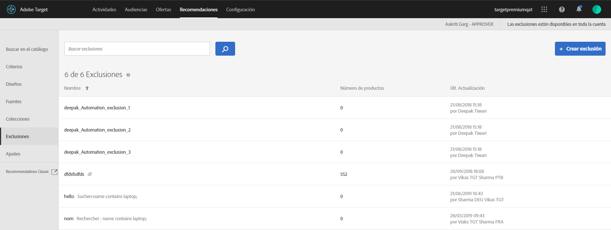

# Exclusiones{#exclusions}

Cree una exclusión en [!DNL Adobe Target Recommendations] para evitar que los productos o el contenido se recomienden a los visitantes. Una exclusión es un subconjunto de productos o contenido que no se debe recomendar a los visitantes.

Las exclusiones están disponibles en toda la cuenta. A diferencia de las colecciones, donde se especifica una colección específica para cada experiencia a medida que se crea una actividad [!UICONTROL Recommendations], las exclusiones se aplican a todas las actividades de la cuenta. No hay opción para asignar un grupo de exclusión durante la creación de la actividad.

Algunos ejemplos de veces que se utilizarían exclusiones son:

* Productos que se han interrumpido
* El catálogo de otoño/invierno es ahora el único catálogo que debería estar presente en línea. Cualquier artículo del catálogo de verano ya no está disponible para la compra.
* Elementos que podrían no ser adecuados para recomendar en la mayoría de las páginas o pantallas (productos para adultos, películas NC-17, etc.)
* Productos con campos de metadatos incompletos (falta miniatura, precio u otros metadatos importantes)
* Productos que nunca deben recomendarse (tal vez exista un SKU en el sistema para algo, pero no es un artículo que se puede comprar, o quizás sea un SKU falso para que el equipo de control de calidad simule una compra sin pedir realmente algo, etc.)

>[!IMPORTANT]
>
>Las reglas de exclusión estáticas y dinámicas son funciones potentes que pueden ayudarle en sus estrategias de marketing. Para obtener información detallada, ejemplos y casos de uso, consulte [Uso de reglas de inclusión dinámicas y estáticas](/help/c-recommendations/c-algorithms/use-dynamic-and-static-inclusion-rules.md#concept_4CB5C0FA705D4E449BD0B37B3D987F9F).

## Creación de una exclusión

1. Haga clic en **[!UICONTROL Recomendaciones]** > **[!UICONTROL Exclusiones]** para visualizar la lista de exclusiones existentes.

   

   El “Número de elementos” registrado para cada exclusión en la vista de la lista [!UICONTROL Exclusiones] es el número de productos que coinciden con las reglas para esa exclusión en el [grupo de hosts](/help/administrating-target/hosts.md) (entorno) configurado como predeterminado en Recommendations. Para cambiar el grupo de hosts predeterminado, consulte [Configuración](/help/c-recommendations/plan-implement.md#concept_C1E1E2351413468692D6C21145EF0B84).

1. Haga clic en **[!UICONTROL Crear exclusión]**.

1. (Condicional) Elija un entorno del filtro **[!UICONTROL Entorno]** mientras crea (o actualiza) una exclusión para obtener una vista previa del contenido de la exclusión en ese entorno. De forma predeterminada, se muestran los resultados del grupo de hosts predeterminado.

   

1. Escriba un **[!UICONTROL Nombre]** de exclusión e introduzca una descripción opcional.

1. Utilice el generador de reglas para crear las exclusiones.

   Seleccione un parámetro en la lista reglas, elija un operador y luego escriba uno o varios valores para identificar los productos. Separe los distintos valores con comas.

1. Haga clic en **[!UICONTROL Guardar]**.

## Cree una exclusión con Búsqueda avanzada

También puede crear exclusiones mediante [!UICONTROL Búsqueda avanzada] en la página [Búsqueda en el catálogo](/help/c-recommendations/c-products/catalog-search.md#save-as) ( [!UICONTROL Recommendations] > [!UICONTROL Búsqueda en el catálogo] > [!UICONTROL Búsqueda avanzada]).

Después de crear una búsqueda utilizando “id > contiene”, por ejemplo, puede hacer clic en [!UICONTROL Guardar como] > [!UICONTROL Exclusión].

>[!IMPORTANT]
>
>La funcionalidad [!UICONTROL Búsqueda avanzada] no distingue entre mayúsculas y minúsculas; sin embargo, los productos devueltos en el momento del envío se basan en la búsqueda que distingue entre mayúsculas y minúsculas. Esta diferencia puede llevar a confusiones. Asegúrese de tener en cuenta las mayúsculas y minúsculas al crear exclusiones basadas en resultados que utilizan la funcionalidad Búsqueda avanzada. Por ejemplo, si busca “Vacaciones”, obtendrá resultados que contienen “Vacaciones” y “vacaciones”. Si a continuación crea una exclusión con la intención de excluir productos que contengan “vacaciones”, solo se excluirán los productos que contienen “vacaciones”, pero no los productos que contengan “Vacaciones”.

## Editar, copiar o eliminar una exclusión

Pase el ratón sobre la exclusión deseada en la lista y, a continuación, haga clic en el icono correspondiente: editar, copiar o eliminar.

Puede copiar una exclusión existente para crear una exclusión de duplicado que luego pueda modificar. Esto le permite crear una exclusión similar con menos esfuerzo.

Tenga en cuenta que las exclusiones están disponibles en toda la cuenta. Asegúrese de tener esto en cuenta antes de eliminar una exclusión. No se pueden recuperar las exclusiones eliminadas.

## Vídeo de capacitación: Crear colecciones y exclusiones en Recommendations (7:05) 

Este vídeo contiene la información siguiente:

* Creación de una colección
* Creación de una exclusión

>[!VIDEO](https://video.tv.adobe.com/v/27689)