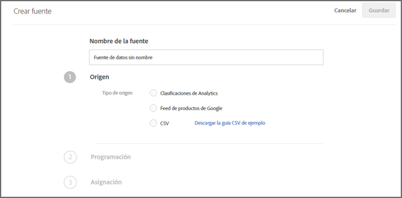
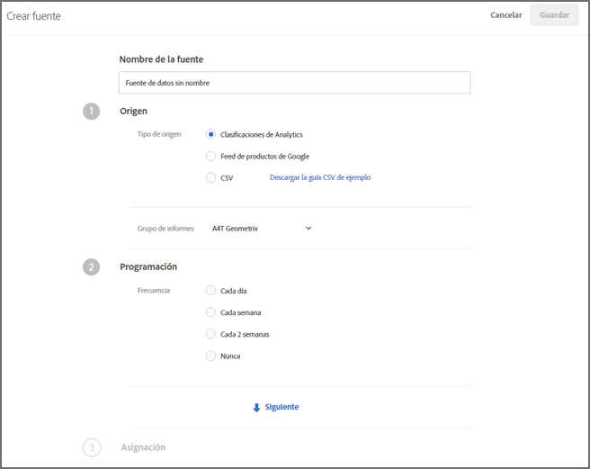

#  Fuentes{#feeds}

Utilice fuentes para obtener entidades importadas en [!DNL Adobe Target Recommendations]. Las entidades se pueden enviar con archivos CSV, el formato de fuente de Google Product Search y las clasificaciones de productos de Adobe Analytics.

## Resumen de las fuentes {#concept_D1E9C7347C5D4583AA69B02E79607890}

Las fuentes le permiten transferir [Entidades](/help/c-recommendations/c-products/products.md) o ampliar los datos de mbox con información que, o bien no está disponible en la página, o bien no es seguro enviar directamente desde la página, como margen, COGS, etc.

Las fuentes le permiten pasar información detallada del elemento a [!DNL Recommendations], como ID del producto, categoría, nombre, mensaje y otros atributos.

Puede seleccionar las columnas de su archivo de clasificaciones de productos de [!DNL Target] o del archivo de Búsqueda de productos de Google que desea enviar al servidor de [!DNL Recommendations].

Estos datos sobre cada elemento se pueden utilizar para:

* Mostrar valores en diseños
* Definir reglas de inclusión de criterios
* Ordenar elementos en diferentes colecciones
* Aplicar exclusiones a las recomendaciones

Las descripciones de los elementos se pueden pasar a [!DNL Target] mediante fuentes o mboxes. Si los datos son recopilados tanto por una fuente de entidades como por un mbox, prevalecerán los datos más recientes. Normalmente, los datos más recientes proceden de un mbox, ya que su visualización es más frecuente. En el caso improbable de que los datos de una fuente de entidades y los datos de un mbox se visiten al mismo tiempo, se utilizarán los datos del mbox.

La lista [!UICONTROL Fuentes] (**[!UICONTROL Recomendaciones]** > **[!UICONTROL Fuentes]**) proporciona información sobre cualquier fuente que haya creado.


La página Fuentes contiene las siguientes columnas:

* **Nombre**: El nombre de la fuente especificada durante la creación. Para editar el nombre de una fuente, debe editar la propia fuente. Cuando guarda la fuente con un nombre nuevo, esta se actualiza.
* **Tipo**: Los tipos incluyen [CSV](/help/c-recommendations/c-products/feeds.md#section_65CC1148C7DD448FB213FDF499D35FCA), [Fuente de productos de Google](/help/c-recommendations/c-products/feeds.md#section_8EFA98B5BC064140B3F74534AA93AFFF) y [Clasificaciones de Analytics](/help/c-recommendations/c-products/feeds.md#section_79E430D2C75443BEBC9AA0916A337E0A).
* **Estado**: [Estado actual de la fuente](/help/c-recommendations/c-products/feeds.md#concept_E475986720D1400999868B3DFD14A7A0).
* **Programación**: Muestra el programa de actualización de la fuente: Diario, Semanal, Cada 2 semanas o Nunca.
* **Elementos**: Muestra el número de elementos de la fuente.
* **Última actualización**: Muestra la fecha y la hora en que la fuente se actualizó por última vez y el nombre de la persona que ha actualizado la fuente. Si la fuente [!UICONTROL Última actualización] indica “sin definir”, esto significa que la fuente procede de [!DNL Recommendations Classic] y no se puede cambiar desde [!DNL Target Premium Recommendations].

>[!IMPORTANT]
>
>Las entidades cargadas y los atributos de entidad caducan pasados 61 días. Esto implica lo siguiente:
>
>* La fuente debe ejecutarse al menos mensualmente para asegurarse de que el contenido del catálogo no caduca.
>* La eliminación de un elemento del archivo de fuente no elimina ese elemento del catálogo. Para eliminar el elemento del catálogo, elimínelo manualmente mediante la interfaz de usuario o la API de Destinatario. O bien, modifique los atributos del artículo (como el inventario) para asegurarse de que el artículo está excluido de la consideración.


## Tipos de origen

Las entidades se pueden enviar con archivos CSV, el formato de fuente de Google Product Search y las clasificaciones de productos de Adobe Analytics.

### CSV {#section_65CC1148C7DD448FB213FDF499D35FCA}

Puede crear un archivo .csv utilizando el formato de carga CSV de propiedad de Adobe. El archivo contiene información de visualización sobre los atributos reservados y personalizados para sus productos. Para cargar atributos específicos de su implementación, reemplace `CustomN` en la fila del encabezado con el nombre del atributo que desea utilizar. En el ejemplo siguiente, `entity.Custom1` ha sido reemplazado por `entity.availability`. A continuación, puede subir de forma masiva el archivo al servidor de [!DNL Recommendations].

El uso del formato .csv tiene las siguientes ventajas sobre el formato de Google Feed:

* No requiere asignaciones de campo.
* Admite atributos multivalor (vea el siguiente ejemplo).
* Admite hasta 100 atributos personalizados. Si necesita más de 100 atributos personalizados, puede crear un segundo archivo de fuente con un conjunto diferente de atributos personalizados específicos.

Utilice el método de carga masiva para enviar la información de visualización si no tiene mboxes en la página o si desea complementar dicha información con artículos que no estén disponibles en el sitio. Por ejemplo, es posible que desee enviar la información del inventario de que no esté publicada en el sitio.

Cualquier dato cargado con el archivo .csv, fuente de producto de Google o fuente de clasificación de productos Analytics sobrescribe el valor de atributo de entidad existente en nuestra base de datos. Si envía información de precios mediante solicitudes mbox y, a continuación, envía valores de precios diferentes en el archivo, los valores del archivo sobrescriben los valores establecidos en la solicitud mbox. Una excepción a esto es el atributo de entidad `categoryId` donde los valores de categoría se anexan en lugar de sobrescribirse hasta el límite de 250 caracteres.

>[!IMPORTANT]
>
>No escriba los valores entre comillas dobles (&quot;) en el archivo .csv a menos que sean deliberadas. Si coloca los valores entre comillas dobles, debe escaparlos escribiendo otro par de comillas dobles. Las comillas dobles sin escape evitan que la fuente de recomendaciones no se cargue correctamente.

Por ejemplo, la sintaxis siguiente es incorrecta:

```
"Apples "Bananas" Grapes"",
```

La sintaxis correcta sería esta:

```
"Apples ""Bananas"" Grapes""",
```

>[!NOTE]
>
>No se puede sobrescribir un valor existente con un valor en blanco. Debe pasar otro valor en su lugar para sobrescribirlo. En el caso del precio de venta, se suele enviar un “NULL” real u otro mensaje. A continuación, puede escribir una regla de plantilla para excluir los artículos con el valor en cuestión.

El producto está disponible en la interfaz de administración de aproximadamente dos horas después de cargar su entidad correctamente.

El siguiente es un código de muestra de un archivo .csv:

```
## RECSRecommendations Upload File 
## RECS''## RECS'' indicates a Recommendations pre-process header. Please do not remove these lines. 
## RECS 
## RECSUse this file to upload product display information to Recommendations. Each product has its own row. Each line must contain 19 values and if not all are filled a space should be left. 
## RECSThe last 100 columns (entity.custom1 - entity.custom100) are custom. The name 'customN' can be replaced with a custom name such as 'onSale' or 'brand'. 
## RECSIf the products already exist in Recommendations then changes uploaded here will override the data in Recommendations. Any new attributes entered here will be added to the product''s entry in Recommendations. 
## RECSentity.id,entity.name,entity.categoryId,entity.message,entity.thumbnailUrl,entity.value,entity.pageUrl,entity.inventory,entity.margin,entity.last_updated_by,entity.multi_english,entity.availability,entity.tax_country,entity.tax_region,entity.tax_rate,entity.product_type,entity.item_group_id,entity.color,entity.size,entity.brand,entity.gtin 
na3456,RipCurl Watch with Titanium Dial,Watches & Sport,Cutting edge titanium with round case,https://example.com/s7/na3456_Viewer,425,https://example.com/shop/en-us/na3456_RipCurl,24,0.25,csv,"[""New"",""Web"",""Sales"",""[1,2,34,5]""]",in stock,US,CA,9.25,Shop by Category > Watches,dz1,Titanium,44mm,RipCurl,"075380 01050 5" 
na3457,RipCurl Watch with Black Dial,Watches & Sport,Cutting edge matte black with round case,https://example.com/s7/na3457_Viewer,275,https://example.com/shop/en-us/na3457_RipCurl,24,0.27,csv,"[""New"",""Web"",""Sales"",""[1,2,34,5]""]",in stock,US,CA,9.25,Shop by Category > Watches,dz1,Black,44mm,RipCurl,"075340 01060 7"
```

### Google {#section_8EFA98B5BC064140B3F74534AA93AFFF}

El tipo de fuente de Búsqueda de productos de Google utiliza el formato de Google. Es distinto al formato de carga CSV propiedad de Adobe.

Si tiene una fuente de productos de Google existente, puede usarla como su archivo de importación.

>[!NOTE]
>
>No es obligatorio usar datos de Google. [!DNL Recommendations] solo utiliza el mismo formato que Google. Puede usar este método para cargar los datos que tenga y utilizar las funciones de programación disponibles. No obstante, debe conservar los nombres de atributo predefinidos de Google al configurar el archivo.

La mayoría de vendedores cargan los productos a Google para que dichos productos se muestren cuando un visitante realice una búsqueda de productos en Google. [!DNL Recommendations] sigue exactamente la especificación de Google para las fuentes de entidades. Las fuentes de entidades se pueden enviar a [!DNL Recommendations] mediante .xml, .txt o .tsv, y pueden utilizar los atributos [definidos por Google](https://support.google.com/merchants/answer/188494?hl=en&amp;topic=2473824&amp;ctx=topic#US). Los resultados se pueden buscar en las [páginas de compra de Google](https://www.google.com/prdhp).

>[!NOTE]
>
>El método POST debe estar permitido en el servidor que hospeda el contenido de las fuentes de Google.

Debido a que los usuarios [!DNL Recommendations] ya configuran fuentes .xml o .txt para enviarlas a Google a través de URL o FTP, las fuentes de entidades aceptan los datos del producto y los utilizan para crear el catálogo de recomendaciones. Especifique si la fuente existe y si el servidor de Recommendations recupera los datos.

Si utiliza la búsqueda de productos de Google para la carga de las fuentes de entidades, debe tener no obstante un mbox de página de producto en la página si desea mostrar recomendaciones en ella o hacer un seguimiento de las vistas de productos para la entrega de algoritmos basados en vistas.

Las fuentes de Google no admiten valores múltiples para un atributo personalizado.

La fuente se ejecuta en el momento en que la guarda y la activa. Se ejecuta en el momento en que guarda la fuente, y cada día una hora más tarde.

El siguiente es un código de muestra para un archivo .xml de una fuente de Google Product Search:

```
<?xml version="1.0" encoding="UTF-8" standalone="yes"?> 
<feed xmlns="https://www.w3.org/2005/Atom" xmlns:ns2="https://base.google.com/ns/1.0" xmlns:ns3="https://base.google.com/cns/1.0"> 
    <title>Product Feed</title> 
    <link href="https://example.com"/> 
    <updated>2017-12-13T08:45:04.918-08:00</updated> 
    <author> 
        <name>Product Feed Author</name> 
    </author> 
    <id>https://example.com</id> 
    <entry> 
        <title>RipCurl Watch with Titanium Dial</title> 
        <description>Cutting edge Titanium with Round case</description> 
        <ns2:id>na3452</ns2:id> 
        <ns2:link>https://example.com/shop/en-us/na3452_RipCurl</ns2:link> 
        <ns2:availability>in stock</ns2:availability> 
        <ns2:condition>NEW</ns2:condition> 
        <ns2:google_product_category>Watches &amp; Sport</ns2:google_product_category> 
        <ns2:gtin>075380 01050 5</ns2:gtin> 
        <ns2:image_link>https://example.com/s7/na3452_Viewer</ns2:image_link> 
        <ns2:mobile_link>https://m.example.com/s7/na3452_Viewer</ns2:mobile_link> 
        <ns2:mpn>71050</ns2:mpn> 
        <ns2:price>425</ns2:price> 
        <ns2:product_review_average>5.0</ns2:product_review_average> 
        <ns2:product_review_count>30</ns2:product_review_count> 
        <ns2:product_type>Shop by Category > Watches </ns2:product_type> 
        <ns2:brand>RipCurl</ns2:brand> 
        <ns2:sale_price>375</ns2:sale_price> 
        <ns2:tax> 
          <ns2:country>US</ns2:country> 
          <ns2:region>CA</ns2:region> 
          <ns2:rate>9.25</ns2:rate> 
          <ns2:tax_ship>y</ns2:tax_ship> 
        </ns2:tax> 
        <ns2:is_bundle>N</ns2:is_bundle> 
    </entry> 
    <entry> 
        <title>RipCurl Watch with Black Dial</title> 
        <description>Cutting edge matte black with Round case</description> 
        <ns2:id>na3453</ns2:id> 
        <ns2:link>https://example.com/shop/en-us/na3453_RipCurl</ns2:link> 
        <ns2:availability>in stock</ns2:availability> 
        <ns2:condition>NEW</ns2:condition> 
        <ns2:google_product_category>Watches &amp; Sport</ns2:google_product_category> 
        <ns2:gtin>075380 013450 5</ns2:gtin> 
        <ns2:image_link>https://example.com/s7/na3453_Viewer</ns2:image_link> 
        <ns2:mobile_link>https://m.example.com/s7/na3453_Viewer</ns2:mobile_link> 
        <ns2:mpn>71050</ns2:mpn> 
        <ns2:price>275</ns2:price> 
        <ns2:product_review_average>4.8</ns2:product_review_average> 
        <ns2:product_review_count>23</ns2:product_review_count> 
        <ns2:product_type>Shop by Category > Watches </ns2:product_type> 
        <ns2:brand>RipCurl</ns2:brand> 
        <ns2:sale_price>249</ns2:sale_price> 
        <ns2:tax> 
          <ns2:country>US</ns2:country> 
          <ns2:region>CA</ns2:region> 
          <ns2:rate>9.25</ns2:rate> 
          <ns2:tax_ship>y</ns2:tax_ship> 
        </ns2:tax> 
        <ns2:is_bundle>N</ns2:is_bundle> 
    </entry> 
</feed> 
```

El siguiente es un código de muestra para un archivo .tsv de una fuente de Google Product Search:

```
id    title    description    link    price    condition    availability    image_link    tax    shipping_weight    shipping    google_product_category    product_type    item_group_id    color    size    gender    age_group    pattern    brand    gtin    mpn 
na3454    RipCurl Watch with Titanium Dial    Cutting edge titanium with round case    https://example.com/shop/en-us/na3454_RipCurl    425    new    in stock    https://example.com/s7/na3452_Viewer    US:CA:9.25:y    1.5 oz    US:::0.00 USD    Watches & Sport    Shop by Category > Watches    dz1    Black    44mm    male    adult    Solid    RipCurl    075380 01050 5    DZ1437 
na3455    RipCurl Watch with Black Dial    Cutting edge matte black with round case    https://example.com/shop/en-us/na3455_RipCurl    275    new    in stock    https://example.com/s7/na3452_Viewer    US:CA:9.25:y    1.5 oz    US:::0.00 USD    Watches & Sport    Shop by Category > Watches    dz1    Black    44mm    male    adult    Solid    RipCurl    075340 01060 7    DZ1446
```

### Clasificaciones de productos Analytics    {#section_79E430D2C75443BEBC9AA0916A337E0A}

La clasificación de productos Analytics es la única clasificación disponible para Recommendations. Para obtener más información sobre este archivo de clasificación, consulte [Acerca de las clasificaciones](https://experienceleague.adobe.com/docs/analytics/components/classifications/c-classifications.html) en la guía *Componentes de Analytics*. Es posible que su implementación actual de no incluya toda la información que necesita en Recommendations. Por lo tanto, si desea agregar información a su archivo de clasificaciones, consulte esta guía de usuario.

>[!IMPORTANT]
>
>Antes de importar datos de entidad a [!DNL Recommendations] mediante clasificaciones de productos de Analytics, tenga en cuenta que este no es el método preferido.
>
> Tenga en cuenta las siguientes advertencias:
>
>* Las actualizaciones de los atributos de la entidad incurren en un retraso adicional de hasta 24 horas.
>* [!DNL Target] solo admite clasificaciones de productos. El SKU de producto de Analytics debe asignarse al mismo nivel que el [!DNL Recommendations] `entity.id`. Las clasificaciones de Analytics personalizadas se pueden diseñar utilizando Adobe Consulting Services. Póngase en contacto con su administrador de cuenta para resolver sus preguntas.


## Crear fuente    {#steps}

Cree una fuente para incluir información sobre sus productos o servicios en [!DNL Recommendations].

1. En la interfaz de Target, haga clic en **[!UICONTROL Recomendaciones]** > **[!UICONTROL Fuentes]** > **[!UICONTROL Crear fuente]**.

   

1. Elija un nombre descriptivo para la fuente.
1. Seleccione un **[!UICONTROL Tipo de fuente]**.

   * CSV
   * Fuente de productos de Google
   * Clasificaciones de Analytics

   Para obtener información sobre los tipos de fuentes CSV y Fuente de productos de Google, consulte [Información general de fuentes](/help/c-recommendations/c-products/feeds.md#concept_D1E9C7347C5D4583AA69B02E79607890). También puede [descargar una guía CSV de modelo](https://recspm2.experiencecloud.adobe.com/content/mac/default/target/files/EntityFileUploadTemplate.csv) para ayudarle a dar un formato correcto a la fuente.

1. (Condicional) Si ha seleccionado **[!UICONTROL CSV]** o **[!UICONTROL Fuente de productos de Google]**, especifique la ubicación donde se puede acceder a la fuente.

   * **FTP**: Si ha seleccionado la ubicación FTP, indique los datos del servidor FTP, las credenciales de inicio de sesión, el nombre de archivo y el directorio de FTP. Tiene la opción de usar FTP con SSL (FTPS) para que las cargas sean más seguras.

      Configuración del servidor FTP admitida:

      * FTP y FTPS deben estar configurados para utilizar FTP pasivo.
      * En FTPS, configure el servidor para aceptar conexiones de FTPS explícita.
      * SFTP no es compatible.
      * Puede especificar manualmente un puerto en el que iniciar la conexión (por ejemplo, `ftp://ftp.yoursite.com:2121`). Si no especifica un puerto, se utilizará el puerto FTP o FTPS predeterminado.
   * **URL**: Si elige una dirección URL, especifíquela.


1. (Condicional) Si ha seleccionado **[!UICONTROL Clasificaciones de Analytics]**, elija el grupo de informes en la lista desplegable.

1. Haga clic en la flecha **[!UICONTROL Siguiente]** para mostrar las opciones de [!UICONTROL Programar].

   

1. Seleccione una opción de actualización:

   * Diario
   * Semanal
   * Cada 2 semanas
   * Nunca: No programar una actualización. Seleccione esta opción si no quiere que se ejecute esta fuente.

1. Especifique durante cuánto tiempo quiere que se ejecute la fuente.

   Esta opción está basada en la zona horaria establecida en el navegador. Si quiere usar una hora de otra zona horaria, tiene que calcularla según su propia zona horaria.

1. Haga clic en la flecha **[!UICONTROL Siguiente]** para mostrar las opciones de [!UICONTROL Asignación] y, a continuación, especifique cómo quiere asignar los datos a las definiciones de [!DNL Target].

   

1. (Opcional) Si quiere que la fuente pertenezca a un entorno (grupo de hosts), seleccione el grupo de hosts.

   De manera predeterminada, la fuente pertenece a todos los grupos de hosts. De este modo se garantiza que los elementos de la fuente estén disponibles en cualquier entorno. Para obtener más información, consulte [Hosts](/help/administrating-target/hosts.md#concept_516BB01EBFBD4449AB03940D31AEB66E).

1. Haga clic en **[!UICONTROL Guardar]**.

Después de crear o editar una fuente, esta se ejecuta de inmediato y después se actualiza según los parámetros que establezca. Se tarda un poco en mostrar toda la información. Primero es necesario sincronizar la fuente, después debe procesarse e indizarse para poder publicarla y ponerla a disposición del público. El estado actual aparece bajo   [Estado de fuente](/help/c-recommendations/c-products/feeds.md#status) en la lista Fuentes. Puede cerrar [!DNL Target] antes de que el proceso se haya completado y el proceso seguirá su curso.

Mientras la indización está en curso, se muestran los encabezados de la fuente y los productos antes de indizar los valores individuales. Esto le permite buscar y ver productos para crear colecciones, exclusiones, diseños y actividades antes de que se haya completado el indizado.

Cuando el estado indica “Correcto”, significa que el archivo se ha encontrado y se ha analizado correctamente. La información no está disponible para su uso en [!DNL Recommendations] hasta que se indexa el archivo. La tarea de indexación puede tardar bastante, en función del tamaño del archivo. Si se produce un error en el proceso, se debe a que no se encontró el archivo (por ejemplo, utilizó una dirección URL incorrecta o unos datos de FTP incorrectos) o que se produjo un error de análisis.

## Estados e indicadores de alimentación    {#concept_E475986720D1400999868B3DFD14A7A0}

Información sobre los posibles estados de alimentación y sus indicadores.

### Estados de las fuentes {#status}

Estos son los posibles estados de una fuente:

| Estado | Descripción |
|--- |--- |
| Sincronización | Los detalles de configuración de la fuente se están guardando en Target. |
| Error en la sincronización | No se pudieron guardar los detalles de configuración de fuente en Target. Inténtelo de nuevo. |
| Sin ejecución de fuente | Ha creado una fuente pero no se ha programado (la frecuencia se ha establecido en Nunca). |
| Programado para *fecha y hora* | La fuente no se ha ejecutado, pero está programada para ejecutarse en la fecha y la hora establecidas. |
| Esperando descarga | Target se está preparando para descargar el archivo de fuente. |
| Descargando del archivo de fuente | Target está descargando el archivo de fuente. |
| Importando elementos | Target está importando elementos del archivo de fuente. |
| Fuente importada correctamente a las *horas* | Target ha importado el archivo de fuente en el sistema de entrega de contenido. Se han realizado cambios en los atributos del elemento en el sistema de entrega de contenido, y estos se reflejarán dentro de poco tiempo en las recomendaciones enviadas. Si no ve los cambios esperados, inténtelo de nuevo más tarde y actualice la página que contenga recomendaciones.<br>Notas:<ul><li>Si los cambios realizados en los atributos de un artículo provocan que un artículo se excluya de las recomendaciones, la exclusión se reflejará inmediatamente. Si se agrega un elemento nuevo o los cambios en los atributos hacen que el elemento ya *no* se excluya de las recomendaciones, esto no se reflejará hasta la siguiente actualización del algoritmo, que se producirá en un plazo de 24 horas.</li><li>Cuando se muestra este estado, es posible que las actualizaciones aún no se reflejen en la interfaz de usuario de Búsqueda en el catálogo. Aparece un estado separado en la Búsqueda en catálogo que indica la última vez que se actualizó el catálogo en el que se puede buscar.</li></ul> |
| Error en la indexación | Se ha producido un error en la operación de indexación. Inténtelo de nuevo. |
| Servidor no encontrado | Las ubicaciones FTP o URL no son válidas o bien no se pueden encontrar. |

Para actualizar una fuente (por ejemplo, si quiere hacer cambios en la configuración o el archivo de la fuente), ábrala, aplique los cambios y haga clic en **[!UICONTROL Guardar]**.

>[!IMPORTANT]
>
>Las entidades cargadas caducan al cabo de 61 días. Esto significa que el archivo de fuentes debe cargarse al menos cada 60 días para evitar interrupciones en las actividades de Recommendations. Si un elemento no se incluye en un archivo de fuente (u otro método de actualización de entidad) al menos una vez cada 60 días, [!DNL Adobe Target] deduce que el elemento ya no es relevante y lo elimina del catálogo.

### Indicadores de estado de fuente    {#section_3C8A236C5CB84C769A9E9E36B8BFABA4}

En la columna [!UICONTROL Estado] se muestran los siguientes indicadores de estado de fuente:

| Indicador de estado | Descripción |
|--- |--- |
| Indicador de estado verde | Cuando una fuente termina de indexarse correctamente, aparece un punto de estado verde que indica que la fuente tiene un estado correcto. |
| Indicador de estado amarillo | Cuando una fuente o índice de fuente tiene un retraso de un 25 % de la frecuencia de la fuente, se muestra un punto de estado amarillo. Por ejemplo, el punto amarillo aparece en una fuente configurada para ejecutarse a diario si el índice aún no se ha completado pasadas seis horas de la hora programada.   Nota: Una vez que el estado de la fuente es “Esperando a la cola de índice”, los valores recién actualizados ya están disponibles para su publicación y el procesamiento de criterios. |
| Indicador de estado blanco | Cuando una fuente no está programada, un punto de estado blanco indica que aún no se ha ejecutado. |
| Indicador de estado rojo | Si la fuente no consigue cargar datos en el servidor, se muestra un indicador de estado rojo. |

Veamos los siguientes ejemplos:

**Ejemplo 1:**

* Día uno: la fuente diaria se procesa a las 9:00 PST
* Día dos: son las 15:30 y la fuente no se ha ejecutado desde ayer a las 9:00

El estado tendría que ser amarillo, ya que el índice se debe de haber ejecutado, más o menos, hace 6 horas y media. 6,5 horas + 24 es un 127 % del plazo de la fuente.

**Ejemplo 2:**

* 1 de enero: la fuente mensual se procesa a las 9:00 PST
* 3 de febrero: son las 10:00 y la fuente no se ha ejecutado desde hace un mes, un día y una hora

El estado tendría que ser amarillo, ya que el índice se debe de haber ejecutado, más o menos, hace un día y una hora. Aunque esto es solo [31 + (1/25)]/30 = 1,03 % de la configuración de frecuencia, se ha superado el retraso máximo de un día.

## Vídeos de formación

Los siguientes vídeos contienen más información sobre los conceptos mencionados en este artículo.

### Explicación de las fuentes en Recommendations (3:01)  

Este vídeo contiene la información siguiente:

* Explicación del objetivo de las fuentes
* Explicación del valor de las fuentes

>[!VIDEO](https://video.tv.adobe.com/v/27695)

### Creación de una fuente (6:44)  

Este vídeo contiene la información siguiente:

* Configuración de una fuente
* Qué tipo de fuente utilizar

>[!VIDEO](https://video.tv.adobe.com/v/27696)
