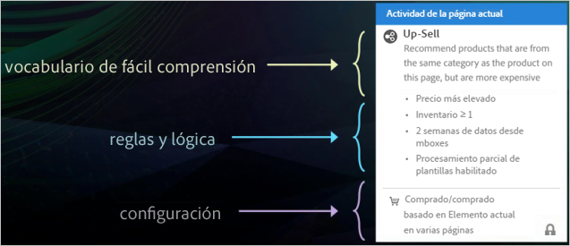
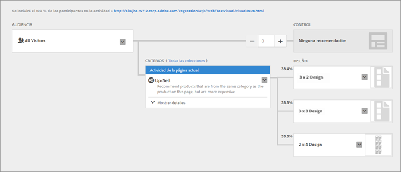

#  Comparación entre las actividades de Recommendations Classic y Recommendations en Target Premium{#recommendations-classic-versus-recommendations-activities-in-target-premium}

Información para ayudarlo a elegir entre Recommendations Classic y actividades de Recommendations en Target Premium.

>[!NOTE]
>
>Las actividades de Recommendations están disponibles como parte de la solución [!DNL Target Premium]. No están disponibles en [!DNL Target Standard] sin una licencia de [!DNL Target Premium].

En el producto clásico de [!DNL Recommendations], las recomendaciones se mostraban al crear un mbox de recopilación de datos en una página y, después, al añadir un mbox de visualización en una ubicación de página específica. La actividad [!DNL Recommendations] en [!DNL Target Premium] le permite recopilar información sobre el visitante y crear las recomendaciones en cualquier parte de la página sin necesidad de crear un mbox para cada ubicación donde quiera recomendar productos o contenido. Una sencilla referencia de JavaScript en el encabezado de la página habilita las recomendaciones en cualquier parte de la página. Use esta referencia de JavaScript para pasar claves al mbox global de [!DNL Target], como las claves `entity.id` y `entity.categoryId`.

[!DNL Recommendations Classic] aparece con su propia tarjeta en la interfaz de usuario de [!DNL Experience Cloud]. Dentro del flujo de trabajo de [!DNL Recommendations] hay disponible una actividad de [!DNL Target Premium].

Los usuarios [!DNL Recommendations Classic] pueden seguir utilizando sus mboxes [!DNL Recommendations] en [!DNL Target Recommendations]. También pueden combinar los enfoques de Classic y [!DNL Target] si conservan sus mboxes y usan el código JavaScript en el encabezado para activar la funcionalidad [!DNL Recommendations] para los demás elementos de la página. Sin embargo, para obtener la funcionalidad completa de [!DNL Target], es posible que los usuarios de [!DNL Recommendations Classic] prefieran eliminar un mbox antiguo y depender solamente de [!DNL Target Recommendations].

La actividad de [!DNL Recommendations] en [!DNL Target] mejora con respecto a [!DNL Recommendations Classic] en las siguientes áreas principales:

## Recommendations como oferta

Puede incluir recomendaciones dentro de la [!UICONTROL prueba A/B] (incluidas las actividades de [!UICONTROL Asignación automática] y [!UICONTROL Segmentación automática]) y las actividades de [!UICONTROL Segmentación de experiencias] (XT).

Esta funcionalidad revela capacidades completamente nuevas, como:

* Recomendaciones de prueba y segmentación y contenido que no sea de recomendación dentro de la misma actividad.
* Experimentar fácilmente con la colocación de recomendaciones en la página, incluido el orden de varias recomendaciones.
* Insertar automáticamente tráfico a la experiencia de recomendaciones de mejor rendimiento mediante [!UICONTROL Asignación automática].
* Asignar de forma dinámica a los visitantes a experiencias de recomendaciones adaptadas según su perfil mediante el uso de [!UICONTROL Segmentación automática].

Para empezar, cree una actividad [!UICONTROL Prueba A/B] o de [!UICONTROL Segmentación de experiencias] con el [!UICONTROL Compositor de experiencias visuales] y use la acción [!UICONTROL Insertar antes], [!UICONTROL Insertar después] o [!UICONTROL Reemplazar con] para agregar recomendaciones a una experiencia.

Para obtener más información, consulte [Recommendations como oferta](/help/c-recommendations/recommendations-as-an-offer.md).

## Criterios {#section_117709846DAA404580EBE879FFCBD9BA}

[!DNL Target Recommendations] incluye una biblioteca de criterios que contiene conjuntos empaquetados previamente de reglas y configuraciones. En [!DNL Recommendations Classic], cada recomendación se creó manualmente rellenando un formulario y eligiendo a partir de una larga lista de reglas. Ahora, cuando cree una actividad de [!DNL Recommendations], solo tiene que elegir un conjunto de criterios preconfigurados. Puede seguir creando recomendaciones personalizadas, pero la biblioteca de criterios contiene muchas de las configuraciones más comunes, está prediseñada para simplificar el proceso y usar un lenguaje comprensible para los usuarios. Estos criterios preempaquetados se pueden usar tal cual, o puede copiarlos y editarlos para adaptarlos a sus necesidades concretas.

Los criterios están preconfigurados y ordenados por sectores, tipos de página e implementación. Por ejemplo, puede buscar los criterios que se apliquen al vertical minorista, para usarlos en una página de producto, que muestre productos de una categoría en particular (definida por el parámetro `entity.categoryID`).

Para obtener más información sobre el uso y la creación de criterios, consulte [Criterios](../../c-recommendations/c-algorithms/algorithms.md).

## Flujo de trabajo {#section_76B4A26297BF422382DE2C79A2713D3C}

El flujo de trabajo de [!DNL Recommendations] se ha simplificado. En lugar de tener que rellenar complicados formularios, solo tiene que seguir un flujo de trabajo visual para:

1. Seleccionar el criterio.
1. Seleccione un   [diseño](../../c-recommendations/c-design-overview/create-design.md#task_CC5BD28C364742218C1ACAF0D45E0E14).
1. Obtener una vista previa de las recomendaciones resultantes.

## Vista previa   {#section_639B9E38C9EC4093BF9023EE0F2A15AC}

Puede obtener una vista previa de las recomendaciones después de configurarlas y realizar los cambios necesarios sin necesidad de crearlas en la página, publicarlas y probarlas. Las vistas previas están disponibles desde [!DNL Target].

## Segmentación {#section_93295EA0DBA14210B8518AF4802A459F}

En [!DNL Recommendations Classic] había seis opciones de segmentación. Las actividades de Recommendations emplean la amplia gama de opciones de segmentación de Target. Defina una audiencia mediante [!DNL Target] o cualquier otra audiencia de [!DNL Adobe Experience Cloud] (como [!DNL Audience Manager] y [!DNL Analytics]) y elija el porcentaje de participantes en la actividad que verá cada diseño y el porcentaje que verá el control.

## Creación de informes{#section_25C2FCCE4BC1488496C517C0470B5CD6}

En [!DNL Target], [!DNL Recommendations] genera informes mejorados que aprovechan las capacidades de [!DNL Target] y [!DNL Experience Cloud]. En lugar de mostrar simplemente el alza proporcionada por [!DNL Recommendations] comparada con los resultados sin ellas, puede ver información completa sobre su actividad de [!DNL Recommendations].

